# Practical Spectral Analysis with Python

## Preface

For many students—and even graduate researchers—their first real encounter with spectral analysis often unfolds like this:

One day, they notice an intriguing phenomenon in a time-domain signal and eagerly share their discovery with an advisor or senior colleague. The response is calmly delivered: "You should try some Fourier or wavelet analysis."

Returning to their desk, they dig out an old calculus textbook, flip through several pages, and quickly realize it won’t help. Next comes the trusted solution: a swift Google search for “Fourier Analysis tutorial". Eventually, they stumble upon a highly recommended *Digital Signal Processing* textbook with an impressive 9.8 book rating.  After a marathon weekend, they manage to read through the 50-plus pages of Chapter 1, Signals and Systems. However, by Chapter 2, Linear Time-Invariant Systems, fatigue sets in—only to realize that the actual Fourier series material is still more than 120 pages away.

At this juncture, most students pragmatically pivot to google *"Fourier Analysis by xxx"*  and get an answer with some unfamiliar jargon from *StackOverflow*, grabbing a ready-made code snippet to forge ahead.

Yet, a few determined souls persist—spending days gathering materials, watching lectures online, coding, and compiling a detailed report. Proudly, they present their hard work to their advisor, only to be met with the classic understated response: “Why so little progress this week?”

## Why Do We Need Spectral Analysis?

### Signals and Time Series

In physics and engineering, we often deal with **signals** – functions that vary over time and represent some physical quantity. A signal can be any measurable quantity that changes with time: for example, an audio waveform, the voltage output of a sensor, or the magnetic field measured in a plasma experiment. In many contexts, a ***time series*** is the observation of a signal over time

Many familiar phenomena are naturally described as time series, including:

- **Meteorology:** e.g. El-Nino Enso

<p align = 'center'>
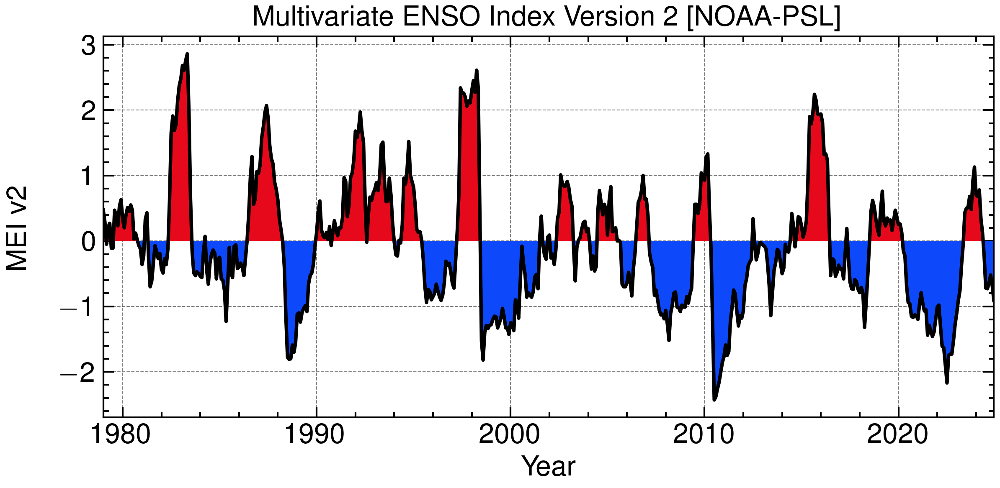
</p>


- **Geophysics:** e.g. Seismic Waves

<p align = 'center'>
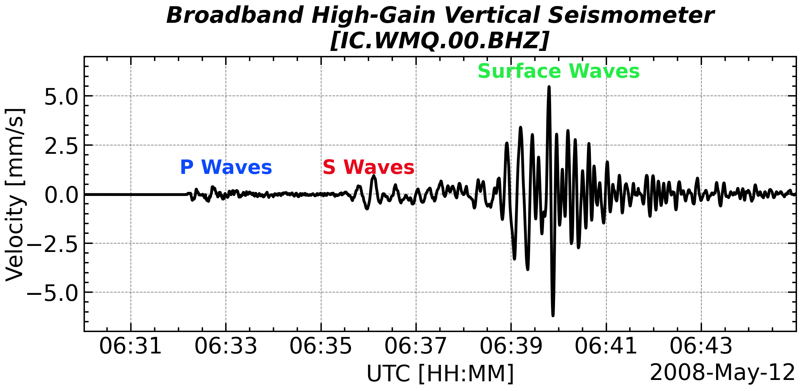
</p>

- **Solar Physics:** e.g. Sunspot Number

<p align = 'center'>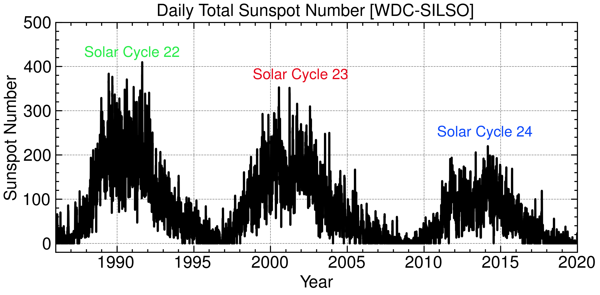</p>


Each of these is a time-domain description: we have a quantity (amplitude, voltage, etc.) **as a function of time**.

Understanding the time-domain behavior of a system is important. However, it is often hard to tell **what underlying patterns or oscillations** are present. This is where **spectral analysis** becomes useful.

### Understand the Signal from Frequency Domain

**Spectral analysis** examines a signal in the frequency domain instead of the time domain.

Imagine listening to an orchestra. The audio signal is a complex waveform. But your brain can distinguish individual notes — essentially doing spectral analysis!

In **plasma physics**, spectral analysis helps resolve the basic properties of wave (e.g., amplitude, compressibility) by revealing dominant frequencies in electromagnetic field fluctuations.

Spectral analysis helps to:

1. **Identify dominant frequencies** in a signal.
2. **Detect multiple overlapping processes**.
3. **Understand system behavior** through resonance.
4. **Filter or reduce noise**.

### Nyquist–Shannon Sampling Theorem
A band-limited continuous-time signal $$x(t)$$ containing no frequency components higher than $$f_{max}$$,  can be perfectly reconstructed from its samples if it is sampled at a rate:
$$
f_s \ge 2f_{max}
$$
The frequency upper limitation $f_{max}=f_s/2$ is also called ***Nyquist Frequency***.

When you measure a high frequency signal with a low cadence instrument, you will not only miss the high frequency component, **<u>but also measure an erroneous signal</u>**, so called ***Aliasing***.

<p align = 'center'>
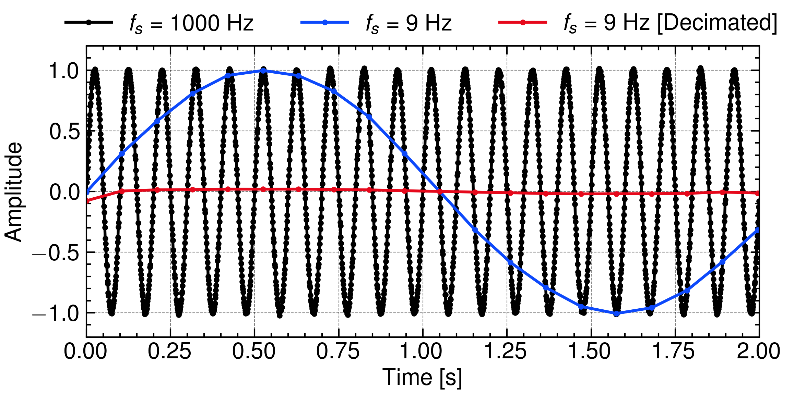
</p>
Such phenomenon is essentially unrelated to the Fourier transform as its frequency range ends up to $f_s/2$ and can be directly observed by naked eye. In real life, aliasing can be visualized by recording the running car wheel (or helicopter propeller) and television (or computer screen) with your smart phone. 

This effect always happens when you (down-)sampling the signal, a common way to avoid it is to apply a low pass filter so that the high frequency component doesn't contribute to the unreal signal. In the instrumental implementation, that filter typically consists of a set of resistor, inductor, and capacity and is putted before the analog-digital converter.

## How Do We See Frequencies in Data?

### Fourier Transform

Fourier transform provide the perfect way to convert the observed quantities into the dual space. Its definition can be written as follows
$$
\begin{align}
X(f) = \int_{-\infty}^{+\infty} x(t) e^{-2\pi i f t} \, \mathrm{d}t
\end{align}
$$
Correspondingly, the inverse (continuous) Fourier transform can be given as:
$$
\begin{align}
x(t)=\int_{-\infty}^{+\infty}X(f) e^{2\pi i f t} \mathrm{d}f
\end{align}
$$
However, a real and physical signal can only be measured at finite and discrete time nodes. Thus, ***Discrete-Time Fourier Transform (DTFT)*** presents an alternative expression in:
$$
\begin{align}
X(f)=\sum_{n=-\infty}^{+\infty} x[n \Delta t]\cdot e^{-i2\pi f (n\Delta t)}
\end{align}
$$
where $x[n\Delta t]$ stands for a discrete signal and $T$ is the sampling period. This signal has infinite length and still unrealistic. For a finite signal, ***Discrete Fourier Transform (DFT)*** is the only one that appliable:
$$
\begin{align}
X[k\Delta f] = \sum_{n=0}^N x[n\Delta t] e^{-2\pi i k\Delta f t} \, \Delta  t
\end{align}
$$
Ideally, according to the periodicity of $$e^{-2\pi i ft}$$, the DFT actually calculate the DTFT coefficients by extending the original series along and anti-along the time axis.


$$
\begin{align}
X[k\Delta f] & = \lim_{M\rightarrow+\infty} \frac{1}{M} \sum_{n=-(M-1)\times N}^{M \times N} x[n\Delta t] e^{-2\pi i k\Delta f t} \, \Delta  t\\
&\approx \int_{-\infty}^{+\infty} x_{ext}[n\Delta t] \, d t
\end{align}
$$

<p align = 'center'>

</p>

It is worth noting that, $\Delta t$ is always taken as unity so that the expressions of both DTFT and DFT can be largely simplified as
$$
\begin{align}
X(f) &= \sum_{n=-\infty}^{+\infty} x[n]\cdot e^{-i2\pi nf}\\
X[k] &= \sum_{n=0}^N x[n]\cdot e^{-2\pi i n k}
\end{align}
$$
in most other tutorial. Nevertheless, this tutorial will keep that term as the constant coefficient matters in the real application.


```python
# Generate a sinuous signal
OMEGA = 2 * np.pi * 5
time = np.arange(0, 1, 200)
signal = np.sin(OMEGA * time)

DT = time[1] - time[0]
# Complex coefficient
coefs = np.fft.fft(signal)
# Corresponding frequency with both zero, positive, and negative frequency
freqs = np.fft.fftfreq(coefs.size, DT)
```
Given a window length n and a sample spacing `DT` (i.e., `np.fft.fftfreq(N, DT)`):

```python
freqs # [0, 1, ...,   N/2-1,     -N/2, ..., -1] / (DT * N)   # if n is even
freqs # [0, 1, ..., (N-1)/2, -(N-1)/2, ..., -1] / (DT * N)   # if n is odd
```
The size of the coefficients is  `N` and each coefficient consist of both its real and imaginary parts, which means a `2N` redundancy. That is because `numpy.fft.fft` is designed for not only the real input but also the complex inputs, which can actually represents `2N` variables with a signal size of `N`.

For real input, the aforementioned `2N` redundancy allows you to get that `freqs[1 + i]` = `freqs[-i].conj` and therefore simplify the frequency spectrum but only adopt the positive frequency component.


```python
freqs[::n // 2] # [0, 1, ...,   N/2-1] / (DT * N)   if n is even
freqs[::n // 2] # [0, 1, ..., (N-1)/2] / (DT * N)   if n is odd
```

Or, a more suggested way to use `numpy.fft.rfft (rfftfreq)` instead of `numpy.fft.fft (fftfreq)`, which is only designed for real input and intrinsically truncate the output coefficients and frequencies.

```python
coefs = np.fft.rfft(signal)
freqs = np.fft.rfftfreq(coefs.size, dt)
```

Yet, please remember that only real signal can be used as an input of `numpy.fft.rfft` otherwise the imaginary parts are ignored by default.

### Frequency Resolution

Assuming you already get a prepared signal, a common way to extract the periodicity from the signal is ***DFT***. By this transformation, you can perfectly convert the signal to the frequency domain without any loss of the physical information.

The yield spectrum contains the wave coefficient at the frequency of


$$

$$

$$
\begin{align}
\frac{i}{N}\frac{f_s}{2}=\frac{i/2}{N\Delta t}=\frac{i/2}{\Delta T}
\end{align}
$$


where $$i=1,2,...,N$$ and $$\Delta T=N\Delta t$$ is the total duration of the signal.

### Periodic Extensions
<p align = 'center'>
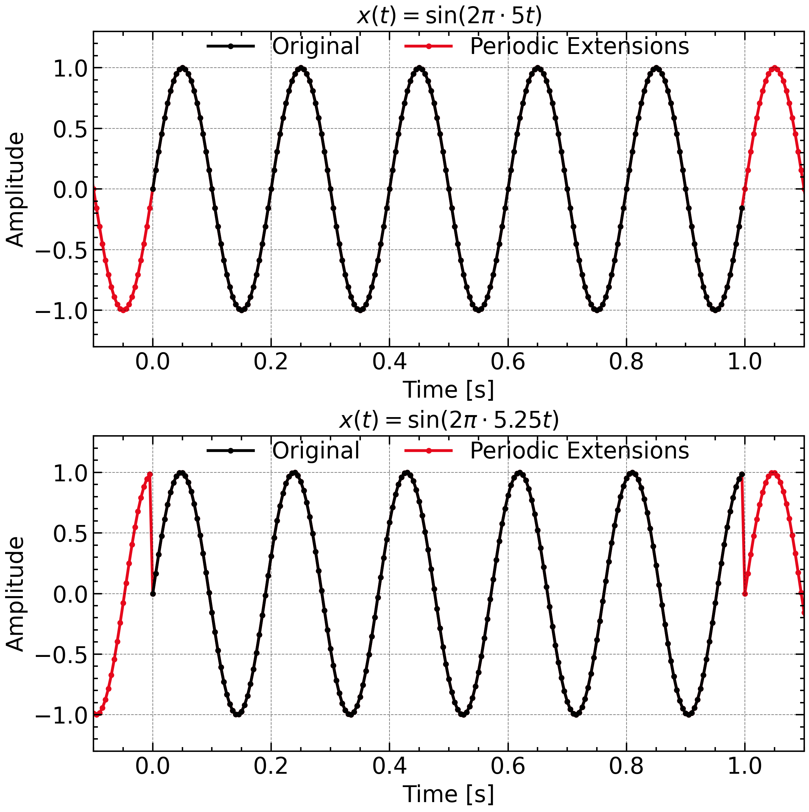
</p>


### Windowing Effect
<p align = 'center'>

</p>


```python
# Without Normalization
signal *= np.hanning(signal.size)
# With Normalization
signal *= np.hanning(signal.size) * np.sqrt(8 / 3)
```

The Hanning window is written as:
$$
\begin{align}
w(x)&=\frac{1}{2}\left[1-\mathrm{cos}(2\pi x)\right]\\
w[n]&=\frac{1}{2}\left[1-\mathrm{cos} \left(\frac{2\pi n}{N}\right)\right]
\end{align}
$$
which has an average energy of 
$$
\begin{align}
\int_0^1 w^2(x)\mathrm{d} x = \frac{1}{4} \left\{\int_0^1 [1 - 2 \mathrm{cos}(2\pi x) + \mathrm{cos^2}(2\pi x)]\mathrm{d}x \right\}=\frac{1}{4}(1-0+\frac{1}{2}) = \frac{3}{8}
\end{align}
$$

| **Name and Function / NumPy/SciPy Function**                 | **w[n]**                                                     | **Amplitude Normalization mean**                             | **Power Normalization **                                     |
| ------------------------------------------------------------ | ------------------------------------------------------------ | ------------------------------------------------------------ | ------------------------------------------------------------ |
| Rectangular (Boxcar) / `np.ones(N)` or `scipy.signal.windows.boxcar(N)` | $w[n] = 1$                                                   | $1$                                                          | $1$                                                          |
| Hann (Hanning) / `np.hanning(N)` or `scipy.signal.windows.hann(N)` | $w[n] = 0.5\left(1 - \cos\left(\frac{2\pi n}{N-1}\right)\right)$ | $\frac{1}{2}$                                                | $\sqrt{\frac{3}{8}}$                                         |
| Hamming / `np.hamming(N)` or `scipy.signal.windows.hamming(N)` | $w[n] = 0.54 - 0.46\cos\left(\frac{2\pi n}{N-1}\right)$      | $0.54$                                                       | $\sqrt{0.397}$                                               |
| Blackman / `np.blackman(N)` or `scipy.signal.windows.blackman(N)` | $w[n] = 0.42 - 0.5\cos\left(\frac{2\pi n}{N-1}\right) + 0.08\cos\left(\frac{4\pi n}{N-1}\right)$ | $0.42$                                                       | $\sqrt{0.274}$                                               |
| Kaiser / `scipy.signal.windows.kaiser(N, beta)`              | $w[n] = \frac{I_0\left(\beta\sqrt{1-\left(\frac{2n}{N-1}-1\right)^2}\right)}{I_0(\beta)}$ | $\frac{1}{2I_0(\beta)}\int_{-1}^{1} I_0\left(\beta\sqrt{1-x^2}\right) dx$ | $\sqrt{\frac{1}{2}\int_{-1}^{1} \left[\frac{I_0\left(\beta\sqrt{1-x^2}\right)}{I_0(\beta)}\right]^2 dx}$ |
| Tukey / `scipy.signal.windows.tukey(N, alpha)`               | $w[n] = 0.5\left(1 + \cos\left(\frac{\pi(2n)}{\alpha N} - 1\right)\right)$ (for edges) | $1 - \frac{\alpha}{2}$                                       | $\sqrt{1 - \frac{\alpha}{2} + \frac{\alpha}{4}}$             |
| Gaussian / `scipy.signal.windows.gaussian(N, std)`           | $w[n] = \exp\left(-\frac{1}{2}\left(\frac{n-\frac{N-1}{2}}{\sigma\frac{N-1}{2}}\right)^2\right)$ | $\sigma\sqrt{\frac{\pi}{2}}$                                 | $\sigma\sqrt{\frac{\pi}{4}}$                                 |
| Bartlett / `np.bartlett(N)` or `scipy.signal.windows.bartlett(N)` | $w[n] = 1 - \frac{2\left|n-\frac{N-1}{2}\right|}{N-1}$       | $\frac{1}{2}$                                                | $\sqrt{\frac{1}{3}}$                                         |

### Definitions

- **Amplitude Normalization (Coherent Gain)**: $\text{mean}{w[n]}$ - preserves amplitude of coherent signals (DC component)
- **Power Normalization (Energy)**: $\sqrt{\text{mean}{w[n]^2}}$ - preserves power of incoherent signals (noise)
- Use amplitude normalization for spectral analysis of tones/periodic signals
- Use power normalization for power spectral density estimation of random signals

### Analytic Values

- **Hamming coefficients**: $0.54 = \frac{25}{46} \approx 0.5435$, $0.46 = \frac{21}{46} \approx 0.4565$
- **Blackman coefficients**: $0.42 = \frac{21}{50}$, $0.5 = \frac{1}{2}$, $0.08 = \frac{2}{25}$
- **Power normalization factors**:
  - Hamming: $\sqrt{0.397} = \sqrt{\frac{25^2 + 21^2}{2 \cdot 46^2}} = \sqrt{\frac{1066}{4232}} \approx 0.630$
  - Blackman: $\sqrt{0.274} = \sqrt{\frac{21^2 + 25^2 + 4^2}{2 \cdot 50^2}} = \sqrt{\frac{1066}{5000}} \approx 0.462$
- $\text{mean}{w[n]} = \frac{1}{N}\sum_{n=0}^{N-1} w[n]$ and $\text{mean}{w[n]^2} = \frac{1}{N}\sum_{n=0}^{N-1} w[n]^2$
- Kaiser and Gaussian expressions involve integrals that depend on shape parameters
- For Tukey: $\alpha$ is the cosine-tapered fraction $(0 \leq \alpha \leq 1)$
- For Kaiser: $I_0$ is the modified Bessel function of the first kind
- Gaussian approximations assume the window is appropriately scaled

### Fence Effect

<p align = 'center'>
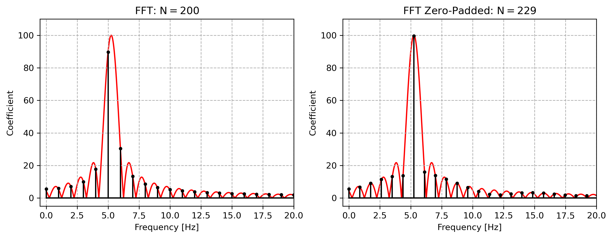
</p>


### Zero-Padding

<p align = 'center'>
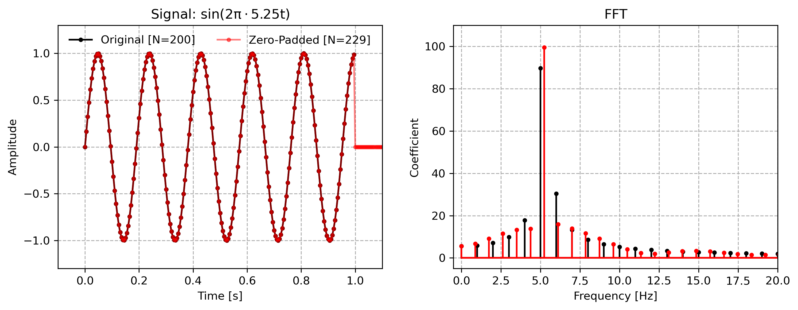
</p>


```python
dt = time[1] - time[0]
n = signal.size

N_PADDING = 29

coefs = np.fft.fft(signal, n = signal.size + N_PADDING)
freqs = np.fft.fftfreq(coefs.size, dt)
```

### Decibel

***Decibel (dB, Deci-Bel)***  is frequently used in describing the intensity of the signal. This quantity is defined as the 


|     Decibel     |  0   |  1   |  3   |  6   |  10  |  20  |
| :-------------: | :--: | :--: | :--: | :--: | :--: | :--: |
|  Energy Ratio   |  1   | 1.12 | 1.41 | 2.00 | 3.16 |  10  |
| Amplitude Ratio |  1   | 1.26 | 2.00 | 3.98 |  10  | 100  |


Due to the fact that $2^{10}\approx10^3$, 3 dB corresponds to a energy ratio of $10^{3/10}=\sqrt[10]{1000}\approx \sqrt[10]{1024}=2$.

The adoption of decibel instead of the conventional physical unit has three advantage:

- It allows the direction addition when compare the amplitude of the signal.
- When you are not confident about the magnitude of the uncalibrated data, you can just use dB to describe the ambiguous intensity.
- The [***Weber–Fechner law***](https://en.wikipedia.org/wiki/Weber-Fechner_law) states that human perception of stimulus intensity follows a logarithmic scale, which is why decibels—being logarithmic units—are used to align physical measurements with human sensory sensitivity, such as in sound and signal strength.

## Rebuild the data from the frequency domain

### Spectral Reconstruction / Trigonometric interpolation

Once the DFT coefficients are derived, one can actually reconstruct a Fourier series with continuous input and get a interpolation on the unsampled points.


### Gibbs Phenomenon

Use Although a discrete signal can be lossless Fourier transformed, some signal. A continuous function with a infinitely sharp discontinuity introduce an infinite derivation at the discontinuity. However, any finite, discrete sampling of the continuous signal can not fully capture the complete, high frequency feature of the discontinuity. The discontinuity saw by the $\mathcal{F}$ operator is nothing but two samples with large variation, while, each adjacent samples can vary to some extent. Fourier transform can perfectly reconstruct the observed, discrete signal but is not able to perfectly represents the continuous function.

Mathematically speaking, a 

<p align = 'center'>

</p>

### Uncertainty Principle

In 

<p align = 'center'>
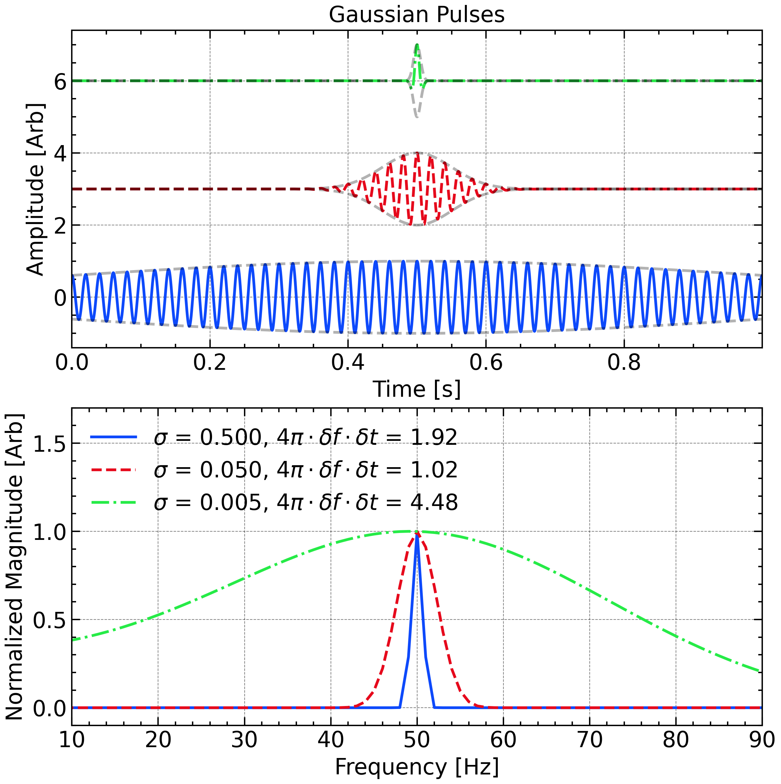
</p>

### Parseval's Theorem and Energy Conservation

> **Parseval's Theorem for CFT:**
> $$
> \begin{align}
> \int_{-\infty}^\infty x^2(t)\, dt = \int_{-\infty}^\infty X^2(f)\, df
> \end{align}
> $$


> **Parseval's Theorem for DFT:**
> $$
> \sum_{n=0}^{N-1}|x(n\Delta t)|^2 = \frac{1}{N}\sum_{k=0}^{N-1}|X(k\Delta f)|^2
> $$

In the physical world, the square power of the ampltitude often refers to some kind of ***energy*** or ***power***. For example, the square of the displacement ($$x$$) of a spring, $$x^2$$ is propotional to the elastic potential energy ($$kx^2/2$$, where $$k$$ describes the stiffness). In plasma physics, electromagnetic field contains the energy density ($$u$$) written as 

$$
\begin{align}
u=u_E + u_B=\frac{1}{2}(\varepsilon_0 \mathit{E}^2 + \frac{1}{\mu_0}\mathit{B}^2)
\end{align}
$$
In this case, the ***energy*** of the signal naturally linked with the ***energy*** of the electromagnetic field. Nevertheless, the energy of a signal is an extensive property as it linearly increases with the length of the sample. In the ordinary investigation, the signal energy is always further converted as signal ***power***, which is an intensive property that describe the amplitude and is independent of signal length. The defition of power, *P*, can be written as:

$$
\begin{align}
P&= \frac{1}{T}\int_{-T/2}^{T/2}|x(t)|^2 \mathrm{d}t\\
\end{align}
$$
or 
$$
\begin{align}
P&=\frac{1}{N\Delta t}\sum_{n=0}^{N-1}|x(n\Delta t)|^2 \Delta t\\
&=\frac{1}{N^2\Delta f}\sum_{k=0}^{N-1}|X(k\Delta f)|^2 \Delta f \\
&=\sum_{k=0}^{N-1} \boxed{\frac{1}{Nf_s} |X(k\Delta f)|^2}\, \Delta f
\end{align}
$$
for DFT. Considering that DFT yields both positive and negative frequency, we typically fold the DFT result. Naturally, the definition of *power spectral density (PSD)* is given as:

$$
\begin{align}
&\sum_{k=0}^{N-1} PSD[k\Delta f] \Delta f =\\
\mathrm{For\ Even \ }N:\ &\Delta f \left[PSD[0] + \sum_{k=1}^{{(N-1)}/{2}} 2\cdot PSD[k\Delta f] + PSD[f_{N/2}]\right]\\
\mathrm{For\ Odd \ }N:\ &\Delta f \left[PSD[0] + \sum_{k=1}^{{(N-1)}/{2}} 2\cdot PSD[k\Delta f]\right]
\end{align}
$$


```python
N = coef.size
FS = 1 / dt
psd = (np.abs(coef) ** 2) / (N * FS)

if N % 2 == 0:
    psd[1:-1] *= 2
else:
    psd[1:] *= 2
```


$$
\begin{align}
|X(k\Delta f)| \propto f_s \cdot T
\end{align}
$$

According to the lineairty of $$\mathcal{F}$$, $$X(k\Delta f)$$ should also be propotional to the signal ampltitude. Easily catch that the coefficient at the exact wave frequency has the form of 

$$
\begin{align}
|X(k\Delta f)| = \frac{1}{2}A(k\Delta f) \cdot f_s \cdot T 
\end{align}
$$
1/2 in this equation arises from the fact that $$\int_0^{2\pi}\mathrm{sin^2}x \mathrm{d}x=1/2$$.


### The performance of `numpy.fft.fft` and `scipy.signal.fft`

The invention of the ***(Cooley–Tukey) Fast Fourier Transform (FFT) algorithm*** reduced the time complexity of DFT from $\mathcal{O}(N^2)$ to $\mathcal{O}(N\mathrm{log}N)$ by efficiently decomposing the DFT into smaller computations, i.e., [divide-and-conquer](https://en.wikipedia.org/wiki/Divide-and-conquer_algorithm).  

Most tutorials introduce the ***radix-2*** FFT, which splits the signal into ***two*** sub-signals with exactly the same length and requires the length of the signal to be an integer power of ***2***. This requirement is hard to satisfy in common applications without zero-padding, which actually includes unwanted modification of the original signal. To overcome that, ***radix-3*** and ***radix-5*** FFTs are developed and implemented. 

Still, the divide-and-conquer strategy fails when the signal length *N* consists of at least one big prime number factor (e.g, 10007) as the signal is hard to split. In that situation, the ***Bluestein's algorithm***, which is essentially a ***Chirping-Z transform***, is used. This algorithm takes the $\mathcal{F}$ operation as a convolution and then uses the *convolution theorem* in the calculation of DFT coefficients. The convolution property allows us to extend the signal length to a proper, highly composite number with zero-padding (denoted as *M*), but the coefficients and frequency resolution remain unchanged. The final time complexity of *Bluestein's algorithm* goes to $\mathcal{O}(N+M\mathrm{log}M)$, where the first term originates from the iterate all the frequency component.

<p align = 'center'>
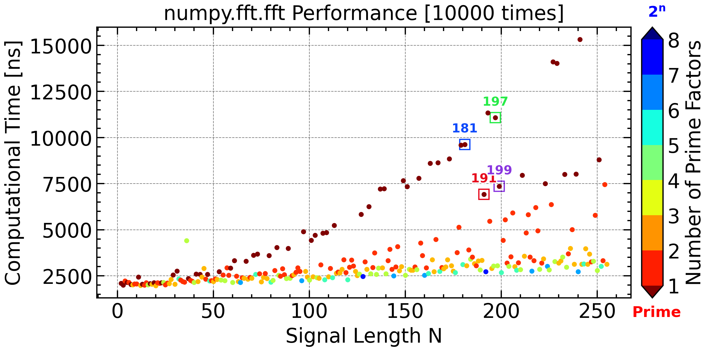
</p>


From the performance test, we observe that signals with prime-number lengths (dark red dots) often incur higher computational costs. For example:
$$
\begin{align}
N&=181=182-1=2^1\times\boxed{7^1\times13^1}-1\\
N&=197=198-1=2^1\times3^2\times\boxed{11^1}-1\\
\end{align}
$$
In contrast, signals with highly composite number lengths (dark blue dots), such as those with lengths being integer powers of 2, usually have the lowest computation time.

However, some prime numbers like: 
$$
\begin{align}
N&=191=192-1=2^6\times3^1-1\\
N&=199=200-1 = 2^3\times5^2-1
\end{align}
$$
can also exhibit relatively efficient performance due to their proximity to highly factorable numbers.

Modern implementation of the FFT algorithm, such as `pocketfft`, combines the above two methods (*Cooley–Tukey* and *Bluestein*). This *C++* package is used in both `numpy` and `scipy(1.4.0+)`  for their FFT implementation. Besides, `fftw`, which stands for the somewhat whimsical title of *"Fastest Fourier Transform in the West"*, is also very popular and used in the `fft/ifft` functions of *MATLAB*. Its *Python* implementation  can be found in the `pyfftw` package.

The `scipy.signal.fft` additionally provides an input parameter `workers:` *`int, optional`* to assign the maximum number of workers to use for parallel computation. If negative, the value wraps around from `os.cpu_count()`. For parallel computation, you need to input a batch of signals with shape of $N\times K$.

***<u>Reference</u>**:*

1. Cooley, James W., and John W. Tukey, 1965, “An algorithm for the machine calculation of complex Fourier series,” Math. Comput. 19: 297-301.
2. Bluestein, L., 1970, “A linear filtering approach to the computation of discrete Fourier transform”. IEEE Transactions on Audio and Electroacoustics. 18 (4): 451-455.
3. https://dsp.stackexchange.com/questions/24375/fastest-implementation-of-fft-in-c
4. https://www.fftw.org/


### Sliding Window

`numpy.lib.stride_tricks.sliding_window_view(x, window_shape, axis=None, *, subok=False, writeable=False)` provides the function for re-organizing the signal into several sub-chunk. This function can only give a stride of one. For a customized stride, you need to use `numpy.lib.stride_tricks.as_strided(x, shape=None, strides=None, subok=False, writeable=True)`. This function can be unsafe and crash your program.  

The `bottleneck` package, which is safer and more efficient,  is more suggested for common usage of moving windows, like moving-average and moving-maximum. The following code shows how to use the `bottleneck` functions and their expected results.

### Derivation of FT

A super powerful property of Fourier transform is that:
$$
\mathcal{F}\left[\frac{\mathrm{d}}{\mathrm{d}t}x(t)\right]=(i2\pi f)\cdot X(f)
$$
which can be easily proved by doing derivative to the both sides of the inverse Fourier transform:
$$
\begin{align}
\frac{\mathrm{d}}{\mathrm{d}t}[x(t)]&=\int_{-\infty}^{+\infty} X(f) (i2\pi f)e^{i 2 \pi f t} \mathrm{d}f\\
&=\int_{-\infty}^{+\infty} \left[(i2\pi f)\cdot X(f)\right] e^{i 2 \pi f t} \mathrm{d}f\\
&=\mathcal{F}^{-1}\left[(i2\pi f)\cdot X(f)\right]
\end{align}
$$
It can be denoted as 
$$
{{\mathrm{d}}/{\mathrm{d}t}}\leftrightarrow i 2\pi f
$$
One can also extend this property to
$$
({{\mathrm{d}/}{\mathrm{d}t}})^n\leftrightarrow (i 2\pi f)^n
$$
In plasma physics, the conventional way to express the electromagnetic field.

It should be noted that this derivation property change a little bit for discrete Fourier transform:
$$
\frac{\Delta x(t)}{\Delta  t}=\int_{-\infty}^{+\infty}X(f) e^{2\pi i f t} \mathrm{d}f
$$


## Noise

Noise refers to random or unwanted fluctuations that obscure the true underlying signal in your data. In spectral analysis, understanding the properties and sources of noise is crucial for interpreting results, estimating signal-to-noise ratio (SNR), and designing effective filtering or denoising strategies. In plasma physics, the noise originates from both physical (e.g., plasma turbulence) and non-physical process (e.g., measurement uncertainty).

<p align = 'center'>
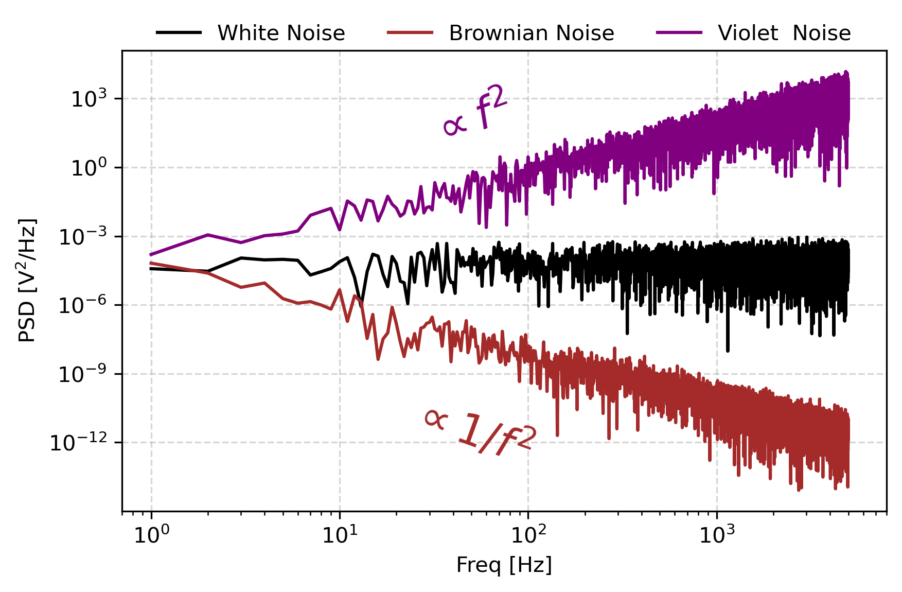
</p>

In audio engineering, electronics, physics, and many other fields, the color of noise or noise spectrum refers to the power spectrum of a noise signal (a signal produced by a stochastic process). Different colors of noise have significantly different properties. For example, as audio signals they will sound different to human ears, and as images they will have a visibly different texture. Therefore, each application typically requires noise of a specific color. This sense of 'color' for noise signals is similar to the concept of timbre in music (which is also called "tone color"; however, the latter is almost always used for sound, and may consider detailed features of the spectrum).

The practice of naming kinds of noise after colors started with white noise, a signal whose spectrum has equal power within any equal interval of frequencies. That name was given by analogy with white light, which was (incorrectly) assumed to have such a flat power spectrum over the visible range. Other color names, such as pink, red, and blue were then given to noise with other spectral profiles, often (but not always) in reference to the color of light with similar spectra. Some of those names have standard definitions in certain disciplines, while others are informal and poorly defined. Many of these definitions assume a signal with components at all frequencies, with a power spectral density per unit of bandwidth proportional to $$1/f^\beta$$ and hence they are examples of power-law noise. For instance, the spectral density of white noise is flat ($$\beta$$ = 0), while flicker or pink noise has $$\beta$$ = 1, and Brownian noise has $$\beta$$ = 2. Blue noise has $$\beta$$ = -1.

### How to generate a colored noise?

### Method 1: Approximate $$\mathrm{d}x/\mathrm{d}t$$ by $$\Delta x/\Delta t$$
According to the property of Fourier transform, the convolution in the .
```python
time = np.linspace(0, 1, 10000, endpoint=False)
dt = time[1] - time[0]

white_noise = np.random.randn(time.size)
brownian_noise = np.cumsum(np.random.randn(time.size)) * dt
violet_noise = np.diff(np.random.randn(time.size + 1)) / dt
```

### Method 2: Rescale the frequency spectrum of the white noise

```python
time = np.linspace(0, 1, 10000, endpoint=False)
dt = time[1] - time[0]
fs = 1 / dt
freq = np.fft.rfftfreq(len(time), dt)

brownian_noise_fft = np.fft.rfft(np.random.randn(time.size))
brownian_noise_fft[1:] /= freq[1:] ** 1
brownian_noise_fft[0] = 0
brownian_noise = np.fft.irfft(brownian_noise_fft)

violet_noise_fft = np.fft.rfft(np.random.randn(time.size))
violet_noise_fft[1:] /= freq[1:] ** -1
violet_noise_fft[0] = 0
violet_noise = np.fft.irfft(violet_noise_fft)
```

Besides these two method, one can also get a colored noise by filtering a white noise. An colored noise that accurately follows its expected power spectrum requires the order of the filter to be high enough. Even though, this 

### "Noise" of Noise
From the power spectra of noises, one can see that the PSD of the generated noise may randomly deviates from the theoretical expectation, i.e., the exactly power-law PSD. 

The Fourier coefficient computed as 
$$
\begin{align}

\hat X[k]:=\sum_0^{N-1}x[n]\mathrm{e}^{\mathit{i}2\pi  n k}

\end{align}
$$
can be deemed as a weighted summation of the signal $x[n]$. When $x[n]$ are independent identically distributed random variables, their weighted summation approaches the Normal distribution when *N* is large enough, according to the ***Central Limit Theorem***. Thus, the *PSD*, defined as the square sum of the real and imaginary part, naturally follows the *Kappa* Distribution with the freedom of 2. The above statement requires the real and imaginary parts are independent to each other, which can be proved by calculating their covariance.


<p align = 'center'>
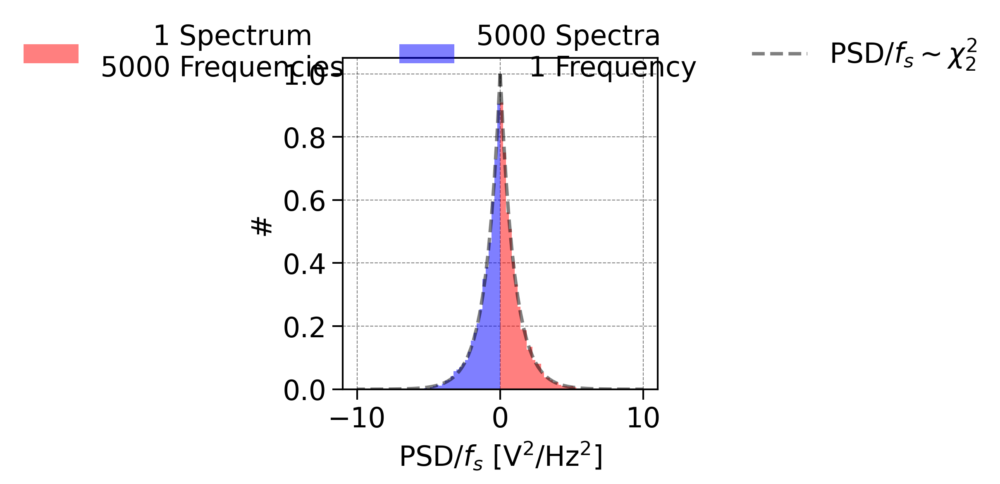
</p>
It should be noted that the wave signals like $\mathrm{sin}\omega t$ are not *i.i.d*. These signals are not even *independent*, which means that even the **Lindeberg (-Feller) CLT**

[^1]: which proved that independent but not identical distributed random variables satisfy the CLT.

 can not guarantee their Fourier coefficients converged to a Normal distribution. Commonly, its *PDF* still follows a bell-shaped curves but the mean and variance dependent on the *SNR*.

To reduce this kind of uncertainty, we are going to introduce the following three method: 1. Barlett Method; 2. Welch Method; and 3. Blackman–Tukey Method.

### Welch Method [`scipy.signal.welch`]
Welch proposed that the averaging the power spectral density instead of the coefficient can largely reduce the flutuation levels of the spectrum. Therefore, we may just get a.

The averaging operation must be taken after the conversion from coefficient to power other wise the averaged coefficients are actually unchanged.

This method can be implemented by `scipy.signal.welch` function:

```python
time = np.linspace(0, 1, 10000, endpoint=False)
fs = 1 / (time[1] - time[0])
freq = np.fft.rfftfreq(len(time), time[1] - time[0])

noise_white = np.random.randn(time.size)

coef_white = np.fft.rfft(noise_white, axis=-1).T
psd_white = (np.abs(coef_white) ** 2) / fs / time.size

freq_welch, psd_white_welch = scipy.signal.welch(noise_white, fs, window = 'hann', nperseg=2 ** 10)
```

Except for averaging, one can also  choose the median of the PSD across different segements and obtain a less disturbed PSD. This choice can be implemented by `scipy.signal.welch(signal, fs, average = 'median')`. The default parameter for `average` is `mean`, corresponding to the normal Welch method.

For each segement, you can also chose the window function to reduce the spectral leakage. The result of this method is shown below:

<p align = 'center'>

</p>

One can also verify that the distribution of the PSD convert to *Gamma* Distribution, which has a ***Probability Density Function (PDF)*** of:

$$
\begin{align}
PDF(x; \alpha, \lambda)=\frac{\lambda^\alpha}{\Gamma(\alpha)} x ^{\alpha - 1} e^{-\lambda x}
\end{align}
$$

The mean and variance of this distribution is $$\alpha/\lambda$$ and $$\alpha / \lambda^2$$. When the number of segments ($$\alpha$$) decrease/increase to 1/$$+\infty$$, the Gamma distribution degenerate to exponential/normal distribution.

<p align = 'center'>
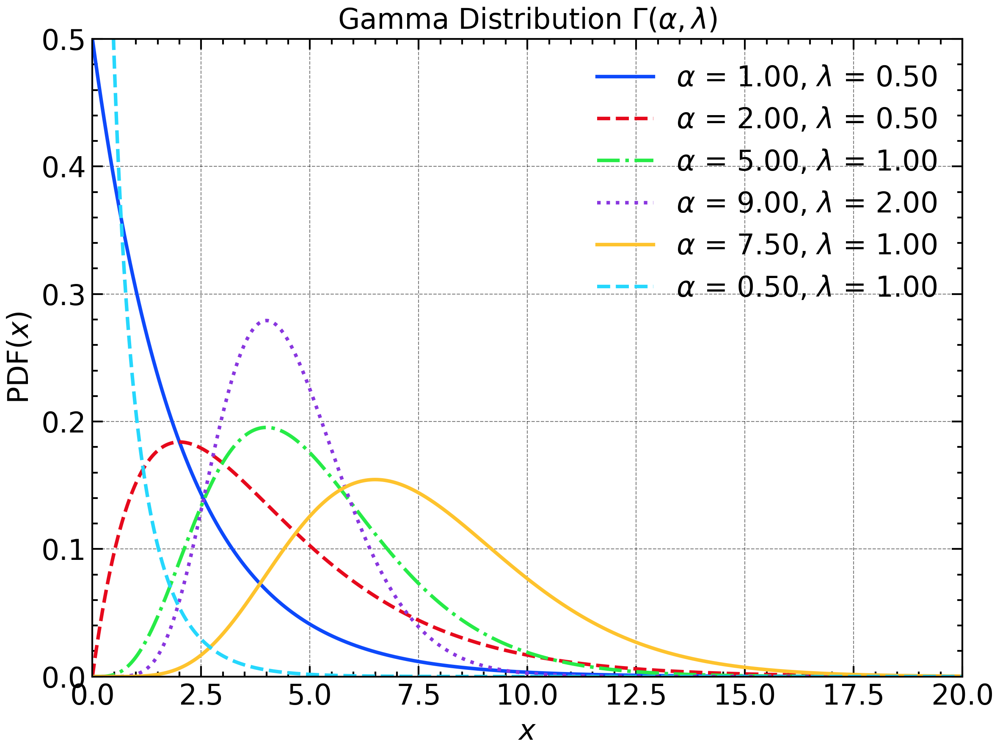
</p>


In ***Bartlett Method***, the ratio of ``N_STEP`` and ``N_PER_SEG`` is fixed at unity, which means every segement has no overlapping with each other. It can be regarded as a special case of the *Welch Method* while it is actually proposed earlier.

### Blackman-Tukey Method

***Blackman-Tukey method*** gives another approach to a high SNR estimation of *PSD* based on the *W.S.S* properties of the signal and *Wiener–Khinchin theorem*. This method consists of three steps:

1. Calculate the (***double-sided***) ACF of the signal

2. Apply a window function to the ACF

3. Do DFT to the windowed ACF.

It should be keep in mind that these methods are all build based on the assumption of wide-sense stationarity of the signal.[Explain WSS here]. A noise signal, no matter its color, is wide-sense stationary. However, a real time series of a physics quantity cannot gurantee its wide-sense stationarity. Since W.S.S is the only presumption of these method, they are also termed ***Nonparametric Estimator***.

Apart from splitting the signal into several segments, one can also downsample the signal and get multiple sub-signal with different startup time. However, the maximum frequency of the yield spectrum will also be reduced by a factor of ``N_DOWNSAMPLE``. At the same time, the frequency resolution remains to be $$(N\Delta t)^{-1}$$. 

<p align = 'center'>

</p>

### Signal Over Noise

A signal composed of a deterministic sinusoidal component and additive noise can be written as:
$$
x(t) = s(t) + n(t)
$$
The Fourier coefficient at frequency $f$ is:
$$
\tilde{X}(f) = \tilde{S}(f) + \tilde{N}(f)
$$
where $\tilde{S}(f)$ is the deterministic signal component (a fixed complex number), and $\tilde{N}(f)$ is the Fourier transform of the noise. If the noise $n(t)$ is zero-mean wide-sense stationary, then:
$$
\tilde{N}(f) \sim \mathcal{CN}(0, \sigma_n^2)
$$
That is, $\tilde{X}(f)$ is a complex Gaussian random variable:
$$
\tilde{X}(f) \sim \mathcal{CN}(\mu, \sigma_n^2), \quad \mu = \tilde{S}(f)
$$
The power spectrum estimate is:
$$
\hat{S}_x(f) = |\tilde{X}(f)|^2
$$
Since $|\tilde{X}(f)|^2$ is the sum of squares of two independent Gaussian variables (real and imaginary parts), it strictly follows a non-central chi-squared distribution:
$$
\hat{S}_x(f) \sim \sigma_n^2 \cdot \chi^2(2, \lambda), \quad \lambda = \frac{|\mu|^2}{\sigma_n^2}
$$
In other words, the deterministic signal provides a **complex offset** (mean $\mu$), and the noise determines the **variance** $\sigma_n^2$. The resulting power spectrum estimate is exactly a non-central chi-squared distribution with 2 degrees of freedom.


## Faulty  Sample

### Lomb-Scargle Periodogram [*scipy.signal.lombscargle*]

The Lomb-Scargle periodogram is a powerful method for estimating the power spectrum of unevenly sampled time series. Unlike the standard FFT-based periodogram, which requires uniformly spaced data, Lomb-Scargle is widely used in astronomy and geophysics where data gaps are common. This section introduces its mathematical foundation, physical interpretation, and provides practical examples using `scipy.signal.lombscargle`.

The basic idea of the Lomb-Scargle periodogram is to fit the observed time series by a sinusoidal function $A\mathrm{sin}{(2\pi ft)}+B\mathrm{cos}{(2\pi ft)}$ with frequency $f$ in the sense of mean square deviation. The yield coefficient A can be a estimate of the signal's magnitude at frequency $f$. 

Minimize the residual sum of squares:

$$
\chi^2(A,B) = \sum_{n=1}^N \bigl[x_n - \bar x - A\cos(\omega t_n) - B\sin(\omega t_n)\bigr]^2.
$$
Setting $\partial\chi^2/\partial A = \partial\chi^2/\partial B = 0$ yields the normal equations:

$$
\begin{pmatrix} \sum\cos^2(\omega t_n) & \sum\cos(\omega t_n)\,\sin(\omega t_n)\\[0.5em] \sum\cos(\omega t_n)\,\sin(\omega t_n) & \sum\sin^2(\omega t_n) \end{pmatrix} \begin{pmatrix}A\\ B\end{pmatrix} = \begin{pmatrix} \sum (x_n-\bar x)\cos(\omega t_n)\\[0.25em] \sum (x_n-\bar x)\sin(\omega t_n) \end{pmatrix}.
$$


Define
$$
\begin{align}
C &= \sum\cos^2(\omega t_n)\\
S &= \sum\sin^2(\omega t_n)\\
D &= \sum\cos(\omega t_n)\sin(\omega t_n)\\
X_c &= \sum(x_n-\bar x)\cos(\omega t_n)\\
X_s &= \sum(x_n-\bar x)\sin(\omega t_n)
\end{align}
$$
Then

$$
A = \frac{X_c\,S - X_s\,D}{C\,S - D^2},  \quad B = \frac{X_s\,C - X_c\,D}{C\,S - D^2}.
$$


$P(\omega) \;=\; \frac12\bigl(A^2 + B^2\bigr).$

Substituting the expressions for $A$ and $B$ yields a form that still involves the cross‐term $D$.

<p align = 'center'>

</p>

### Introducing the Phase Offset $\tau$

To eliminate the cross‐term, shift the time origin:

$t_n' = t_n - \tau,$

and choose $\tau$ so that

$\sum_{n=1}^N \sin\bigl(2\omega t_n'\bigr) = 0 \quad\Longleftrightarrow\quad \tan(2\omega\tau) = \frac{\sum_{n=1}^N \sin(2\omega t_n)}{\sum_{n=1}^N \cos(2\omega t_n)}.$

This makes $\sum\cos(\omega t_n'),\sin(\omega t_n')=0$, diagonalizing the normal equations. The power then becomes

$P(\omega) = \frac12\left[ \frac{\bigl[\sum (x_n-\bar x)\cos\!\bigl(\omega (t_n-\tau)\bigr)\bigr]^2} {\sum \cos^2\!\bigl(\omega (t_n-\tau)\bigr)} \;+\; \frac{\bigl[\sum (x_n-\bar x)\sin\!\bigl(\omega (t_n-\tau)\bigr)\bigr]^2} {\sum \sin^2\!\bigl(\omega (t_n-\tau)\bigr)} \right].$


Compare with the original frequency spectrum, the Lomb-Scargle periodogram contains some irregular frequency leakage. The Lomb-Scargle periodogram finally converge to the Fourier periodogram when the sample time is uniformly distributed.

### Correlation Function

>A correlation function is a function that gives the statistical correlation between random variables, contingent on the spatial or temporal distance between those variables. If one considers the correlation function between random variables representing the same quantity measured at two different points, then this is often referred to as an autocorrelation function, which is made up of autocorrelations. Correlation functions of different random variables are sometimes called cross-correlation functions to emphasize that different variables are being considered and because they are made up of cross-correlations. ——Wikipedia

$$
\begin{align}
{R_{XY}}(t, t + \tau) := \mathbb{E}\left[ {X(t)} \overline{Y(t + \tau)} \right]
\end{align}
$$

where the overline represents the complex conjugate operation when $$X$$ and $$Y$$ are complex signal. Specifically, the correlation function between $$X$$ and itself is called autocorrelation function:

$$
\begin{align}
{R_{XX}}(t, t + \tau) := \mathbb{E}\left[ {X(t)} \overline{X(t + \tau)} \right]
\end{align}
$$
If $$X$$ is a wide-sense stationary signal, then $${R_{XX}}(t_1, t_1 + \tau)=R_{XX}(t_2, t_2 + \tau)$$ for arbitrary $$t_1, t_2,$$ and $$\tau$$. Thus, the autocorrelation function can be written as a single-variate function $$R_{XX}(\tau)=R_{XX}(t, t + \tau)$$.

### Wiener–Khinchin theorem
For a wide-sense stationary signal, its power spectral density is equal to the the fourier transform of its autocorrelation function, i.e.,:

$$
\begin{align}
PSD(f)=\int_{-\infty}^{\infty}R_{XX}(\tau) e^{-2\pi i f \tau} \mathrm{d} \tau
\end{align}
$$
This theorem tells the intrinsic relationship between the *PSD* and *ACF*. Its contraposition claims that if the PSD doesn't equal to the Fourier transform of the ACF, the signal is not a *w.s.s* signal. The difference between them signify the nature of the solar wind parameters —— They are different from the NOISE! But, for some specific frequency range, they agree with each other well. It should be noticed that the closeness between them doesn't gurantee the signal to be *w.s.s*.

### Hilbert Transform [*scipy.signal.hilbert*]

The Hilbert transform is a fundamental tool for analyzing the instantaneous amplitude and phase of a signal. By constructing the analytic signal, it enables us to extract the envelope and instantaneous frequency, which are essential in the study of modulated waves and transient phenomena. This section demonstrates how to implement the Hilbert transform in Python and interpret its results in both physical and engineering contexts.

<p align = 'center'>
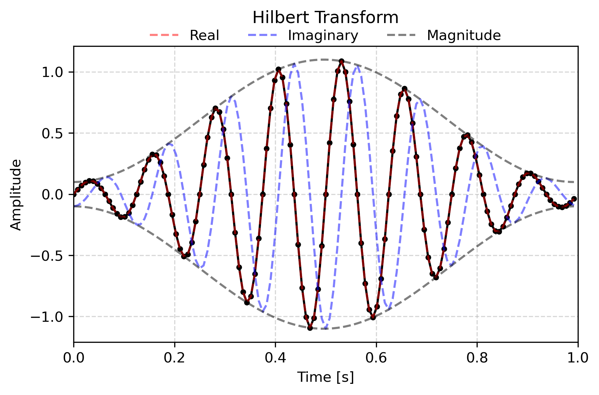
</p>

```python
omega = 2 * np.pi * 8.0
time = np.linspace(0, 1, 2 ** 7, endpoint=False)
# Modulate the Sine Wave with a offseted Hanning Window
signal = np.sin(omega * time) * (0.1 + np.hanning(time.size))
signal_ht = scipy.signal.hilbert(signal)

signal_ht.real, sighal_ht.imag, np.abs(signal_ht)
```

### Digital Filter

### Cepstrum

Cepstral analysis provides a unique perspective by applying a Fourier transform to the logarithm of the spectrum. The resulting “Cepstrum” is widely used for echo detection, speech processing, and seismic reflection analysis. This section explains the underlying theory, physical meaning, and demonstrates how to perform cepstral analysis in Python.

## Time-Frequency Spectrum

### Short-Time Fourier Transform

The Short-Time Fourier Transform (STFT) extends traditional Fourier analysis to non-stationary signals by introducing time localization via windowing. This allows us to track how the frequency content of a signal evolves over time. This section explains the trade-off between time and frequency resolution, the role of window functions, and practical implementation with `scipy.signal.shortTimeFFT`. It should be noted that function `scipy.signal.stft` is considered legacy and will no longer receive updates. While `scipy` currently have no plans to remove it, they recommend that new code uses more modern alternatives `shortTimeFFT` instead.

```python
window = 4096
step = 100
hann_window = scipy.signal.windows.hann(window, sym = True) # Hanning Window
STFT = scipy.signal.ShortTimeFFT(hann_window, hop=step, fs = fs, scale_to='psd', fft_mode = 'onesided2X')  # create the STFT object
stft_psd = STFT.stft(sig)  # perform the STFT
stft_time = np.arange(0, stft_psd.shape[1]) * STFT.hop / fs - STFT.win.size / 2 / fs  # time vector for STFT
stft_frequency = np.fft.rfftfreq(window, d=dt)  # frequency vector for STFT
```


### Wavelet Analysis

Wavelet analysis offers a versatile framework for multi-resolution time-frequency analysis, especially for signals with localized features or abrupt transitions. By decomposing a signal into wavelets, we gain simultaneous insight into both frequency and time domains. This section introduces the fundamentals of wavelet theory, common wavelet families, and hands-on examples using Python packages such as `pywt`, `scipy`, and `squeezzeypy`.

### Moving-Average and Moving-Median

Moving-average and moving-median filters are essential tools for smoothing time series and removing high-frequency noise. They are simple yet effective for trend extraction, baseline correction, and outlier suppression. This section compares these techniques, discusses their strengths and limitations, and provides Python code snippets for practical use. `bottleneck` and `numpy.sliding_window`.

## Multi-Dimensional Signal

### Principal Component Analysis / Minimum Variance Analysis

Principal Component Analysis (PCA) and Minimum Variance Analysis (MVA) are closely related, eigen‐vector–based techniques for extracting the dominant directional structure in multivariate data. PCA is a general statistical tool; MVA is the same mathematics applied to three-component field measurements (e.g., **B** in space physics) with special attention to the minimum-variance direction.

------

#### 1. Core Idea

- **PCA**: Rotate the data into a new orthogonal basis such that each successive axis captures the greatest possible remaining variance.
- **MVA**: Apply PCA to a 3 × * N vector time series and interpret the eigenvectors as the directions of maximum, intermediate, and minimum variance—often used to infer boundary normals or wave polarization axes.

------

#### 2. Mathematical Formulation

1. **Collect & demean** the data matrix
   $$
   \mathbf{X}
   = \begin{bmatrix}
     x_1 & x_2 & \dots & x_N \\
     y_1 & y_2 & \dots & y_N \\
     z_1 & z_2 & \dots & z_N
   \end{bmatrix},
   \qquad
   \tilde{\mathbf{X}} = \mathbf{X} - \langle\mathbf{X}\rangle
   $$

2. **Form the covariance (spectral) matrix**
   $$
     \mathbf{C} \;=\; \frac{1}{N-1}\,\tilde{\mathbf{X}}\tilde{\mathbf{X}}^\mathsf{T}
   $$

3. **Solve the eigenproblem**
   $$
     \mathbf{C}\,\mathbf{e}_i \;=\; \lambda_i\,\mathbf{e}_i,
     \quad
     \lambda_1 \ge \lambda_2 \ge \lambda_3 \ge 0
   $$

4. **Interpretation**

   - **PCA**: Project the data onto the top *k* eigenvectors $\{\mathbf{e}_1,\dots,\mathbf{e}_k\}$ for dimensionality reduction.
   
   - **MVA**:
     - $\mathbf{e}_1$: maximum‐variance direction (largest fluctuations)
     
     - $\mathbf{e}_2$: intermediate direction
     
     - $\mathbf{e}_3$: minimum‐variance direction—often taken as the local discontinuity normal or the wave propagation vector.
     
       <p align = 'center'>
       
       </p>

```python
N = 2 ** 10
time = np.linspace(0, 1, N, endpoint=False)
omega = 2 * np.pi * 8.0

signal_x = np.sin(omega * time + np.pi * 0.0) * (0.6 * np.hanning(time.size)) + np.random.randn(time.size) * 0.02
signal_y = np.sin(omega * time + np.pi * 0.5) * (0.7 * np.hanning(time.size)) + np.random.randn(time.size) * 0.02
signal_z = np.sin(omega * time + np.pi * 1.0) * (0.8 * np.hanning(time.size)) + np.random.randn(time.size) * 0.02

signal = np.vstack((signal_x, signal_y, signal_z)).T
pca = sklearn.decomposition.PCA(n_components=3)
pca.fit(signal)

eigenvalues = pca.singular_values_
eigenvectors = pca.components_
```


### Cross-Spectral Density

Cross-spectral density (CSD) quantifies the frequency-domain relationship between two signals, revealing shared oscillatory components and phase relationships. It forms the basis for advanced techniques such as coherence and transfer function estimation. This section covers the theory behind CSD, its estimation using Welch’s method, and real-world applications in system identification and geophysics.

### Average of the Spectral Matrix

A ***spectral matrix*** can be defined as 
$$
\hat{S}_{ij}= \hat{B}_i \hat{B}_j^*
$$

for a time series decomposite with both signal and noise, its Fourier coefficients follows the non-central chi-square distribution, as introduced in the previous section. Taking a 


### Coherence

Coherence measures the degree of linear correlation between two signals at each frequency, serving as a frequency-resolved analog of correlation coefficient. High coherence indicates a strong, consistent relationship, which is crucial for studies of wave propagation, coupled systems, and causality analysis. Here, we explain how to calculate and interpret coherence with Python tools.

To be honest, I feel very hard to understand what does *coherent/coherence* means in many of the magnetospheric ULF/VLF waves investigations. It can be easily understood the coherence between two individual light or signal. However, in the *in-situ* observation, the spacecraft can only measure one signal without further distinguishment or separation. In some literature, the coherence between $E_x$ and $B_y$ are used to measure whether the observed VLF waves are coherent. These VLF waves always propagate along the geomagnetic field line, which point to the north near the magnetic equator. It makes some sense as a high coherence suggests the waves have a stable wave vector during this interval. But, it is still hard to expect the occurrence of interference as both $E_x$ and $B_y$ may just be the presence of one single wave. While, some other literatures use the coherence between the magnetic field components to 

### Combination with Maxwell's Equations: SVD Wave Analysis

Spectral analysis gains further physical meaning when interpreted alongside Maxwell’s equations. For electromagnetic signals, the spectral content reflects underlying wave propagation, polarization, and field coupling processes. 
$$
\begin{align}
\nabla \cdot \mathbf{E}(\mathbf{r},t) & = -\frac{\rho}{\varepsilon_0}\\

\nabla \cdot \mathbf{B}(\mathbf{r},t) & = 0\\

\nabla \times \mathbf{E}(\mathbf{r},t) & = -\frac{\partial \mathbf{B}(\mathbf{r},t)}{\partial t} \\

\nabla \times \mathbf{B}(\mathbf{r},t) & = \mu_0 \mathbf{J}(\mathbf{r},t)+\mu_0\varepsilon_0 \frac{\partial\mathbf{E}(\mathbf{r},t)}{\partial t}

\end{align}
$$
As the electromagnetic field $\mathbf{E(r},t)$ and $\mathbf{B(r}, t)$ are square-integrable, Maxwell's equations can be naturally transformed into the $(\mathbf{k},\omega)$-space with the basic replacement from $\nabla \leftrightarrow i\mathbf{k}$ and $\partial/\partial t\leftrightarrow -i\omega$:
$$
\begin{align}
i \mathbf{k\cdot \hat{E}(k,\omega)}&=-\hat{\rho_e}/\varepsilon_0 \\
i \mathbf{k\cdot \hat{B}(k,\omega)}&=0 \\
i \mathbf{k\times \hat{E}(k,\omega)}&=i\omega\mathbf{\hat{B}(k,\omega)} \\
i \mathbf{k\times \hat{B}(k,\omega)}&=\mu_0 \mathbf{\hat{J}(k,\omega)} -\mu_0 \varepsilon_0 i\omega\mathbf{\hat{E}(k,\omega)} \\

\end{align}
$$

However, a single spacecraft measurement only allows you to observe a one-dimensional (time) signal at one position, i.e., the spacecraft position, which literally moves in the space. Thus, the signal can only be converted into the frequency space as $\mathbf{\hat{B}(\omega)}$. The second equation is the only parameter-free equation and states that the wave vector, $\mathbf{k}$ must be perpendicular to the magnetic field disturbance, $\mathbf{\hat{B}(\omega)}$. Obviously, $\mathbf{k=0}$ is a trivial, but not useful solution for satisfying the divergence-free theorem. By constraining the norm of $\mathbf{k}$ to be unity, $\boldsymbol{\kappa}\mathbf{:=k/}k$, a more meaningful solution comes out. When the real part, $\Re{\hat{\mathbf{B}}(\omega)}$ and imaginary part, $\Im{\hat{\mathbf{B}}(\omega)}$ of $\mathbf{\hat{B}(\omega)}$ are highly orthogonal, they can span a linear space whose normal vector is naturally $\boldsymbol{\kappa}$. 
$$
\boldsymbol{\kappa}=\frac{\Re{\hat{\mathbf{B}}(\omega)}\times{\Im\hat{\mathbf{B}}(\omega)}}{|\Re{\hat{\mathbf{B}}(\omega)}\times{\Im\hat{\mathbf{B}}(\omega)}|}
$$
which perfectly satisfy that $\boldsymbol{\hat{\mathbf{B}}\cdot \kappa}=0$. 

However,  this $\mathbf{\hat{B}}$-based, namely, coefficient-based estimation may be influenced by the noise's contribution and thus is not so practical. Inspired by the Welch method, a spectral-based estimation is preferred as the spectral density is easily denoised. The spectral-based estimation can be given by refining the original proposition:
$$
(\hat{\mathbf{B}}^*\hat{\mathbf{B}})\cdot \boldsymbol{\kappa}=0
$$

$$
\hat{S}_{ij}=\langle \hat{B}_i \hat{B}_j^* \rangle
$$

which can still be met by the original solution. After averaging the spectral matrix in time and frequency domain, this equation can not be perfectly satisfied any more. Thus, we will look for a weaker solution in the sense of minimization:
$$
\begin{align}
\min \limits_{\mathbf{||\boldsymbol{\kappa}||_2^2=1}} & ||\hat{S}\cdot \boldsymbol{\kappa}||_2^2\\ \Leftrightarrow \min \limits_{\mathbf{||\boldsymbol{\kappa}||_2^2=1}} \{&{\underline{||{\Re{\hat{S}}}\cdot \boldsymbol{\kappa}||_2^2}} + \underline{{||{\Im\hat{S}}\cdot \boldsymbol{\kappa}||_2^2}}\}\\
\end{align}
$$
[McPherron et al. (1972)](https://doi.org/10.1007/BF00219165) and [Means (1972)](https://doi.org/10.1029/JA077i028p05551) adopts the real and imaginary part in the minimization optimization for the estimation of wave propagation direction, respectively. Both of these two optimization problem can be solved by eigenvalue decomposition. Then, [Santolík et al. (2003)](https://doi.org/10.1029/2000RS002523) combine both terms and construct an augmented matrix ${A}$:
$$
{A} =
\begin{pmatrix}
\Re S_{11} & \Re S_{12} & \Re S_{13} \\
\Re S_{12} & \Re S_{22} & \Re S_{23} \\
\Re S_{13} & \Re S_{23} & \Re S_{33} \\
0 & -\Im S_{12} & -\Im S_{13} \\
\Im S_{12} & 0 & -\Im S_{23} \\
\Im S_{13} & \Im S_{23} & 0 \\
\end{pmatrix}
$$


The optimization problem
$$
\min\limits_{\Vert\boldsymbol{\kappa}\Vert_2^2=1} ||{A\cdot \mathbf{k}}||_2^2
$$
is directly solvable by applying a ***singular value decomposition(SVD)*** to matrix ${A}$
$$
{A}=U\cdot W\cdot V^T
$$
where $U$ is a $6\times3$ matrix with orthonormal columns, $W$ is a $3\times3$ diagonal matrix with three nonnegative singular values, and $V ^T$ is a $3\times 3$ matrix with orthonormal rows. Diagonal matrix $W$ representing the signal power in a descending order. 

- **<u>Compressibility</u>** describe the polarization 

$$
\begin{align}
\mathrm{Compressibility}(f_k):=\frac{PSD(B_\parallel)}{\sum_i PSD(B_i)}
\end{align}
$$


- **<u>Planarity</u>** 

$$
F=1-\sqrt{W_{2}/W_{0}}
$$

Without averaging the spectral matrix, the planarity $F(t,f)$ **<u>will be all one</u>**. It means that, when the observer only take one snapshot of the waves, it can not distinguish how does the waves propagate. After the averaging, the planarity actually describe that, **<u>whether the waves that observed at these time periods, frequencies share the common unitary wave vector.</u>**

```python
spec = np.einsum('fti,ftj->ftij', coef, coef.conj())
spec = bn.move_mean(spec, window=freq_window, min_count=1, axis=0)
spec = bn.move_mean(spec, window=time_window, min_count=1, axis=1)

spec_63 = np.concatenate([spec.real, spec.imag], axis=-2)
u, s, vh = np.linalg.svd(spec_63, full_matrices=False)

planarity = 1 - np.sqrt(s[:, :, 2] / s[:, :, 0])
ellipticity_along_k = s[:, :, 1] / s[:, :, 0]
```

Similarly, based on the averaged spectral matrix, one may define the coherence (coherency) between different components:
$$
Coherency:=\frac{|S_{ij}|}{\sqrt{S_{ii}S_{jj}}}
$$
<p align = 'center'>
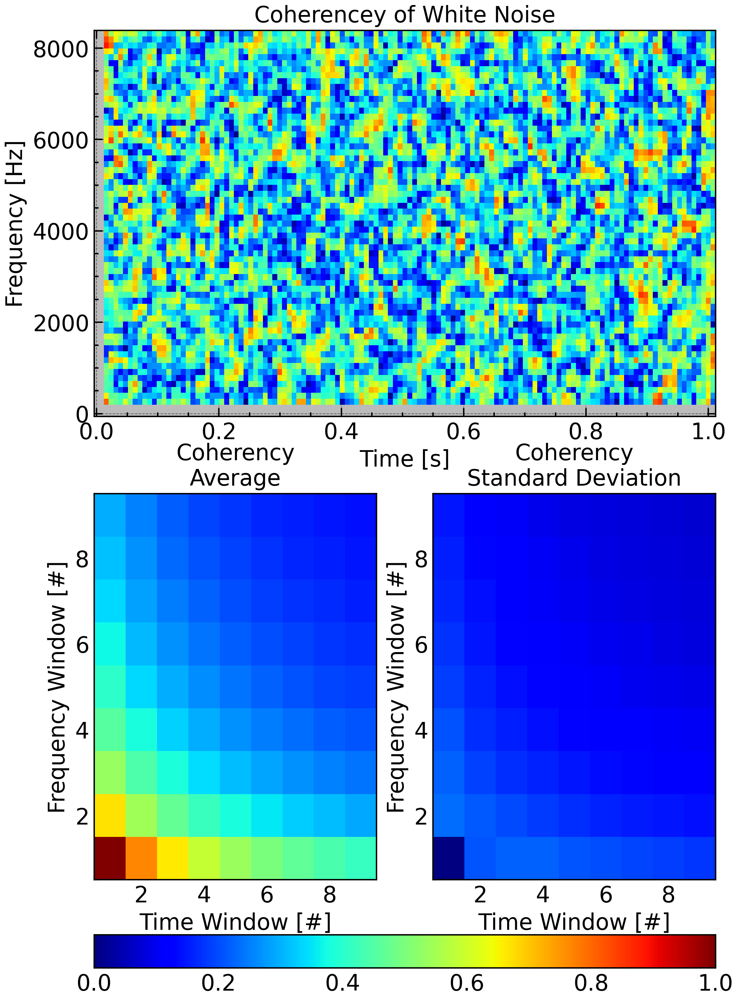
</p>

One should keep in mind that all interpretation about the observed waves is in the spacecraft inertial reference frame. A proper choice of coordinate system is especially necessary for a spinning spacecraft.


This section explores the synergy between spectral analysis and electromagnetic theory, demonstrating how to derive physical insights and constraints from both perspectives.

#### Polarization

Polarization analysis examines the orientation and ellipticity of oscillatory signals, especially electromagnetic or plasma waves. By decomposing the signal into orthogonal components and analyzing their relative amplitude and phase, we can characterize wave mode, propagation direction, and physical source. This section introduces key polarization parameters, their spectral estimation, and relevant Python implementations.

Ellipticity can be defined as the ratio of the semi-major and semi-minor, which is estimated by:
$$
\epsilon=\frac{W_1}{W_0}
$$
For a noisy signal, T and S 2019 propose an improved method with a estimation of the noise level based on the eigen decomposition. In this method, they noise level is inferred by decomposing the real part of the spectral density matrix and the maximum/intermediate eigenvalues of the complex spectral density represents the summation of wave power and noise power. Therefore, the improved ellipticity is derived:
$$
\epsilon^\prime=\sqrt{\frac{\lambda_{r1}-\lambda_1}{\lambda_{r0}-\lambda_1}}
$$
This improved ellipticity performs better than the original one when SNR is low but the still randomly deviates from the ground true. Thus, a moving average in the time or frequency domain is still required as it promote the SNR. 

```python
coef_wf = np.einsum('ijk,ijlk->ijl', coef, vh)
spec_wf = np.einsum('fti,ftj->ftij', coef_wf, coef_wf.conj())
spec_wf = bn.move_mean(spec_wf, window=freq_window, min_count=1, axis=0)
spec_wf = bn.move_mean(spec_wf, window=time_window, min_count=1, axis=1)

coherence = np.abs(spec_wf[:, :, 0, 1]) / np.sqrt(np.abs(spec_wf[:, :, 0, 0] * spec_wf[:, :, 1, 1]))

eigenvalues_r, _ = np.linalg.eigh(spec_wf[:, :, :2, :2].real) # Ascending
eigenvalues, _ = np.linalg.eigh(spec_wf[:, :, :2, :2]) # Ascending

ellipticity_along_k = np.sqrt((eigenvalues_r[:, :, 0] - eigenvalues[:, :, 0]) \
                              / (eigenvalues_r[:, :, 1] - eigenvalues[:, :, 0]))
```


Both above two ellipticities are unsigned as the singular/eigen values are always non-negative. Another, but not alternative definition of the ellipticity, is the ratio of left-handed polarized signal power to the right-handed polarized power. This definition is signed and the the ellipse is defined in the plane that perpendicular to the background magnetic field:
$$
\epsilon_B=\frac{|\hat{B}_L|^2-|\hat{B}_R|^2}{|\hat{B}_L|^2+|\hat{B}_R|^2}
$$
with $B_L$ and $B_R$ defines below:
$$
\begin{align}
B_L = \frac{1}{\sqrt{2}}(B_{\perp1}+iB_{\perp2})\\
B_R = \frac{1}{\sqrt{2}}(B_{\perp1}-iB_{\perp2})
\end{align}
$$
with $\mathbf{e_{\perp1}}$, $\mathbf{e_{\perp2}}$, and $\mathbf{e_\parallel }$ constitute a right-hand system, i.e., $\mathbf{e_{\perp1}\times e_{\perp2}=e_\parallel}$.

It is also important as it may unveils the wave excitation mechanism (e.g., wave-particle resonance). This definition is totally irrelevant with the determination of the wave vector direction. Instead, field-aligned coordinates is required for its derivation.

```python
dir_para = (magf.T / np.linalg.norm(magf, axis = 1)).T
# Find the reference direction that is furthest from the magnetic field direction
dir_ref = np.eye(3)[np.argmin(np.abs(dir_para), axis = 1)]

dir_perp_1 = np.cross(dir_para, dir_ref)
dir_perp_1 = (dir_perp_1.T / np.linalg.norm(dir_perp_1, axis = 1)).T

dir_perp_2 = np.cross(dir_para, dir_perp_1)
dir_perp_2 = (dir_perp_2.T / np.linalg.norm(dir_perp_2, axis = 1)).T

coef_para = np.einsum('ijk,jk->ij', coef, dir_para)
coef_perp1 = np.einsum('ijk,jk->ij', coef, dir_perp_1)
coef_perp2 = np.einsum('ijk,jk->ij', coef, dir_perp_2)

coef_lh = (coef_perp1 - 1j * coef_perp2) / np.sqrt(2)
coef_rh = (coef_perp1 + 1j * coef_perp2) / np.sqrt(2)

ellipticity_along_b = (np.abs(coef_rh) - np.abs(coef_lh)) / (np.abs(coef_rh) + np.abs(coef_lh))
compressibility = np.abs(coef_para) ** 2 / (np.abs(coef_para) ** 2 + np.abs(coef_lh) ** 2 + np.abs(coef_rh) ** 2)

```

#### Degree of Polarization

The **degree of polarization** quantifies the proportion of an electromagnetic fluctuation (such as a plasma wave) that is organized, or polarized, as opposed to random or unpolarized (noise-like) components. It is a fundamental parameter in space plasma physics, characterizing the coherence of observed wave signals.

The degree of polarization is defined as the fraction of the total wave power that is associated with a perfectly polarized (coherent) component. It is mathematically expressed as:
$$
D_p = \frac{\text{Power of the Polarized Component}}{\text{Total Power}}
$$

- $D_p = 1$: the signal is completely polarized.
- $0 < D_p < 1$: the signal is partially polarized.
- $D_p = 0$: the signal is totally unpolarized (random noise).

A high degree of polarization indicates that the observed fluctuations are dominated by coherent wave processes, while a low degree suggests that random or turbulent components are significant. The degree of polarization is widely used to distinguish wave modes, to separate physical signals from instrumental or background noise, and to assess the reliability of wave analysis.

In three-dimensional wave analysis, the **degree of polarization** quantifies how much of the measured signal is concentrated along a single, well-defined direction, versus being randomly distributed among all directions.

The 3D eigenvalue-based degree of polarization is defined as:
$$
D_{p,3D} = \frac{\lambda_1 - \lambda_2}{\lambda_1 + \lambda_2 + \lambda_3}
$$
where $\lambda_1 \geq \lambda_2 \geq \lambda_3$ are the eigenvalues of the (power or spectral) matrix constructed from the three orthogonal components of the wave field.

This definition is coordinate-invariant and widely used in space plasma physics to characterize the coherence and organization of wave signals in planetary magnetospheres and the solar wind. It is particularly powerful for distinguishing true wave modes from background turbulence or noise.

```python
w, v = np.linalg.eigh(spec)
degree_of_polarization = (w[:, :, 2] - w[:, :, 1]) / np.sum(w, axis = -1)
```

- Notice: `np.linalg.eigh` and `np.linalg.svd` return the eigen/singular values in an ascending / descending order.


## Jargon Sheet and Personal Naming Convention


</body>
</html>
