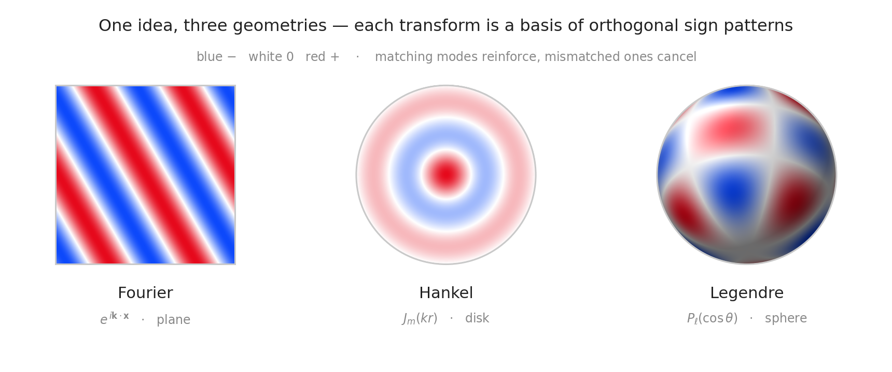

<p align="center">
  
</p>

<h1 align="center">Practical Spectral Analysis with Python</h1>

<p align="center">
  <em>An interactive, example-first guide to the Fourier and wavelet analysis of real signals.</em>
</p>

<p align="center">
  <a href="https://jiutongzhao.github.io/Time-Series-Data-Analysis/"><strong>📖&nbsp; Read it online →</strong></a>
</p>

<p align="center">
  <a href="https://jiutongzhao.github.io/Time-Series-Data-Analysis/"></a>
  
  
  
  
</p>

---

> *"You should try some Fourier or wavelet analysis."* — every advisor, ever.
>
> This is the resource I wish I'd had then: every concept paired with a **real-world signal** and runnable Python — sunspots, earthquakes, exoplanet transits, gearbox vibrations, birdsong, the cosmic microwave background — not just toy sinusoids.

## 📖 Read it on the web

The book is published as an interactive [Quarto](https://quarto.org) website with rendered math, figures, and copy-paste code. That is the intended way to read it:

<h3 align="center">

[**jiutongzhao.github.io/Time-Series-Data-Analysis**](https://jiutongzhao.github.io/Time-Series-Data-Analysis/)

</h3>

<p align="center">
  <a href="https://jiutongzhao.github.io/Time-Series-Data-Analysis/chap3.html">
    
  </a>
</p>

## What's inside

| | Chapter | Topic |
|--:|---|---|
| | [Preface](https://jiutongzhao.github.io/Time-Series-Data-Analysis/chap0_preface.html) | Why spectral analysis, and how to read this book |
| 1 | [Data Initialization](https://jiutongzhao.github.io/Time-Series-Data-Analysis/chap1.html) | Loading, timestamps, units, array shaping |
| 2 | [Frequency Domain](https://jiutongzhao.github.io/Time-Series-Data-Analysis/chap2.html) | DFT/FFT, windowing, leakage |
| 3 | [Power Spectral Density](https://jiutongzhao.github.io/Time-Series-Data-Analysis/chap3.html) | Periodogram, Welch, Wiener–Khinchin, Hankel/Legendre/Hermite |
| 4 | [More about FFT](https://jiutongzhao.github.io/Time-Series-Data-Analysis/chap4.html) | Zero-padding, Gibbs, cepstrum |
| 5 | [Noise](https://jiutongzhao.github.io/Time-Series-Data-Analysis/chap5.html) | Coloured noise, quantization, stationarity |
| 6 | [Signal Processing](https://jiutongzhao.github.io/Time-Series-Data-Analysis/chap6.html) | Filters, detrending, convolution |
| 7 | [Time–Frequency Analysis](https://jiutongzhao.github.io/Time-Series-Data-Analysis/chap7.html) | STFT, CWT, DWT denoising |
| 8 | [Multi-Channel Signals](https://jiutongzhao.github.io/Time-Series-Data-Analysis/chap8.html) | Coherence, cross-spectra, polarization |
| | [Appendix](https://jiutongzhao.github.io/Time-Series-Data-Analysis/chap10_appendix.html) · [Naming Convention](https://jiutongzhao.github.io/Time-Series-Data-Analysis/chap_naming.html) | Weighted sums, distributions, conventions |

## 🖼️ Gallery

Self-contained, real-data worked examples — [**browse the Gallery →**](https://jiutongzhao.github.io/Time-Series-Data-Analysis/gallery.html)

<p align="center">
  <a href="https://jiutongzhao.github.io/Time-Series-Data-Analysis/gallery/sunspot.html"></a>
  &nbsp;
  <a href="https://jiutongzhao.github.io/Time-Series-Data-Analysis/gallery/stft_cwt.html"></a>
  &nbsp;
  <a href="https://jiutongzhao.github.io/Time-Series-Data-Analysis/chap3.html"></a>
</p>

## 🛠️ Run it locally

```bash
git clone https://github.com/jiutongzhao/Time-Series-Data-Analysis.git
cd Time-Series-Data-Analysis

# install Quarto (https://quarto.org/docs/get-started/) and the Python deps:
pip install numpy scipy matplotlib pandas pywavelets bottleneck \
            scienceplots ssqueezepy healpy jupyter

quarto render        # build the static site into docs/
quarto preview       # live-reloading local server
```

The source for each chapter is a paired `chap*.qmd` (prose + math) and `chap*.ipynb` (figure-generating code); the site is built to `docs/` and served via GitHub Pages.

## 📦 Built with

Python · NumPy · SciPy · Matplotlib · pandas · PyWavelets · ssqueezepy · healpy — typeset with **Quarto** and KaTeX.

## 📄 License & citation

- **Prose & figures:** [CC BY 4.0](https://creativecommons.org/licenses/by/4.0/)
- **Code:** [MIT](LICENSE)

```bibtex
@book{zhao_practical_spectral_analysis,
  author = {Zhao, Jiutong},
  title  = {Practical Spectral Analysis with Python},
  year   = {2026},
  url    = {https://jiutongzhao.github.io/Time-Series-Data-Analysis/}
}
```

<p align="center"><sub>© 2024–2026 Jiutong Zhao · Content CC BY 4.0 · Code MIT</sub></p>
