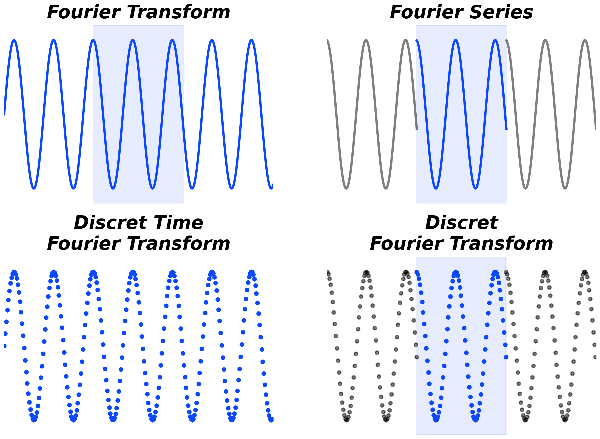
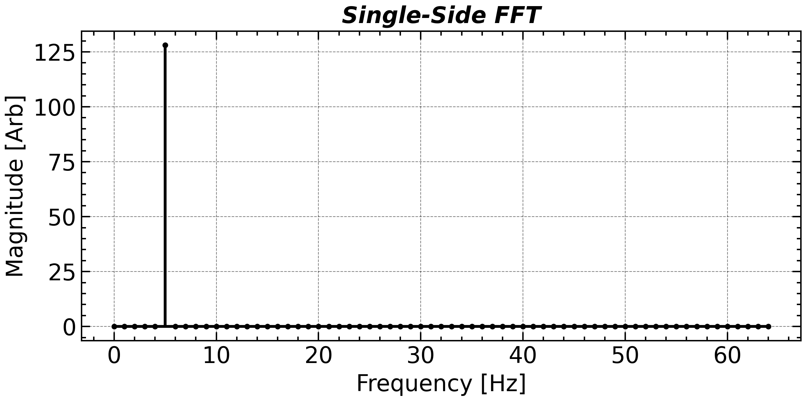
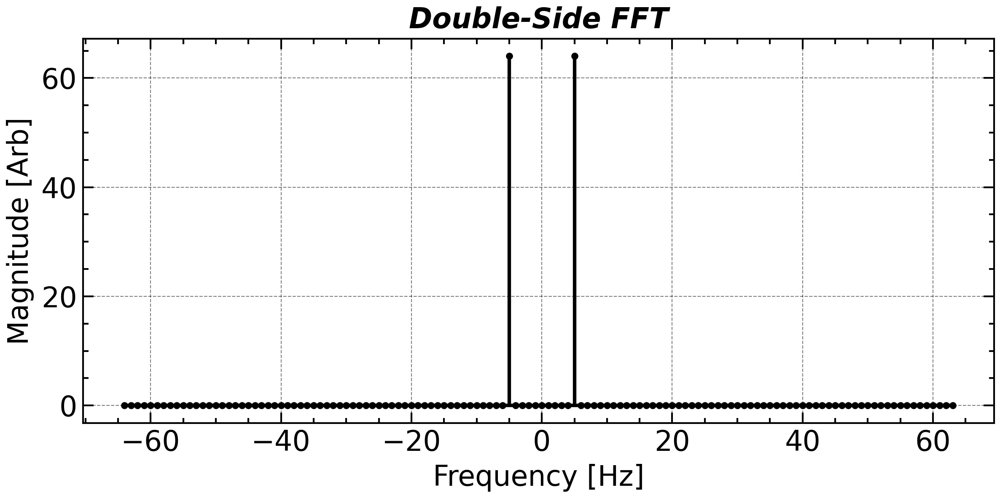
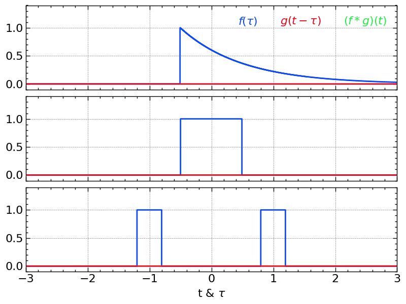
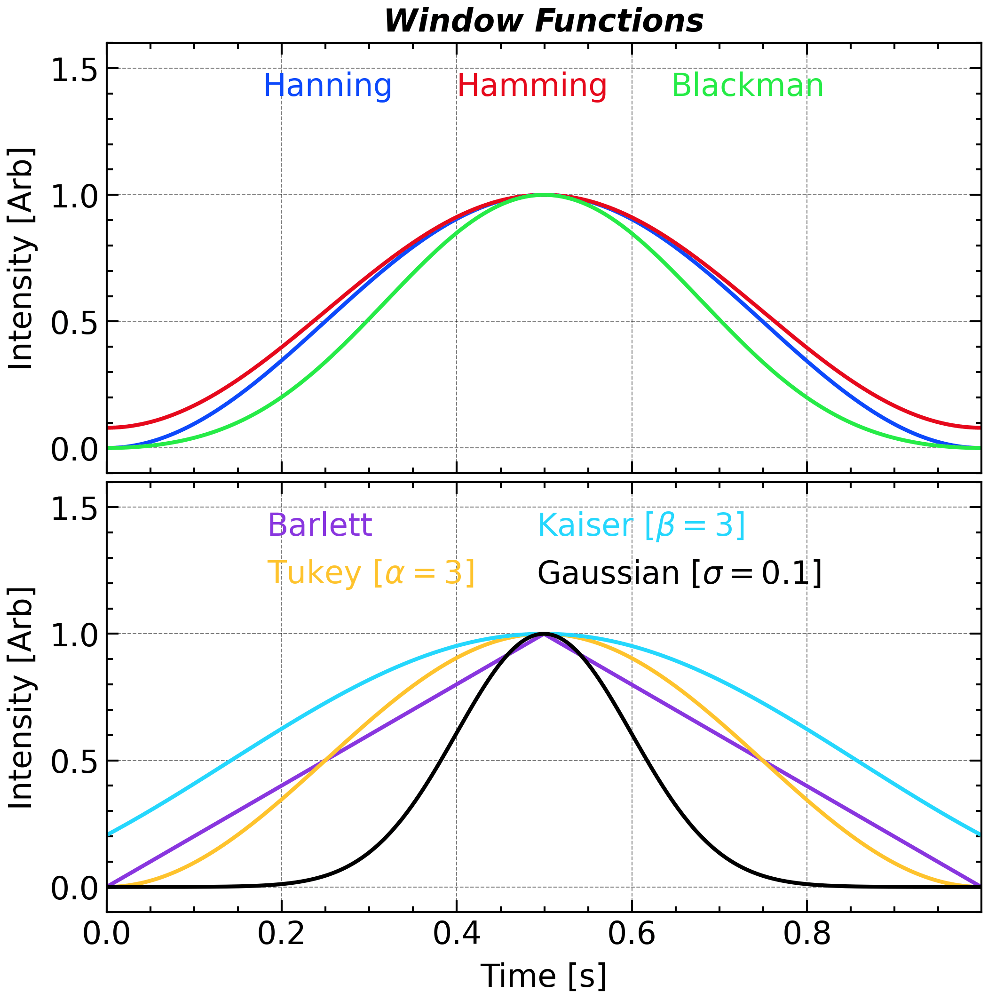
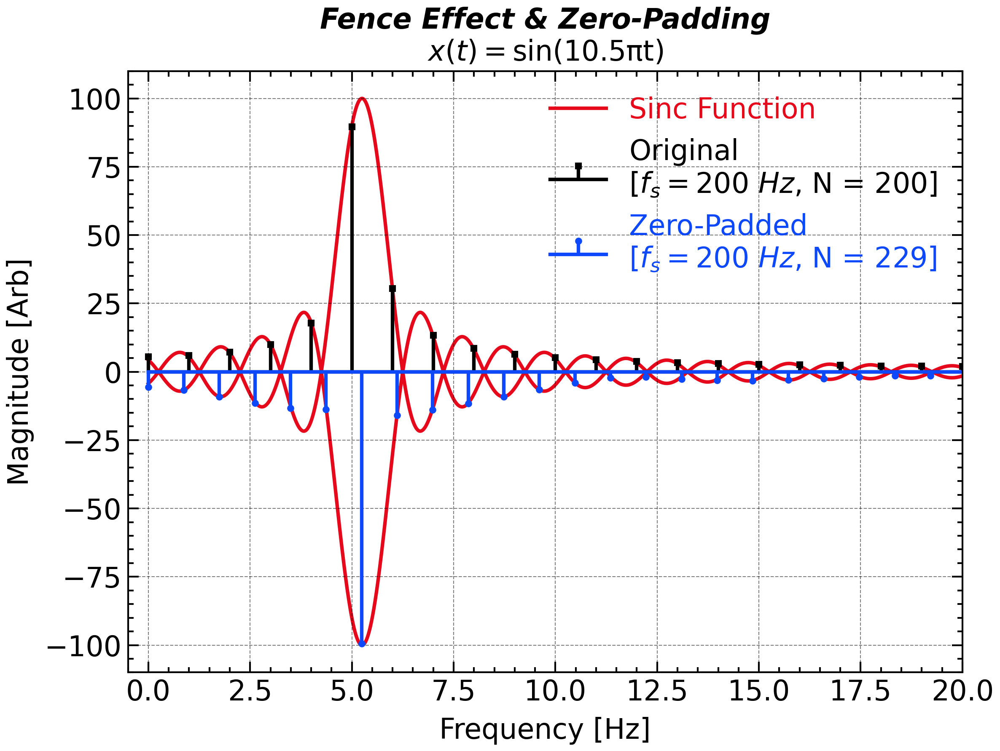
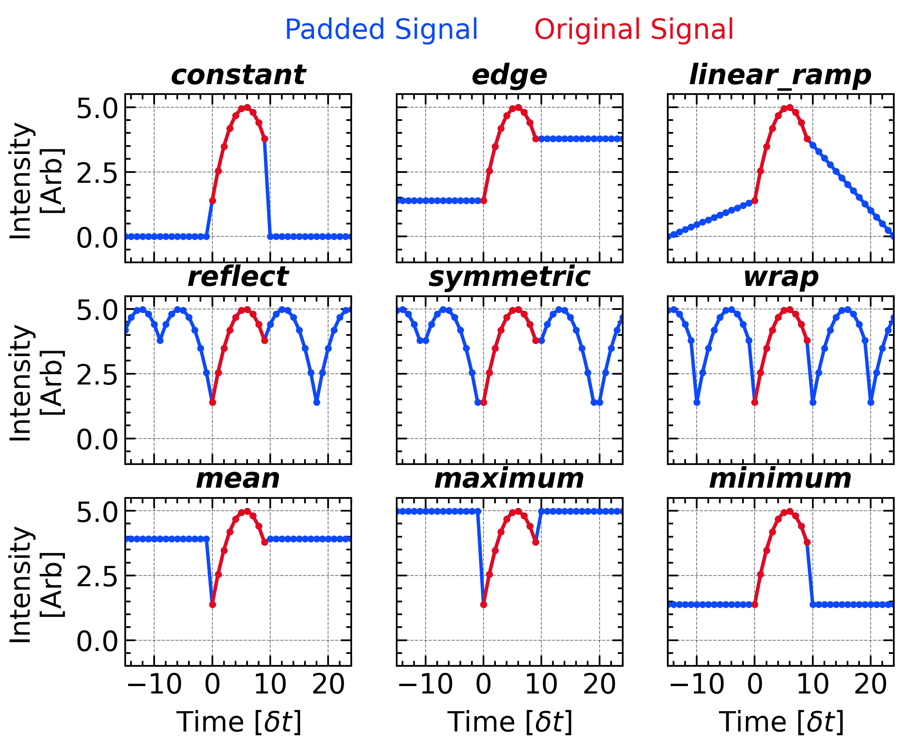

# Frequency Domain

## Fourier Transform

> **[(Continuous) Fourier Transform (CFT, or FT)](https://en.wikipedia.org/wiki/Fourier_transform)** provide the perfect way to convert the observed time series into the dual space, ***Frequency domain***. Its definition can be written as follows
$$
\begin{align}
X(f) = \int_{-\infty}^{+\infty} x(t) e^{-2\pi i f t} \, \mathrm{d}t:=\mathcal{F}[x(t)]
\end{align}
$$
>$\mathcal{F}$ denotes the Fourier transform operator.  This transform is invertible and the inverse (continuous) Fourier transform can be given as:
$$
\begin{align}
x(t)=\int_{-\infty}^{+\infty}X(f) e^{2\pi i f t} \mathrm{d}f:=\mathcal{F^{-1}}[X(f)]
\end{align}
$$

<!-- fig-tabset:figure_4types_of_ft.png -->
::: {.panel-tabset}

### Figure



### Code  <small>chap2.ipynb · cell 6</small>

```python
import numpy as np
import matplotlib.pyplot as plt
import scipy.signal
import scienceplots
plt.style.use(['science', 'nature', 'notebook', 'grid', 'high-vis'])

%matplotlib ipympl
plt.close()
plt.gcf()
plt.gca()

plt.figure(figsize = figsize_normal)
plt.subplots_adjust(hspace = 0.3, bottom = 0.05, left = 0.05, right = 0.95)
ax1 = plt.subplot(2, 2, 1)
ax2 = plt.subplot(2, 2, 2, sharex = ax1, sharey = ax1)
ax3 = plt.subplot(2, 2, 3, sharex = ax1, sharey = ax1)
ax4 = plt.subplot(2, 2, 4, sharex = ax1, sharey = ax1)


t = np.linspace(0, 1, 2 ** 13, endpoint=False)
N = t.size
dt = t[1] - t[0]
fs = 1 / dt

omega0 = 2 * np.pi * 6.8
sig0 = np.sin(omega0 * t)

ax1.plot(t, sig0, 'C0')

sample_slice = slice(N // 3 * 1, N // 3 * 2)
ax2.plot(t[sample_slice], sig0[sample_slice], 'C0')

for i in [-1, 1]:
    ax2.plot(t[sample_slice] + i * np.ptp(t[sample_slice]), sig0[sample_slice], 'k-', alpha = 0.5)

ax1.axvspan(t[sample_slice].min(), t[sample_slice].max(), color = 'C0', alpha = 0.1)
ax2.axvspan(t[sample_slice].min(), t[sample_slice].max(), color = 'C0', alpha = 0.1)


sample_slice = slice(0, N, 32)
ax3.plot(t[sample_slice], sig0[sample_slice], 'C0o')
# ax3.plot(t[sample_slice], sig0[sample_slice], 'C0-', alpha = 0.5)

sample_slice = slice(N // 3 * 1, N // 3 * 2, 32)
ax4.plot(t[sample_slice], sig0[sample_slice], 'C0o')
# ax4.plot(t[sample_slice], sig0[sample_slice], 'C0-', alpha = 0.5)
for i in [-1, 1]:
    ax4.plot(t[sample_slice] + i * np.ptp(t[sample_slice]), sig0[sample_slice], 'ko', alpha = 0.5)

ax4.axvspan(t[sample_slice].min(), t[sample_slice].max(), color = 'C0', alpha = 0.1)

# plt.suptitle('Time Domain', weight = 'bold', fontsize = 16)

_titles = ['Fourier Transform', 'Fourier Series', 'Discret Time\nFourier Transform', 'Discret\nFourier Transform']
for i, ax in enumerate(plt.gcf().axes):
    ax.label_outer()
    ax.set_title(_titles[i], fontdict = title_font)
    ax.set_xlim(0, 1)
    ax.set_ylim(-1.2, 1.2)
    ax.grid(False)
    ax.axis('off')
# plt.tight_layout()

plt.savefig(save_path + 'figure_4types_of_ft' + '.png',bbox_inches='tight',dpi=300)

plt.show()
```

:::

However, a physical sample can only cover at discrete time nodes. Thus, ***<u>Discrete-Time Fourier Transform (DTFT)</u>*** presents an alternative expression in:
$$
\begin{align}
X(f)=\sum_{n=-\infty}^{+\infty} x[n]\cdot e^{-i2\pi f\cdot (n\delta t)}
\end{align}
$$

where $x[n]=x(n\cdot\delta t)$ stands for a discrete signal and $\delta t$ (`dt`) is the sampling period. 

This infinite-length discrete signal is still unrealistic. For a finite signal, the ***<u>Discrete Fourier Transform (DFT)</u>*** is the only one that applicable:
$$
\begin{align}
X[k] := X(k\cdot \delta f) & = \sum_{n=0}^N x(n\delta t) e^{-2\pi i \cdot k\cdot\delta f \cdot t} \, \delta  t \\
& = \sum_{n=0}^N x[n] e^{-2\pi i\cdot k \cdot \delta f \cdot t} \, \delta  t
\end{align}
$$

and the yielding frequency is also discrete with a frequency interval of $\delta f = 1/(N\cdot\delta t)$, where $N$ is the total number of samples. The multiplier $k$ is an integer ranging from $0$ to $N-1$. But, **$X[k]$ provide no additional information beyond $k=N/2$** for a real-valued signal, as it is **symmetric about** $k=N/2$, as a manifestation of the Nyquist-Shannon sampling theorem.

### DFT for a sinusoidal signal

For a pure sinusoidal signal $x(t)=A\cdot \mathrm{sin}(2\pi f_0 t + \phi)$, the DFT result will be two spikes at $f_0$ and $-f_0$ (or equivalently at $N-f_0$) with a complex amplitude of $AN/2 \cdot e^{i\phi}$ and $AN/2 \cdot e^{-i\phi}$, respectively. The amplitude spectrum can be calculated as $|X[k]|/N$ and the phase spectrum can be calculated as $\mathrm{arg}(X[k])$.

In many lecture notes (especially in the mathematics course), the sample period $\delta t$ is set to unity so that the formulas can be simplified. So, remember that all the related quantities are not in **<u>*SI (Système International d'Unités)*</u>** in that case. But in practical usage of spectral analysis, **the unit here always matters**. Specially, the unit information will be lost in the programming processing, which can be kept in mind in theoretical derivation. For this reason, we will try to keep all the units in this document. You can also ignore it during the processing but remember to add it back when you output the results. [Dimensional analysis](https://en.wikipedia.org/wiki/Dimensional_analysis) can be useful for getting and checking the correct final unitof the results. 

Ideally, according to the periodicity of $e^{-2\pi i ft}$, the DFT actually calculates the DTFT coefficients by extending the original series along and anti-along the time axis.

### Double-side ***versus*** Single-side 

In frequency analysis using the *DFT*, or its practical implementation **<u>*Fast Fourier Transform (FFT)*</u>**, the spectrum can be represented in two main formats: **double-sided** and **single-sided**, depending on the properties of the input signal and the goal of the analysis.

- **Double-Sided FFT** includes both positive and negative frequency components, symmetrically arranged around zero. It shows the full complex-valued spectrum, which is useful when the signal is complex or when phase symmetry matters. For real signals, the negative-frequency part is the complex conjugate of the positive-frequency part, making the negative side redundant.

  `np.fft.fftfreq(N, dt)` returns the discrete Fourier Transform sample frequencies. 

  ```python
  coef = np.fft.fft(sig)
  # Corresponding frequency with both zero, positive, and negative frequency
  
  freq = np.fft.fftfreq(coef.size, dt)
  # [0, 1, ...,   N/2-1,     -N/2, ..., -1] / (dt * N)   # if n is even
  # [0, 1, ..., (N-1)/2, -(N-1)/2, ..., -1] / (dt * N)   # if n is odd
  ```

  Then you can use `np.fft.fftshift` to rearrange the `coef` and `freq` so that the frequency is monotonically increasing:

  ```python
  freq = np.fft.fftshift(freq)
  coef = np.fft.fftshift(coef)
  ```


- **Single-Sided FFT** presents only the non-negative frequency components (from 0 up to Nyquist frequency). This format is typically used for **real-valued signals** when the **amplitude spectrum** or **energy (i.e., the square of amplitude) spectrum** is of interest. To preserve energy equivalence, the magnitudes (except at 0 and Nyquist) are usually **doubled** to account for the omitted negative frequencies.

  For real input, use `numpy.fft.rfft` (`numpy.fft.rfftfreq`) instead of `numpy.fft.fft` (`numpy.fft.fftfreq`) to get a single-sided Fourier spectrum, which is only designed for real input and intrinsically truncate the output coefficients and frequencies.

  ```python
  coef = np.fft.rfft(sig)
  freq = np.fft.rfftfreq(coef.size, dt)
  ```

  Yet, please remember that only real signal can be used as an input to `numpy.fft.rfft` otherwise the program will report a `TypeError`.

::: {.panel-tabset}

## Single-Sided


## Double-Sided


:::

## Application: Polynomial & Large Integer Multiplication

This is one of the most brilliant "crossover episodes" in computer science and applied mathematics. Using a tool originally designed for analyzing continuous wave frequencies (the Fourier Transform) to multiply discrete numbers and polynomials is a stroke of absolute genius.

First, let us imagine you have two polynomials of degree $N-1$:
$$
A(x) = \sum_{k=0}^N a_kx^k = a_0 + a_1x + a_2x^2 + ... + a_{N-1}x^{N-1}\\
B(x) = \sum_{k=0}^N b_kx^k = b_0 + b_1x + b_2x^2 + ... + b_{N-1}x^{N-1}
$$
If you want to find their product $C(x) = A(x)B(x)$, the standard "distributive" method requires multiplying every term in $A(x)$ by every term in $B(x)$, which has a time complexity of $\mathcal{O}(N^2)$. 

Once you put $$x=\mathrm{exp}[i2\pi\ l/M],\ l = 0,1,\dots, M-1$$ into the above polynomials, you get
$$
A\left[\mathrm{e}^{i2\pi l / M}\right] = \sum_{k=0}^N a_k\mathrm{e}^{i2\pi (lk / M)}:=A_l\\
B\left[\mathrm{e}^{i2\pi l / M}\right] = \sum_{k=0}^N b_k\mathrm{e}^{i2\pi (lk / M)}:=B_l
$$
The results $A_L,\ B_L$ are nothing but the **Fourier** coefficients of the series $a_k$ and $b_k$ with an extension filled by zero. 

These values of $A(x)$ (or $B(x)$) at $M$ specific points: $$[x_0, A(x_0)], ..., [x_{M-1}, A(x_{M-1})]$$ are called **Point-Value Representation** with a degree-bound of $M$ of a polynomial, and they can uniquely determine a polynomials with degree no more than $M$.

According to the definition $C(x)=A(x) B(x)$, we have $C_l=A_l B_l$ that is satisfied from $l=0$ to $M-1$. Now, we get the point-value representation of $C(x)$ as well. The coefficients of $C(x)$ are obviously derived by applying IFFT to the point-value representation of $C_l$.

```python
import numpy as np

A = np.array([1, 2, 3, 4])
# 1x^0 + 2x^1 + 3x^2 + 4x^3

B = np.array([5, 6, 7, 8, 9])
# 5x^0 + 6x^1 + 7x^2 + 8x^3 + 9x^4

M = len(A) + len(B) - 1

A_padded = np.pad(A, (0, M - len(A)), mode='constant')
B_padded = np.pad(B, (0, M - len(B)), mode='constant')

C = np.fft.ifft(np.fft.fft(A_padded) * np.fft.fft(B_padded))

A_string = ' + '.join([f'{a:.0f}x^{i}' for i, a in enumerate(A)])
B_string = ' + '.join([f'{b:.0f}x^{i}' for i, b in enumerate(B)])
C_string = ' + '.join([f'{c.real:.0f}x^{i}' for i, c in enumerate(C)])

print(A_string)
print('*')
print(B_string)
print('=')
print(C_string)

# Result:
# 1x^0 + 2x^1 + 3x^2 + 4x^3
#             *
# 5x^0 + 6x^1 + 7x^2 + 8x^3 + 9x^4
#             =
# 5x^0 + 16x^1 + 34x^2 + 60x^3 + 70x^4 + 70x^5 + 59x^6 + 36x^7
```

This idea can easily extended to the large integer multiplication, as an integer can be decomposited as
$$
\underline{65536} = \underline{6} \times 10^4 + \underline{5} \times 10^3 + \underline{5} \times 10^2 + \underline{3} \times 10^1 + \underline{6} \times 10^0=A_{63556}(10)
$$
The only two addition things to do are 
1. convert the large integers to polynomial $A(x),\ B(x)$, coefficients; 
2. Convert the resultant polynomial $C(x)$ back to the resultant integer.

## [Windowing](https://en.wikipedia.org/wiki/Window_function) Effect

When performing spectral analysis using the DFT, we implicitly assume that the finite-duration signal is periodically extended. 
$$
\begin{align}
X[k] & = \lim_{M\rightarrow+\infty} \frac{1}{2M} \sum_{n=-(M-1)\times N}^{M \times N} x[n] e^{-2\pi i k {t}/{T}} \, \delta  t\\
& \propto \sum_{n=-\infty}^{+\infty} x[n] e^{-2\pi i k {t}/{T}} \, \delta  t
\end{align}
$$
However, if the total sampling duration does not exactly match an integer multiple of the signal’s intrinsic period, a mismatch arises between the first and last sample points. This mismatch is interpreted by the DFT as a sharp discontinuity—or a jump—at the signal boundary. It arises since the first and last measurements seen by the Fourier operator is next to each other while it is actually not.

<!-- fig-tabset:figure_dft_spectral_leakage_window.png -->
::: {.panel-tabset}

### Figure


### Code  <small>chap2.ipynb · cell 24</small>

```python
import numpy as np
import matplotlib.pyplot as plt
import scienceplots
plt.style.use(['science', 'nature', 'notebook', 'grid', 'high-vis'])

%matplotlib ipympl
plt.close()

plt.figure(figsize=(8, 8))
ax1 = plt.subplot(2, 1, 1)
ax2 = plt.subplot(2, 1, 2)

N = 2 ** 8
omega0 = 2 * np.pi * 5.25

t = np.linspace(0, 1, N, endpoint=False)[:220]

# omega0 = 2 * np.pi * 5.

# t = np.linspace(0, 1, N, endpoint=False)

dt = t[1] - t[0]
sig = np.cos(omega0 * t)

ax1.plot(np.concat([t - (t[-1] + dt), t, t + (t[-1] + dt)]), np.concat([sig, sig, sig]), 'ko-')

coefs = np.fft.rfft(sig)
freq = np.fft.rfftfreq(len(t), t[1] - t[0])

ax2.stem(freq, np.abs(coefs), linefmt = 'k', markerfmt = 'ko', basefmt = 'k-')


window = np.hanning(sig.size + 1)[:-1]
sig *= window

ax1.plot(t, window, 'C1-', alpha = 0.25)
ax1.plot(t, -window, 'C1-', alpha = 0.25)

ax1.plot(t - (t.size * dt), window, 'C1-', alpha = 0.25, label = 'Hanning Window [Periodic]')
ax1.plot(t - (t.size * dt), -window, 'C1-', alpha = 0.25)

ax1.plot(t + (t.size * dt), window, 'C1-', alpha = 0.25)
ax1.plot(t + (t.size * dt), -window, 'C1-', alpha = 0.25)
ax1.axvspan(t[0], -1, -1.3, 1.3, color = '#888888', alpha = 0.25)
ax1.axvspan(t[-1], 2, -1.3, 1.3, color = '#888888', alpha = 0.25)

ax1.plot(np.concat([t - (t[-1] + dt), t, t + (t[-1] + dt)]), np.concat([sig, sig, sig]), 'C1o-')

coefs = np.fft.rfft(sig / np.sqrt((window ** 2).mean()))
freq = np.fft.rfftfreq(len(t), t[1] - t[0])

ax2.stem(freq, -np.abs(coefs), linefmt = 'C1--', markerfmt = 'C1o', basefmt = 'C1--')

# sig = np.cos(omega0 * t)

# window = np.hanning(sig.size)[:]
# sig *= window

# coefs = np.fft.rfft(sig * np.sqrt(8 / 3))
# freq = np.fft.rfftfreq(len(t), t[1] - t[0])

# ax2.stem(freq, np.abs(coefs), linefmt = 'C0--', markerfmt = 'C0o', basefmt = 'C0--')

ax1.set_ylim(-1.3, 1.3)
ax1.set_title('Windowed FFT', **title_font)

ax1.set_xlabel('Time [s]')
ax1.set_ylabel('Intensity [Arb]')

# ax2.set_title(r'${\hat{x}(f)}$')
ax2.set_xlabel('Frequency [Hz]')
ax2.set_ylabel('Magnitude [Arb]')

ax2.set_xlim(-0.5, 20)
ax2.set_ylim(-110, 110)

ax1.legend(frameon = True, bbox_to_anchor = (0.5, 1.02), loc = 'upper center', ncols = 2)

ax1.set_ylim(-1.6, 1.6)
ax1.set_xlim(-0.1, 1.0)

plt.tight_layout()

# ax2.text(13, 50., 'Spectral Leakage', fontsize=20, ha='center', va='center', rotation=-0, color='grey', alpha=1.0)

# for i in range(0, 20, 1):
#     if i not in [5, 6]:
#         ax2.annotate('', xy=(freq[i], np.abs(coefs[i])), xytext=(freq[i], np.abs(coefs[i]) + 10),
                        # arrowprops=dict(arrowstyle='->', lw=1.5, color='grey', alpha=1.0),
#                         fontsize=20, ha='center', va='center', rotation=-0, color='grey', alpha=1.0)

plt.savefig(save_path + 'figure_dft_spectral_leakage_window' + '.png',bbox_inches='tight',dpi=300)

plt.show()
```

:::

This artificial discontinuity introduces ***<u>[Spectral Leakage](https://en.wikipedia.org/wiki/Spectral_leakage)</u>***, causing energy from specific frequency components to spread into adjacent frequencies (called ***<u>[lobe](https://en.wikipedia.org/wiki/Sidelobes)</u>***, thereby distorting the true spectral content. To mitigate this issue, a **window function**—typically denoted ${w}(t)$—is applied to taper the edges of the signal, reducing the contribution of the jump and suppressing leakage.

Different window functions (e.g., **<u>*rectangular, Hamming, Hanning, Blackman*</u>**) offer different trade-offs between **frequency resolution** (main-lobe width) and **leakage suppression** (side-lobe attenuation). You should try these window functions yourself and choose the most suitable one.

The [Hanning window](https://en.wikipedia.org/wiki/Hann_function), which is a very wide used window function, can be written as:
$$
\begin{align}
w(t)&=\frac{1}{2}\left[1-\mathrm{cos}(2\pi t)\right]\\
w[n]&=\frac{1}{2}\left[1-\mathrm{cos} \left(\frac{2\pi n}{N}\right)\right]
\end{align}
$$

It can be implemented in `numpy` as follow:

```python
# Symmetric Window, for which w[0] = w[-1]
w = np.hanning(sig.size)

# Periodic Window, for which w[1] = w[-1]
w = np.hanning(sig.size + 1)[:-1]

# Windowing Without Normalization
sig *= w
```

However, applying a window also reduce the signal’s amplitude and energy near the boundary. This can introduce ambiguity when interpreting the resulting spectrum or comparing analyses across different window shapes. To ensure physical and quantitative consistency, **normalization** of the window function is often necessary. **Amplitude normalization** ensures that the peak value of the window is one, preserving the local signal scale. **Power normalization** adjusts the window so that the total energy of the signal—defined as the sum of squared values—remains unchanged after windowing. The amplitude and energy normalization is also named <u>**$L_1$ and $L_2$ normalization**</u> as the amplitude and energy can is proportional to the $L_1$ and $L_2$ norm of the signal, respectively. The choice of normalization method depends on the analytical goals, and plays a crucial role in ensuring accurate and meaningful spectral results.

The Hanning window has an average amplitude of $1/2=\int_0^1 w(x)\mathrm{d}x$ and an average energy of 
$$
\begin{align}
\int_0^1 w^2(x)\mathrm{d} x = \frac{1}{4} \left\{\int_0^1 [1 - 2 \mathrm{cos}(2\pi x) + \mathrm{cos^2}(2\pi x)]\mathrm{d}x \right\}=\frac{1}{4}(1-0+\frac{1}{2}) = \frac{3}{8}
\end{align}
$$

A more quantitative estimation of the signal amplitude or energy can be given by using a normalized window function.

```python
# Amplitude Normalization (factor of 2)
w = np.hanning(sig.size) * 2

# or
w = np.hanning(sig.size)
w /= w.sum()

# Energy Normalization (factor of 8/3)
w = np.hanning(sig.size) * np.sqrt(8 / 3)

# or
w = np.hanning(sig.size)
w /= np.sqrt((w ** 2).sum())
```

## [Convolution Theorem](https://en.wikipedia.org/wiki/Convolution_theorem)

>  In Fourier analysis, the **Convolution Theorem** says that convolving two signals in time becomes multiplying their spectra:
$$
\mathcal{F}\{\,x(t)*y(t)\,\}=X(f)\cdot Y(f),
\qquad
\mathcal{F}^{-1}\{X(f)*Y(f)\}=x(t)\cdot y(t),
$$
> with the definition of convolution operator ($*$):
$$
(x*y)(t)=\int_{-\infty}^{\infty}x(\tau)\,y(t-\tau)\,d\tau
$$


The convolution theorem states how operations performed on a signal in the time domain or in the frequency domain will affect that signal in its dual domain. 

<p align = 'center'>

<i>Some Other Window Functions (without normalization).</i>
</p>

We now understand that windowing (**time-domain multiplication**) actually broadens and shapes the spectrum (**frequency-domain convolution**) exactly as predicted by the convolution theorem.

Unlike the continuous version, the discrete convolution theorem inherently links point-wise multiplication in the DFT domain to **circular (convolution-mod-N)** in the time domain—so to obtain ordinary linear convolution you must first zero-pad the sequences beyond their combined length.

According to the convolution theorem, performing convolution via the *FFT* cuts the computational cost from $O(N^{2})$ to $O\bigl(N\log N\bigr)$.

## Other Window Functions

Some other window functions are also supported by `numpy` and `scipy`, which is summarized below:

<!-- fig-tabset:figure_window_functions.png -->
::: {.panel-tabset}

### Figure



### Code  <small>chap2.ipynb · cell 20</small>

```python
plt.close()
plt.figure(figsize = (8, 8))
plt.subplots_adjust(hspace = 0.02)
ax1 = plt.subplot(2, 1, 1)
ax2 = plt.subplot(2, 1, 2, sharex = ax1, sharey = ax1)

N = 2 ** 10
t = np.linspace(0, 1, N, endpoint = False)

ax1.plot(t, np.hanning(N), label = 'Hanning', linestyle = '-')
ax1.plot(t, np.hamming(N), label = 'Hamming', linestyle = '-')
ax1.plot(t, np.blackman(N), label = 'Blackman', linestyle = '-')

ax2.plot(t, np.bartlett(N), label = 'Barlett', linestyle = '-', color = 'C3')
ax2.plot(t, scipy.signal.windows.tukey(N, alpha = 3), label = r'Tukey [$\alpha=3$]', linestyle = '-', color = 'C4')
ax2.plot(t, scipy.signal.windows.kaiser(N, beta = 3), label = r'Kaiser [$\beta=3$]', linestyle = '-', color = 'C5')
ax2.plot(t, scipy.signal.windows.gaussian(N, std = N * 0.1), label = r'Gaussian [$\sigma=0.1$]', linestyle = '-', color = 'k')

ax1.set_ylim(-0.1, 1.6)
# ax1.legend(frameon = False, ncol = 3)
# ax2.legend(frameon = False, ncol = 2)
ax1.legend(loc = 'upper center', ncol = 5, labelcolor="linecolor", handlelength = 0, handletextpad = 0, frameon = False)
ax2.legend(loc = 'upper center', ncol = 2, labelcolor="linecolor", handlelength = 0, handletextpad = 0, frameon = False)

ax1.set_ylabel('Intensity [Arb]')
ax2.set_ylabel('Intensity [Arb]')
ax2.set_xlabel('Time [s]')
ax1.autoscale(axis = 'x', tight = True)

ax1.set_title('Window Functions', **title_font)

plt.setp(ax1.xaxis.get_majorticklabels(), visible = False)

# plt.tight_layout()

plt.savefig(save_path + 'figure_window_functions' + '.png',bbox_inches='tight',dpi=300)

plt.show()
```

:::

<i>Some Other Window Functions (without normalization).</i>


| **Window Name & Python Call** | **w[n]** | **Amplitude Normalization** | **Power Normalization** |
| :----------------------- | :----------------------------------------------------------: | :---------------------------------: | :--------------------------------------: |
| **Rectangular (Boxcar)**<br>`np.ones(N)` / `scipy.signal.windows.boxcar(N)` | $1$ | $1$ | $1$ |
| **Hann (Hanning)**<br>`np.hanning(N)` / `scipy.signal.windows.hann(N)` | $0.5\!\left(1-\cos\frac{2\pi n}{N-1}\right)$ | $\dfrac12$ | $\sqrt{\dfrac38}$ |
| **Hamming**<br>`np.hamming(N)` / `scipy.signal.windows.hamming(N)` | $0.54-0.46\cos\frac{2\pi n}{N-1}$ | $0.54$ | $\sqrt{0.397}$ |
| **Blackman**<br>`np.blackman(N)` / `scipy.signal.windows.blackman(N)` | $0.42-0.5\cos\frac{2\pi n}{N-1}+0.08\cos\frac{4\pi n}{N-1}$ | $0.42$ | $\sqrt{0.274}$ |
| **Kaiser**<br>`scipy.signal.windows.kaiser(N, β)` | $\dfrac{I_0\!\left(\beta\sqrt{1-\left(\frac{2n}{N-1}-1\right)^2}\right)}{I_0(\beta)}$ | $\dfrac{1}{2I_0(\beta)}\!\displaystyle\int_{-1}^{1}\!I_0\!\left(\beta\sqrt{1-x^2}\right)dx$ | $\sqrt{\dfrac12\!\displaystyle\int_{-1}^{1}\!\!\left[\dfrac{I_0\!\left(\beta\sqrt{1-x^2}\right)}{I_0(\beta)}\right]^{\!2}dx}$ |
| **Tukey**<br>`scipy.signal.windows.tukey(N, α)` | $0.5\!\left(1+\cos\!\left(\dfrac{\pi(2n)}{\alpha N}-1\right)\right)$ | $1-\dfrac{\alpha}{2}$ | $\sqrt{1-\dfrac{\alpha}{2}+\dfrac{\alpha}{4}}$ |
| **Gaussian**<br>`scipy.signal.windows.gaussian(N, σ)` | $\exp\!\left[-\dfrac12\left(\dfrac{n-\frac{N-1}{2}}{σ\frac{N-1}{2}}\right)^{\!2}\right]$ | $σ\sqrt{\dfrac{\pi}{2}}$ | $σ\sqrt{\pi}/2$ |
| **Bartlett**<br>`np.bartlett(N)` / `scipy.signal.windows.bartlett(N)` | $1-\dfrac{2\left|n-\frac{N-1}{2}\right|}{N-1}$ | $\dfrac12$ | $\sqrt{\dfrac13}$ |

* **Tukey window:** α is the cosine-tapered fraction (0 ≤ α ≤ 1).  
* **Kaiser window:** \(I_0\) is the modified Bessel function of the first kind.  
* Gaussian factors assume appropriate scaling of σ.

**As the magnitude and energy spectra have different normalization factors, it is suggested that apply the normalization before the data outputting/plotting but not immediately after you proceed the Fourier transform.**

## Sampling as a Rectangular Window

It is interesting to note that, when you finitely sample a continuous signal, you are actually multiplying the continuous signal by a rectangular window (i.e., the sampling function). This rectangular window will also introduce spectral leakage. Therefore, even if you do not apply any window function, the rectangular window is still applied implicitly.

For the best case, the window length perfectly matches an integer multiple of the signal period, the rectangular window will not introduce any spectral leakage. However, in most cases, the rectangular window will inevitably distort the spectrum. Such a windowed signal does not only contain the original signal’s frequency components, but also additional components introduced by the rectangular window, which might have an even higher frequency than the Nyquist frequency and thus can not be completely reconstructed. That's why the reconstruction of the 50 Hz sine waves with a one-second 100 Hz sample is still imperfect, as introduced in our [previous chapter](chap1.qmd).

## Application: Borwein integral

The integral of sinc function (i.e., one of the Dirichlet Integral) is classic problem in both mathematics and physics
$$
\int_0^\infty \frac{\mathrm{sin}x}{x}\mathrm{d}x=\frac{\pi}{2}
$$
Despite many methods toward this problem have been given, a very beautiful insight in this integral can be given by Fourier Transform. As we rewrite this integral to
$$
\int_0^\infty \frac{\mathrm{sin}x}{x}\ \mathrm{e}^{i2\pi x\times0}\ \mathrm{d}x=\mathcal{F}\left[\mathrm{sinc}(x)\right](0)
$$
This integer is nothing but the zero-frequency coefficient of $$\mathcal{F}\left[\mathrm{sinc}(x)\right]$$ , which is just known by us a subsection earlier.

An even more interesting fact is, all the below integral share the same result, $$\pi/2$$
$$
\int_0^\infty \frac{\mathrm{sin}x}{x} \frac{\mathrm{sin}(x/3)}{(x/3)}\mathrm{d}x=\frac{\pi}{2}\\
\int_0^\infty \frac{\mathrm{sin}x}{x} \frac{\mathrm{sin}(x/3)}{(x/3)} \frac{\mathrm{sin}(x/5)}{(x/5)} \mathrm{d}x=\frac{\pi}{2}\\
...\\
\int_0^\infty \frac{\mathrm{sin}x}{x} \frac{\mathrm{sin}(x/3)}{(x/3)} \frac{\mathrm{sin}(x/5)}{(x/5)} ...\frac{\mathrm{sin}(x/13)}{(x/13)} \mathrm{d}x=\frac{\pi}{2}
$$
until
$$
\int_0^\infty \frac{\mathrm{sin}x}{x} \frac{\mathrm{sin}(x/3)}{(x/3)} \frac{\mathrm{sin}(x/5)}{(x/5)} ...\frac{\mathrm{sin}(x/15)}{(x/15)} \mathrm{d}x&=\frac{467807924713440738696537864469}{935615849440640907310521750000}\pi\\
&\approx\frac{\pi}{2}-2.31\times10^{-11}
$$
These sinc functions have the square Fourier transform of
$$
\mathcal{F}\left[\frac{\mathrm{sin}(x/N)}{(x/N)}\right]=\mathrm{rect}(Nk)
$$
Convolving a function with such a rectangular function means a **sliding average** to the original function. Each time we adding a multiplication term inside the integral, we equivalently apply a sliding average with window length of $$1/N$$ to the original unitary rectangular function. These sliding averages push the sharp edge at $$x=\pm 0.5$$ toward the center with a step of $$1/N$$, the window length. At the 7 times, the yards gained reaches $$1$$, and the DC component, which is the integral value, got took down and no longer $$\pi /2$$.

## Fence Effect and Padding

Ideally, a rectangular windowed sinusoidal signal has a DFT spectrum expressed as a $\mathrm{sinc}$ function (${\mathrm{sin}\ \pi x}/{\pi x}$) centered at the sinusoid frequency ($f_0$):
$$
|X[k]|=A_k\cdot (N/2) \cdot \mathrm{sinc}\left(\frac{k\cdot \delta f - f_0}{\delta f}\right)
$$
instead of a single spike at the signal frequency. This spectrum spread up to **infinite frequency** but the amplitude approximately decreases by $1/k$. The form of $\mathrm{sinc}$ function is adaptable to any sampling window of sampling rate. Any finite samples of this continuous signal will just reveal a Fourier spectrum with discrete points on the $\mathrm{sinc}$ function, like observing a mountain range through a picket fence. This is known as the ***<u>fence effect</u>***. If the signal frequency does not align with a *DFT* bin (i.e., $f_0/\delta f \notin \mathbb{Z}$), the peak of the $\mathrm{sinc}$ function will fall between two bins, leading to an underestimation of the true amplitude. Conversely, if the signal length is exactly an integer multiple of the wave period,  the peak will coincide with a frequency bin, yielding an accurate amplitude estimate. Meanwhile, all the side-lobes will disappear because every other frequency bins satisfy $(k\delta f-f_0)/f_0\in \mathbb{Z}$ and is the zero point of the $\mathrm{sinc}$ function.

Therefore, a common strategy to mitigate the fence effect is to increase the total number of samples, thereby moving the frequency bins closer to the signal frequency. This can be achieved by extending the signal duration by adding zeros, so called ***<u>zero-padding</u>***. Zero-padding does not improve true frequency resolution, but it interpolates between bins, producing smoother spectra and clearer peak locations. It is especially helpful for peak detection, cross-spectral analysis, and visualization, where finer granularity aids interpretation without adding new information.

<!-- fig-tabset:figure_dft_fence_effect_zero_padding.png -->
::: {.panel-tabset}

### Figure



### Code  <small>chap2.ipynb · cell 30</small>

```python
import numpy as np
import matplotlib.pyplot as plt
import scienceplots
plt.style.use(['science', 'nature', 'notebook', 'grid', 'high-vis'])

%matplotlib ipympl
plt.close()

plt.figure(figsize=(8, 6))
ax1 = plt.subplot(1, 1, 1)

omega0 = 2 * np.pi * 5.

t = np.linspace(0, 1, 200, endpoint=False)
sig = np.sin(omega0 * t)


coefs = np.fft.fft(sig)
freq = np.fft.fftfreq(len(t), t[1] - t[0])

pos_mask = freq >= 0

ax1.stem(freq[pos_mask], np.abs(coefs)[pos_mask], linefmt = 'k', markerfmt = 'ks', basefmt = 'k-', label = 'Original\n[$f_s=200\ Hz$, N = 200]')


coefs = np.fft.fft(sig, n = 229)
freq = np.fft.fftfreq(len(coefs), t[1] - t[0])

pos_mask = freq >= 0

ax1.stem(freq[pos_mask], -np.abs(coefs)[pos_mask], linefmt = 'C0', markerfmt = 'C0o', basefmt = 'C0-', label = 'Zero-Padded\n[$f_s=200\ Hz$, N = 229]')


for ax in [ax1,]:
    ax.set_xlabel('Frequency [Hz]')
    ax.set_ylabel('Magnitude [Arb]')

    ax.set_xlim(-0.5, 20)
    ax.set_ylim(-110, 110)

    ax.grid('on', linestyle = '--')

    _freq = np.linspace(0, 20, 2000)

    ax.plot(_freq, 100 * np.abs(np.sinc(np.abs(_freq - 5.25))), 'C1-', alpha = 1., zorder = -1, label = 'Sinc Function')
    ax.plot(_freq, -100 * np.abs(np.sinc(np.abs(_freq - 5.25))), 'C1-', alpha = 1., zorder = -1)
# ax1.legend(frameon = False)
ax1.legend(loc = 'upper right', ncol = 1, labelcolor=['C1', 'k', 'C0'], frameon = False)

# ax1.set_title(r'${\hat{x}(f)}$: ${N=200}$')
# ax2.set_title(r'${\hat{x}(f)}$ Zero-Padded: ${N=229}$')

ax1.set_title('Fence Effect & Zero-Padding\n' + '$x(t)=\mathrm{sin(10.5\pi t)}$', **title_font)

plt.tight_layout()

# plt.savefig(save_path + 'figure_dft_fence_effect_zero_padding' + '.png',bbox_inches='tight',dpi=300)

plt.show()
```

:::


```python
# Example of Zero-padding
coef = np.fft.rfft(sig, n = signal.size + n_padding)
freq = np.fft.rfftfreq(coef.size, dt)
```


## Other Padding Type

Package `pywt` supports several [other padding types](https://pywavelets.readthedocs.io/en/latest/ref/signal-extension-modes.html). These padding types can also be used in Fourier transform to reduce the edge effect. The following figure illustrates the different padding types: 

<!-- fig-tabset:figure_padding_type.png -->
::: {.panel-tabset}

### Figure



### Code  <small>chap2.ipynb · cell 28</small>

```python
# synthetic test signal
sig = 5 - np.linspace(-1.9, 1.1, 10) ** 2

plt.close()
plt.subplots_adjust(hspace=0.02, wspace=0.02)
plt.figure(figsize = figsize_normal)

fig, axes = plt.subplots(nrows=3, ncols=3, sharex=True, sharey=True)
ax1, ax2, ax3, ax4, ax5, ax6, ax7, ax8, ax9 = axes.flatten()

pad_width = 15  # You can modify this value as needed
sig_padded = {
    'constant': np.pad(sig, pad_width=pad_width, mode='constant', constant_values=0),
    'edge': np.pad(sig, pad_width=pad_width, mode='edge'),
    'linear_ramp': np.pad(sig, pad_width=pad_width, mode='linear_ramp', end_values=(0, 0)),
    'reflect': np.pad(sig, pad_width=pad_width, mode='reflect'),
    'symmetric': np.pad(sig, pad_width=pad_width, mode='symmetric'),
    'wrap': np.pad(sig, pad_width=pad_width, mode='wrap'),
    'mean': np.pad(sig, pad_width=pad_width, mode='mean'),
    'maximum': np.pad(sig, pad_width=pad_width, mode='maximum'),
    'minimum': np.pad(sig, pad_width=pad_width, mode='minimum')
}

for ax, (key, padded_sig) in zip(axes.flatten(), sig_padded.items()):
    x_original = np.arange(len(sig))  # Indices for the original signal
    x_padded = np.arange(-pad_width, len(sig) + pad_width)  # Indices for the padded signal
    ax.plot(x_padded, padded_sig, '-', label='Padded Signal', color='C0')  # Padded signal in orange
    ax.plot(x_original, sig, '-', label='Original Signal', color='C1', zorder=2)  # Original signal in blue
    ax.plot(x_padded, padded_sig, 'o', color='C0')  # Padded signal in orange
    ax.plot(x_original, sig, 'o', color='C1', zorder=2)  # Original signal in blue
    ax.set_xticks(np.arange(-30, 30, 10))  # Set xticks every 10
    ax.set_title(key, **title_font)
    ax.set_ylabel('Intensity\n[Arb]')
    ax.set_xlabel('Time [$\delta t$]')
    ax.label_outer()  # Hide labels on inner plots
    fig.set_size_inches(figsize_normal)
    ax.autoscale(axis='x', tight=True)
ax1.set_ylim(-1, 5.5)
# ax1.set_xlim(-15, 20.)
# Update the figure size to 8x6

# Add a legend to the first subplot
# axes.flatten()[0].legend(loc='upper center', frameon=False, ncol=2)

axes[0][1].legend(loc = 'lower center', ncol = 2, labelcolor="linecolor", handlelength = 0, handletextpad = 0, frameon = False, bbox_to_anchor=(0.5, 1.15))
# plt.tight_layout()

plt.savefig(save_path + 'figure_padding_type.png',bbox_inches='tight',dpi=300)

plt.show()
```

:::

 <p align = 'center'>
    Different Pat Padding Mode Supported by pywt.pad
</p>


The padding can be implemented using:

```python
pywt.pad(x, pad_widths, mode)
```

where `pad_widths` is a tuple of two integers indicating the number of values padded to the edges of each axis, and `mode` is a string representing the padding type. The supported padding types include:


- `zero` - **zero-padding** - signal is extended by adding zero samples:

  ```
  ... 0  0 | x1 x2 ... xn | 0  0 ...
  ```

- `constant` - **constant-padding** - border values are replicated:

  ```
  ... x1 x1 | x1 x2 ... xn | xn xn ...
  ```

- `symmetric` - **symmetric-padding** - signal is extended by *mirroring* samples. This mode is also known as half-sample symmetric.:

  ```
  ... x2 x1 | x1 x2 ... xn | xn xn-1 ...
  ```

- `reflect` - **reflect-padding** - signal is extended by *reflecting* samples. This mode is also known as whole-sample symmetric.:

  ```
  ... x3 x2 | x1 x2 ... xn | xn-1 xn-2 ...
  ```

- `periodic` - **periodic-padding** - signal is treated as a periodic one:

  ```
  ... xn-1 xn | x1 x2 ... xn | x1 x2 ...
  ```

- `smooth` - **smooth-padding** - signal is extended according to the first derivatives calculated on the edges (straight line)

- `antisymmetric` - **anti-symmetric padding** - signal is extended by *mirroring* and negating samples. This mode is also known as half-sample anti-symmetric:

  ```
  ... -x2 -x1 | x1 x2 ... xn | -xn -xn-1 ...
  ```

- `antireflect` - **anti-symmetric-reflect padding** - signal is extended by *reflecting* anti-symmetrically about the edge samples. This mode is also known as whole-sample anti-symmetric:

  ```python
  ... (2*x1 - x3) (2*x1 - x2) | x1 x2 ... xn | (2*xn - xn-1) (2*xn - xn-2) ...
  ```

## Application: Stiffness of a Piano String

$$
\mu \frac{\partial^2 y}{\partial t^2}=T\frac{\partial^2 y}{\partial x^2}-ESK\frac