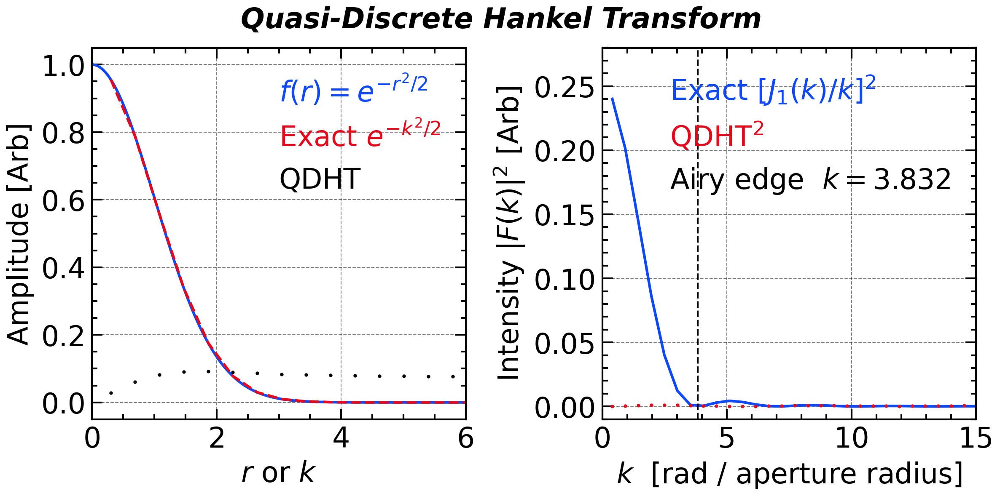
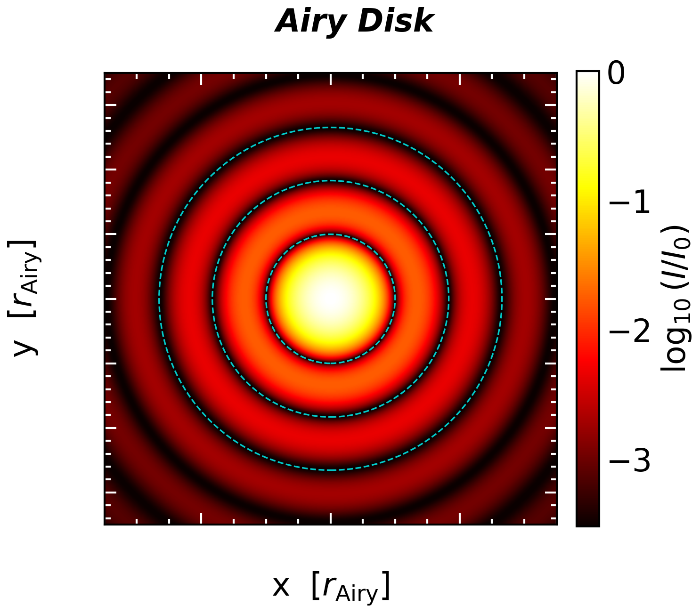
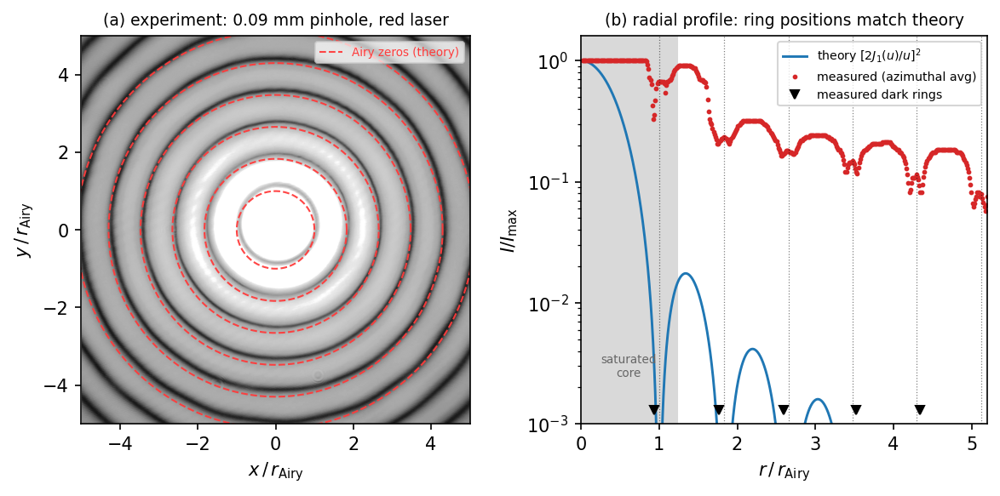
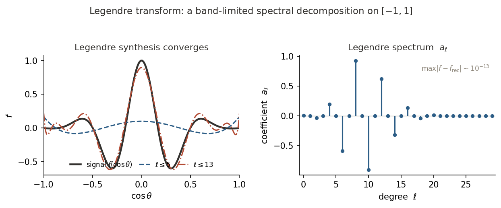
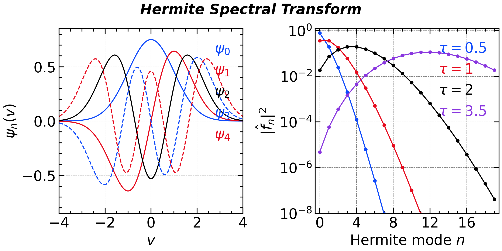
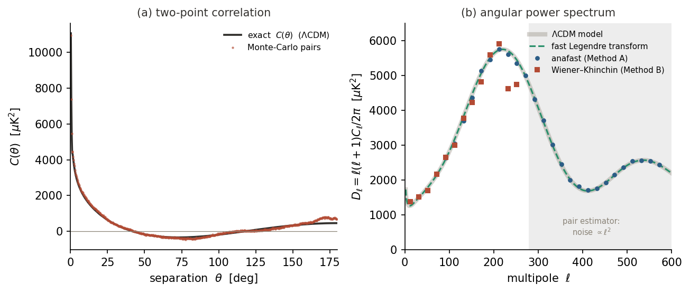
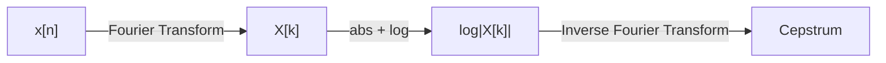
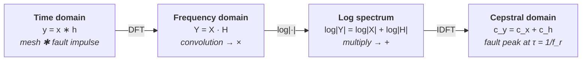
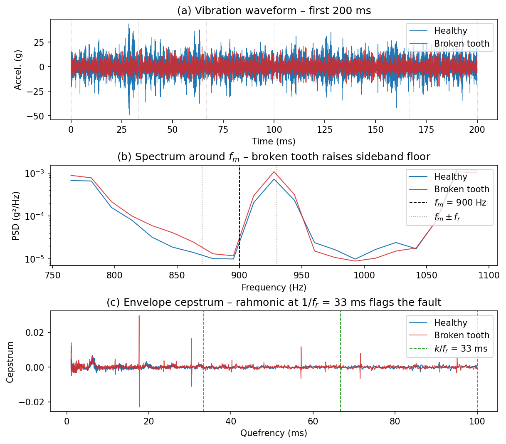

# Power Spectral Density

## [Parseval's Theorem](https://en.wikipedia.org/wiki/Parseval%27s_theorem) and Energy Conservation

> **Parseval's Identity**: The identity asserts that the sum of squares of the Fourier coefficients of a function is equal to the integral of the square of the function. The CFT version of Parseval's Identity can be expressed as:
$$
\int_{-\infty}^\infty x^2(t)\, dt = \int_{-\infty}^\infty X^2(f)\, df
$$
and the DFT Version:
$$
\sum_{n=0}^{N-1} |x[n]|^{2} \delta t
 \;=\;
 \sum_{k=0}^{N-1} |X[k]|^{2} \delta f
$$
> This theorem essentially states that the total energy of a signal in the time domain is equal to the total energy in the frequency domain. 
>

In the physical world, the square power of the amplitude often refers to some kind of ***energy*** or ***power***. For example, the square of the displacement ($x$) of a spring, $x^2$ is proportional to the elastic potential energy ($kx^2/2$, where $k$ describes the stiffness). The electromagnetic field in the vacuum contains the energy density ($u$) written as 
$$
u=u_E + u_B=\frac{1}{2}(\varepsilon_0 \mathit{E}^2 + \frac{1}{\mu_0}\mathit{B}^2)
$$
In these cases, the ***energy*** of the signal naturally linked with the ***energy*** of the electromagnetic field. Nevertheless, the energy of a signal is an extensive property as it linearly increases with the length of the sample. In the ordinary investigation, the signal energy is always further converted as signal ***power***, which is an intensive property that describe the amplitude and is independent of signal length. The definition of power, *P*, can be written as:
$$
P= \frac{1}{T}\int_{-T/2}^{T/2}|x(t)|^2 \mathrm{d}t
$$
## [Power Spectral Density](https://en.wikipedia.org/wiki/Spectral_density)

The Parseval's Identity also reveals that it is possible to measure the energy contribution from each individual frequency by Fourier transform.  The quantity, ***<u>Power Spectral Density (PSD)</u>***, describes how the power of a signal is distributed with frequency.

According to Parseval's theorem, the total power of a signal can be computed in either the time domain or the frequency domain. The total power can be expressed as:
$$
\begin{align*}
P&=\frac{1}{N\delta t}\sum_{n=0}^{N-1}|x[n]|^2 \delta t \\
&=\frac{1}{N^2\delta f}\sum_{k=0}^{N-1}|X[k]|^2 \delta f \\
&=\sum_{k=0}^{N-1} \boxed{\frac{1}{Nf_s} |X[k]|^2}\, \delta f\\
&=\sum_{k=0}^{N-1}\boxed{PSD[k]}\delta f
\end{align*}
$$
for DFT. Considering that DFT yields both **positive and negative** frequency, we typically **fold** the DFT result. Naturally, the definition of PSD is given as:
$$
PSD[k]= \left\{ 
\begin{align*}
\frac{1}{Nf_s} |X[k]|^2, \ & k = 0\ \mathrm{or}\ k = N / 2\}\\
\frac{2}{Nf_s} |X[k]|^2, \ & k \notin \{0, N / 2\}\\

\end{align*}
\right.
$$
$PSD[0]$ represents the DC component and is **ignored** in the spectral analysis for the most (but not all) time.

According to the linearity of $\mathcal{F}$, $X[k]$, after single-side compensation, should also be proportional to the sine wave amplitude ($A_k$). Easily catch that the coefficient and power spectral density at the exact wave frequency has the form of 
$$
\begin{align*}
PSD[k]& = \frac{P[k]}{\delta f} = \frac{A_k^2/2}{f_s/N}  = \frac{2}{Nf_s} |X[k]|^2   \\
\Rightarrow|X[k]|& = \frac{1}{2}\cdot A_k \cdot N 
\end{align*}
$$
$1/2$ in this equation arises from the fact that $({\int_0^{2\pi}\mathrm{sin^2}x \mathrm{d}x})/{2\pi}=1/2$.

- `numpy.fft` implementation of PSD calculation:

    ```python
    window = np.hanning(N + 1)[:-1] # Periodic Hanning Window
    x_w = x * window

    # Normalization factor (sum of squares of window coefficients)
    norm_window = np.sum(window**2)

    # Compute one-sided FFT
    coef = np.fft.rfft(x_w)
    freq = np.fft.rfftfreq(N, d=dt)

    # Estimate PSD with proper scaling:
    psd = (np.abs(coef)**2) / (N * fs * norm_window)

    # Single-side compensation: double non-DC (and non-Nyquist if N is even)
    if N % 2 == 0:
        psd[1:-1] *= 2
    else:
        psd[1:] *= 2
    ```

- `scipy.signal.welch` is a more robust and efficient implementation of PSD estimation through Welch's method. This method will be introduced later in [Chapter 5](chap5.qmd). But it still provide a concise way to estimate PSD in one line of code, whose results can be exactly the same as above if the parameters are set properly.

  ```python
  freq, psd = scipy.signal.welch(x, fs=fs, window='hann', nperseg=N, noverlap=0, detrend=False)
  ```
  
  - The `hann` window used in `scipy.signal.welch` is ***periodic*** instead of ***symmetric***. 

## [Correlation Function](https://en.wikipedia.org/wiki/Correlation_function) [`scipy.signal.correlate`]

The correlation function has a similar form as the energy of the signal:
$$
\begin{align*}
{R_{xy}}(t, t + \tau) := \mathbb{E}\left[ {x(t)} {y^*(t + \tau)} \right]
\end{align*}
$$
where the asterisk symbol represents the complex conjugate operation when $X$ and $Y$ are complex signal. Specifically, the correlation function between $X$ and itself is called **<u>*autocorrelation function (ACF)*</u>**:
$$
\begin{align*}
{R_{xx}}(t, t + \tau) := \mathbb{E}\left[ {x(t)} {x^*(t + \tau)} \right]
\end{align*}
$$
The correlation function not only measures the similarity between two signals, but also reveals the time lag ($\tau$) between them. The autocorrelation function measures how similar a signal is to itself at different time lags, providing insights into the signal's periodicity and temporal structure.

Especially, under certain conditions, the autocorrelation function shows intrinsic relationship with the power spectral density, which will be introduced in the next section.

## [Wide-Sense Stationarity](https://en.wikipedia.org/wiki/Stationary_process#Weak_or_wide-sense_stationarity)

If you want the calculated power spectrum to be representative for the entire signal, meaning $PSD(f,t)=PSD(f)$, then the signal needs to satisfy the **<u>*Wide-Sense Stationarity (WSS)*</u>**condition. The core idea behind this is that only when a signal's intrinsic statistical properties are constant over time can we use a single, static spectrum to describe it meaningfully. *WSS* is the mathematical framework that provides this guarantee of statistical stability.

Specifically, a signal $x(t)$ is considered *WSS* if it has:

- **Constant Mean:**

   The mean of the signal is constant for all time: $$ \mathbb{E}[x(t)] = \mu, \quad \forall t $$

- **Time-Invariant Autocorrelation:**

   The autocorrelation function depends only on the time difference (lag) between two time instants, not on the absolute time: $$ R_x(t_1, t_2) = R_x(\tau), \quad \tau = t_2 - t_1 $$

These conditions imply that even if the signal itself is random, its first two moments are invariant to shifts in time. Under these conditions, the autocorrelation reduces to a single-variable function $R_x(\tau)$, and the **<u>*Wiener–Khinchin theorem*</u>** that we are going to introduce, will ensures a **well-defined PSD**.

## [Wiener–Khinchin Theorem](https://en.wikipedia.org/wiki/Wiener%E2%80%93Khinchin_theorem)

For a *WSS* signal $x(t)$, the **power spectral density** can be derived as the **Fourier transform** of the autocorrelation function:
$$
S_x(f) = \int_{-\infty}^{\infty} R_x(\tau)\,e^{-j 2\pi f \tau}\,d\tau
$$
This is known as the **<u>*[Wiener–Khinchin theorem](https://en.wikipedia.org/wiki/Wiener%E2%80%93Khinchin_theorem)*</u>**, and it is valid *only* under the assumption of WSS. The $PSD(f)$ then describes how the total power of the signal is distributed across different frequency components. 

This theorem tells the intrinsic relationship between the *PSD* and *ACF*. This relationship is particularly useful because it allows us to compute the power spectral density from time-domain data by first calculating the autocorrelation function and then applying the Fourier transform. This approach is often more robust, especially for signals that may be noisy or have missing data.


## [Hankel Transform](https://en.wikipedia.org/wiki/Hankel_transform)

### Radial Power Spectrum — a 2-D Wiener–Khinchin Theorem

For a **statistically homogeneous and isotropic** random field in 2-D — where the autocorrelation depends only on the separation distance $r = |\mathbf{r}_1 - \mathbf{r}_2|$ — the Wiener–Khinchin theorem generalises to:

$$
S(k) = 2\pi\int_0^\infty R(r)\,J_0(kr)\,r\,dr = 2\pi\,\mathcal{H}_0[R](k)
$$

The **2-D power spectral density** $S(k)$ is the **zeroth-order Hankel transform** of the radial autocorrelation $R(r)$, exactly as the 1-D PSD is the Fourier transform of $R(\tau)$.

The **Hankel transform** (also called the **Fourier–Bessel transform**) is the natural spectral transform for signals with **radial symmetry**. It arises whenever the 2-D Fourier transform is applied to a function that depends only on the distance from the origin, $r = \sqrt{x^2+y^2}$, and has no azimuthal dependence.

### Derivation from the 2-D Fourier Transform

For a radially symmetric function $f(\mathbf{r}) = f(r)$, the 2-D Fourier transform is:
$$
F(\mathbf{k}) = \int_{\mathbb{R}^2} f(r)\,e^{-i\mathbf{k}\cdot\mathbf{r}}\,d^2\mathbf{r}
$$
Switching to polar coordinates $\mathbf{r} = (r,\phi)$ and $\mathbf{k} = (k,\psi)$:
$$
F(k) = \int_0^\infty f(r)\,r\left[\int_0^{2\pi}e^{-ikr\cos(\phi-\psi)}\,d\phi\right]dr
= 2\pi\int_0^\infty f(r)\,J_0(kr)\,r\,dr
$$
where the Bessel identity $\frac{1}{2\pi}\int_0^{2\pi}e^{iz\cos\theta}\,d\theta = J_0(z)$ was used. The result is independent of $\psi$, confirming that the 2-D spectrum of a radially symmetric function is itself radially symmetric.

> **Hankel Transform (order $\nu$):**
> $$
> \mathcal{H}_\nu[f](k) = \int_0^\infty f(r)\,J_\nu(kr)\,r\,dr
> $$
> **Inverse Hankel Transform:**
> $$
> f(r) = \int_0^\infty \mathcal{H}_\nu[f](k)\,J_\nu(kr)\,k\,dk
> $$
> The transform is **self-reciprocal**: the forward and inverse kernels have exactly the same form. The 2-D Fourier transform of a radially symmetric function satisfies $\mathcal{F}_{2D}[f(r)] = 2\pi\,\mathcal{H}_0[f](k)$.

The order $\nu$ selects which Bessel function acts as the kernel. In practice:

| $\nu$ | Application |
|:---:|---|
| 0 | 2-D optics, acoustic radiation, plasma profiles |
| 1 | Vortex beams, vector potential in cylindrical coordinates |
| $n$ | Cylindrical waveguides, angular momentum eigenstates |

**Key property — Hankel transform of a Gaussian.** The function $f(r) = e^{-ar^2}$ satisfies:
$$
\mathcal{H}_0\!\left[e^{-ar^2}\right](k) = \frac{1}{2a}\,e^{-k^2/(4a)}
$$
In particular, for $a = \tfrac{1}{2}$: $\mathcal{H}_0\!\left[e^{-r^2/2}\right](k) = e^{-k^2/2}$ — the Gaussian is its own Hankel transform, which provides a convenient numerical benchmark.

### Quasi-Discrete Hankel Transform (QDHT)

Unlike the Fourier transform, there is no general $O(N\log N)$ Hankel transform. However, a near-exact discrete version exists for **bandlimited** functions (Guizar-Sicairos & Gutiérrez-Vega, *J. Opt. Soc. Am. A*, 2004).

The **QDHT** algorithm samples at the zeros of $J_0$:

1. Let $j_n$ denote the $n$-th positive zero of $J_0$ ($j_1 \approx 2.405$, $j_2 \approx 5.520$, …).
2. For a function supported on $r \le R$ and bandlimited to $k \le k_{\max} = j_{N+1}/R$, the sample grids are:
$$
r_n = \frac{j_n}{k_{\max}} = \frac{j_n R}{j_{N+1}}, \qquad k_m = \frac{j_m}{R}, \qquad m,n = 1,\ldots,N
$$
3. The discrete transform is the matrix–vector product:
$$
\boxed{F(k_m) = \frac{2}{k_{\max}^2}\sum_{n=1}^N \frac{J_0\!\left(j_m j_n / j_{N+1}\right)}{J_1^2(j_m)}\,f(r_n)}
$$

The transform matrix $T_{mn} \propto J_0(j_m j_n / j_{N+1})$ is **symmetric** and approximately **unitary**: the inverse transform has the same structure with $k_{\max}^2$ replaced by $R^2$.  Complexity: $O(N^2)$, practical for $N \lesssim 10^3$.

```python
import numpy as np
from scipy.special import jn_zeros, j0, j1

def qdht(f, R):
    """Zeroth-order quasi-discrete Hankel transform (Guizar-Sicairos 2004).

    f : array, values of f(r) sampled at r_n = qdht_grid(R, N)
    R : float, maximum radius

    Returns
    -------
    k : wavenumber sample grid
    F : transform values F(k_m)
    r : radial sample grid  (= qdht_grid(R, len(f)))
    """
    N  = len(f)
    z  = jn_zeros(0, N + 1)          # j_{0,1}, …, j_{0,N+1}
    jn, z_p = z[:N], z[N]            # sample zeros / bandwidth product
    k_max = z_p / R
    r     = jn / k_max               # radial samples in (0, R)
    k     = jn / R                   # wavenumber samples in (0, k_max)
    J0mat = j0(np.outer(jn, jn) / z_p)
    F     = (2.0 / k_max**2) * (J0mat / j1(jn)[:, None]**2) @ f
    return k, F, r

def qdht_grid(R, N):
    """Return the N radial sample points for a QDHT on [0, R)."""
    z = jn_zeros(0, N + 1)
    return z[:N] * R / z[N]
```

<!-- fig-tabset:figure_hankel.png -->
::: {.panel-tabset}

### Figure



### Code

```python
from scipy.special import jn_zeros, j0, j1

leg_kw = dict(labelcolor='linecolor', handlelength=0, markerscale=0,
              handletextpad=0, frameon=False)

def qdht(f, R):
    N = len(f)
    z = jn_zeros(0, N + 1)
    jn_z, z_p = z[:N], z[N]
    k_max = z_p / R
    r = jn_z / k_max
    k = jn_z / R
    T = j0(np.outer(jn_z, jn_z) / z_p) / j1(jn_z)[:, None]**2
    return k, (2.0 / k_max**2) * T @ f, r

# (a) Gaussian self-dual
N_a, R_a = 256, 8.0
z_a = jn_zeros(0, N_a + 1)
r_a = z_a[:N_a] * R_a / z_a[N_a]
f_gauss = np.exp(-r_a**2 / 2)
k_a, F_gauss, _ = qdht(f_gauss, R_a)
F_exact_gauss = np.exp(-k_a**2 / 2)

# (b) Unit circular aperture → Airy pattern
N_b, R_b = 512, 6.0
z_b = jn_zeros(0, N_b + 1)
r_b = z_b[:N_b] * R_b / z_b[N_b]
f_circ = (r_b <= 1.0).astype(float)
k_b, F_airy, _ = qdht(f_circ, R_b)
F_exact_airy = np.where(k_b > 1e-8, j1(k_b) / k_b, 0.5)
j11 = jn_zeros(1, 1)[0]

plt.close()
plt.figure(figsize=(8, 4))
ax1 = plt.subplot(1, 2, 1)
ax2 = plt.subplot(1, 2, 2)

ax1.plot(r_a, f_gauss,       'C0-',  lw=1.5, label=r'$f(r)=e^{-r^2/2}$')
ax1.plot(k_a, F_exact_gauss, 'C1--', lw=1.5, label=r'Exact $e^{-k^2/2}$')
ax1.plot(k_a, F_gauss,       'k.',   ms=2,   label='QDHT')
ax1.set_xlim(0, 6)
ax1.set_xlabel(r'$r$ or $k$')
ax1.set_ylabel('Amplitude [Arb]')
ax1.legend(loc='upper right', ncol=1, **leg_kw)

ax2.plot(k_b, F_exact_airy**2, 'C0-', lw=1.5, label=r'Exact $[J_1(k)/k]^2$')
ax2.plot(k_b, F_airy**2,       'C1.', ms=2,   label=r'QDHT$^2$')
ax2.axvline(j11, color='k', lw=1.0, ls='--', label=rf'Airy edge  $k={j11:.3f}$')
ax2.set_xlim(0, 15)
ax2.set_ylim(-0.01, 0.28)
ax2.set_xlabel(r'$k$  [rad / aperture radius]')
ax2.set_ylabel(r'Intensity $|F(k)|^2$ [Arb]')
ax2.legend(loc='upper right', ncol=1, **leg_kw)

plt.suptitle('Quasi-Discrete Hankel Transform', **title_font)
plt.tight_layout()
plt.savefig(save_path + 'figure_hankel.png', bbox_inches='tight', dpi=300)
```

:::

### Application: Airy Pattern of a Circular Aperture

When a monochromatic plane wave illuminates a **circular aperture** of diameter $D$, the Fraunhofer far-field intensity forms the **Airy pattern**. Normalising the transverse coordinate by the Rayleigh radius $r_\mathrm{Airy} = 1.22\,\lambda f/D$:

$$
I\!\left(\frac{r}{r_\mathrm{Airy}}\right) = I_0\left[\frac{2J_1(1.22\pi\,r/r_\mathrm{Airy})}{1.22\pi\,r/r_\mathrm{Airy}}\right]^2
$$

The first zero — the **Airy disk edge** — is at $r = r_\mathrm{Airy}$ by construction, enclosing 83.8 % of the total diffracted energy. Successive dark rings lie at $1.83$, $2.65$, and $3.48\,r_\mathrm{Airy}$.

This is the 2-D radial power spectrum of a top-hat aperture, computed via the zeroth-order Hankel transform. The figure below shows the predicted 2-D intensity distribution on the focal plane (left) alongside the radial cross-section (right).

<!-- fig-tabset:figure_airy_disk_2d.png -->
::: {.panel-tabset}

### Figure



### Code

```python
from scipy.special import j1, jn_zeros

leg_kw = dict(labelcolor='linecolor', handlelength=0, markerscale=0,
              handletextpad=0, frameon=False)

def airy_intensity(q):
    u = 1.22 * np.pi * q
    with np.errstate(invalid='ignore', divide='ignore'):
        return np.where(u == 0, 1.0, (2 * j1(u) / u)**2)

N, lim = 600, 3.5
xy = np.linspace(-lim, lim, N)
X, Y = np.meshgrid(xy, xy)
I2D = airy_intensity(np.sqrt(X**2 + Y**2))
q1d = np.linspace(0, lim, 1000)
I1d = airy_intensity(q1d)
dark_rings_q = jn_zeros(1, 3) / (1.22 * np.pi)

plt.close()
plt.figure(figsize=(8, 4))
ax2d = plt.subplot(1, 2, 1)
ax1d = plt.subplot(1, 2, 2)

eps = 3e-4
im = ax2d.imshow(np.log10(I2D + eps), origin='lower',
                 extent=[-lim, lim, -lim, lim], cmap='hot',
                 vmin=np.log10(eps), vmax=0, interpolation='bilinear')
cb = plt.colorbar(im, ax=ax2d, fraction=0.046, pad=0.04)
cb.set_label(r'$\log_{10}(I/I_0)$')
cb.set_ticks([-3, -2, -1, 0])
for q_r in dark_rings_q:
    ax2d.add_patch(plt.Circle((0, 0), q_r, color='cyan', fill=False,
                               lw=0.8, ls='--', alpha=0.8))
ax2d.set_xlabel(r'$x\,/\,r_\mathrm{Airy}$')
ax2d.set_ylabel(r'$y\,/\,r_\mathrm{Airy}$')
ax2d.set_aspect('equal')
ax2d.grid(False)

ax1d.semilogy(q1d, I1d, 'C0-', lw=1.5, label=r'$[2J_1(u)/u]^2$')
ax1d.fill_between(q1d[q1d < dark_rings_q[0]], I1d[q1d < dark_rings_q[0]],
                  1e-4, alpha=0.2, color='C0', label='Airy disk  (83.8 %)')
for i, q_r in enumerate(dark_rings_q, 1):
    ax1d.axvline(q_r, color='k', lw=0.8, ls='--',
                 label='Dark rings' if i == 1 else '_nolegend_')
ax1d.set_xlim(0, lim)
ax1d.set_ylim(5e-4, 1.5)
ax1d.set_xlabel(r'$r\,/\,r_\mathrm{Airy}$')
ax1d.set_ylabel(r'Intensity $I/I_0$')
ax1d.legend(loc='upper right', ncol=1, **leg_kw)

plt.suptitle('Airy Disk', **title_font)
plt.tight_layout()
plt.savefig(save_path + 'figure_airy_disk_2d.png', bbox_inches='tight', dpi=300)
```

:::

#### Numerical prediction vs. a real diffraction photograph

The curve above is a *prediction*. Does a physical aperture obey it? The image below is a public-domain photograph ([CC0](https://commons.wikimedia.org/wiki/File:Beugungsscheibchen.k.720.jpg), B. Bautsch) of monochromatic **red laser light** diffracted by a **0.09 mm circular pinhole**, recorded 65 mm downstream — a textbook Fraunhofer setup that resolves diffraction orders out to the 27th ring. We linearise the photograph (undo the sRGB gamma), **azimuthally average** it into a measured radial profile, fit the *single* scale $r_\mathrm{Airy}$ to the first five dark rings, and overlay the parameter-free Airy prediction.

What the theory actually fixes is the **geometry**, and that is what matches: the dark rings fall at $r/r_\mathrm{Airy} = 1,\,1.83,\,2.66,\,3.48,\dots$ — the scaled zeros of $J_1$ — to within a few percent (panel **a**, the red circles land squarely in the dark gaps). The fitted first null, $r_\mathrm{Airy}\approx 0.53$ mm, is consistent with $1.22\,\lambda f/D$ for the quoted pinhole and a red ($\sim$600 nm) laser.

A real measurement also forces two honesties that a synthetic plot hides:

- **The core is saturated.** To expose the faint high-order rings, the central disk is deliberately over-exposed (clipped at the sensor maximum), so measured *amplitudes* inside $r\lesssim 1.2\,r_\mathrm{Airy}$ are **not** photometric — only ring *positions* are. The secondary maxima also sit above the ideal envelope because of stray light and the camera's finite contrast.
- **Only ratios are parameter-free.** Absolute ring radii require $\lambda$, $f$, and $D$; the *ratios* $1:1.83:2.66$ require nothing — they are the fingerprint that this really is the $J_1$ diffraction pattern of a circular aperture and not, say, a Gaussian blur.

<!-- fig-tabset:figure_airy_experiment.png -->
::: {.panel-tabset}

### Figure



### Code

```python
from PIL import Image
from scipy.special import j1, jn_zeros
from scipy.signal import argrelmin

# --- load the photograph and linearise the red channel (undo sRGB gamma) ---
def srgb_lin(c):
    c = c / 255.0
    return np.where(c <= 0.04045, c / 12.92, ((c + 0.055) / 1.055)**2.4)

im = np.asarray(Image.open(read_path + 'airy_experiment_pinhole.jpg').convert('RGB')).astype(float)
I  = srgb_lin(im[:, :, 0])                       # red laser -> use the red channel

# --- locate the pattern centre by an iterated intensity centroid ---
iy, ix = np.unravel_index(np.argmax(I), I.shape)
cx, cy = float(ix), float(iy)
ys, xs = np.indices(I.shape)
for _ in range(6):
    rr = np.sqrt((xs - cx)**2 + (ys - cy)**2)
    w  = np.where(rr < 250, I, 0.0)
    cx, cy = (xs * w).sum() / w.sum(), (ys * w).sum() / w.sum()
r = np.sqrt((xs - cx)**2 + (ys - cy)**2)

# --- azimuthal average -> measured radial profile I(r) ---
nb, rmax = 750, 1500
bins = np.linspace(0, rmax, nb + 1)
idx  = np.digitize(r.ravel(), bins) - 1
prof = np.array([np.median(I.ravel()[idx == b]) if (idx == b).sum() > 30 else np.nan
                 for b in range(nb)])
rc = 0.5 * (bins[:-1] + bins[1:])
pn = prof / np.nanmax(prof)

# --- fit the single scale r_Airy to the first five dark rings ---
sm   = np.convolve(np.log(pn + 1e-5), np.ones(7) / 7, mode='same')
mins = argrelmin(sm, order=12)[0]
rmin = rc[mins[(rc[mins] > 80) & (rc[mins] < 760)]][:5]
ratio = jn_zeros(1, len(rmin)) / jn_zeros(1, 1)          # 1, 1.83, 2.66, ...
rA   = np.sum(rmin * ratio) / np.sum(ratio**2)           # least-squares through origin

# --- the parameter-free Airy prediction, in units of r_Airy ---
def airy(q):
    u = 1.22 * np.pi * q
    return np.where(u == 0, 1.0, (2 * j1(u) / u)**2)
zeros_q = jn_zeros(1, 6) / jn_zeros(1, 1)
sat = im[:, :, 0] >= 252
r_sat = r[sat].max()                                     # extent of the clipped core

plt.close()
fig, ax = plt.subplots(1, 2, figsize=figsize_short)

# (a) the photograph with theoretical dark-ring circles overlaid
half = int(5.0 * rA)
crop = I[int(cy - half):int(cy + half), int(cx - half):int(cx + half)]
ax[0].imshow(np.clip(crop, 0, 1)**0.5, origin='lower', cmap='gray', vmin=0, vmax=0.62,
             extent=[-half / rA, half / rA, -half / rA, half / rA])
th = np.linspace(0, 2 * np.pi, 256)
for k, zq in enumerate(zeros_q):
    ax[0].plot(zq * np.cos(th), zq * np.sin(th), '--', color='#FF3B3B', lw=1.0,
               label='Airy zeros (theory)' if k == 0 else None)
ax[0].set_xlim(-5, 5); ax[0].set_ylim(-5, 5)
ax[0].set_xlabel(r'$x\,/\,r_\mathrm{Airy}$'); ax[0].set_ylabel(r'$y\,/\,r_\mathrm{Airy}$')
ax[0].set_title('(a) experiment: 0.09 mm pinhole, red laser', fontsize=9)
ax[0].legend(loc='upper right', fontsize=6.5, framealpha=0.7, labelcolor='#FF3B3B')

# (b) measured radial profile vs the Airy prediction
q  = rc / rA
qq = np.linspace(0, 5.2, 2000)
m  = q <= 5.2
ax[1].semilogy(qq, airy(qq), 'C0-', lw=1.4, label=r'theory $[2J_1(u)/u]^2$')
ax[1].semilogy(q[m], pn[m], '.', color='C3', ms=3.5, label='measured (azimuthal avg)')
ax[1].plot(rmin / rA, np.full_like(rmin, 1.3e-3), 'v', color='k', ms=5, clip_on=False,
           label='measured dark rings')
ax[1].axvspan(0, r_sat / rA, color='0.85', zorder=0)
ax[1].text(r_sat / rA / 2, 3e-3, 'saturated\ncore', ha='center', va='center',
           fontsize=6.5, color='0.4')
for zq in zeros_q:
    ax[1].axvline(zq, color='k', lw=0.6, ls=':', alpha=0.5)
ax[1].set_xlim(0, 5.2); ax[1].set_ylim(1e-3, 1.6)
ax[1].set_xlabel(r'$r\,/\,r_\mathrm{Airy}$'); ax[1].set_ylabel(r'$I/I_{\max}$')
ax[1].set_title('(b) radial profile: ring positions match theory', fontsize=9)
ax[1].legend(loc='upper right', fontsize=6.8)

plt.tight_layout()
plt.savefig(save_path + 'figure_airy_experiment.png', bbox_inches='tight', dpi=150)
```

:::

---

## [Legendre Spectral Transform](https://en.wikipedia.org/wiki/Legendre_polynomials)

### Angular Power Spectrum — a Spherical Wiener–Khinchin Theorem

For a **statistically isotropic** random field on the 2-sphere — where the two-point correlation $C(\theta) = \langle T(\hat{n}_1)\,T(\hat{n}_2)\rangle$ depends only on the angle $\theta$ between the two directions — the Wiener–Khinchin theorem takes the form of a **Legendre transform**:

$$
C_\ell = 2\pi\int_{-1}^{1} C(\theta)\,P_\ell(\cos\theta)\,d(\cos\theta)
$$

The **angular power spectrum** $C_\ell$ is the **Legendre transform of the angular correlation function** $C(\theta)$, in direct analogy with $S(k)=\mathcal{F}[R(\tau)]$ on the line and $S(k)=2\pi\mathcal{H}_0[R(r)]$ in the plane.

The **Legendre spectral transform** provides the natural decomposition for functions on a **sphere** — or for any function on $[-1, 1]$. While the Fourier series decomposes functions on a circle and the Hankel transform handles radial structure in the plane, the Legendre basis is adapted to the geometry of the sphere.

### Legendre Polynomials and Orthogonality

The **Legendre polynomials** $\{P_\ell(x)\}_{\ell=0}^\infty$ form a complete orthogonal basis on $[-1, 1]$:
$$
\int_{-1}^1 P_m(x)\,P_n(x)\,dx = \frac{2}{2n+1}\,\delta_{mn}
$$
They satisfy the Legendre differential equation
$$
\frac{d}{dx}\!\left[(1-x^2)\,\frac{dP_\ell}{dx}\right] + \ell(\ell+1)\,P_\ell(x) = 0
$$
and are generated by the three-term recurrence $(\ell+1)P_{\ell+1} = (2\ell+1)x\,P_\ell - \ell\,P_{\ell-1}$, starting from $P_0=1$, $P_1=x$.

The index $\ell$ plays the role of "angular wavenumber" (or multipole): $P_\ell$ oscillates approximately $\ell$ times on $[-1,1]$, just as $e^{2\pi i n x/L}$ oscillates $n$ times on $[0,L]$.

### Forward and Inverse Transform

> **Legendre Spectral Transform (forward):**
> $$
> a_\ell = \frac{2\ell+1}{2}\int_{-1}^1 f(x)\,P_\ell(x)\,dx, \qquad \ell = 0,1,2,\ldots
> $$
>
> **Inverse (synthesis):**
> $$
> f(x) = \sum_{\ell=0}^{\infty} a_\ell\,P_\ell(x)
> $$

The coefficient $a_\ell$ measures how much of the "angular frequency" $\ell$ is present in $f$. The orthogonality relation ensures the two formulas are consistent: substituting the synthesis into the forward transform recovers the original coefficients exactly.

### Fast Computation via Gauss–Legendre Quadrature

The forward integral is computed exactly for polynomials of degree $\le 2N-1$ by **Gauss–Legendre (GL) quadrature** with $N$ nodes:
$$
a_\ell \approx \frac{2\ell+1}{2}\sum_{i=1}^N w_i\,P_\ell(x_i)\,f(x_i)
$$
where $x_i$ are the roots of $P_N$ and $w_i$ the associated weights. Written for all modes simultaneously this is a **matrix–vector product**:
$$
\mathbf{a} = \mathbf{P}\,(\mathbf{w} \circ \mathbf{f}), \qquad \mathbf{P}_{\ell i} = \frac{2\ell+1}{2}\,P_\ell(x_i)
$$
Cost: $O(L_{\max}\cdot N)$. For $L_{\max} = N-1$ the matrix $\mathbf{P}$ is square, and the inverse is simply $\mathbf{f} = \mathbf{P}^T\mathbf{a}$ (exact because GL nodes diagonalise the Legendre system).

```python
import numpy as np
from scipy.special import eval_legendre

def legendre_transform(f, x, w, L_max):
    """Forward Legendre spectral transform via Gauss–Legendre quadrature.

    f, x, w : function values and GL nodes/weights (np.polynomial.legendre.leggauss)
    L_max   : maximum degree
    Returns a : coefficients a_ell for ell = 0, …, L_max
    """
    ell   = np.arange(L_max + 1)
    P_mat = eval_legendre(ell[:, None], x[None, :])   # (L_max+1, N)
    return (2 * ell + 1) / 2 * (P_mat @ (w * f))

def legendre_synthesis(a, x):
    """Reconstruct f at points x from Legendre coefficients a."""
    ell   = np.arange(len(a))
    P_mat = eval_legendre(ell[:, None], x[None, :])
    return a @ P_mat

# Usage
N = 256
x, w = np.polynomial.legendre.leggauss(N)   # GL nodes and weights on [-1, 1]
f    = np.exp(-5 * x**2) * np.cos(3 * np.pi * x)
a    = legendre_transform(f, x, w, L_max=N - 1)
f_rec = legendre_synthesis(a, x)
# max |f - f_rec| ~ 1e-14 (machine precision for smooth f)
```

### Connection to the CMB Angular Power Spectrum

For a statistically **isotropic** random field on the sphere — the CMB temperature $T(\hat{n})$ — the two-point correlation function depends only on the angle between two directions:
$$
C(\theta) = \langle T(\hat{n}_1)\,T(\hat{n}_2)\rangle, \quad \hat{n}_1\!\cdot\!\hat{n}_2 = \cos\theta
$$
Expanding in Legendre polynomials:
$$
C(\theta) = \frac{1}{4\pi}\sum_{\ell=0}^{\infty}(2\ell+1)\,C_\ell\,P_\ell(\cos\theta)
$$
The **angular power spectrum** $C_\ell$ is the Legendre transform of $C(\theta)$:
$$
C_\ell = 2\pi\int_{-1}^{1} C(\theta)\,P_\ell(\cos\theta)\,d(\cos\theta)
$$
This is the **spherical analogue of the Wiener–Khinchin theorem**: just as the PSD is the Fourier transform of the autocorrelation function, $C_\ell$ is the Legendre transform of the angular correlation function. In `healpy`, `hp.anafast(T_map)` implements exactly this computation for a full-sky map.

<!-- fig-tabset:figure_legendre.png -->
::: {.panel-tabset}

### Figure



### Code

```python
from scipy.special import eval_legendre

N = 256
x, w = np.polynomial.legendre.leggauss(N)
ell  = np.arange(N)
P_mat = eval_legendre(ell[:, None], x[None, :])          # (N, N)

# Forward transform
f_vals = np.exp(-5 * x**2) * np.cos(3 * np.pi * x)
a      = (2 * ell + 1) / 2 * (P_mat @ (w * f_vals))

# Inverse (synthesis)
f_rec  = a @ P_mat
```

The same Legendre machinery, applied to the two-point correlation function $C(\theta)$ of an actual sky map, yields the CMB angular power spectrum $C_\ell$ — worked out end-to-end in the [application below](#application-angular-power-spectrum-of-the-cosmic-microwave-background-cmb).

:::

---

## [Hermite Spectral Transform](https://en.wikipedia.org/wiki/Hermite_polynomials)

### Hermite–Gauss Basis

The **Hermite–Gauss functions** are Hermite polynomials multiplied by a Gaussian weight:

$$
\psi_n(v) = \frac{1}{\pi^{1/4}\sqrt{2^n n!}}\, H_n(v)\, e^{-v^2/2}, \qquad n = 0, 1, 2, \ldots
$$

where $H_n(v) = (-1)^n e^{v^2}\dfrac{d^n}{dv^n}e^{-v^2}$ are the physicist's Hermite polynomials. These functions are **orthonormal**:

$$
\int_{-\infty}^{\infty} \psi_m(v)\,\psi_n(v)\,dv = \delta_{mn}
$$

and complete on $L^2(\mathbb{R})$, giving the **Hermite spectral transform pair**:

$$
\hat{f}_n = \int_{-\infty}^{\infty} f(v)\,\psi_n(v)\,dv, \qquad
f(v) = \sum_{n=0}^{\infty} \hat{f}_n\,\psi_n(v)
$$

### Ladder Operators and the Velocity Recurrence

The key property that makes the Hermite basis powerful for kinetic equations is the **recurrence**:

$$
v\,\psi_n = \sqrt{\tfrac{n+1}{2}}\;\psi_{n+1} + \sqrt{\tfrac{n}{2}}\;\psi_{n-1}
$$

In the language of quantum mechanics this is the **creation/annihilation operator** algebra:

$$
v = \tfrac{1}{\sqrt{2}}\!\left(\hat{a} + \hat{a}^\dagger\right), \quad
\hat{a}\,\psi_n = \sqrt{n}\;\psi_{n-1}, \quad
\hat{a}^\dagger\psi_n = \sqrt{n+1}\;\psi_{n+1}
$$

**Multiplication by $v$ in physical space couples only nearest-neighbor Hermite modes** — a sparse stencil analogous to how differentiation couples adjacent Fourier modes in a spectral PDE solver.

### Application: Vlasov Equation and the Moment Hierarchy

The natural home of the Hermite transform is **kinetic theory**, where the central object is the distribution function $f(v,x,t)$ — the probability density of finding a particle at position $x$ with velocity $v$ at time $t$. In a collisionless plasma this satisfies the **Vlasov (free-streaming) equation**:

$$
\frac{\partial f}{\partial t} + v\,\frac{\partial f}{\partial x} = 0
$$

Expanding $f = \sum_n \hat{f}_n(x,t)\,\psi_n(v)$ and applying the recurrence relation gives the **Hermite moment hierarchy** — an infinite chain of coupled advection equations:

$$
\frac{\partial \hat{f}_n}{\partial t}
+ \frac{\partial}{\partial x}\!\left[\sqrt{\tfrac{n+1}{2}}\;\hat{f}_{n+1}
                                   + \sqrt{\tfrac{n}{2}}\;\hat{f}_{n-1}\right] = 0,
\quad n = 0, 1, 2, \ldots
$$

Each moment has an immediate physical interpretation:

| Mode | Physical meaning |
|------|-----------------|
| $\hat{f}_0$ | density perturbation $\delta n$ |
| $\hat{f}_1$ | bulk velocity $u$ |
| $\hat{f}_2$ | pressure / temperature perturbation $\delta T$ |
| $\hat{f}_n,\; n \gg 1$ | fine-grained velocity-space structure |

### Phase-Space Mixing and Landau Damping

Starting from a pure density perturbation $\hat{f}_n(x,0) = \delta_0\,e^{ikx}\delta_{n0}$, the free-streaming solution is exactly soluble using the Hermite generating-function integral

$$
\int_{-\infty}^{\infty} H_n(v)\,e^{-v^2+\xi v}\,dv = \sqrt{\pi}\,e^{\xi^2/4}\,\xi^n
$$

with $\xi = -ikt$, which gives:

$$
\hat{f}_n(x,t) = \delta_0\,e^{ikx}\cdot\frac{\left(-ikt/\sqrt{2}\right)^n}{\sqrt{n!}}\,e^{-k^2t^2/4}
$$

The **power in each Hermite mode** follows a **Poisson distribution** in $n$:

$$
\boxed{|\hat{f}_n|^2 \;\propto\; \frac{\tau^{2n}}{n!}\,e^{-\tau^2}}, \qquad \tau \equiv \frac{kt}{\sqrt{2}}
$$

The cascade peak advances as $n_\text{peak}(t) = \tau^2 = k^2t^2/2$, while total power $\sum_n|\hat{f}_n|^2 = 1$ is **exactly conserved** (Parseval). Three physical consequences follow:

1. **Landau damping** — the density mode ($n=0$) decays as $|\hat{f}_0|\propto e^{-k^2t^2/4}$, losing energy to ever-finer velocity-space structure. This is *not* thermodynamic dissipation.

2. **Collisionless reversibility** — because $\sum_n|\hat{f}_n|^2$ is conserved, the phase mixing is reversible in principle; no entropy is produced.

3. **Collisional entropy production** — a collision operator (e.g., Lenard–Bernstein: $\nu\,\hat{a}^\dagger\hat{a}$ damps mode $n$ at rate $\nu n$) absorbs the cascade at high $n$, breaking Parseval and producing real thermodynamic entropy.

<!-- fig-tabset:figure_hermite_cascade.png -->
::: {.panel-tabset}

### Figure



### Code

```python
from scipy.special import eval_hermite, factorial

leg_kw = dict(labelcolor='linecolor', handlelength=0, markerscale=0,
              handletextpad=0, frameon=False)

def psi_n(n, v):
    norm = 1.0 / (np.pi**0.25 * np.sqrt(float(2**n) * float(factorial(n))))
    return norm * eval_hermite(n, v) * np.exp(-v**2 / 2.0)

v = np.linspace(-4, 4, 600)

plt.close()
plt.figure(figsize=(8, 4))
ax1 = plt.subplot(1, 2, 1)
ax2 = plt.subplot(1, 2, 2)

# Panel (a): first five basis functions
labels      = [r'$\psi_0$', r'$\psi_1$', r'$\psi_2$', r'$\psi_3$', r'$\psi_4$']
line_styles = ['-', '-', '-', '--', '--']
colors      = ['C0', 'C1', 'k', 'C0', 'C1']
for n in range(5):
    ax1.plot(v, psi_n(n, v), ls=line_styles[n], color=colors[n],
             lw=1.2, label=labels[n])
ax1.axhline(0, color='k', lw=0.4, ls=':')
ax1.set_xlim(-4, 4); ax1.set_ylim(-0.85, 0.85)
ax1.set_xlabel('$v$'); ax1.set_ylabel(r'$\psi_n(v)$')
ax1.legend(loc='upper right', ncol=1, **leg_kw)

# Panel (b): free-streaming Poisson cascade
# |hat f_n|^2 = tau^(2n) / n! * exp(-tau^2),  tau = kt/sqrt(2)
ns       = np.arange(0, 20)
taus     = [0.5, 1.0, 2.0, 3.5]
colors_b = ['C0', 'C1', 'k', 'C3']
labels_b = [r'$\tau=0.5$', r'$\tau=1$', r'$\tau=2$', r'$\tau=3.5$']
for tau, c, lb in zip(taus, colors_b, labels_b):
    power = tau**(2*ns) / factorial(ns) * np.exp(-tau**2)
    ax2.semilogy(ns, power, '-o', color=c, ms=3, lw=1.2, label=lb)
ax2.set_xlim(-0.5, 19.5); ax2.set_ylim(1e-8, 1.2)
ax2.xaxis.set_major_locator(ticker.MultipleLocator(4))
ax2.set_xlabel(r'Hermite mode $n$'); ax2.set_ylabel(r'$|\hat{f}_n|^2$')
ax2.legend(loc='upper right', ncol=1, **leg_kw)

plt.suptitle('Hermite Spectral Transform', **title_font)
plt.tight_layout()
plt.savefig(save_path + 'figure_hermite_cascade.png', bbox_inches='tight', dpi=300)
```

:::

Panel (a) shows the first five orthonormal Hermite–Gauss functions: $\psi_0$ is a pure Gaussian; each higher mode $\psi_n$ has exactly $n$ zero-crossings inside the Gaussian envelope. Panel (b) shows the **free-streaming Poisson cascade**: power deposited initially at $n=0$ spreads toward higher modes as $|\hat{f}_n|^2\propto\tau^{2n}e^{-\tau^2}/n!$, with $\tau=kt/\sqrt{2}$. The cascade front advances as $n_\text{peak}\sim\tau^2$ while total power is exactly conserved — the spectral portrait of collisionless Landau damping.

---

## Application: Angular Power Spectrum of the Cosmic Microwave Background (CMB)

The Wiener–Khinchin theorem is the workhorse behind almost every estimator of the **angular power spectrum of the Cosmic Microwave Background (CMB)**. Modern pipelines (e.g. *Planck*, *ACT*) operate on the 2-sphere, but the underlying logic is one-dimensional:

1. Observe a (nearly) stationary stochastic field $T(\hat n)$.
2. Estimate its two-point correlation function $C(\theta) = \langle T(\hat n_1)\,T(\hat n_2)\rangle$ for $\hat n_1\!\cdot\!\hat n_2 = \cos\theta$.
3. Take the (spherical) Fourier transform — equivalent to expanding $C(\theta)$ on Legendre polynomials — to obtain $C_\ell$.

Wiener–Khinchin guarantees that this $C_\ell$ is the same object as $\langle |a_{\ell m}|^2\rangle$ obtained by a direct harmonic transform of $T$ — provided the field is statistically isotropic (the angular analogue of WSS).

We verify this by **simulating a realistic CMB sky**: draw one full-sky realisation from a theoretical $\Lambda$CDM angular power spectrum (the standard curve `totcls.dat` bundled with `healpy`), then recover $C_\ell$ two independent ways and check both against the input theory:

- **Method A — spherical harmonics (`healpy.anafast`).** Expand the map in $a_{\ell m}$ and average $|a_{\ell m}|^2$ over $m$: $\;C_\ell=\langle|a_{\ell m}|^2\rangle_m$. Efficient and accurate to high $\ell$ — the standard estimator.
- **Method B — Wiener–Khinchin.** Estimate the two-point correlation function $C(\theta)$ by averaging $T(\hat n_1)T(\hat n_2)$ over pixel **pairs** separated by $\theta$, then Legendre-transform it: $\;C_\ell = 2\pi\int_{-1}^{1} C(\theta)\,P_\ell(\cos\theta)\,d\cos\theta$.

Method B is exact *in expectation*, but a naïve implementation is wildly inaccurate. Three choices matter:

::: {.callout-important}
## Making the correlation-function route accurate

1. **Integrate over the full range $\theta\in[0,\pi]$.** The transform runs over all of $\mu=\cos\theta\in[-1,1]$. Truncating $C(\theta)$ to a few degrees keeps only a thin sliver of $\mu$ (e.g. $\theta<15^\circ \Rightarrow \mu\in[0.97,1]$, *97% of the integration range discarded*). In harmonic space that truncation convolves $C_\ell$ with a broad kernel — a strong bias that apodization cannot undo. **This is the usual reason a hand-rolled estimator looks wrong.**
2. **Use Gauss–Legendre nodes and weights** for the $\mu$-integral, so $C_\ell=2\pi\sum_i w_i\,C(\theta_i)\,P_\ell(\mu_i)$ is exact for the band-limit — not a coarse trapezoid sum over a region where $P_\ell$ oscillates $\ell$ times.
3. **Average enough pixel pairs per node.** `anafast` implicitly uses *all* pairs. Method B's variance on $C_\ell$ is roughly white, so its $D_\ell=\ell(\ell+1)C_\ell/2\pi$ noise grows as $\ell^2$: it is fundamentally a **large-angle tool**. It tracks the first acoustic peak ($\ell\!\lesssim\!250$), but `anafast` is the right estimator for the high-$\ell$ tail no matter how many pairs you draw.
:::

The figure below confirms the picture: `anafast` traces the input $\Lambda$CDM curve — first acoustic peak at $\ell\!\approx\!220$ ($\sim\!5700\ \mu K^2$), the trough near $\ell\!\approx\!410$, the second peak near $\ell\!\approx\!540$ — across the whole range, while the Wiener–Khinchin estimator agrees through the first peak and is then dropped where its $\ell^2$ noise takes over (shaded). The pair-counting route also has one practical virtue on real data: it uses only the pixels you actually have, so on a masked sky it estimates the *true* $C(\theta)$ directly and needs **no $1/f_{\text{sky}}$ correction**.

::: {.callout-note}
## From a simulation to a real map

On a *measured* map (e.g. WMAP or Planck) two extra steps are needed before the spectrum matches the textbook curve: **deconvolve the instrument beam and pixel window** ($C_\ell^{\text{true}}=C_\ell^{\text{map}}/(B_\ell^2 w_\ell^2)$), and **subtract the noise bias**. Skipping the beam step is the classic mistake — it pushes the apparent first peak to lower $\ell$ and suppresses its height, because the beam multiplies the true spectrum by a steeply falling $B_\ell^2$.
:::

<!-- fig-tabset:figure_wk_cmb_sphere.png -->
::: {.panel-tabset}

### Figure



### Code — Method A (`anafast`)

```python
import os
import healpy as hp

# --- A realistic LCDM angular power spectrum (healpy ships the theory curve) ---
totcls  = os.path.join(os.path.dirname(hp.__file__), 'data', 'totcls.dat')
lmax    = 600
ell     = np.arange(lmax + 1)
Dl_th   = np.loadtxt(totcls)[:lmax + 1, 1]                  # LCDM D_l^TT  [uK^2]
Cl_th   = np.zeros(lmax + 1)
Cl_th[2:] = Dl_th[2:] * 2*np.pi / (ell[2:] * (ell[2:] + 1)) # D_l -> C_l

# --- simulate one full-sky CMB realisation drawn from this spectrum ---
nside   = 512
cmb_map = hp.synfast(Cl_th, nside, lmax=lmax, pixwin=False)

# Method A: anafast expands T(n) in a_lm and averages |a_lm|^2 over m
Cl_A = hp.anafast(cmb_map, lmax=lmax)
```

### Code — Method B (Wiener–Khinchin)

```python
from scipy.special import eval_legendre

N_nodes = lmax + 1
mu, wmu = np.polynomial.legendre.leggauss(N_nodes)   # full-range GL nodes/weights
theta   = np.arccos(mu)
n_pairs = 500_000                                    # pixel pairs per node (SNR knob)
rng     = np.random.default_rng(1)

# (B1) ring sampling: for each node draw random centres and a partner at
#      EXACTLY angular distance theta_i (random azimuth phi).
C_theta = np.zeros(N_nodes)
for k, th in enumerate(theta):
    cp  = rng.integers(0, cmb_map.size, n_pairs)
    vi  = np.array(hp.pix2vec(nside, cp))                      # (3, n_pairs) centres
    e0  = np.eye(3)[np.argmin(np.abs(vi), axis=0)].T           # axis least || to vi
    e1  = np.cross(vi.T, e0.T).T;  e1 /= np.linalg.norm(e1, axis=0)
    e2  = np.cross(vi.T, e1.T).T                               # tangent-plane basis
    phi = rng.uniform(0, 2*np.pi, n_pairs)
    vj  = np.cos(th)*vi + np.sin(th)*(np.cos(phi)*e1 + np.sin(phi)*e2)
    C_theta[k] = np.mean(cmb_map[cp] * cmb_map[hp.vec2pix(nside, *vj)])

# (B2) exact Legendre transform on the GL grid: C_l = 2*pi * sum_i w_i C(theta_i) P_l(mu_i)
P_mat = eval_legendre(ell[:, None], mu[None, :])              # (lmax+1, N_nodes)
Cl_B  = 2*np.pi * (P_mat * (wmu * C_theta)).sum(axis=1)

# bin in ell; show Method B only where its l^2 noise stays small
Dl = lambda Cl: ell*(ell+1)*Cl/(2*np.pi)
def bin_Dl(Cl, dl=20, l_hi=lmax):
    e = np.arange(2, l_hi + 1, dl); cen = 0.5*(e[:-1] + e[1:])
    return cen, np.array([np.mean(Dl(Cl)[a:b]) for a, b in zip(e[:-1], e[1:])])
cA, DA = bin_Dl(Cl_A)
cB, DB = bin_Dl(Cl_B, l_hi=280)
```

:::

The left panel shows the Wiener–Khinchin intermediate — the two-point correlation function $C(\theta)$. The right panel confirms that **both estimators recover the same $\Lambda$CDM angular power spectrum** $D_\ell\equiv\ell(\ell+1)C_\ell/2\pi$ where each is reliable — the spherical-geometry analogue of "Welch and the FT of the ACF agree".

### Why `anafast` and Wiener–Khinchin are the *same sum*

Why does the spherical-harmonic estimator stay accurate to high $\ell$ while the pair-counting estimator does not, when both target the same $C_\ell$? Because they are **literally the same sum**, evaluated two different ways. Expanding `anafast`'s estimator,

$$
\hat C_\ell=\frac{1}{2\ell+1}\sum_{m}|a_{\ell m}|^2
=\frac{(\Delta\Omega)^2}{4\pi}\sum_{p,\,q} T_p\,T_q\,P_\ell(\cos\theta_{pq}),
$$

which is exactly "average $T(\hat n_1)T(\hat n_2)\,P_\ell(\cos\theta)$ over pixel pairs" — the Wiener–Khinchin recipe — taken over **every** pair $(p,q)$ at once. The methods differ only in *how* they evaluate this sum:

- **`anafast`** computes it **exactly** through the fast spherical-harmonic transform ($O(N_{\text{pix}}\,\ell_{\max})$, no random sampling). Its only error is **cosmic variance**: at each multipole there are merely $2\ell+1$ independent $m$-modes, an irreducible fractional uncertainty of $\sqrt{2/(2\ell+1)}$. That is a property of having a single sky, not of the algorithm.
- **Pair-counting Wiener–Khinchin** estimates the same sum by **Monte-Carlo**, averaging a random subset of $n_{\text{pairs}}$ pairs per separation. This adds a *second* error on top of cosmic variance, scaling as $1/\sqrt{n_{\text{pairs}}}$. That sampling error is roughly white in $C_\ell$, so in $D_\ell=\ell(\ell+1)C_\ell/2\pi$ it grows as $\ell^2$. At high $\ell$, where $P_\ell$ oscillates rapidly and the true signal is a small residual left after enormous cancellation among the $\sim\!N_{\text{pix}}^2$ terms, this noise swamps the signal — which is precisely why Method B is a **large-angle tool**.

Couldn't we remove the sampling noise by using *all* pairs? In principle yes, but summing all $N_{\text{pix}}^2\!\sim\!10^{13}$ pairs exactly is infeasible, and the only algorithm that performs that all-pairs, $P_\ell$-weighted sum quickly **is** the spherical-harmonic transform. The noise-free limit of Wiener–Khinchin *is* `anafast`; random pair sampling is simply the price of evaluating the same sum cheaply. (The instrument beam, by contrast, biases *both* estimators identically — that is the separate preprocessing issue flagged above, not a difference between the two methods.)

## What If the Signal Is Not Stationary? [`scipy.signal.detrend`]

If the constant mean condition (first condition) is not satisfied, say, due to an underlying background trend, you should first apply **<u>*detrend*</u>**. Techniques such as subtracting the mean (constant detrend) or removing a linear trend (linear detrend) help modify the signal so that its mean becomes approximately constant.

```python
scipy.signal.welch(x, fs, detrend = 'constants' (default) | 'linear' | Fasle)
```

<!-- fig-tabset:figure_detrend.png -->
::: {.panel-tabset}

### Figure


### Code

```python
plt.close()
N = 2 ** 10
t = np.linspace(0, 1, N, endpoint=False)
dt = t[1] - t[0]
fs = 1 / dt
omega0 = 1 * np.pi * 50
sig = 2 * t + np.sin(omega0 * t) * 1
plt.figure(figsize=figsize_short)
ax1 = plt.subplot()

sig = 100 * t + np.sin(omega0 * t) * 1
freq, psd = scipy.signal.welch(sig, fs, window = 'hann', nperseg = N, noverlap = 0, detrend=False, nfft = None, return_onesided=True, scaling='density')
ax1.plot(freq[:], psd[:], 'C0-', label = 'No Detrend')
ax1.plot(freq[:], psd[:], 'C0o')

sig = 100 * t + np.sin(omega0 * t) * 1
freq, psd = scipy.signal.welch(sig, fs, window = 'hann', nperseg = N, noverlap = 0, detrend='constant', nfft = None, return_onesided=True, scaling='density')
ax1.plot(freq[:], psd[:], 'C1-', label = 'Constant')
ax1.plot(freq[:], psd[:], 'C1o')

sig = 100 * t + np.sin(omega0 * t) * 1
freq, psd = scipy.signal.welch(sig, fs, window = 'hann', nperseg = N, noverlap = 0, detrend='linear', nfft = None, return_onesided=True, scaling='density')
ax1.plot(freq[:], psd[:], 'C2-', label = 'Linear')
ax1.plot(freq[:], psd[:], 'C2o')

ax1.set_ylim(1e-18, 1e6)
ax1.set_xlabel('Frequency [Hz]')
ax1.set_ylabel('PSD [$\mathrm{Arb^2}$/Hz]')

ax1.legend(loc = 'upper right', ncol = 5, labelcolor="linecolor", handlelength = 0, handletextpad = 0, frameon = False)
ax1.set_xscale('log')
ax1.set_yscale('log')
# ax1.autoscale(axis = 'x', tight = True)
ax1.set_title("Fourier Spectrum After Detrend\n" + "$x(t)=2t + \mathrm{sin}(50\pi t)$", **title_font)
plt.tight_layout()
plt.savefig(save_path + 'figure_detrend' + '.png',bbox_inches='tight',dpi=300)

plt.show()
```

:::


If the time-invariant autocorrelation condition (second condition) is not met, which indicates that the signal's higher-order statistics vary with time, traditional spectral analysis (like using the Wiener–Khinchin theorem) may no longer yield a meaningful power spectral density. In such cases, it is advisable to use time-frequency analysis methods, such as the Short-Time Fourier Transform (STFT) or the Wavelet Transform, to properly capture the signal's evolving spectral content.

The concept of *W.S.S* essentially guides us in **selecting an appropriate window** for spectral analysis. On one hand, the window length should be longer than the oscillation period to capture a complete cycle of the fluctuations. On the other hand, the window length should be shorter than the characteristic scale over which power or frequency variations occur, so that the signal within the window can be approximated as wide-sense stationary.
## [Cepstrum](https://en.wikipedia.org/wiki/Cepstrum)

A non-sinuous, periodic signal usually has a broad Fourier spectrum concentrating at not only the fundamental frequency $f_0$ but also its **harmonic** $f_n=nf_0$. Like, a sawtooth waves have a Fourier coefficient decreases with $1/n$ where $n$ is the harmonic order while the coefficients at the rest frequencies remain zero. Therefore, there exists a periodic structure with period of $f_0$ in the Fourier domain. 

<!-- fig-tabset:figure_cepstrum.png -->
::: {.panel-tabset}

### Figure


### Code

```python
plt.close()
plt.figure(figsize=(16, 4))

N = 2 ** 8
omega0 = 2 * np.pi * 4.0
t = np.linspace(0, 1, N, endpoint=False)
dt = t[1] - t[0]
fs = 1 / dt

sig = 2 * ((omega0 / 2 / np.pi * t) % 1.0 - 0.5)
# Add white noise for preventing getting a log(abs(0))
sig += np.random.randn(t.size) * 1e-2
freq = np.fft.rfftfreq(N, dt)
coef = np.fft.rfft(sig)

log_abs_X = np.log(np.abs(coef))
log_abs_X -= np.mean(log_abs_X)  # Remove DC component for cepstrum calculation
cepstrum = np.fft.rfft(log_abs_X)
df = freq[1] - freq[0]
quefrency = np.fft.rfftfreq(log_abs_X.size, df)


ax1 = plt.subplot(1, 3, 1)
ax2 = plt.subplot(1, 3, 2)
ax3 = plt.subplot(1, 3, 3)

ax1.plot(t, sig, 'ko-', label='Signal')
ax2.stem(freq, np.abs(coef), linefmt='k', markerfmt='k', basefmt='k')
ax2.plot(freq, 4 / freq * np.abs(coef)[4], 'r--', label='1/f', zorder = 0)

ax3.stem(quefrency, np.abs(cepstrum), linefmt='k', markerfmt='k', basefmt='k')

ax2.text(30, 30, 'Harmonics', color = 'k', ha = 'center', va = 'bottom', **title_font)
ax2.text(12, 30, '$X[k]\propto 1/k $', color = 'C1', ha = 'center', va = 'bottom', **title_font, rotation = -70)
ax3.text(1 / (omega0 / (2 * np.pi)), 135, '4 Hz', color = 'k', ha = 'center', va = 'center', **title_font)
ax3.set_ylim(-0.5, 150)
# ax3.set_yscale('log')

ax1.set_title('Signal', **title_font)
ax2.set_title('FFT Magnitude', **title_font)
ax3.set_title('Cepstrum', **title_font)

ax1.set_xlabel('Time [s]')
ax2.set_xlabel('Frequency [Hz]')
ax3.set_xlabel('Quefrency [s]')
ax1.set_ylabel('Intensity [Arb]')
ax2.set_ylabel('Magnitude [Arb]')
ax3.set_ylabel('Intensity [Arb]')

ax2.set_ylim(-5, 90)
ax2.set_xlim(-2, 60)

plt.tight_layout()

plt.savefig(save_path + 'figure_cepstrum' + '.png',bbox_inches='tight',dpi=300)

plt.show()
```

:::
<p align = 'center'>
<i>An example of cepstrum for a sawtooth wave with the fundamental frequency of 4 Hz</i>
</p>


Inspiri ng by this fact, B. P. Bogert, M. J. Healy, and J. W. Tukey introduce the ***Cepstral Analysis*** in 1963. The norm of the Fourier coefficients is taken logarithm and then inverse Fourier transformed for detecting the harmonic signature of the signal. 



This resulting "spectrum" is named as its variant ($\mathrm{spec \rightarrow ceps}$) —Cepstrum. Correspondingly, "frequency" is converted to "quefrency", which has the unit same as time's.

The initial aim of cepstrum is to analysis the seismic echoes, which can be modeled as:
$$
y(t) = x(t) +\alpha x(t-\tau)
$$
It has a Fourier transform of
$$
\begin{align*}
Y(f) &= X(f) + \alpha X(f) e^{j2\pi f \tau}=X(f)(1+\alpha e^{j2\pi f \tau})\\
|Y(f)|^2 &= |X(f)|^2 [1+2\alpha \mathrm{cos}({j2\pi f \tau})+\alpha^2]
\end{align*}
$$

$$
\begin{align*}
\mathrm{log}(|Y(f)|^2) &= \mathrm{log}(|X(f)|^2) + \mathrm{log}[1+2\alpha \mathrm{cos}({j2\pi f \tau})+\alpha^2]\\
& \approx \mathrm{log}(|X(f)|^2) + 2\alpha \mathrm{cos}({j2\pi f \tau})
\end{align*}
$$
Therefore, the echoes introduce the periodic structure in $\mathrm{log}(|Y(f)|^2)$. When parameter $\alpha$ is small enough, the periodic structure has a perfect sinuous waveform. Interestingly, the periodic sawtooth waves we introduced first can actually be interpreted as an initial signal accompanied with its three non-decayed echoes. That's the reason cepstral analysis works. 

However, it doesn't mean that the cepstral analysis only work for the signals composited with echoes. Another common application of cepstral analysis is the [voice recognition](https://ieeexplore.ieee.org/document/859069). The principle behind is that the both the musical instrument and vocal fold has an eigen frequency thus the power of the voice naturally concentrate near the fundamental and harmonics.

```python
''' Python Implication of Cepstrum '''

freq = np.fft.rfftfreq(sig.size, dt)
coef = np.fft.rfft(sig)

log_abs_coef = np.log(np.abs(coef))

# Optional, Remove DC component for cepstrum calculation
log_abs_coef -= np.mean(log_abs_coef)

cepstrum = np.fft.rfft(log_abs_coef)
df = freq[1] - freq[0]
quefrency = np.fft.rfftfreq(log_abs_coef.size, df)
```

### Worked Example: Gear-Box Fault Detection

A textbook industrial application of cepstral analysis is **gear-mesh diagnostics**. A healthy gear-box vibration spectrum is dominated by the *gear-mesh frequency* $f_m = N_t f_r$ (number of teeth $\times$ shaft rotation frequency) and its harmonics. A localized fault — a chipped tooth, say — modulates the mesh signal at the *shaft-rotation frequency* $f_r$, introducing a family of side-bands $f_m \pm k f_r$ around every mesh harmonic.

In the spectrum these side-bands form a **comb** with spacing $f_r$. The cepstrum collapses each such comb into a single peak (a *rahmonic*) at quefrency $\tau_r = 1/f_r$ — the period of one shaft revolution — making the fault signature far easier to read than scanning individual side-bands in the log-spectrum.

Why does this work? The key is that **convolution in time becomes multiplication in the frequency domain, and multiplication becomes addition after taking the logarithm**. A fault that fires once per revolution convolves the clean gear-mesh signal with a periodic impulse train. Following the log-spectrum through to the cepstrum, the two contributions simply add — so the fault's rahmonic appears at a fixed quefrency regardless of the machine's load or speed:



The example below uses real vibration data from the **SpectraQuest Machinery Fault Simulator** [@NREL_gearbox_2018], recorded at $f_s = 66\,667\,\mathrm{Hz}$ with the shaft running at $f_r = 30\,\mathrm{Hz}$ and 50 % load. Two conditions are compared: a healthy gear and a gear with a broken tooth. The gear-mesh frequency is $f_m = 30 \times 30 = 900\,\mathrm{Hz}$.

Panel (b) shows the Welch PSD around $f_m$: the broken-tooth spectrum has a higher sideband floor at $f_m \pm f_r = 870/930\,\mathrm{Hz}$, but the difference is subtle. Panel (c) shows the **envelope cepstrum** — band-pass filtered around $f_m$, Hilbert envelope, then real cepstrum — which collapses all sidebands into a single rahmonic peak near $\tau_r = 33.3\,\mathrm{ms}$, roughly $10\times$ stronger in the broken-tooth case.

<!-- fig-tabset:figure_cepstrum_gearbox.png -->
::: {.panel-tabset}

### Figure



### Code

```python
# SpectraQuest Machinery Fault Simulator – 50 % load, 30 Hz shaft speed
# Data: NREL / OpenEI  https://data.openei.org/files/623/gearboxdata.zip
_data_path = save_path.replace('Figure/', 'Data/')
data     = np.load(_data_path + 'gearbox_spectraquest.npz')
xh, xb   = data['healthy'].astype(float), data['broken'].astype(float)
fs_gear  = float(data['fs'])   # 66 667 Hz

shaft_hz = 30.0                 # shaft rotation frequency
gmf_hz   = 900.0                # gear-mesh freq = 30 teeth × 30 Hz

# Band-pass around GMF, then Hilbert envelope, then real cepstrum
from scipy.signal import butter, filtfilt, hilbert, welch as sp_welch
b_bp, a_bp = butter(4, [(gmf_hz - 200) / (fs_gear / 2),
                         (gmf_hz + 200) / (fs_gear / 2)], btype='band')
env_h = np.abs(hilbert(filtfilt(b_bp, a_bp, xh)))
env_b = np.abs(hilbert(filtfilt(b_bp, a_bp, xb)))

def _rceps(x):
    lX = np.log(np.abs(np.fft.rfft(x)) + 1e-12)
    lX -= lX.mean()
    return np.fft.irfft(lX, n=len(x))

ch, cb = _rceps(env_h), _rceps(env_b)
q_ms   = np.arange(len(ch)) / fs_gear * 1000   # quefrency in ms
```

:::

---
