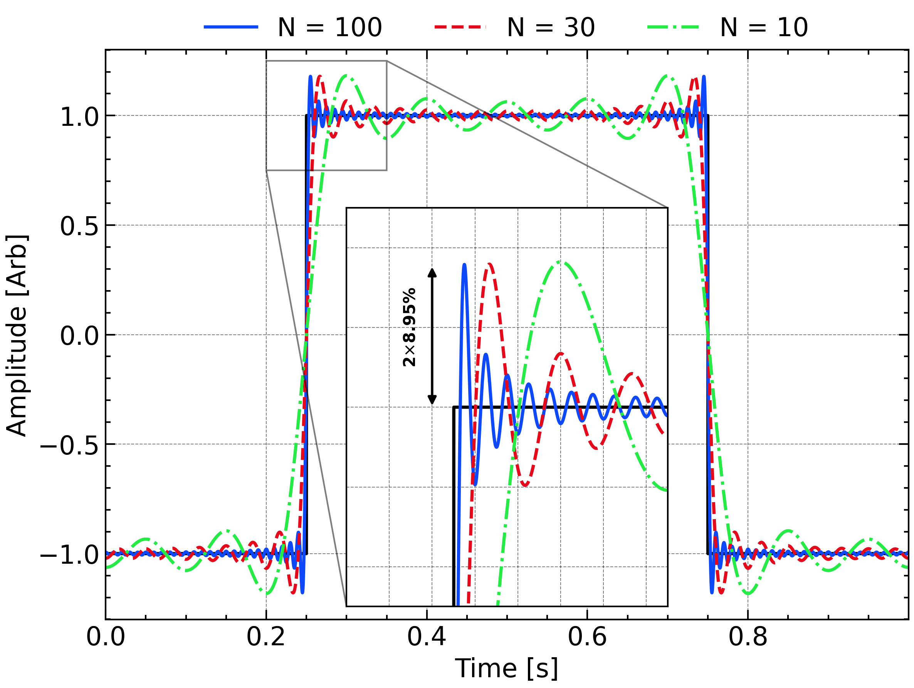
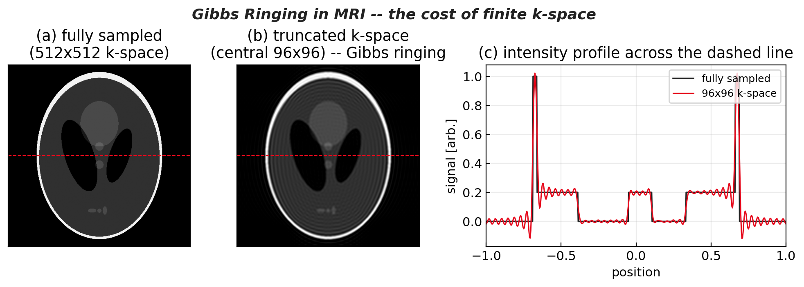
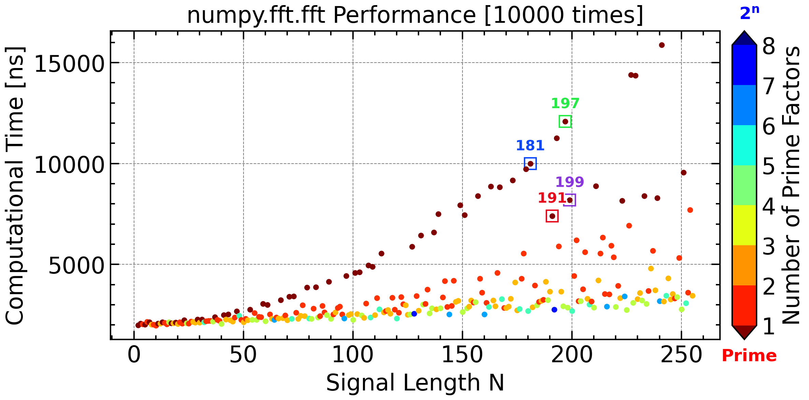

# More about DFT/FFT

## Uncertainty Principle

> **Uncertainty Principle:** A signal $x(t)$ and its Fourier transform $X(f)$ cannot both be sharply localized.  If $\Delta t$ denotes the effective duration of the signal and $\Delta f$ its effective bandwidth, then
$$
\Delta t \,\Delta f \;\ge\; \tfrac{1}{4\pi}
$$
> meaning you can trade time resolution for frequency resolution, but never improve both simultaneously beyond this bound.  


<!-- fig-tabset:figure_uncertainty_principle.png -->
::: {.panel-tabset}

### Figure


### Code

```python
import numpy as np
import matplotlib.pyplot as plt
import scipy.signal
import scienceplots
plt.style.use(['science', 'nature', 'notebook', 'grid', 'high-vis'])

%matplotlib ipympl
plt.close()
plt.gcf()
plt.gca()

N = 2 ** 14
t = np.linspace(0, 1, N, endpoint=False)
dt = t[1] - t[0]
fs = 1 / dt
omega = 50.0 * 2 * np.pi
bws = np.array([0.1, 0.25, 0.5])

plt.figure(figsize=(8, 8))
ax1 = plt.subplot(2, 1, 1)
ax2 = plt.subplot(2, 1, 2)

for idx, bw in enumerate(bws):
    # sig = np.exp(-((t - np.mean(t))**2) / (2 * sigma**2)) * np.cos(omega * t)  # 50 Hz 的正弦波调制的高斯脉冲
    sig, sig_env = scipy.signal.gausspulse(t - np.mean(t), fc = omega / 2 / np.pi, bw = bw, retenv = True)
    ax1.plot(t, 3.0 * idx + sig, label = r"$bw$ = %.2f" % bw, linestyle = '-')
    ax1.plot(t, 3.0 * idx + sig_env, 'k--', alpha = 0.3)
    ax1.plot(t, 3.0 * idx - sig_env, 'k--', alpha = 0.3)
    # ax1.plot(t, 3.0 * idx + np.exp(-((t - np.mean(t))**2) / (2 * sigma**2)), 'k--', alpha = 0.3)
    # ax1.plot(t, 3.0 * idx - np.exp(-((t - np.mean(t))**2) / (2 * sigma**2)), 'k--', alpha = 0.3)

    sig -= np.mean(sig)  # 去除直流分量
    # ----- 频域谱 -----
    freq, psd = scipy.signal.welch(sig, fs, nperseg = N)  # 使用Welch方法计算功率谱密度

    t0 = np.sum(t * np.abs(sig)**2) / np.sum(sig ** 2)        # 中心时刻
    delta_t = np.sqrt(np.sum(((t - t0)**2) * sig**2) / np.sum(sig**2))
    
    f0 = np.sum(freq * psd) / np.sum(psd)
    delta_f = np.sqrt(np.sum(((freq - f0)**2) * psd) / np.sum(psd))

    ax2.plot(freq, psd / np.max(psd), label = r"$4\pi \cdot \Delta f \cdot \Delta t$ = %.2f" % (4 * np.pi * delta_t * delta_f), linestyle = '-')

# ---------------- 轴标签与图例 ----------------
# ax1.set_title("Gaussian Pulses (Time Domain)")
ax1.set_xlabel("Time [s]")
ax1.set_ylabel("Intensity [Arb]")

# ax2.set_title("Magnitude Spectra (Frequency Domain)")
ax2.set_xlabel("Frequency [Hz]")
ax2.set_ylabel("Normalized Magnitude [Arb]")

ax1.text(0.68, 7.0, 'Gaussian Pulse\n(bw: Bandwidth)', **title_font, color = 'w', path_effects = path_effect)
ax1.set_ylim(-2, 10)
ax1.yaxis.set_major_locator(ticker.MultipleLocator(3))
ax1.legend(frameon = False, ncols = 2, loc = 'upper left')
ax2.legend(frameon = False, ncols = 1, loc = 'upper left')

ax1.autoscale(axis = 'x', tight=True)
ax2.set_xlim(10, 90)
ax2.set_ylim(-0.1, 1.7)
ax1.set_title('Uncertainty Principle', **title_font)

plt.tight_layout()

plt.savefig(save_path + 'figure_uncertainty_principle' + '.png',bbox_inches='tight',dpi=300)
plt.show()
```

:::
<p align = 'center'><i>Top: Gaussian pulses with narrow (purple) to wide (blue) time span; Bottom: Their Fourier coefficient with wide to narrow frequency bandwidth. </i></p>

Here the central time $t_0$ and bandwidth $f_0$ are defined as the first moments of the energy density $|x(t)|^2$ and $|X(f)|^2$, respectively, while $\Delta t$ and $\Delta f$ are their standard deviations. The integrals are taken over all time and frequency, respectively.
$$
t_0 = \frac{\int t\,|x(t)|^{2} \, \mathrm{d}t}{\int |x(t)|^{2} \, \mathrm{d}t},
\qquad
\Delta t = \sqrt{\frac{\int (t-t_0)^{2}\,|x(t)|^{2} \, \mathrm{d}t}{\int |x(t)|^{2} \, \mathrm{d}t}}
$$

$$
f_0 = \frac{\int f\,|X(f)|^{2} \, \mathrm{d}f}{\int |X(f)|^{2} \, \mathrm{d}f},
\qquad
\Delta f = \sqrt{\frac{\int (f-f_0)^{2}\,|X(f)|^{2} \, \mathrm{d}f}{\int |X(f)|^{2} \, \mathrm{d}f}}
$$

This is often summarized as: "A signal cannot be **both time-limited and band-limited**." Practically, **a shorter pulse spreads its spectrum, while a narrow-band tone must last longer**. The lower bound of the time–bandwidth product is achieved by Gaussian functions:
$$
x(t)= Ae^{-(t-t_0)^2/B^{2}}\mathrm{cos}\omega t,
$$


which are optimal in the sense that they minimize the product $\Delta t \Delta f$.

This trade-off is a fundamental limitation of the Fourier transform and is mathematically expressed through time–bandwidth products. It implies that **short-duration signals must occupy a wide frequency range**, while **narrow-band signals cannot be sharply confined in time**—a concept closely related to Heisenberg’s uncertainty principle in quantum mechanics.

One direct application of this principle is the choice of the window length in the **<u>*Short-Time Fourier Transform (STFT)*</u>**. A longer window improves frequency resolution but reduces time resolution, while a shorter window does the opposite. The optimal choice depends on the specific characteristics of the signal being analyzed.

<div STYLE="page-break-after: always;"></div>

## Gibbs Phenomenon

Although the Fourier transform can perfectly reconstruct **discrete** signal points, it struggles to represent analytic functions with sharp discontinuities. Such a sharp jump is so temporal local thus spread the whole frequency range, up to the infinity. This is because a finite number of sinusoids cannot fully capture the infinite-frequency behavior near a jump, leading to **the Gibbs phenomenon**—persistent overshoot and ringing near discontinuities. 

<!-- fig-tabset:figure_gibbs.png -->
::: {.panel-tabset}

### Figure



### Code

```python
import numpy as np
import matplotlib.pyplot as plt
import scipy.signal
import scienceplots
plt.style.use(['science', 'nature', 'notebook', 'grid', 'high-vis'])

%matplotlib ipympl
plt.close()
plt.gcf()
plt.gca()

ax1 = plt.subplot(1, 1, 1)

t = np.linspace(0, 1, 2 ** 13, endpoint=False)
dt = t[1] - t[0]
fs = 1 / dt

omega0 = 2 * np.pi * 4.0
omega1 = 2 * np.pi * 11.0
omega2 = 2 * np.pi * 25.0

sig0 = np.sin(omega0 * t)
sig1 = 0.5 * np.sin(omega1 * t)
sig2 = 0.5 * np.sin(omega2 * t)

sig = sig0 + sig1 + sig2 + np.random.normal(0, 0.01, t.shape)


ax1.plot(t, sig, 'k.-')
ax1.plot(t, sig0 - 0, 'C1-', label='4 Hz Component')
ax1.plot(t, sig1 - 0, 'C0-', label='11 Hz Component')
ax1.plot(t, sig2 - 0, 'C2-', label='25 Hz Component')

ax1.set_xlabel('Time [s]')
ax1.set_ylabel('Intensity [Arb]')
ax1.autoscale(axis = 'x', tight=True)
ax1.set_ylim(-6.2, 1.2)
plt.tight_layout()
# plt.savefig(save_path + 'figure_gibbs' + '.png',bbox_inches='tight',dpi=300)

plt.show()
```

:::

The variation of the signal concentrates sharply localized, which means the bandwidth should be infinitely wide. Such a transient signal has a Fourier coefficient propotional to ${(2k+1)}^{-1}$ and $\delta f$ can not converged.

Despite increasing the number of harmonics, the overshoot becomes narrower but remains at a constant: ~8.95%, which is the average of the $\mathrm{sinc}$ function between $0$ and $\pi$: 
$$
\frac{1}{\pi}\int_0^\pi \frac{\mathrm{sin} u}{u} \mathrm{d}u \approx 0.08949\ldots
$$

### Application: Gibbs Ringing in MRI

The Gibbs phenomenon is not just a textbook curiosity — it is a **routine artifact in clinical MRI**, where it goes by the names *Gibbs ringing*, *truncation artifact*, or *ringing artifact*. The reason is that an MRI scanner never measures the image directly: it samples the image's **spatial-frequency space** (**$k$-space**) line by line, and the picture the radiologist sees is the **inverse 2-D FFT** of that raw data.

This flips the usual picture. In most of this book we sample a signal in **time or space** and then *compute* its spectrum, so any truncation happens in the domain we control. MRI is the opposite: the measurement is taken **directly in the frequency ($k$) domain** — each data point the scanner records *is* one spatial-frequency coefficient of the object. We never see the "full" signal to window; the raw acquisition is already a finite, band-limited set of frequency samples.

And that is precisely where Gibbs bites. If the object contains a **discontinuity** — a sharp tissue boundary — its true spectrum has energy stretching out to arbitrarily high $k$. A finite set of $k$-space samples simply **cannot capture that infinite high-frequency tail**, so the sharp edge is rebuilt from an incomplete sum of sinusoids. The missing high frequencies re-emerge as **overshoot and ringing** at the edge: a set of **parallel bright-and-dark ripples running alongside every high-contrast boundary** (skull/brain, fat/muscle, CSF/spinal-cord), decaying with distance. Truncating the Fourier series of a discontinuous image is *exactly* the Gibbs setup — only now in two dimensions, and forced on us by the physics of the measurement rather than chosen.

The figure below simulates it on a Shepp–Logan phantom: acquiring only the central $96\times96$ block of the full $512\times512$ $k$-space produces the characteristic ringing around the skull and the internal boundaries, and the line profile shows the familiar **$\sim\!9\%$ overshoot** followed by decaying oscillations at each jump.

<!-- fig-tabset:figure_gibbs_mri.png -->
::: {.panel-tabset}

### Figure



### Code

```python
import numpy as np
import matplotlib.pyplot as plt

BLUE, RED, INK, GREY = '#0d49fb', '#e6091c', '#222222', '#888888'

# --- modified Shepp-Logan phantom (the classic MRI test image) ---
def shepp_logan(N):
    # (intensity, a, b, x0, y0, phi_deg) for each ellipse
    E = [( 1.0, .69,  .92,   0,     0,    0), (-.80, .6624,.874,  0,  -.0184, 0),
         (-.20, .11,  .31,  .22,    0,  -18), (-.20, .16,  .41, -.22,   0,   18),
         ( .10, .21,  .25,   0,    .35,   0), ( .10, .046, .046,  0,   .10,   0),
         ( .10, .046, .046,  0,   -.10,   0), ( .10, .046, .023, -.08,-.605,  0),
         ( .10, .023, .023,  0,   -.606,  0), ( .10, .023, .046, .06, -.605,  0)]
    g = np.linspace(-1, 1, N); X, Y = np.meshgrid(g, -g)
    img = np.zeros((N, N))
    for I, a, b, x0, y0, phi in E:
        t = np.radians(phi)
        xc =  (X - x0)*np.cos(t) + (Y - y0)*np.sin(t)
        yc = -(X - x0)*np.sin(t) + (Y - y0)*np.cos(t)
        img[(xc/a)**2 + (yc/b)**2 <= 1] += I
    return img

N = 512
truth = shepp_logan(N)

# --- MRI acquisition: full k-space, then keep only a central MxM block ---
K = np.fft.fftshift(np.fft.fft2(truth))          # image -> k-space
M = 96                                            # sampled matrix (of N): finite k-space
c, h = N // 2, M // 2
mask = np.zeros((N, N), bool); mask[c-h:c+h, c-h:c+h] = True
recon = np.fft.ifft2(np.fft.ifftshift(K * mask)).real   # zero-filled inverse FFT

row = c; x = np.linspace(-1, 1, N)               # profile through the image centre

# --- figure: truth | truncated recon | line profile ---
plt.rcParams.update({'font.size': 11, 'axes.linewidth': 0.8,
                     'xtick.direction': 'in', 'ytick.direction': 'in'})
fig = plt.figure(figsize=(10, 3.4), layout='constrained')
gs = fig.add_gridspec(1, 3, width_ratios=[1, 1, 1.35])
a0, a1, a2 = (fig.add_subplot(gs[i]) for i in range(3))
VMAX = 1.05

a0.imshow(truth, cmap='gray', vmin=0, vmax=VMAX, extent=[-1, 1, -1, 1])
a0.axhline(x[row], color=RED, lw=0.8, ls='--')
a0.set_title(f'(a) fully sampled\n({N}x{N} k-space)'); a0.set_xticks([]); a0.set_yticks([])

a1.imshow(recon, cmap='gray', vmin=0, vmax=VMAX, extent=[-1, 1, -1, 1])
a1.axhline(x[row], color=RED, lw=0.8, ls='--')
a1.set_title(f'(b) truncated k-space\n(central {M}x{M}) -- Gibbs ringing')
a1.set_xticks([]); a1.set_yticks([])

a2.plot(x, truth[row], color=INK, lw=1.3, label='fully sampled')
a2.plot(x, recon[row], color=RED, lw=1.1, label=f'{M}x{M} k-space')
a2.set_title('(c) intensity profile across the dashed line')
a2.set_xlabel('position'); a2.set_ylabel('signal [arb.]')
a2.set_xlim(-1, 1); a2.legend(loc='upper right', fontsize=9); a2.grid(alpha=0.25)

fig.suptitle('Gibbs Ringing in MRI -- the cost of finite k-space',
             fontsize=13, fontweight='bold', fontstyle='italic', color=INK)
fig.savefig(save_path + 'figure_gibbs_mri.png', dpi=200, bbox_inches='tight')
plt.show()
```

:::

Two things follow directly from the 1-D theory. First, **extending $k$-space** (a larger acquisition matrix, i.e. higher resolution) does *not* lower the overshoot — it only makes the ripples finer and pushes them closer to the edge, just as adding harmonics never beats the $8.95\%$ constant. Second, the practical fix is **apodization**: multiplying $k$-space by a smooth taper (a Hamming or Fermi window) before the inverse FFT suppresses the ringing at the price of a slightly blurrier edge — the same time–frequency trade-off that runs through this whole chapter.

::: {.callout-note}
## Aside: CT, the Radon transform, and the Fourier slice theorem

MRI records $k$-space directly; **CT** reaches the frequency domain by a different door — the **Radon transform**. A CT scanner measures how much an X-ray is attenuated along each ray through the body, i.e. a set of **line integrals** of the image. Collecting all parallel rays at a viewing angle $\theta$ gives one *projection* $p_\theta(s)$, and the Radon transform is the map from the image $f(x,y)$ to all of its projections:

$$
p_\theta(s) = \mathcal{R}f(\theta, s) = \iint f(x, y)\,\delta(x\cos\theta + y\sin\theta - s)\, dx\, dy .
$$

The bridge to Fourier analysis is the **Fourier slice theorem**: the **1-D** Fourier transform of a single projection equals a **radial line through the origin** of the **2-D** Fourier transform of the image,

$$
\mathcal{F}_{1\mathrm D}\{p_\theta\}(k) = \hat f(k\cos\theta,\; k\sin\theta).
$$

So rotating the source and detector fills 2-D $k$-space one radial spoke at a time — CT samples the *same* spectrum as MRI, just on a polar grid instead of a Cartesian one. Inverting this (filtered back-projection) reconstructs the image, and the same lesson returns: a **finite** number of angles and radial samples cannot capture a discontinuity's high-frequency tail, so sharp edges again produce ringing (plus the streak artifacts characteristic of sparse-angle CT).
:::

## More Practical Properties

A super powerful property of Fourier transform is that:
$$
\mathcal{F}\left[\frac{\mathrm{d}}{\mathrm{d}t}x(t)\right]=(i2\pi f)\cdot X(f)
$$

which can be easily proved by doing derivative to the both sides of the inverse Fourier transform:
$$
\begin{align*}
\frac{\mathrm{d}}{\mathrm{d}t}[x(t)]&=\int_{-\infty}^{+\infty} X(f) (i2\pi f)e^{i 2 \pi f t} \mathrm{d}f\\
&=\int_{-\infty}^{+\infty} \left[(i2\pi f)\cdot X(f)\right] e^{i 2 \pi f t} \mathrm{d}f\\
&=\mathcal{F}^{-1}\left[(i2\pi f)\cdot X(f)\right]
\end{align*}
$$

It can be denoted as 
$$
{{\mathrm{d}}/{\mathrm{d}t}}\leftrightarrow i 2\pi f
$$

One can also extend this property to
$$
({{\mathrm{d}/}{\mathrm{d}t}})^n\leftrightarrow (i 2\pi f)^n
$$

It should be noted that this **derivation property change a little bit** for $\Delta x/\Delta t$ in the *DFT*:

$$
\begin{align*}
\frac{\Delta x(t)}{\Delta  t}&=\int_{-\infty}^{+\infty}X(f) \frac{e^{2\pi i f (t+\Delta t)}-e^{2\pi i f t}}{\Delta t} \mathrm{d}f\\
&=\mathcal{F}^{-1}\left[\frac{e^{2\pi if \Delta t} - 1}{\Delta t}\cdot X(f)\right]
\end{align*}
$$

The following table summarizes some common properties of the Continuous-Time Fourier Transform (FT) and the Discrete Fourier Transform (DFT/FFT):

| Property                   | Continuous-Time Fourier Transform (FT)                 | Discrete Fourier Transform (DFT/FFT)                         |
| -------------------------- | ------------------------------------------------------ | :----------------------------------------------------------- |
| Linearity                  | $\mathcal{F}\{a\,x(t) + b\,y(t)\} = a\,X(f) + b\,Y(f)$ | $\mathrm{DFT}\{a\,x[n] + b\,y[n]\} = a\,X[k] + b\,Y[k]$      |
| Time Shift                 | $x(t - t_0) \rightarrow X(f)\,e^{-j 2\pi f t_0}$       | $x[n - n_0] \rightarrow X[k]\,e^{-j 2\pi k n_0 / N}$         |
| Frequency Shift            | $x(t)\,e^{j 2\pi f_0 t} \rightarrow X(f - f_0)$        | $x[n]\,e^{j 2\pi k_0 n / N} \rightarrow X[(k - k_0)\bmod N]$ |
| Time-Domain Convolution    | $x(t) * h(t) \rightarrow X(f)\,H(f)$                   | $x[n] \circledast h[n] \rightarrow X[k]\,H[k]$ (circular)    |
| Time-Domain Multiplication | $x(t)\,h(t) \rightarrow X(f) * H(f)$                   | $x[n]\,h[n] \rightarrow X[k] * H[k] / N$                     |
| Derivative (Time Domain)   | $\frac{d^n x(t)}{dt^n} \rightarrow (j 2 \pi f)^n X(f)$ | $\Delta^n x[n] \rightarrow X[k] \cdot (e^{j 2 \pi k / N} - 1)^n$ |
| Conjugate Symmetry         | $x(t) \in \mathbb{R} \Rightarrow X(-f) = X^*(f)$       | $x[n] \in \mathbb{R} \Rightarrow X[N - k] = X^*[k]$          |
| Parseval's Theorem         | $\int |x(t)|^2\,dt = \int |X(f)|^2\,df$                | $\sum |x[n]|^2 = \frac{1}{N} \sum |X[k]|^2$                  |
| Spectral Periodicity       | $X(f)$ not periodic                                    | $X[k]$ is periodic with period $N$                           |
| Periodic Input Duality     | Periodic $x(t) \Rightarrow$ discrete $X(f)$            | Periodic $x[n] \Rightarrow$ sparse $X[k]$                    |

## Application: Solve Differential Equations with FFT

As the physics field, e.g., temperature field, electromagnetic field, has finite energy and therefore can be decomposed by Fourier transform. Mathematicians surprisingly find that the physics law these field follows can be largely simplified in its Fourier space. For example, the thermal diffusion equation written as
$$
\frac{\mathrm{d}T(\mathbf{r},t)}{\mathrm{d}t}=\alpha\nabla^2T(\mathbf{r},t) \\ \frac{\mathrm{d}\hat{T}(\mathbf{k},t)}{\mathrm{d}t} = -\alpha k^2\hat{T}(\mathbf{k},t)
$$
 The transformed differential equation has a very apparent solution:
$$
\hat{T}(\mathbf{k},t)=\hat{T}(\mathbf{k},0)\cdot\exp(-\alpha k^2t)
$$
and the solution of the thermal diffusion problem can be given by the inverse Fourier transform of $\hat{T}(\mathbf{k},t)$.

<!-- fig-tabset:heat_diffusion.gif -->
::: {.panel-tabset}

### Figure


### Code

```python
import matplotlib.animation
import numpy as np
import matplotlib.pyplot as plt
from scipy.fft import fft2, ifft2, fftfreq

N = 128
dx = dy = 1.0
alpha = 1.0          # thermal diffusivity
T = 100.0
dt_fdtd = dx**2 / (4 * alpha)   # stability limit for FTCS

kx = 2 * np.pi * fftfreq(N, d=dx)
ky = 2 * np.pi * fftfreq(N, d=dy)
kx_grid, ky_grid = np.meshgrid(kx, ky, indexing='ij')
k2 = kx_grid**2 + ky_grid**2

T_init = np.zeros((N, N))
T_init[N//4:3*N//4, N//4:3*N//4] = 1.0

T_fdtd  = T_init.copy()
T_psatd = T_init.copy()

SAMPLE_RATE = 1 / dt_fdtd
n_frames = int(T * SAMPLE_RATE + 1)
T_fdtd_sampled  = np.zeros((n_frames, N, N))
T_psatd_sampled = np.zeros((n_frames, N, N))

for i in range(int(T / dt_fdtd + 1)):
    t = i * dt_fdtd
    T_fdtd_sampled[i]  = T_fdtd
    T_psatd_sampled[i] = T_psatd
    laplacian = (np.roll(T_fdtd,  1, 0) + np.roll(T_fdtd, -1, 0) +
                 np.roll(T_fdtd,  1, 1) + np.roll(T_fdtd, -1, 1) - 4*T_fdtd) / dx**2
    T_fdtd  += alpha * dt_fdtd * laplacian
    T_psatd  = np.real(ifft2(fft2(T_init) * np.exp(-alpha * k2 * t)))

fig, axes = plt.subplots(1, 2, figsize=(8, 3), sharex=True, sharey=True,
                         gridspec_kw={'wspace': 0.05, 'bottom': 0.2, 'right': 0.8})
for ax in axes:
    ax.set_aspect('equal'); ax.set_xlabel('X')
    ax.tick_params(color='w', which='both', axis='both')
axes[0].set_ylabel('Y')
axes[0].set_title('Finite-Difference')
axes[1].set_title('Fourier Transform')

pc1 = axes[0].pcolormesh(T_init*np.nan, cmap='bwr', vmax=1, vmin=0)
pc2 = axes[1].pcolormesh(T_init*np.nan, cmap='bwr', vmax=1, vmin=0)
cax = fig.add_axes([axes[1].get_position().x1+0.03, axes[1].get_position().y0,
                    0.02, axes[1].get_position().height])
plt.colorbar(pc2, cax=cax, label='Temperature [K]')
text1 = axes[0].text(0.05, 0.95, '0 Iterations', transform=axes[0].transAxes,
                     fontsize=12, color='w', va='top')

def update(i):
    pc1.set_array(T_fdtd_sampled[i].ravel())
    pc2.set_array(T_psatd_sampled[i].ravel())
    text1.set_text(f'{i} Iterations')

ani = matplotlib.animation.FuncAnimation(fig, update, frames=n_frames,
                                         interval=30, repeat=False)
ani.save('Figure/heat_diffusion.gif', writer='pillow', fps=30)
```

:::

Another application is solving the Maxwell's equation in the vaccum:
$$
\frac{\partial \mathbf{E}}{\partial t}=\frac{1}{c^2}\nabla\times \mathbf{B} + \mu_0\mathbf{J}\\
\frac{\partial \mathbf{B}}{\partial t}=-\nabla\times \mathbf{E}
$$
Accordingly, these equations in the Fourier space are:
$$
\frac{\partial \mathbf{\hat{E}}}{\partial t}=\frac{1}{c^2}i\mathbf{k}\times \mathbf{\hat{B}} + \mu_0\mathbf{\hat{J}}\\
\frac{\partial \mathbf{\hat{B}}}{\partial t}=-i\mathbf{k}\times \mathbf{\hat{E}}
$$
These equations does not have a general analytic solution but can still be solved numerically through finite-difference method in the time domain.
$$
\mathbf{\hat{E}}^{n+1}=\mathbf{\hat{E}}^{n}+\Delta t \cdot \frac{1}{c^2}i\mathbf{k}\times\mathbf{\hat{B}}^{n+1/2}\\
\mathbf{\hat{B}}^{n+3/2}=\mathbf{\hat{B}}^{n+1/2}-\Delta t \cdot i\mathbf{k}\times\mathbf{\hat{E}}^{n+1}\\
$$
This kind of algorithm take the Fourier decomposition in the position space but keep using 
$$
\mathbf{\hat{E}}^{n+1}=\mathbf{\hat{E}}^{n}+\Delta t \cdot \frac{1}{c^2}i\mathbf{k}\times\mathbf{\hat{B}}^{n+1/2}\\
\mathbf{\hat{B}}^{n+3/2}=\mathbf{\hat{B}}^{n+1/2}-\Delta t \cdot i\mathbf{k}\times\mathbf{\hat{E}}^{n+1}\\
$$


<!-- fig-tabset:unit_pulse.gif -->
::: {.panel-tabset}

### Figure


### Code

```python
import matplotlib.animation
import numpy as np
import matplotlib.pyplot as plt
from scipy.fft import fft2, ifft2, fftfreq

N = 128; dx = dy = 1.0; c = 1.0; T = 200
dt_fdtd = dx / c / np.sqrt(2)          # CFL limit (2-D)
dt_pstd  = np.sqrt(2) / np.pi * dx / c

kx = 2 * np.pi * fftfreq(N, d=dx)
ky = 2 * np.pi * fftfreq(N, d=dy)
kx_g, ky_g = np.meshgrid(kx, ky, indexing='ij')
k = np.sqrt(kx_g**2 + ky_g**2); k[0, 0] = 1e-12

x0 = y0 = N // 2
X, Y = np.ogrid[:N, :N]
init_ez = np.exp(-((X-x0)**2 + (Y-y0)**2) / 2)

fields = {name: {'Ez': np.zeros((N,N)), 'Hx': np.zeros((N,N)), 'Hy': np.zeros((N,N))}
          for name in ('FDTD', 'PSTD', 'PSATD')}
for f in fields.values(): f['Ez'][:] = init_ez

SAMPLE_RATE = 1 / (7 * dt_pstd)
n_frames = int(T * SAMPLE_RATE + 1)
sampled = {name: np.zeros((n_frames, N, N)) for name in fields}

# FDTD (Yee leapfrog)
t = 0.0; f = fields['FDTD']
for i in range(int(T / dt_fdtd) + 1):
    sampled['FDTD'][int(t * SAMPLE_RATE)] = f['Ez']
    f['Hx'] -= 0.5*dt_fdtd*(np.roll(f['Ez'],-1,1)-f['Ez'])
    f['Hy'] += 0.5*dt_fdtd*(np.roll(f['Ez'],-1,0)-f['Ez'])
    f['Ez'] += dt_fdtd*((f['Hy']-np.roll(f['Hy'],1,0))-(f['Hx']-np.roll(f['Hx'],1,1)))
    f['Hx'] -= 0.5*dt_fdtd*(np.roll(f['Ez'],-1,1)-f['Ez'])
    f['Hy'] += 0.5*dt_fdtd*(np.roll(f['Ez'],-1,0)-f['Ez'])
    t += dt_fdtd

# PSTD (spectral spatial, leapfrog time)
t = 0.0; f = fields['PSTD']
for i in range(int(T / dt_pstd) + 1):
    sampled['PSTD'][int(t * SAMPLE_RATE)] = f['Ez']
    Ez_k = fft2(f['Ez'])
    f['Hx'] -= dt_pstd * np.real(ifft2(1j * ky_g * Ez_k))
    f['Hy'] += dt_pstd * np.real(ifft2(1j * kx_g * Ez_k))
    Hx_k, Hy_k = fft2(f['Hx']), fft2(f['Hy'])
    f['Ez'] += dt_pstd * np.real(ifft2(1j * kx_g * Hy_k - 1j * ky_g * Hx_k))
    t += dt_pstd

# PSATD (spectral spatial, analytic time integration)
t = 0.0; f = fields['PSATD']
Ez0_k, Hx0_k, Hy0_k = fft2(init_ez), fft2(np.zeros((N,N))), fft2(np.zeros((N,N)))
for i in range(int(T / dt_pstd) + 1):
    sampled['PSATD'][int(t * SAMPLE_RATE)] = f['Ez']
    C, S = np.cos(c*k*t), np.sin(c*k*t)/k
    f['Ez'] = np.real(ifft2(C*Ez0_k + 1j*c*S*(kx_g*Hy0_k - ky_g*Hx0_k)))
    t += dt_pstd

fig, axes = plt.subplots(1, 3, figsize=(11, 3), sharex=True, sharey=True,
                         gridspec_kw={'wspace': 0.15, 'bottom': 0.2, 'right': 0.8})
for ax in axes:
    ax.set_aspect('equal'); ax.set_xlabel('X')
    ax.tick_params(color='w', which='both', axis='both')
axes[0].set_ylabel('Y')
for ax, title in zip(axes, ('FDTD', 'PSTD', 'PSATD')): ax.set_title(title)

vmax = 0.1
pcs = [ax.pcolormesh(init_ez, cmap='Greys', vmax=vmax, vmin=-vmax) for ax in axes]
cax = fig.add_axes([axes[2].get_position().x1+0.03, axes[2].get_position().y0,
                    0.02, axes[2].get_position().height])
plt.colorbar(pcs[2], cax=cax, label='Ez [a.u.]')
circles = [ax.add_artist(plt.Circle((x0,y0), 0, color='C0', fill=False, ls='--', lw=1.5))
           for ax in axes]
text = axes[0].text(0.05, 0.95, '0 Iter', transform=axes[0].transAxes,
                    fontsize=12, color='w', va='top')

def update(i):
    for name, pc in zip(('FDTD','PSTD','PSATD'), pcs):
        pc.set_array(sampled[name][i].ravel())
    r = (i + 1) / SAMPLE_RATE * c
    for circle in circles: circle.set_radius(r)
    text.set_text(f'{int(i / SAMPLE_RATE / dt_fdtd)} Iterations')

ani = matplotlib.animation.FuncAnimation(fig, update, frames=n_frames, interval=30)
ani.save('Figure/unit_pulse.gif', writer='pillow', fps=10)
```

:::

However, the Fourier method intrinsically assume a periodic boundary condition of the solution and limit its own applicable situations. More importantly, the Fourier transform takes the whole information from the global area of interest and therefore become parallelization-difficult. This defect becomes even more fatal as the advances in parallelized, GPU-based computation. 

## FFT Algorithm Performance

The invention of the [***(Cooley–Tukey) Fast Fourier Transform (FFT) algorithm***](https://www.ams.org/journals/mcom/1965-19-090/S0025-5718-1965-0178586-1/S0025-5718-1965-0178586-1.pdf) reduced the time complexity of DFT from $\mathcal{O}(N^2)$ to $\mathcal{O}(N\mathrm{log}N)$ by efficiently decomposing the DFT into smaller computations, i.e., [divide-and-conquer](https://en.wikipedia.org/wiki/Divide-and-conquer_algorithm).  

Most tutorials introduce the ***radix-2*** FFT, which splits the signal into ***two*** sub-signals with exactly the same length and requires the length of the signal to be an integer power of ***2***. This requirement is hard to satisfy in common applications without zero-padding, which actually includes unwanted modification of the original signal. To overcome that, ***radix-3*** and ***radix-5*** FFTs are developed and implemented. 

Still, the divide-and-conquer strategy fails when the signal length *N* consists of at least one big prime number factor (e.g, 10007) as the signal is hard to split. In that situation, the [***Bluestein's algorithm***](https://ieeexplore.ieee.org/document/1162132), which is essentially a ***Chirping-Z transform***, is used. This algorithm takes the $\mathcal{F}$ operation as a convolution and then uses the *convolution theorem* in the calculation of DFT coefficients. The convolution property allows us to extend the signal length to a proper, highly composite number with zero-padding (denoted as *M*), but the coefficients and frequency resolution remain unchanged. The final time complexity of *Bluestein's algorithm* goes to $\mathcal{O}(N+M\mathrm{log}M)$, where the first term originates from the iterate all the frequency component.

<!-- fig-tabset:figure_numpy_fft_performance.png -->
::: {.panel-tabset}

### Figure



### Code

```python
import time
import sympy

plt.close()

plt.figure(figsize=single_panel_figsize, tight_layout=True)
ax1 = plt.subplot(1, 1, 1)

N_LENGTHS = np.arange(2, 256, 1)
TIME_PER_THOUSAND_RUNS_NUMPY = np.zeros(N_LENGTHS.size)
TIME_PER_THOUSAND_RUNS_SCIPY = np.zeros(N_LENGTHS.size)
N_REPEATS = 10000

for N_LENGTH in N_LENGTHS:
    sig = np.random.randn(N_LENGTH)

    _start_time = time.perf_counter_ns()

    for _ in range(N_REPEATS):
        coefs = np.fft.rfft(sig)

    _end_time = time.perf_counter_ns()

    TIME_PER_THOUSAND_RUNS_NUMPY[
        N_LENGTHS == N_LENGTH] = (_end_time - _start_time) / 1e9 / N_REPEATS

    # _start_time = time.perf_counter_ns()

    # for _ in range (N_REPEATS):
    #     coefs = scipy.fft.fft(signal, workers = -1)

    # _end_time = time.perf_counter_ns()

    # TIME_PER_THOUSAND_RUNS_SCIPY[N_LENGTHS == N_LENGTH] = (_end_time - _start_time) / 1e9 / N_REPEATS

for i in N_LENGTHS:
    N = N_LENGTHS[i - 2]
    n_prime_factor = sum(sympy.ntheory.factor_.factorint(N).values())

    sc1 = ax1.plot(N,
                   1e9 * TIME_PER_THOUSAND_RUNS_NUMPY[i - 2],
                   color=matplotlib.cm.jet_r(((n_prime_factor - 1) / 7)),
                   marker='o')

circled_numbers = [181, 191, 197, 199]
for idx, circled_number in enumerate(circled_numbers):
    N = circled_number
    n_prime_factor = sum(sympy.ntheory.factor_.factorint(N).values())
    ax1.plot(N,
             1e9 * TIME_PER_THOUSAND_RUNS_NUMPY[N_LENGTHS == N],
             's',
             color=f"C{idx}",
             fillstyle='none',
             markersize=8,
             label=f'Prime {N}',
             zorder=-1)
    ax1.text(N,
             1e9 * TIME_PER_THOUSAND_RUNS_NUMPY[N_LENGTHS == N] +
             (1000 if N == 199 else 500),
             f'{N}',
             color=f"C{idx}",
             ha='center',
             va='bottom',
             fontsize=10,
             weight='bold',
             path_effects=[
                 matplotlib.patheffects.withStroke(linewidth=2, foreground='w')
             ])

ax1.set_ylabel('Computational Time [ns]')
ax1.set_xlabel('Signal Length N')

ax1.set_title('Performance Test' + f" [{N_REPEATS} times]\n" + 'numpy.fft.fft', **title_font)
# ax2.set_title('scipy.fft.fft Performance\n' + f"Repeat {N_REPEATS} times")

# ax1.set_yscale('log')

cmap = matplotlib.cm.jet_r
bounds = [1, 2, 3, 4, 5, 6, 7, 8]
norm = matplotlib.colors.BoundaryNorm(bounds, cmap.N, extend='both')

ax2 = ax1.inset_axes([1.02, 0.00, 0.04, 1.0])
cbar = plt.gcf().colorbar(matplotlib.cm.ScalarMappable(norm=norm, cmap=cmap),
                          cax=ax2,
                          orientation='vertical',
                          label="Number of Prime Factors")

plt.text(0.7,
         -.08,
         'Prime',
         transform=ax2.transAxes,
         ha='center',
         va='top',
         color='r',
         fontweight='bold',
         fontsize=12)
plt.text(0.7,
         1.08,
         '$\mathbf{2^n}$',
         transform=ax2.transAxes,
         ha='center',
         va='bottom',
         color='b',
         fontweight='bold',
         fontsize=12)

# ax1.set_yscale('log')

plt.tight_layout()

plt.savefig(save_path + 'figure_numpy_fft_performance' + '.png',bbox_inches='tight',dpi=300)

plt.show()
```

:::


From the performance test, we observe that signals with prime-number lengths (dark red dots) often incur higher computational costs. For example:
$$
\begin{align*}
N&=181=182-1=2^1\times\boxed{7^1\times13^1}-1\\
N&=197=198-1=2^1\times3^2\times\boxed{11^1}-1\\
\end{align*}
$$
In contrast, signals with highly composite number lengths (dark blue dots), such as those with lengths being integer powers of 2, usually have the lowest computation time.

However, some prime numbers like: 
$$
\begin{align*}
N&=191=192-1=2^6\times3^1-1\\
N&=199=200-1 = 2^3\times5^2-1
\end{align*}
$$
can also exhibit relatively efficient performance due to their proximity to highly factorable numbers.

Modern implementation of the FFT algorithm, such as `pocketfft`, combines the above two methods (*Cooley–Tukey* and *Bluestein*). This *C++* package is used in both `numpy` and `scipy(1.4.0+)`  for their FFT implementation. Besides, [*fftw*](https://www.fftw.org/), which stands for the somewhat whimsical title of *"Fastest Fourier Transform in the West"*, is also very popular and used in the `fft/ifft` functions of [*MATLAB*](https://dsp.stackexchange.com/questions/24375/fastest-implementation-of-fft-in-c). Its *Python* implementation  can be found in the `pyfftw` package.

The `scipy.signal.fft` additionally provides an input parameter `workers:` *`int, optional`* to assign the maximum number of workers to use for parallel computation. If negative, the value wraps around from `os.cpu_count()`. For parallel computation, you need to input a batch of signals with shape of $N\times K$.


<div STYLE="page-break-after: always;"></div>