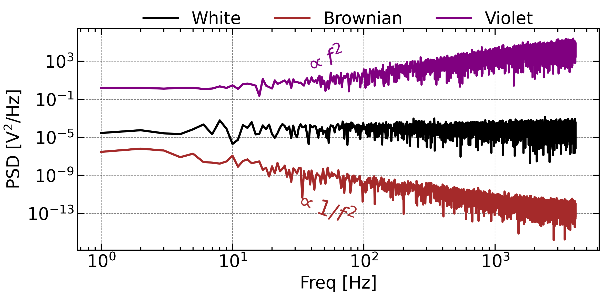
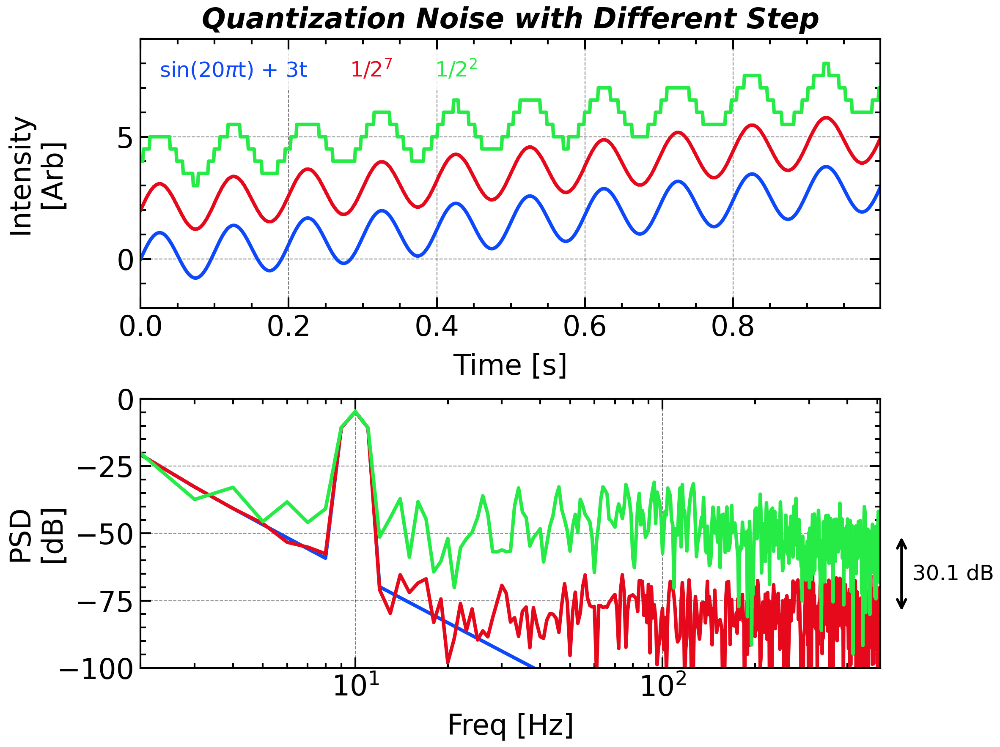
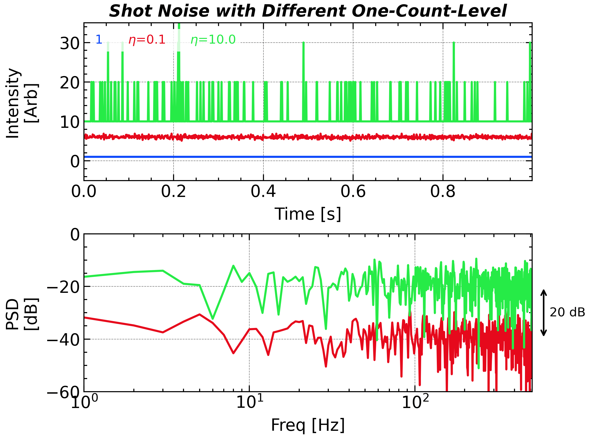
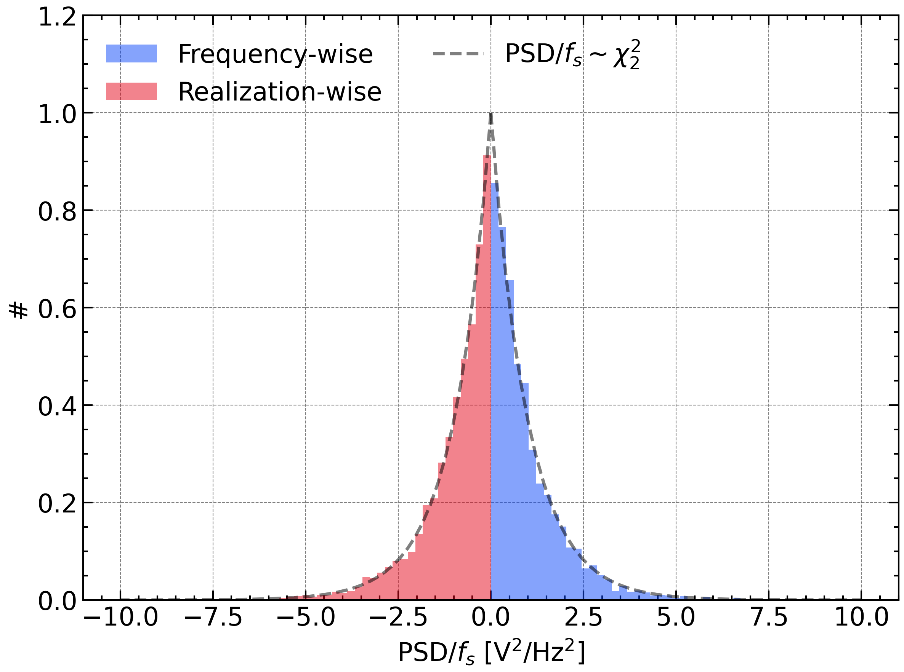
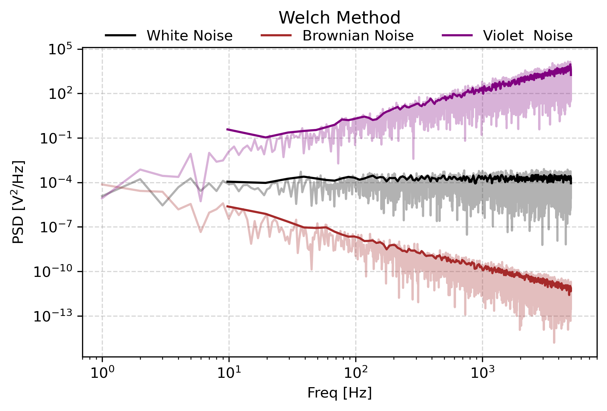
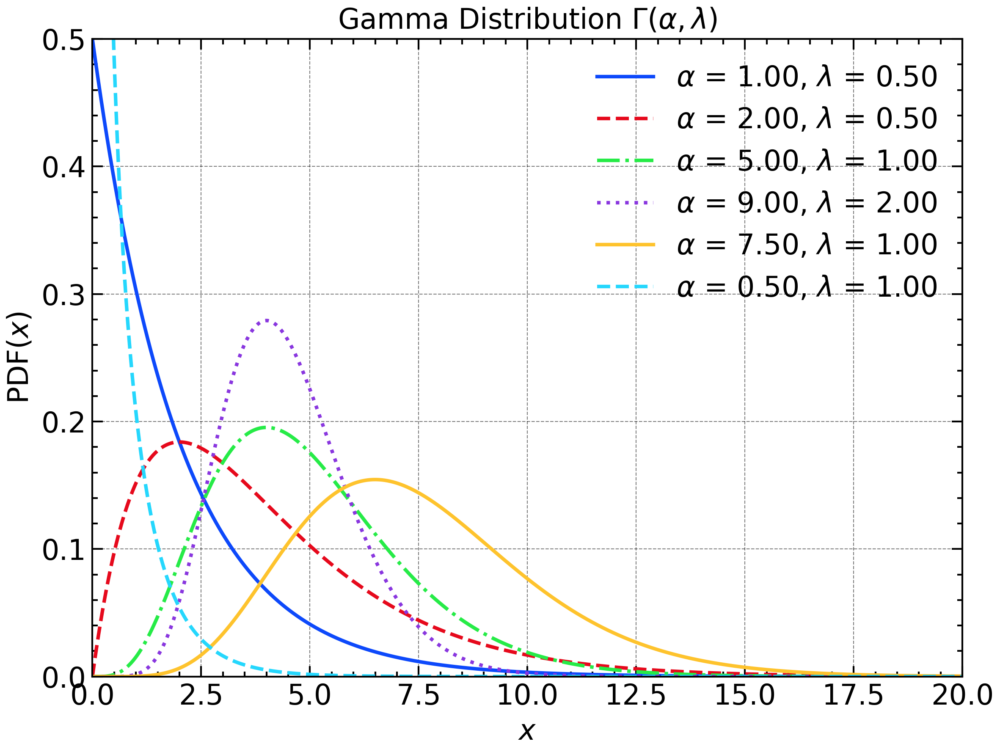
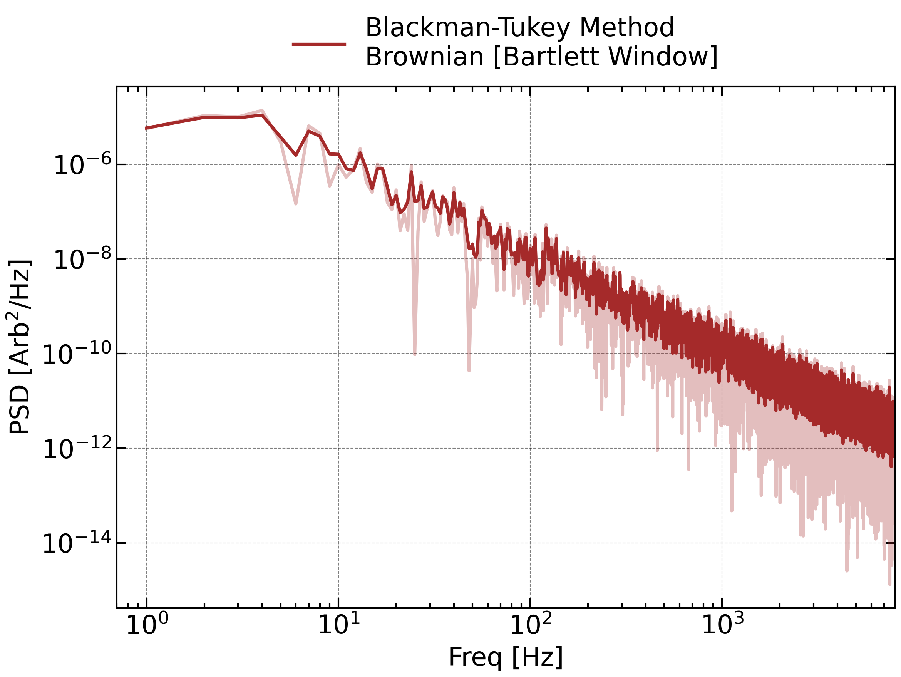
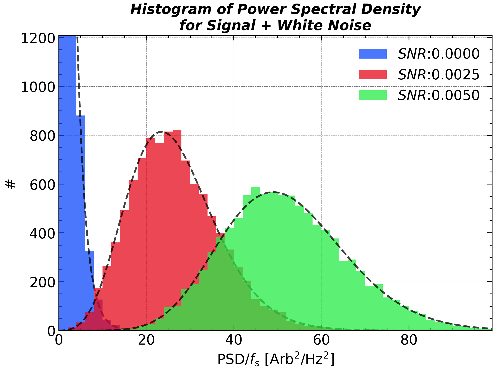

# Noise


> **[Lindeberg–Lévy Central Limit Theorem (CLT)](https://en.wikipedia.org/wiki/Central_limit_theorem):**  Suppose $X_1, X_2, X_3,...,X_n$ is a sequence of independent and identically distributed random variables with $\mathbb{E}(X)=\mu$ and $\mathbb{D}(X)=\sigma^2<\infty$. Then, as $n$ approaches infinity, the random variables $\sqrt{n}(\bar{X}_n-\mu)$ converge in distribution to a **normal (or Gaussian)** distribution:
$$
\sqrt{n}(\bar{X}_n-\mu) \mathrel {\overset {d}{\longrightarrow }} \mathcal{N}(0,\sigma^2)
$$
>  

**<u>*Central Limit Theorem*</u>** states that the sum of a large number of **independent random variables**, regardless of their individual distributions, will tend to follow a ***<u>Normal (Gaussian)</u>*** distribution. This principle underpins much of statistical analysis and signal processing. The requirement of independent and random variables is intrinsically related to the definition of noise.

## Description of Noise

Every real‑world measurement—whether from a spacecraft magnetometer, a seismometer, or a studio microphone—contains the desired signal plus unwanted fluctuations we lump together as **<u>*noise*</u>**. These fluctuations can originate from the sensor (thermal agitation, quantization), the environment (vibrations, electromagnetic interference) or the intrinsic randomness of the source.

A compact way to describe noise is by the **power-law index** of the $PSD(f) \propto 1/f^\beta$, $\mathbf{\beta}$, traditionally labeled with colors:

| Noise Color / Info | White | Pink | Brown (Red) | Blue | Violet |
|:------------------:|:-----:|:----:|:-----------:|:----:|:------:|
| $\beta$            | $\beta=0$ | $\beta=1$ | $\beta=2$ | $\beta=-1$ | $\beta=-2$ |
| Examples           | Thermal/electronic background | Music, biological rhythms | Brownian motion, accumulated random walks | Halftoning dither, mask design | GPS acceleration errors |


These color names condense how energy spreads across frequencies and guide filter choice, window length, and averaging strategies.

<!-- fig-tabset:figure_noise.png -->
::: {.panel-tabset}

### Figure



### Code

```python
import numpy as np
import matplotlib.pyplot as plt
import scienceplots
plt.style.use(['science', 'nature', 'notebook', 'grid', 'high-vis'])

%matplotlib ipympl
plt.close()

ax1 = plt.subplot(1, 1, 1)

N = 2 ** 13
t = np.linspace(0, 1, N, endpoint=False)
fs = 1 / (t[1] - t[0])
freq = np.fft.rfftfreq(len(t), t[1] - t[0])

noise_white = np.random.randn(t.size)

coef_white = np.fft.rfft(noise_white, axis=-1).T
psd_white = (np.abs(coef_white) ** 2) / fs / t.size

noise_brownian_fft = np.fft.rfft(np.random.randn(t.size))
noise_brownian_fft[1:] /= freq[1:] ** 1
noise_brownian_fft[0] = 0
noise_brownian = np.fft.irfft(noise_brownian_fft)

coef_brownian = np.fft.rfft(noise_brownian, axis=-1).T
psd_brownian = (np.abs(coef_brownian) ** 2) / fs / t.size

noise_violet_fft = np.fft.rfft(np.random.randn(t.size))
noise_violet_fft[1:] /= freq[1:] ** -1
noise_violet_fft[0] = 0
noise_violet = np.fft.irfft(noise_violet_fft)

coef_violet = np.fft.rfft(noise_violet, axis=-1).T
psd_violet = (np.abs(coef_violet) ** 2) / fs / t.size


freq, psd_white = scipy.signal.welch(noise_white, fs, nperseg=N)
freq, psd_brownian = scipy.signal.welch(noise_brownian, fs, nperseg=N)
freq, psd_violet = scipy.signal.welch(noise_violet, fs, nperseg=N)

ax1.plot(freq[1:], psd_white[1:], 'k-', label = 'White')
ax1.plot(freq[1:], psd_brownian[1:], color = 'brown', linestyle = '-', label = 'Brownian')
ax1.plot(freq[1:], psd_violet[1:], color = 'purple', linestyle = '-', label = 'Violet ')

ax1.set_yscale('log')
ax1.set_xscale('log')

ax1.legend(frameon = False, bbox_to_anchor = (0.5, 1.1), loc = 'upper center', ncol = 5)

ax1.set_xlabel('Freq [Hz]')
ax1.set_ylabel('PSD [$\mathrm{V^2/Hz}$]')

plt.tight_layout()

ax1.text(50, 1e2, '${\propto f^2}$', fontsize=20, rotation = 20, ha='center', va='center', color='purple', alpha=1.0)
ax1.text(50, 3e-12, '${\propto 1/f^{2}}$', fontsize=20, rotation = -20, ha='center', va='center', color='brown', alpha=1.0)
ax1.set_xlim(0.7, 8e3)

plt.savefig(save_path + 'figure_noise' + '.png',bbox_inches='tight',dpi=300)

plt.show()
```

:::

<p align = 'center'><i> Three types of colored noise.</i></p>


## Signal-to-Noise Ratio (SNR) and Decibels

**SNR** measures how clearly the signal emerges from noise:
$$
\mathrm{SNR} = \frac{P_{\text{signal}}}{P_{\text{noise}}}
$$
where $P_{\text{signal}}$ and $P_{\text{noise}}$ are the average powers of the signal and noise, respectively.

Because the ratio can span orders of magnitude, it is usually expressed in **decibels (dB)**:
$$
\mathrm{SNR}_{\mathrm{dB}} = 10 \log_{10} \left( \frac{P_{\text{signal}}}{P_{\text{noise}}} \right)
$$
For amplitude‑based measurements (root‑mean‑square values):
$$
\mathrm{SNR}_{\mathrm{dB}} = 20 \log_{10} \left( \frac{A_{\text{signal}}}{A_{\text{noise}}} \right)
$$

***Decibel Quick Reference***


|     Decibel     | -20  | -10    | -6                   | -3                           | -1    |  0   |   1   |             3              |         6         |  10   |  20  |
| :-------------: | ---- | ------ | -------------------- | ---------------------------- | ----- | :--: | :---: | :------------------------: | :---------------: | :---: | :--: |
| Amplitude Ratio | 0.1  | 0.3162 | 0.501 $\approx$ 1/2  | 0.708 $\approx$ $1/\sqrt{2}$ | 0.891 |  1   | 1.122 | 1.413 $\approx$ $\sqrt{2}$ | 1.995 $\approx$ 2 | 3.162 |  10  |
|   Power Ratio   | 0.01 | 0.1    | 0.251 $\approx$  1/4 | 0.501                        | 0.794 |  1   | 1.259 |           1.995            | 3.981 $\approx$ 4 |  10   | 100  |

Due to the fact that $2^{10}\approx10^3$, 3 dB corresponds to a energy ratio of $10^{3/10}=\sqrt[10]{1000}\approx \sqrt[10]{1024}=2$.

The adoption of decibel instead of the conventional physical unit has three advantage:

- It allows the directive addition when compare the amplitude of the signal.
- When you are not confident about the magnitude of the uncalibrated data, you can just use dB to describe the ambiguous intensity.
- The [***Weber–Fechner law***](https://en.wikipedia.org/wiki/Weber-Fechner_law) states that human perception of stimulus intensity follows a logarithmic scale, which is why decibels—being logarithmic units—are used to align physical measurements with human sensory sensitivity, such as in sound and signal strength.

## [Quantization Noise](https://en.wikipedia.org/wiki/Quantization_(signal_processing))

Quantization noise arises when a continuous-valued signal is mapped to discrete levels in an analog-to-digital converter (or by fixed-point rounding in digital signal processing). The difference between the true value $x$ and the quantized value $\Delta\cdot\lfloor {x}/{\Delta} + {1}/{2}\rfloor$  is the ***<u>quantization error</u>***, where $\Delta$ is the quantization step size.

For a uniform mid-tread quantizer with step size $\Delta$, and when the input is sufficiently “busy” (uncorrelated with the quantizer and exercising many codes), the error can be modeled as **additive white noise**, uniformly distributed on $[-\Delta/2,\,+\Delta/2]$. Such a addictive noise is white with a total power of $\sigma_q^2=\Delta^2/12$.  Therefore, the signal-to-quantization-noise ratio (SQNR) increases by **6.02 dB ($\approx 10\mathrm{log}_{10}2$)** for each additional bit of resolution.

The uniformly distributed requirement can be fulfilled by the full-amplitude triangle waves or sawtooth waves, or a fast temporal variation. For small or slowly varying signals, the error becomes correlated with the signal, leading to distortion and spurious tones.

<!-- fig-tabset:figure_quantization_noise.png -->
::: {.panel-tabset}

### Figure



### Code

```python
plt.close()
N = 2 ** 10

t = np.linspace(0, 1, N, endpoint=False)
dt = t[1] - t[0]
fs = 1 / dt
sig = np.sin(2 * np.pi * 10 * t) + 3 * t
# sig = t

plt.figure(figsize=figsize_normal)
ax1 = plt.subplot(2, 1, 1)
ax2 = plt.subplot(2, 1, 2)
ax1.plot(t, sig, label='sin(20$\pi$t) + 3t', color='C0')
freq, psd = scipy.signal.welch(sig, fs=fs, nperseg=N, window='hann')
ax2.plot(freq, 10 * np.log10(psd), label='Power Spectral Density', color='C0')

for i, N_BIT in enumerate([2, 7][::-1]):
    DELTA = 2 / (2 ** N_BIT)
    # sig_digitized = RANGE[np.digitize(sig - AMPLITUDE / 2 / N_DIGITS, RANGE)]
    sig_digitized = DELTA * np.round(sig / DELTA)
    ax1.plot(t, sig_digitized + (i + 1) * 2, linestyle = '-', label = f'1/2$^{N_BIT:d}$')

    freq, psd = scipy.signal.welch(sig_digitized, fs=fs, nperseg= N, window='hann')
    ax2.plot(freq, 10 * np.log10(psd), linestyle = '-')


ax1.set_title('Quantization Noise with Different Step', **title_font)

# ax2.loglog()
ax2.set_xscale('log')

ax1.set_ylim(-2, 9)
# ax2.set_ylim(1e-10, 1e0)
ax2.set_ylim(-100, 0)
ax2.set_xlim(2, 512)
ax1.legend(loc = 'upper left', ncol = 5, labelcolor="linecolor", handlelength = 0, handletextpad = 0, prop = {'weight': 'normal', 'size' : 12})
ax1.set_xlabel('Time [s]')
ax1.set_ylabel('Intensity\n[Arb]')
ax2.set_xlabel('Freq [Hz]')
ax2.set_ylabel('PSD\n[dB]')
# ax2.yaxis.set_minor_locator(ticker.LogLocator(base=10.0, numticks=50))
# ax2.yaxis.set_minor_formatter(ticker.NullFormatter())
ax1.autoscale(enable=True, axis='x', tight=True)
# ax2.autoscale(enable=True, axis='x', tight=True)

ax1.yaxis.set_label_coords(-0.1, 0.5)
ax2.yaxis.set_label_coords(-0.1, 0.5)
ax2.text(650, -65.05, '30.1 dB', fontsize=12, color='k', va = 'center')
ax2.annotate('', (600, -80.1), (600, -50), arrowprops=dict(arrowstyle='<->', lw=1.5), fontsize=12, color='k', ha='center', annotation_clip=False)
plt.tight_layout()

plt.savefig(save_path + 'figure_quantization_noise' + '.png', bbox_inches='tight', dpi=300)

plt.show()
```

:::
<p align = 'center'><i> Signals and power spectra for the sine waves with incresing background with different number of quantization bits.</i></p>

At lower amplitudes the quantization error becomes dependent on the input signal, resulting in distortion. This distortion is created after the anti-aliasing filter, and if these distortions are above 1/2 the sample rate they will alias back into the band of interest. In order to make the quantization error **independent** of the input signal, the signal is <u>***dithered***</u> by adding noise to the signal. This slightly reduces signal-to-noise ratio, but can completely eliminate the distortion.

## [Shot Noise](https://en.wikipedia.org/wiki/Shot_noise)

The uncertainty in the counting measurement create intrinsic randomness called **<u>*Shot noise (Schottky noise)*</u>**. Even with constant signal to be measured by counting the number of events, arrivals are [**<u>*Poisson-distributed*</u>**](https://en.wikipedia.org/wiki/Poisson_distribution), producing fluctuations.

$$
P(x;\lambda)=\frac{\lambda^x e^{-\lambda}}{x!}
$$
where $\lambda$ is the expected number of events in the interval, and $x$ is the actual number of events that occur. The mean and variance of the Poisson distribution are both equal to $\lambda$.

This noise is neither additive or multiplicative, but rather **signal-dependent**: its variance scales with the signal level. For a constant average rate $\bar{x}$, the shot noise power spectrum is white with total power $\sigma^2=\eta\bar{x}^2$ when using a detector with an one-count-level, $\eta$:
$$
\eta:=\frac{\mathrm{Signal\ Intensity}}{\mathbb{E}(\mathrm{Number\ of\ Events})}
$$


Thus, the $PSD$ noise level increases 10 dB for each 10-fold increase in signal intensity, corresponding to a 10-fold increase in the Poisson mean $\lambda$. 

<!-- fig-tabset:figure_shot_noise.png -->
::: {.panel-tabset}

### Figure



### Code

```python
plt.close()
N = 2 ** 10

t = np.linspace(0, 1, N, endpoint=False)
dt = t[1] - t[0]
fs = 1 / dt
m = 0.3
sig = (1 + m * np.sin(20 * np.pi * t))
sig = 1 + 0 * t
plt.figure(figsize=figsize_normal)
ax1 = plt.subplot(2, 1, 1)
ax2 = plt.subplot(2, 1, 2)
ax1.plot(t, sig, label='1', color='C0')
freq, psd = scipy.signal.welch(sig, fs=fs, nperseg=N, window='hann')
ax2.plot(freq, 10 * np.log10(psd), label='Power Spectral Density', color='C0')

sig[sig < 0] = 0
for i, DETECTION_EFFICIENCY in enumerate([.1, 10.0, ][::-1]):
    sig_digitized = np.random.poisson(sig * DETECTION_EFFICIENCY) / DETECTION_EFFICIENCY
    ax1.plot(t, sig_digitized + (i + 1) * 5, linestyle = '-', label = r'$\eta$=' + f'{1/DETECTION_EFFICIENCY}')

    freq, psd = scipy.signal.welch(sig_digitized, fs=fs, nperseg=N, window='hann')
    ax2.plot(freq, 10 * np.log10(psd), linestyle = '-', label = f'{DETECTION_EFFICIENCY}')
    print(np.mean(psd) / (2 / DETECTION_EFFICIENCY / fs))
ax1.set_title('Shot Noise with Different One-Count-Level', **title_font)

# ax2.loglog()
ax2.set_xscale('log')
ax2.set_ylim(-60, 0)
ax1.set_ylim(-5, 35)
# ax2.set_ylim(1e-8, 1e-1)

ax1.legend(loc = 'upper left', ncol = 5, labelcolor="linecolor", handlelength = 0, handletextpad = 0, prop = {'weight': 'normal', 'size' : 12})
ax1.set_xlabel('Time [s]')
ax1.set_ylabel('Intensity\n[Arb]')
ax2.set_xlabel('Freq [Hz]')
# ax2.set_ylabel('PSD\n[Arb$^2$/Hz]')
ax2.set_ylabel('PSD\n[dB]')
# ax2.yaxis.set_minor_locator(ticker.LogLocator(base=10.0, numticks=50))
# ax2.yaxis.set_minor_formatter(ticker.NullFormatter())
ax1.autoscale(enable=True, axis='x', tight=True)
ax2.autoscale(enable=True, axis='x', tight=True)

ax1.yaxis.set_label_coords(-0.1, 0.5)
ax2.yaxis.set_label_coords(-0.1, 0.5)

ax2.text(650, -30, '20 dB', fontsize=12, color='k', va = 'center')
ax2.annotate('', (600, -40), (600, -20), arrowprops=dict(arrowstyle='<->', lw=1.5), fontsize=12, color='k', ha='center', annotation_clip=False)

plt.tight_layout()

plt.savefig(save_path + 'figure_shot_noise' + '.png', bbox_inches='tight', dpi=300)

plt.show()
```

:::
<p align = 'center'><i> Shot noise for a constant signal with different one-count-level.</i></p>

A more general signal model consists of a constant background $a$ plus a time-varying component $b\cdot\mathrm{sin}(\omega t)$:

$$
x(t)=a+b\cdot\mathrm{sin}(\omega t)
$$
In such case, the high frequency part of the power spectrum is still white, but with a total power $\sigma^2=\eta(a+b^2/2)$ that depends on the average signal level. While, the power at the frequency $\omega$ is boosted by the sinusoidal component, standing out from the white noise floor.


------

## Artificial Noise Generation `np.random.randn`

Colored noise can be generated by manipulating the Fourier coefficients of white noise. The following code snippet demonstrates how to create Brownian (red) noise and Violet noise from white noise using NumPy:

```python
white_noise = np.random.randn(time.size)

brownian_noise_fft = np.fft.rfft(white_noise)
brownian_noise_fft[1:] /= freq[1:] ** 1
brownian_noise_fft[0] = 0
brownian_noise = np.fft.irfft(brownian_noise_fft)

violet_noise_fft = np.fft.rfft(white_noise)
violet_noise_fft[1:] /= freq[1:] ** -1
violet_noise_fft[0] = 0
violet_noise = np.fft.irfft(violet_noise_fft)
```

Besides these two methods, one can also get colored noise by filtering white noise. A colored noise that accurately follows its expected power spectrum requires the order of the filter to be high enough. Even though this method is not as straightforward as the Fourier method, it is more efficient in terms of computation time and memory usage.

------

## [Autoregressive (AR) Model](https://en.wikipedia.org/wiki/Autoregressive_model)

Apart from the completely randomness, many real-world disturbances carry just a hint of “inertia”: the next value mostly echoes the present one, plus a fresh random jolt. Such behavior is well captured by a first-order **<u>*autoregressive model*</u>**:
$$
x[n]=\varphi x[n-1] + \mathcal{N}(0,1)
$$
whose single coefficient $\varphi$ sets the memory length. When $\varphi=0$ the series is white noise; as $\varphi\to1^{-}$ it approaches an integrated (Brownian) path with power piling up at low frequencies. 

<p align = 'center'></p>
<p align = 'center'><i> AR1 Time series with different AR1 coefficient (alpha = 0.10, 0.90, and 0.99).</i></p>

The spectrum makes this clear:
$$
\mathbb{E}[PSD(f)]=\frac{\sigma^2(1-\varphi^2)}{1+\varphi^2-2\varphi \mathrm{cos}(2\pi f/f_s)}
$$

which is flat for $\varphi=0$ and climbs like $1/f^{2}$ near $f=0$ for $\varphi\approx1$. Thus AR1 offers the simplest realistic noise model—white at one extreme, red at the other—while remaining easy to simulate and fit.

The $$\varphi$$ parameter can be estimated by the lag-1 autocorrelation of the time series. 
$$
\varphi = \frac{\sum_{n=0}^{N-2}(x[n]-\bar{x})(x[n+1]-\bar{x})}{\sum_{n=0}^{N-1}(x[n]-\bar{x})^2}
$$
The AR model is naturally linked to the high-order dynamic system: For example, a second order ordinary differential equation can be discretized as:
$$
\frac{\mathrm{d}^2x}{\mathrm{d}t^2}=kx\to \frac{x[n]-2x[n-1]+x[n-2]}{\Delta t^2}=kx[n-1]
$$
The right-hand side can be re-arranged as
$$
x[n]=(2+k\Delta t^2)x[n-1]-x[n-2]
$$

$$
x[n]=\varphi_1 x[n-1]+\varphi_2 x[n-2]+\mathcal{N}(0,1)
$$


## Null Hypothesis In the Signal Interpretation

When you see a peak in the Fourier spectrum, you may want to know whether it is a real signal or just a random fluctuation of the noise. To answer this question, you need to set up a null hypothesis that the time series is purely noise, and then calculate the probability of observing such a peak (or higher) under this hypothesis. If this probability (the p-value) is very low, you can reject the null hypothesis and conclude that the peak is likely a real signal.

## "Noise"(Uncertainty) of Noise
From the power spectra of noises, one can see that the PSD of the generated noise may randomly deviates from the theoretical expectation, i.e., the exactly power-law PSD. 

The Fourier coefficient computed as 
$$
\begin{align*}

X[k]:=\sum_0^{N-1}x[n]\mathrm{e}^{\mathit{i}2\pi  n k}

\end{align*}
$$
can be deemed as a <u>**weighted summation**</u> of the signal $x[n]$. When $x[n]$ are independent identically distributed (*i.i.d*) random variables, their weighted summation approaches the Normal distribution when *N* is large enough, according to the ***Central Limit Theorem***. Thus, the *PSD*, defined as the square sum of the real and imaginary parts, naturally follows the *Kappa* Distribution with the freedom of 2. The above statement requires that he real and imaginary parts are independent to each other, which can be proved by calculating their covariance.


<!-- fig-tabset:figure_noise_hist.png -->
::: {.panel-tabset}

### Figure



### Code

```python
import numpy as np
import matplotlib.pyplot as plt
import scienceplots
plt.style.use(['science', 'nature', 'notebook', 'grid', 'high-vis'])

%matplotlib ipympl
plt.close()
plt.figure(figsize=single_panel_figsize)

ax1 = plt.subplot(1, 1, 1)

N = 2 ** 13
t = np.linspace(0, 1, N, endpoint=False)
fs = 1 / (t[1] - t[0])
freq = np.fft.rfftfreq(len(t), t[1] - t[0])

noise_white = np.random.randn(t.size)

coef_white = np.fft.rfft(noise_white, axis=-1).T
psd_white = (np.abs(coef_white) ** 2) / fs / t.size

bins = np.linspace(0, 10, 50)

ax1.hist(psd_white[1:] * fs , bins=bins, color='C0', alpha=0.75, density = True, label = f'Frequency-wise')

N_SAMPLE = int(t.size / 2)
psd_white_at_100_Hz = np.zeros(N_SAMPLE)
for i in range(N_SAMPLE):
    noise_white = np.random.randn(t.size)

    coef_white = np.fft.rfft(noise_white, axis=-1).T
    psd_white = (np.abs(coef_white) ** 2) / fs / t.size
    psd_white_at_100_Hz[i] = psd_white[100 + 1]

ax1.hist(-psd_white_at_100_Hz * fs, bins=-bins[::-1], color='C1', alpha=0.75, density = True, label = 'Realization-wise')

ax1.plot(bins, 1 * np.exp(-bins), 'k--', alpha = 0.5, zorder = 1, label = 'PSD/$f_s \sim \chi_2^2$')
ax1.plot(-bins, 1 * np.exp(-bins), 'k--', alpha = 0.5, zorder = 1)


for ax in [ax1]:

    ax.legend(frameon = False, loc = 'upper left', ncol = 2)

    ax.set_xlabel('PSD/$f_s$ [$\mathrm{V^2/Hz^2}$]')
    ax.set_ylabel('#')

ax1.set_ylim(0, 1.2)
ax1.set_title('Histogram of Power Spectral Density\nfor White Noise', **title_font)
plt.tight_layout()

plt.savefig(save_path + 'figure_noise_hist' + '.png',bbox_inches='tight',dpi=300)

plt.show()
```

:::

### Significance Level

A Fourier spectrum always has some peaks no matter the signal is really periodic or totally random. It is of course not appreciated if you interpret a random Fourier peak as a sign of periodicity. 

The ***significance level*** comes out for the assessment of these Fourier power peak. It uses the hypothesis testing to testify whether the peak is significance. The null hypothesis is that 
$$
x[n]\sim N(\mu, \sigma)
$$
Thus, the power spectral density follows the exponential distribution $PSD/S(f)\sim \chi_2^2$. The $95\%$ and $99\%$ percentile of this distribution is $2.995$ and $4.605$, respectively. Therefore, 95% and 99% significance level of the PSD is $2.995\sigma$ and $4.605\sigma$.

### Welch Method [`scipy.signal.welch`]
Welch proposed that the averaging the power spectral density instead of the coefficient can largely reduce the flutuation levels of the spectrum. Therefore, we may just get a.

The averaging operation must be taken after the conversion from coefficient to power other wise the averaged coefficients are actually unchanged.

This method can be implemented by `scipy.signal.welch` function:

```python
freq, psd = scipy.signal.welch(sig, fs, window = 'hann', nperseg=2 ** 10)
```

Except for averaging, one can also  choose the median of the PSD across different segements and obtain a less disturbed PSD. This choice can be implemented by `scipy.signal.welch(signal, fs, average = 'median')`. The default parameter for `average` is `mean`, corresponding to the normal Welch method.

For each segement, you can also chose the window function to reduce the spectral leakage. The result of this method is shown below:

<!-- fig-tabset:figure_noise_welch.png -->
::: {.panel-tabset}

### Figure



### Code

```python
import numpy as np
import matplotlib.pyplot as plt
import scienceplots
plt.style.use(['science', 'nature', 'notebook', 'grid', 'high-vis'])

%matplotlib ipympl
plt.close()
plt.cla()
plt.clf()
# plt.figure(figsize=figsize_short)
ax1 = plt.subplot(1, 1, 1)

N = 2 ** 14
t = np.linspace(0, 1, N, endpoint=False)
fs = 1 / (t[1] - t[0])
freq = np.fft.rfftfreq(len(t), t[1] - t[0])

N_PER_SEG = 2 ** 13
window = 'boxcar'
noise_white = np.random.randn(t.size)

coef_white = np.fft.rfft(noise_white, axis=-1).T
psd_white = (np.abs(coef_white) ** 2) / fs / t.size
psd_white[1:] *= 2  # Adjust for one-sided spectrum

freq_welch, psd_white_welch = scipy.signal.welch(noise_white, fs, window = window, nperseg=N_PER_SEG)

noise_brownian_fft = np.fft.rfft(np.random.randn(t.size))
noise_brownian_fft[1:] /= freq[1:] ** 1
noise_brownian_fft[0] = 0
noise_brownian = np.fft.irfft(noise_brownian_fft)

coef_brownian = np.fft.rfft(noise_brownian, axis=-1).T
psd_brownian = (np.abs(coef_brownian) ** 2) / fs / t.size
psd_brownian[1:] *= 2  # Adjust for one-sided spectrum

freq_welch, psd_brownian_welch = scipy.signal.welch(noise_brownian, fs, window = window, nperseg=N_PER_SEG)

noise_violet_fft = np.fft.rfft(np.random.randn(t.size))
noise_violet_fft[1:] /= freq[1:] ** -1
noise_violet_fft[0] = 0
noise_violet = np.fft.irfft(noise_violet_fft)

coef_violet = np.fft.rfft(noise_violet, axis=-1).T
psd_violet = (np.abs(coef_violet) ** 2) / fs / t.size
psd_violet[1:] *= 2  # Adjust for one-sided spectrum

# freq, psd_violet = scipy.signal.welch(noise_violet, fs, window = window, nperseg=N)

freq_welch, psd_violet_welch = scipy.signal.welch(noise_violet, fs, window = window, nperseg=N_PER_SEG)

ax1.plot(freq[1:], psd_white[1:], 'k-', alpha = 0.3)
ax1.plot(freq[1:], psd_brownian[1:], color = 'brown', linestyle = '-', alpha = 0.3)
ax1.plot(freq[1:], psd_violet[1:], color = 'purple', linestyle = '-', alpha = 0.3)

ax1.plot(freq_welch[1:], psd_white_welch[1:], 'k-', label = 'White')
ax1.plot(freq_welch[1:], psd_brownian_welch[1:], color = 'brown', linestyle = '-', label = 'Brownian')
ax1.plot(freq_welch[1:], psd_violet_welch[1:], color = 'purple', linestyle = '-', label = 'Violet ')

ax1.set_yscale('log')
ax1.set_xscale('log')

ax1.yaxis.set_major_locator(ticker.LogLocator(base=10.0, subs='all', numticks=6))
ax1.yaxis.set_minor_locator(ticker.LogLocator(base=10.0, subs='all', numticks=100))
ax1.yaxis.set_minor_formatter(ticker.NullFormatter())
ax1.legend(frameon = False, bbox_to_anchor = (0.5, 1.10), loc = 'upper center', ncol = 5)

ax1.set_xlabel('Freq [Hz]')
ax1.set_ylabel('PSD [$\mathrm{Arb^2/Hz}$]')


ax1.set_xlim(0.7, 8e3)

ax1.set_title('Welch Method', y = 1.05, **title_font)
plt.tight_layout()

plt.savefig(save_path + 'figure_noise_welch' + '.png',bbox_inches='tight',dpi=300)

plt.show()
```

:::


One can also verify that the distribution of the PSD convert to *Gamma* Distribution, which has a ***Probability Density Function (PDF)*** of:

$$
\begin{align*}
PDF(x; \alpha, \lambda)=\frac{\lambda^\alpha}{\Gamma(\alpha)} x ^{\alpha - 1} e^{-\lambda x}
\end{align*}
$$

The mean and variance of this distribution is $\alpha/\lambda$ and $\alpha / \lambda^2$. When the number of segments ($\alpha$) decrease/increase to 1/$+\infty$, the Gamma distribution degenerate to exponential/normal distribution.

<!-- fig-tabset:figure_gamma_distribution.png -->
::: {.panel-tabset}

### Figure



### Code

```python
import numpy as np
import matplotlib.pyplot as plt
import scipy.special
import scipy.stats
import scienceplots
plt.style.use(['science', 'nature', 'notebook', 'grid', 'high-vis'])

%matplotlib ipympl
plt.close()

plt.figure(figsize=single_panel_figsize)
ax1 = plt.subplot(1, 1, 1)
sig = np.linspace(0, 20, 100000, endpoint=False)

parameters = [(1.0, 2.0), (2.0, 2.0), (5.0, 1.0), (9.0, 0.5), (7.5, 1.0), (0.5, 1.0)]
colors = ['r', 'orange', 'yellow', 'lime', 'k', 'blue', 'm']

for i in np.arange(len(parameters)):
    alpha = parameters[i][0]
    theta = parameters[i][1]
    color = colors[i]
    pdf = scipy.stats.gamma.pdf(sig, alpha, 0, theta)
    pdf[pdf == 0] = np.nan
    # ax1.plot(x, pdf, color = color, linestyle = '-', label = r"$\alpha$ = %.2f, $\lambda$ = %.2f" % (alpha, 1 / theta))
    ax1.plot(sig, pdf, color = f"C{i}", label = r"$\alpha$ = %.2f, $\lambda$ = %.2f" % (alpha, 1 / theta))

ax1.legend(frameon = False, loc = 'upper right')

ax1.set_ylim(0, 0.5)
ax1.set_xlim(0, 20)

ax1.set_xlabel('$x$')
ax1.set_ylabel(r'PDF(${x}$)')

ax1.set_title(r'Gamma Distribution $\Gamma(\alpha,\lambda)$')

plt.tight_layout()

plt.savefig(save_path + 'figure_gamma_distribution' + '.png',bbox_inches='tight',dpi=300)

plt.show()
```

:::


In ***Bartlett Method***, the ratio of ``N_STEP`` and ``N_PER_SEG`` is fixed at unity, which means every segement has no overlapping with each other. It can be regarded as a special case of the *Welch Method* while it is actually proposed earlier.

### Blackman-Tukey Method

***Blackman-Tukey method*** gives another approach to a high SNR estimation of *PSD* based on the *W.S.S* properties of the signal and *Wiener–Khinchin theorem*. This method consists of three steps:

1. Calculate the (***double-sided***) ACF of the signal
2. Apply a window function to the ACF
3. Do DFT to the windowed ACF.


It should be keep in mind that these methods are all build based on the assumption of wide-sense stationarity of the signal.[Explain WSS here]. A noise signal, no matter its color, is wide-sense stationary. However, a real time series of a physics quantity cannot gurantee its wide-sense stationarity. Since W.S.S is the only presumption of these method, they are also termed ***Nonparametric Estimator***.

Apart from splitting the signal into several segments, one can also downsample the signal and get multiple sub-signal with different startup time. However, the maximum frequency of the yield spectrum will also be reduced by a factor of ``N_DOWNSAMPLE``. At the same time, the frequency resolution remains to be $(N\Delta t)^{-1}$. 

<!-- fig-tabset:figure_noise_blackman_tukey.png -->
::: {.panel-tabset}

### Figure



### Code

```python
import numpy as np
import matplotlib.pyplot as plt
import scipy.signal
import scienceplots

plt.style.use(['science', 'nature', 'notebook', 'grid', 'high-vis'])

%matplotlib ipympl
plt.close()
plt.cla()
plt.clf()
ax1 = plt.subplot(1, 1, 1)

N = 2 ** 14
t = np.linspace(0, 1, N, endpoint=False)
dt = t[1] - t[0]
fs = 1 / dt
freq = np.fft.rfftfreq(len(t), t[1] - t[0])

noise_white = np.random.randn(t.size)
coef_white = np.fft.rfft(noise_white, axis=-1).T
psd_white = (np.abs(coef_white) ** 2) / fs / t.size

noise_brownian_fft = np.fft.rfft(np.random.randn(t.size))
noise_brownian_fft[1:] /= freq[1:] ** 1
noise_brownian_fft[0] = 0
noise_brownian = np.fft.irfft(noise_brownian_fft)

freq, psd_brownian = scipy.signal.welch(noise_brownian, fs, window = 'boxcar', nperseg=N)

ax1.plot(freq[1:], psd_brownian[1:], color = 'brown', linestyle = '-', alpha = 0.3)

acf = np.correlate(noise_brownian, noise_brownian, mode='full') / N  # unbiased normalization
acf *= np.bartlett(len(acf))

# From single-sided to two-sided
acf = 2 * acf[acf.size // 2:]
acf[0] *= 0.5

psd = 2 * np.real(np.fft.rfft(acf)) / fs
freq = np.fft.rfftfreq(len(acf), dt)

ax1.plot(freq[1::], psd[1::], 'brown', label = 'Blackman-Tukey Method\nBrownian [Bartlett Window]')

ax1.set_yscale('log')
ax1.set_xscale('log')

ax1.legend(frameon = False, bbox_to_anchor = (0.5, 1.18), loc = 'upper center', ncol = 5)

ax1.set_xlabel('Freq [Hz]')
ax1.set_ylabel('PSD [$\mathrm{Arb^2/Hz}$]')

plt.tight_layout()

ax1.set_xlim(0.7, 8e3)

# ax1.set_title('Welch Method', y = 1.05)
plt.savefig(save_path + 'figure_noise_blackman_tukey' + '.png',bbox_inches='tight',dpi=300)

plt.show()
```

:::


## Signal Over Noise

A signal composed of a deterministic sinusoidal component $s(t)$ and additive noise $n(t)$ can be written as:
$$
x(t) = s(t) + n(t)
$$
Correspondingly, the Fourier coefficient at frequency $f$ is the sum of the signal and noise components::
$$
{X}(f) = {S}(f) + {N}(f)
$$
where ${S}(f)$ is the deterministic signal component (a fixed complex number), and ${N}(f)$ is the Fourier transform of the noise. If the noise $n(t)$ is zero-mean wide-sense stationary, then:
$$
\tilde{N}(f) \sim \mathcal{CN}(0, \sigma_n^2)
$$
That is, ${X}(f)$ is a complex Gaussian random variable:
$$
{X}(f) \sim \mathcal{CN}(\mu, \sigma_n^2), \quad \mu = {S}(f)
$$
The power spectrum estimate is:
$$
{S}_x(f) = |{X}(f)|^2
$$
Since $|{X}(f)|^2$ is the sum of squares of two independent Gaussian variables (real and imaginary parts), it strictly follows a non-central chi-squared distribution:
$$
{S}_x(f) \sim \sigma_n^2 \cdot \chi^2(2, \lambda), \quad \lambda = \frac{|\mu|^2}{\sigma_n^2}
$$
In other words, the deterministic signal provides a **complex offset** (mean $\mu$), and the noise determines the **variance** $\sigma_n^2$. The resulting power spectrum estimate is exactly a **<u>non-central chi-squared distribution</u>** with 2 degrees of freedom.

<!-- fig-tabset:figure_signal_over_noise_hist.png -->
::: {.panel-tabset}

### Figure



### Code

```python
import numpy as np
import matplotlib.pyplot as plt
import scipy.stats
import scienceplots
plt.style.use(['science', 'nature', 'notebook', 'grid', 'high-vis'])

%matplotlib ipympl
plt.close()
ax1 = plt.subplot(1, 1, 1)

N = 10000

t = np.linspace(0, 1, N, endpoint=False)
fs = 1 / (t[1] - t[0])

omega = 2 * np.pi * 100
freq = np.fft.rfftfreq(len(t), t[1] - t[0])
freq_idx = np.where(freq == omega / (2 * np.pi))[0][0]

bins = np.linspace(0, 400.0, 200, endpoint=False)
bin_width = bins[1] - bins[0]
fined_bins = np.linspace(0, 400, 20000)[1:]


N_SAMPLE = 10000
psd_at_wave_frequency = np.zeros(N_SAMPLE)
amp_signal = [0.00, 0.07, 0.10]
amp_noise = [1.00, 1.00, 1.00]

for i in range(3):
    for j in range(N_SAMPLE):
        sig = amp_signal[i] * np.sin(omega * t) + amp_noise[i] * np.random.randn(t.size)
        _, psd = scipy.signal.welch(sig, fs, window='boxcar', nperseg=N)
        psd_at_wave_frequency[j] = psd[freq_idx]
    ax1.hist(psd_at_wave_frequency * fs, bins = bins, alpha=0.75, label = "$\mathit{SNR}$:" + f"{(amp_signal[i] / amp_noise[i]) ** 2 / 2:.4f}")
    # ax1.hist(psd_at_wave_frequency * fs, bins = bins, alpha=0.75)

    # fit_result = scipy.stats.ncx2.fit(psd_at_wave_frequency * fs, method = 'MLE', fdf = 2, floc = 0)
    # print(fit_result)
    # ax1.plot(fined_bins, N_SAMPLE * bin_width * scipy.stats.ncx2.pdf(fined_bins, *fit_result), 'k--', alpha = 0.75, zorder = 1)
    # (x, df, nc, loc, scale)
    nc = (amp_signal[i] ** 2 / 2) * N
    scale = amp_noise[i] ** 2
    # print(nc, scale)
    ax1.plot(fined_bins, N_SAMPLE * bin_width * scipy.stats.ncx2.pdf(fined_bins, df = 2, nc = nc, loc = 0, scale = scale), 'k--', alpha = 0.75, zorder = 1)
    
ax1.legend(frameon = False, loc = 'upper right', ncol = 1)

ax1.set_xlabel('PSD/$f_s$ [$\mathrm{Arb^2/Hz^2}$]')
ax1.set_ylabel('#')

# ax1.set_xlim(0, 68)
# ax1.set_yscale('symlog', linthresh = 1e1)
# ax1.set_ylim(1e0, 1e4)

ax1.set_ylim(0, 1210)
ax1.set_xlim(0, 99)

# ax1.set_title('Signal Over Noise PSD', **title_font)
ax1.set_title('Histogram of Power Spectral Density\nfor Signal + White Noise', **title_font)

plt.tight_layout()
plt.savefig(save_path + 'figure_signal_over_noise_hist' + '.png',bbox_inches='tight',dpi=300)

plt.show()
```

:::


## Application: Solar-Wind Turbulence Spectrum

Power-law noise has a spectacular real-world counterpart. The **solar wind** — the magnetized plasma streaming out of the Sun — is in a state of fully developed **turbulence**. Magnetometers carried by spacecraft such as *Wind*, *Cluster*, and *Parker Solar Probe* measure a magnetic-field power spectrum that spans roughly six decades in frequency and breaks naturally into a sequence of power-law ranges. The classic broadband picture is reviewed by [Verscharen, Klein & Maruca (2019)](https://doi.org/10.1007/s41116-019-0021-0), *The Multi-Scale Nature of the Solar Wind* (Living Rev. Sol. Phys. **16**, 5), whose canonical trace spectrum we reproduce here.

No single instrument can cover the whole range, so the canonical picture (Fig. 19 of the review) is a **composite** stitched together from several spacecraft and interval lengths — here *ACE* MFI over 58 days and 51 hours for the lowest frequencies, and *Cluster* FGM and STAFF-SC over one hour for the highest. Together they reveal three power-law ranges:

- an **energy-injection ("$1/f$") range** at the lowest frequencies, with slope near $f^{-1}$, where large-scale energy is fed into the system;
- an **inertial range** with the celebrated Kolmogorov slope $f^{-5/3}$, where energy cascades scale-by-scale without being dissipated. (Whether the magnetic inertial range follows the Kolmogorov $-5/3$ or the Iroshnikov–Kraichnan $-3/2$ exponent is a long-standing debate; *in situ* magnetic spectra cluster close to $-5/3$, while the velocity spectrum often sits nearer $-3/2$.)
- a **dissipation (kinetic) range** beyond the **ion-scale break**, where the spectrum steepens to the near-universal slope $f^{-2.8}$ (Alexandrova et al. 2009).

The transitions line up with characteristic plasma scales (shown as vertical lines): the correlation-scale frequency $f_{\tau_\mathrm{c}}$ ends the injection range, the proton inertial length $f_{d_\mathrm{p}}$ and gyroradius $f_{\rho_\mathrm{p}}$ mark the ion break, and the electron scales $f_{d_\mathrm{e}}$, $f_{\rho_\mathrm{e}}$ sit at the high-frequency end.

We reproduce the figure with a single **model spectrum** — the piecewise power law $f^{-1}\!\to\!f^{-5/3}\!\to\!f^{-2.8}$, continuous across the breaks — sampled the way each instrument would see it. A single-realization **periodogram** scatters about the true PSD as $S(f)\cdot\mathrm{Exp}(1)$ (the exponential law from the [previous section](#noiseuncertainty-of-noise)), which is exactly what gives each segment its characteristic noisy band.

<!-- fig-tabset:figure_solar_wind_turbulence.png -->
::: {.panel-tabset}

### Figure


### Code

```python
import numpy as np
import matplotlib.pyplot as plt
import scienceplots
import matplotlib.ticker as ticker
plt.style.use(['science', 'nature'])          # serif, no grid (match the reference)

rng = np.random.default_rng(7)

# ---- one underlying model spectrum: -1 / -5/3 / -2.8, continuous at the breaks ----
f_tau = 1.5e-4     # correlation-scale frequency  (injection -> inertial)
f_ion = 0.4        # ion-scale break              (inertial -> dissipation)
A1 = 3.0           # sets the -1 range:  P = A1 / f   (P(1e-6) = 3e6)

def target_psd(f):
    f = np.asarray(f, float)
    P = A1 / f
    C1 = A1 * f_tau ** (5/3 - 1)
    m = f >= f_tau; P[m] = C1 * f[m] ** (-5/3)
    C2 = C1 * f_ion ** (2.8 - 5/3)
    m = f >= f_ion; P[m] = C2 * f[m] ** (-2.8)
    return P

# ---- four "instruments": each samples the same spectrum over its own band ----
# a single-realization periodogram scatters about the true PSD as S(f)*Exp(1)
def periodogram(fs, T, band, color, label):
    N = int(round(T * fs))
    f = np.fft.rfftfreq(N, 1 / fs)[1:]
    S = target_psd(f) * rng.exponential(1.0, f.size)
    m = (f >= band[0]) & (f <= band[1])
    return f[m], S[m], color, label

DAY = 86400.0
segs = [
    periodogram(1/240, 58*DAY, (1e-6, 2.5e-4), '#2b3fd0', 'ACE MFI (58 days)'),
    periodogram(0.5,   51*3600, (1.2e-4, 1.2e-1), '#e8000b', 'ACE MFI (51 hours)'),
    periodogram(22.0,  3600,    (7e-2, 1.3),       '#1a9a1a', 'Cluster FGM (1 hour)'),
    periodogram(100.0, 3600,    (0.8, 50.0),       '#b06fd8', 'Cluster STAFF-SC (1 hour)'),
]

# ---- figure ----
plt.close()
fig, ax = plt.subplots(figsize=(7.2, 5.0))

for f, S, color, label in segs:
    ax.loglog(f, S, color=color, lw=0.5, alpha=0.9, label=label)

# black power-law guide lines (the three ranges)
gg = np.array([1e-6, f_tau, f_ion, 60.0])
fg = np.logspace(-6, np.log10(55), 600)
ax.loglog(fg, target_psd(fg), color='k', lw=1.1, zorder=6)

ax.set_xlim(1e-6, 6e1)
ax.set_ylim(1e-10, 1e8)
ax.set_xlabel('Frequency (Hz)')
ax.set_ylabel(r'Power Spectral Density (nT$^2$ Hz$^{-1}$)')
ax.xaxis.set_major_locator(ticker.LogLocator(base=10, numticks=20))
ax.yaxis.set_major_locator(ticker.LogLocator(base=10, numticks=20))

# slope labels along the guide line
ax.text(8e-6, 4e3, r'$f^{-1}$', fontsize=12)
ax.text(8e-3, 2e0, r'$f^{-5/3}$', fontsize=12)
ax.text(6.0,  6e-8, r'$f^{-2.8}$', fontsize=12)

# characteristic-scale vertical lines
tr = ax.get_xaxis_transform()   # x in data coords, y in axes coords
def vline(fx, color, ls, name, ytxt):
    ax.axvline(fx, color=color, ls=ls, lw=1.0, zorder=2)
    ax.text(fx, ytxt, name, color=color, fontsize=9, ha='center', va='bottom',
            transform=tr)
vline(f_tau, '#2b3fd0', '-.', r'$f_{\tau_\mathrm{c}}$', 1.005)
vline(0.40,  '#e8000b', '--', r'$f_{d_\mathrm{p}}$',    1.06)
vline(0.50,  '#ff8c00', '--', r'$f_{\rho_\mathrm{p}}$', 1.005)
vline(20.0,  '#999999', ':',  r'$f_{d_\mathrm{e}}$',    1.06)
vline(45.0,  '#ff8c00', '-.', r'$f_{\rho_\mathrm{e}}$', 1.005)

# range labels across the top
for xc, name in [(1.2e-5, 'Injection Range'), (4e-3, 'Inertial Range'),
                 (6.0, 'Dissipation Range')]:
    ax.text(xc, 1.13, name, ha='center', va='bottom', fontsize=11, transform=tr)

ax.legend(frameon=False, loc='lower left', fontsize=9, handlelength=1.4)
fig.subplots_adjust(top=0.88)

plt.savefig(save_path + 'figure_solar_wind_turbulence' + '.png', bbox_inches='tight', dpi=300)
plt.show()
```

:::
<p align = 'center'>
<i>Reproduction of Fig. 19 of Verscharen, Klein &amp; Maruca (2019): the composite solar-wind magnetic power spectrum from <i>ACE</i> MFI (58 days, 51 hours) and <i>Cluster</i> FGM &amp; STAFF-SC (1 hour), showing the $f^{-1}$ injection, $f^{-5/3}$ inertial, and $f^{-2.8}$ dissipation ranges separated by the correlation-scale and ion-scale breaks.</i>
</p>

Each instrument occupies the frequency band it can actually resolve, and because every segment is drawn from the *same* model spectrum they stitch into one continuous curve — the multi-decade signature of a turbulent cascade. With real archived data the recipe is identical: compute a periodogram (or Welch estimate) per interval, overlay them, and read off the spectral index in each range. Measuring that index, and locating the breaks against the ion and electron scales, is one of the central diagnostics of space-plasma turbulence.


<div STYLE="page-break-after: always;"></div>

[https://en.wikipedia.org/wiki/Quantization_(signal_processing)]: https://en.wikipedia.org/wiki/Quantization_(signal_processing)