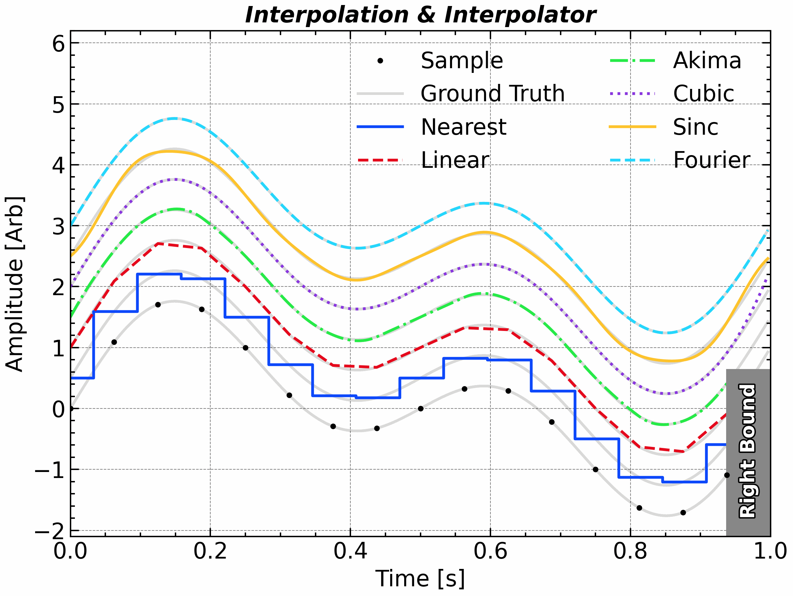
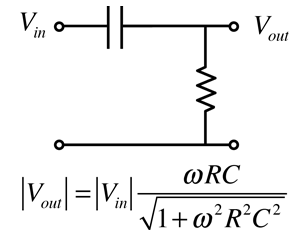
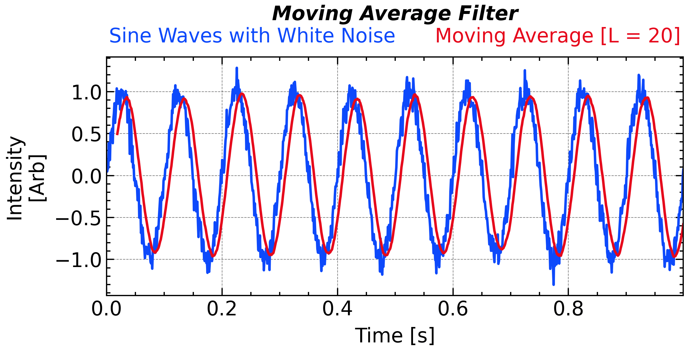
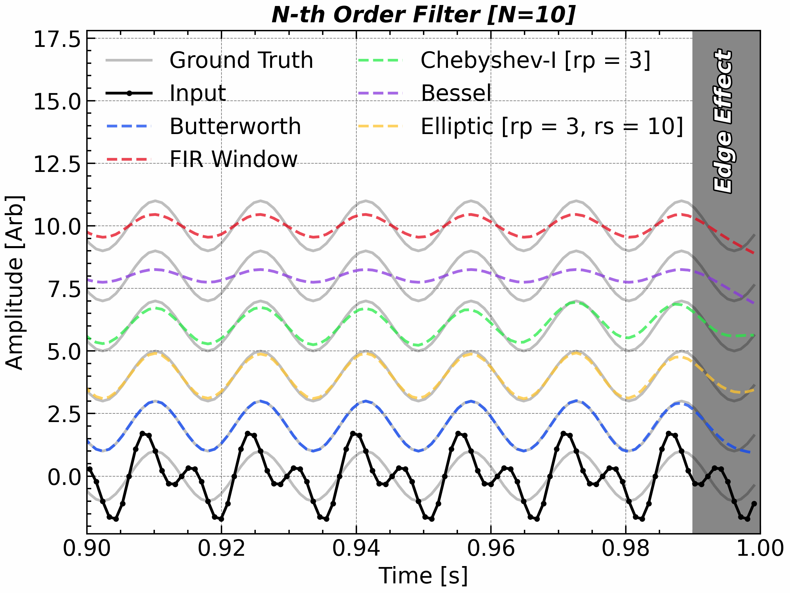
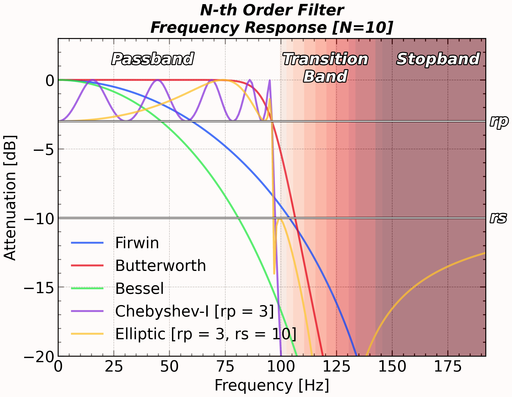
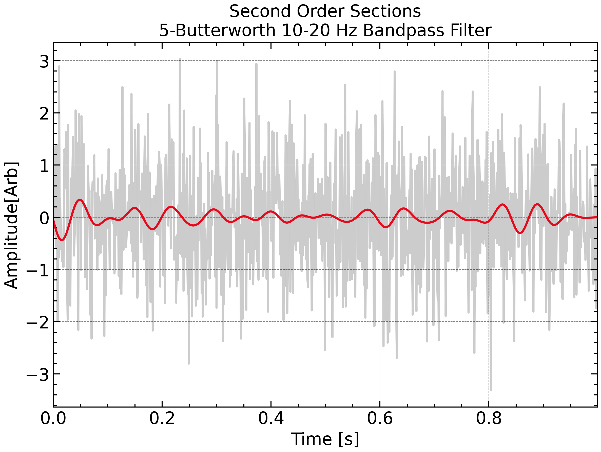
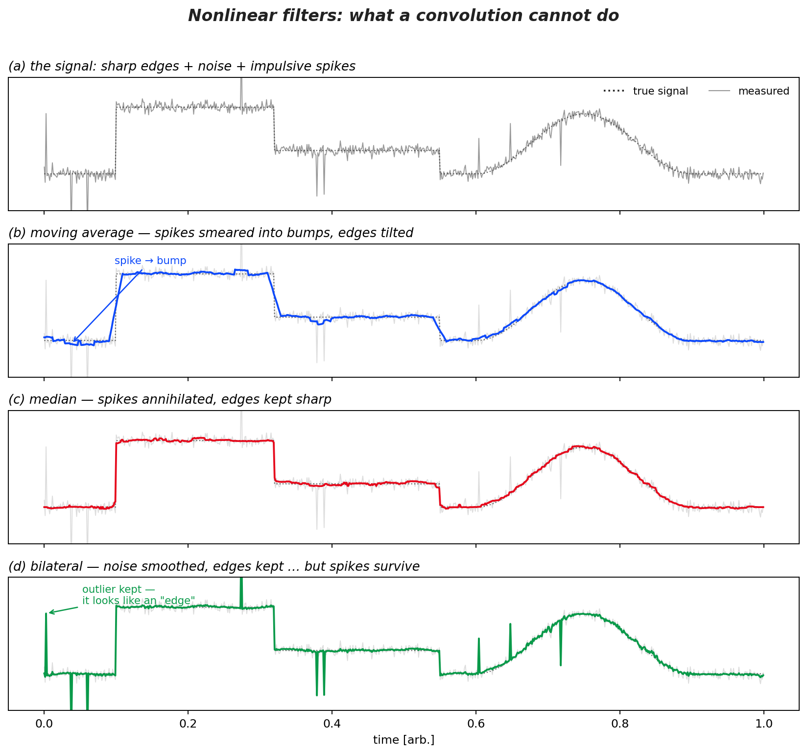
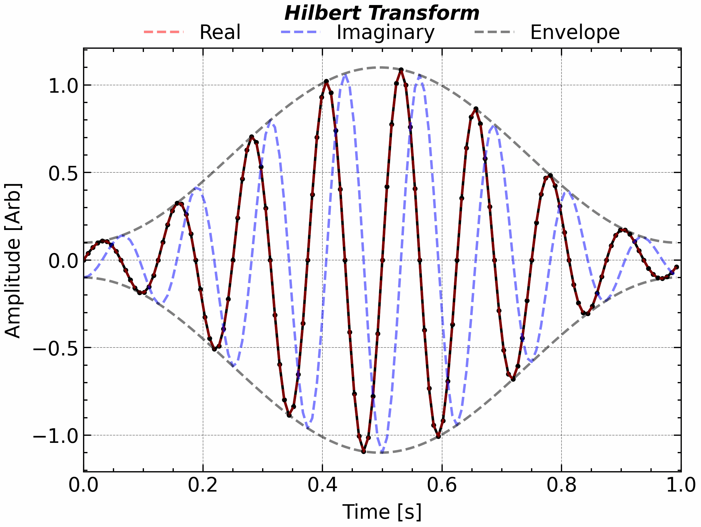

# Processing of the signal

## Reconstruction and Interpolation [`scipy.interpolate`]

**Interpolation** is the process of estimating unknown values between discrete data points. In scientific data analysis, especially in signal processing and time series studies, interpolation plays a vital role in resampling, aligning datasets, filling gaps, and reconstructing higher-resolution signals from coarse measurements.

The choice of interpolation method can significantly affect the quality of the reconstructed signal, particularly in terms of smoothness, fidelity to the original data, and preservation of frequency content. Below is a summary of common interpolation methods, their implementations in SciPy, and their respective advantages and caveats:

| Method                | SciPy / API                | Pros                                                         | Caveats                                                      |
| --------------------- | -------------------------- | ------------------------------------------------------------ | ------------------------------------------------------------ |
| Nearest neighbor      | `interp1d(kind='nearest')` | Extremely fast; trivial to use                               | Step artifacts; strong spectral distortion; not smooth       |
| Linear                | `interp1d(kind='linear')`  | Robust; no overshoot; simple and predictable                 | Not smooth at knots; attenuates high frequencies             |
| Cubic spline          | `CubicSpline(bc_type=...)` | Very smooth (C²); configurable boundaries                    | Overshoot/ringing near discontinuities; needs strictly increasing x |
| Akima piecewise       | `Akima1DInterpolator`      | Reduces overshoot; robust to local outliers/kinks            | Only C¹; slower than linear; not globally optimal            |
| Fourier (freq-domain) | `scipy.signal.resample`    | Preserves spectrum for band-limited signals; great for upsampling | Requires uniform sampling & quasi-periodicity; wrap-around artifacts if not tapered |
| Ideal sinc (windowed) | custom (windowed `sinc`)   | Theoretical best under sampling theorem; highest spectral fidelity | Infinite kernel → truncation/window needed; computationally heavy; uniform sampling only |

<!-- fig-tabset:figure_interpolation.png -->
::: {.panel-tabset}

### Figure



### Code

```python
import scipy.interpolate

plt.close()
plt.figure(figsize=(8, 6), tight_layout=True)
ax1 = plt.subplot(1, 1, 1)
N = 2 ** 4
omega0 = 2 * np.pi * 1.1

t = np.arange(0, N + 1) / N
t = np.linspace(0, 1, N, endpoint = False)

dt = t[1] - t[0]
sig = np.sin(omega0 * t) + np.sin(omega0 * 2 * t)

ax1.plot(t, sig, 'ko', label = 'Sample', zorder = 3)

nearest_interp = scipy.interpolate.interp1d(t, sig, kind = 'nearest', bounds_error = False)
linear_interp = scipy.interpolate.interp1d(t, sig, bounds_error = False)
akima_interp = scipy.interpolate.Akima1DInterpolator(t, sig)
cubic_interp = scipy.interpolate.CubicSpline(t, sig)

def sinc_interp(t_interp):
    weight = np.sinc((t_interp[:, None] - t[None, :]) / dt)
    return weight @ sig

n_interp = 2 ** 4 * N
t_interp = np.arange(0, n_interp) / n_interp

gap = 0.5
sig_interp = np.sin(omega0 * t_interp) + np.sin(omega0 * 2 * t_interp)
for i in range(7):
    if i == 0:
        ax1.plot(t_interp, sig_interp + i * gap, 'k-', alpha = 0.15, label = 'Ground Truth')
    else:
        ax1.plot(t_interp, sig_interp + i * gap, 'k-', alpha = 0.15)

ax1.step(t_interp, nearest_interp(t_interp) + 1 * gap, label = 'Nearest', where = 'mid')
ax1.plot(t_interp, linear_interp(t_interp) + 2 * gap, label = 'Linear')
ax1.plot(t_interp, akima_interp(t_interp) + 3 * gap, label = 'Akima')
ax1.plot(t_interp, cubic_interp(t_interp) + 4 * gap, label = 'Cubic')
ax1.plot(t_interp, sinc_interp(t_interp) + 5 * gap, label = 'Sinc')
ax1.plot(t_interp, scipy.signal.resample(sig, t_interp.size) + 6 * gap, label = 'Fourier')

ax1.axvspan(t[-1], 1, 0, 1.0, color = '#888888', edgecolor = 'none', zorder = 2, alpha = 0.5)
ax1.text((t[-1] + 1) / 2, -0.7, 'Right Bound', rotation = 90,          fontsize=14,
         color='w',
         ha='center',
         va='center',
         weight='bold', path_effects = path_effect)
ax1.autoscale(axis = 'x', tight = True)

ax1.legend(frameon = False, ncol = 2, loc = 'upper center')
ax1.set_title('Interpolation & Interpolator', **title_font)

ax1.set_xlabel('Time [s]')
ax1.set_ylabel('Intensity [Arb]')
ax1.set_ylim(-2.1, 6.2)

plt.tight_layout()
# ax1.grid('off')

plt.savefig(save_path + 'figure_interpolation' + '.png',bbox_inches='tight',dpi=300)

plt.show()
```

:::
<p align = 'center'>
    Different  interpolation methods applied to a two frequencies (1.1 Hz and 2.2 Hz) signal.
</p>

Particularly, the $\mathrm{sinc}$ interpolation is the most intutive way for the **reconstruction of a band-limited signal**, as it do not contribute any frequency component beyond the Nyquist frequency. It is defined as:
$$
x(t) = \sum_{n=-\infty}^{+\infty} x[n]\, \mathrm{sinc}\left(\frac{t - n\delta t}{\delta t}\right)
$$
where $\delta t=1/f_s$ is the sampling interval, and $\mathrm{sinc}(x) = {\sin(\pi x)}/{\pi x}$.

A practical implementation of $\mathrm{sinc}$ interpolation in Python/`Numpy` is as follows:

```python
def sinc_interp(t_interp, sig, t):
    dt = t[1] - t[0]
    weight = np.sinc((t_interp[:, None] - t[None, :]) / dt)
    return weight @ sig

sinc_interp(t_interp, sig, t)
```

There is no a universal best interpolation method. The choice depends on the specific application, data characteristics, and computational constraints. For example, if you need a quick and dirty upsampling for visualization, linear interpolation might suffice. If you are reconstructing a smooth physical signal from noisy measurements, cubic splines or Akima interpolation could be better. For resampling band-limited signals, Fourier-based methods or sinc interpolation are preferred.

## Filter Circuit

<p align = 'center'>

</p><p align = 'center'>
    Different  interpolation methods applied to a two frequencies (1.1 Hz and 2.2 Hz) signal.
</p>

## Digital Filter [`scipy.interpolate`]

Digital filters are fundamental tools for shaping, extracting, or suppressing specific features in time series data. The anti-aliasing is also a common application, where filters are used to prevent high-frequency components from distorting the signal before downsampling.

Digital filters are divided into two main types:

- **<u>*Finite Impulse Response (FIR)*</u>:** The output depends only on the current and <u>**a finite number of past input samples**</u>. FIR filters are always stable and can have exactly linear phase.  A general FIR digital filter is implemented as:
  $$
  y[n] = \sum_{m=0}^{L} h[m]\, x[n-m]
  $$

  - $x[n], y[n]$: Input, Output signal
  - $h[m]$: Filter coefficients (impulse response), length $L+1$
  - $L$: Filter order

- ***<u>Infinite Impulse Response (IIR)</u>*:** The output depends on both current and **<u>past input samples and past outputs</u>**. IIR filters can achieve sharp cutoffs with fewer coefficients, but may be unstable and generally do not preserve linear phase. A general IIR filter has both input and output recursion:
  $$
  y[n] = \sum_{p=0}^{L} b[p]\, x[n-p] - \sum_{q=1}^{M} a[q]\, y[n-q]
  $$

  - $b[p]$: Feedforward (input) coefficients
  - $a[q]$: Feedback (output) coefficients, usually $a[0] = 1$
  - $L, M$: Orders for input and output

The *FIR* filter can be explicitly written as a convolution with the filter coefficients, $h[k]$, as the kernel. The *IIR* filter involves feedback, making it recursive and more complex to analyze, but is still possible to express as an infinite series of convolutions, implicitly.

### Moving Average as an FIR Filter

The **moving average filter** is actually a simple FIR filter. For a window length $L$, the coefficients are:
$$
h[k] = \frac{1}{L},\quad k = 0, 1, \ldots, L-1
$$
So the output is:
$$
y[n] = \frac{1}{L} \sum_{k=0}^{L-1} x[n-k]
$$
That is, the output is the **average of the most recent $L$ input samples**. **Therefore, the moving average filter is an FIR filter whose coefficients are all equal.**

<!-- fig-tabset:figure_moving_average.png -->
::: {.panel-tabset}

### Figure



### Code

```python
plt.close()
plt.close()
N = 2 ** 10

t = np.linspace(0, 1, N, endpoint=False)
dt = t[1] - t[0]
fs = 1 / dt
sig = np.sin(2 * np.pi * 10 * t) + 0.1 * np.random.randn(N)

plt.figure(figsize=figsize_short)
ax1 = plt.subplot(1, 1, 1)
ax1.plot(t, sig, color='C0', label='Sine Waves with White Noise')

sig_ma = bn.move_mean(sig, 20)
ax1.plot(t, sig_ma, 'C1-', label='Moving Average [L = 20]')
ax1.legend(loc = 'upper center', ncol = 5, labelcolor="linecolor", handlelength = 0, handletextpad = 0, frameon = False, bbox_to_anchor=(0.5, 1.2))
ax1.set_title('Moving Average Filter', fontdict=title_font, pad = 30)
ax1.set_xlabel('Time [s]')
ax1.set_ylabel('Intensity\n[Arb]')
plt.tight_layout()
ax1.autoscale(enable=True, axis='x', tight=True)
plt.savefig(save_path + 'figure_moving_average' + '.png', bbox_inches='tight', dpi=300)

plt.show()
```

:::
<p align = 'center'>
    Sine waves with white noise and its moving average [L = 20].
</p>

The output $y[n]$ is the average of $x[m]$ between $m=n-L+1$ and $m=n$. Therefore, the outputis delayed by about $L/2$ samples compared to the input. This delay is called ***<u>phase shift</u>*** of the filter. As the linear filter is essentially a convolution, its influence on the frequency content of the signal can be analyzed in the frequency domain. A filter has frequency response $\mathcal{F}\{h[t]\}=H(k)=|H(k)|e^{j\phi(k)}$, where $|H|$ controls amplitude and $\phi(\omega)$ is the phase shift. 

For multi-frequency signals, the **phase response** $\phi(\omega)$ shapes how different components are time-shifted, which can preserve or distort waveform shape.

- **Linear phase.** If $\phi(\omega)=-\omega\tau_0$ (a straight line), then the **group delay** $\tau_g(\omega)=-\tfrac{d\phi}{d\omega}=\tau_0$ is constant: every frequency is delayed by the same $\tau_0$. Waveforms are not distorted—only shifted in time. Real, symmetric FIR filters achieve this; the delay equals $(N-1)/2$ samples.
- **Nonlinear phase.** When $\tau_g(\omega)$ varies with $\omega$, different frequencies experience different delays, causing **dispersion** (e.g., edge smearing, ringing). Most IIR filters (Butterworth, Chebyshev, elliptic) have nonlinear phase; **Bessel** IIRs trade selectivity for flatter group delay.

To get the correct timing, you may need to shift the output back by $L/2$ samples. Equivalently, you can use a **centered moving average** to avoid phase distortion:
$$
y[n]= \frac{1}{2M + 1} \sum_{k=-M}^{M} x[n-k]
$$
Such a filter not only has the input in the past (i.e., $x[n-M],\ x[n-M+1],\ ...,\ x[n-1]$) but also in the future (i.e., $x[n+1],\ x[n+2],\ ...,\ x[n+M]$). This is a **<u>*non-causal*</u>** filter, which cannot be implemented in real-time systems but is acceptable for offline processing. Conversely, a ***<u>causal</u>*** filter only uses past and present inputs.

Alternatively, you can apply the filter twice, once forward and once backward in time, to achieve zero-phase filtering. This is implemented in `scipy.signal.filtfilt`.

## Implementing Digital Filters in `scipy.signal`

### Filter representations in `scipy.signal`:

- ### BA (transfer-function coefficients)

  - Numerator/denominator polynomials $(b, a)$ of $H(z)=\frac{B(z)}{A(z)}$ [See [Z-transform](https://en.wikipedia.org/wiki/Z-transform) for explanation].

  - **Pros:** Simple, widely used; works for FIR (`a=[1]`) and IIR.

  - **Cons:** Can be **numerically unstable** for high-order IIR (coefficient sensitivity).

  - **Get/Use:** `scipy.signal.butter(..., output='ba')`; apply with `scipy.signal.lfilter(b, a, x)` (once, forward) or `scipy.signal.filtfilt(b, a, x)`.

- ### ZPK (zeros–poles–gain)

  - Factorized form $(z, p, k)$ describing zeros, poles, overall gain.

  - **Pros:** Great for analysis (stability, sensitivity); easy to modify poles/zeros.
  - **Cons:** Still not the most stable for *applying* high-order IIR directly.
  - **Get/Convert:** `scipy.signal.butter(..., output='zpk')`; convert via `scipy.signal.zpk2tf`, `scipy.signal.zpk2sos`.

- ### SOS (second-order sections, <u>suggested</u>)

  - Cascade of bi-quads; array of sections with 6 parameters each.
  - **Pros:** **Most numerically stable** for high-order IIR; production-friendly.
  - **Cons:** Slightly more verbose; must convert at design time.
  - **Get/Use:** `scipy.signal.butter(..., output='sos')`; apply with `scipy.signal.sosfilt(sos, x)` or `scipy.signal.sosfiltfilt(sos, x)`.


### Common Filter Types

The following table summarizes common digital filter types, their implementations in `scipy.signal`, main features, and typical use cases:


| Filter Type    | Function (`scipy.signal`) | Main Features                | Use Case                  |
| -------------- | ------------------------- | ---------------------------- | ------------------------- |
| FIR (window)   | `firwin`, `firwin2`       | Stable, linear phase         | Smoothing, band selection |
| Butterworth    | `butter`                  | Smooth, monotonic response   | General purpose           |
| Chebyshev I/II | `cheby1`, `cheby2`        | Sharper cutoff, ripples      | Strong suppression        |
| Elliptic       | `ellip`                   | Fastest cutoff, both ripples | Selective, small band     |
| Bessel         | `bessel`                  | Linear phase, slow rolloff   | Transient preservation    |
| Median         | `medfilt`, `medfilt1d`    | Nonlinear, preserves edges   | Spike removal             |

::: {.callout-tip}
## Which filter should I pick?

Decide along three axes — **phase**, **transition sharpness**, and **causality** — in that order:

1. **Does waveform shape / event timing matter?** (e.g. detecting an arrival time, preserving a pulse shape)
   - *Yes* → you need (near-)**linear phase**. Pick **FIR** (`firwin`), or **Bessel** if you need an efficient IIR. For an offline FIR/IIR, `filtfilt` (forward–backward) gives **exactly zero phase** at the cost of doubling the effective order.
   - *No* → any IIR is fine; continue.
2. **How sharp must the transition band be, for a given order?**
   - Gentle, maximally flat passband, general purpose → **Butterworth**.
   - Sharper, ripple allowed in the **stopband** only → **Chebyshev II** (`cheby2`).
   - Sharper, ripple allowed in the **passband** only → **Chebyshev I** (`cheby1`).
   - Steepest possible for the lowest order, ripple allowed in **both** bands → **Elliptic** (`ellip`).
3. **Real-time or offline?**
   - Real-time / low latency → a **low-order IIR** (causal, few coefficients).
   - Offline / latency tolerable → **FIR + `filtfilt`** for a clean zero-phase result.

**Special case:** impulsive spikes / outliers (salt-and-pepper) are not a frequency-band problem — use the nonlinear **median** filter, which removes spikes without smearing genuine edges.

The catch with sharper magnitude responses (Chebyshev, elliptic) is increasingly nonlinear phase and ringing near edges, so the axis-1 question always wins over axis-2.
:::

For IIR filters, the **<u>*Butterworth*</u>** filter, `scipy.signal.butter`, is commonly used. An example of these filters applied to a sine wave is shown below:


<!-- fig-tabset:figure_filters.png -->
::: {.panel-tabset}

### Figure



### Code

```python
plt.close()
plt.figure(figsize = (8, 6))
ax1 = plt.subplot(1, 1, 1)

N = 2 ** 10
omega0 = 2 * np.pi * 64

t = np.linspace(0, 1, N, endpoint = False)

dt = t[1] - t[0]
sig = np.sin(omega0 * t) + np.sin(omega0 * 2 * t) + np.random.randn(t.size) * 0.0

plt.close()
# plt.figure(figsize = (8, 6))
ax1 = plt.subplot(1, 1, 1)

fs = 1 / dt
cutoff = 1.5 * omega0 / 2 / np.pi
cutoff = 96

N = 10
rp = 3
rs = 10
firwin_b = scipy.signal.firwin(numtaps=N, cutoff=cutoff, fs=fs, width=3)
# FIR 不需要 sos

butter_sos = scipy.signal.butter(N=N, Wn=cutoff, fs=fs, output='sos')
bessel_sos = scipy.signal.bessel(N=N, Wn=cutoff, fs=fs, output='sos')
cheby1_sos = scipy.signal.cheby1(N=N, rp=rp, Wn=cutoff, fs=fs, output='sos')
ellip_sos = scipy.signal.ellip(N=N, rp=rp, rs=rs, Wn=cutoff, fs=fs, btype='lowpass', output='sos')

gap = 2.0


for i in range(6):
    ax1.plot(t, i * gap + np.sin(omega0 * t), 'k-', alpha=0.25, label = "Ground Truth" if i == 0 else None)


ax1.plot(t, sig, 'ko-', label='Input')
ax1.plot(t, 1 * gap + scipy.signal.sosfiltfilt(butter_sos, sig), label='Butterworth', linestyle='--', alpha=0.75)
ax1.plot(t, 5 * gap + scipy.signal.filtfilt(firwin_b, 1, sig), label='FIR Window', linestyle='--', alpha=0.75)
ax1.plot(t, 3 * gap + scipy.signal.sosfiltfilt(cheby1_sos, sig), label='Chebyshev-I [rp = 3]', linestyle='--', alpha=0.75)
ax1.plot(t, 4 * gap + scipy.signal.sosfiltfilt(bessel_sos, sig), label='Bessel', linestyle='--', alpha=0.75)
ax1.plot(t, 2 * gap + scipy.signal.sosfiltfilt(ellip_sos, sig), label='Elliptic [rp = 3, rs = 10]', linestyle='--', alpha=0.75)

ax1.axvspan(0.99, 1.0, color = '#888888', edgecolor = 'none')
ax1.text(0.993, 11.5, 'Edge Effect', **title_font, rotation = 90, color = 'w', path_effects = path_effect)
ax1.set_ylim(-2.3, 17.8)

ax1.set_xlabel('Time [s]')
ax1.set_ylabel('Intensity [Arb]')
ax1.set_title('N-th Order Filter' + f" [N={N}]", **title_font)
ax1.autoscale(axis = 'x', tight = True)
ax1.set_xlim(0.9, 1.0)
ax1.legend(frameon = False, ncol = 2, loc = 'upper left')
plt.tight_layout()

plt.savefig(save_path + 'figure_filters' + '.png',bbox_inches='tight',dpi=300)

plt.show()
```

:::

Please note that **filtering can introduce edge effects**, so always inspect the beginning and end of the filtered signal.

### Frequency Response and Interpretation

The effect of a digital filter can be fully characterized by its **<u>*frequency response*</u>**, i.e., how it amplifies or suppresses each frequency. Use `scipy.signal.freqz` to plot the amplitude and phase response of your filter, and check that it matches your physical requirements (e.g., minimal ripple in the passband, sufficient attenuation in the stopband).


<!-- fig-tabset:figure_filters_response.png -->
::: {.panel-tabset}

### Figure



### Code

```python
plt.close()
plt.figure(figsize = (8, 6))

ax1 = plt.subplot(1, 1, 1)

fs = 1024.0  # Hz
cutoff = 96.0  # Hz

N = 10
rp = 3
rs = 10

butter_b, butter_a = scipy.signal.butter(N = N, Wn = cutoff, fs = fs)
butter_w, butter_h = scipy.signal.freqz(butter_b, butter_a, fs = fs)

bessel_b, bessel_a = scipy.signal.bessel(N = N, Wn = cutoff, fs = fs)
bessel_w, bessel_h = scipy.signal.freqz(bessel_b, bessel_a, fs = fs)

firwin_b = scipy.signal.firwin(numtaps=N, cutoff = cutoff, fs = fs, width = 3)
firwin_w, firwin_h = scipy.signal.freqz(firwin_b, fs = fs)

cheby1_b, cheby1_a = scipy.signal.cheby1(N = N, rp = rp, Wn = cutoff, fs = fs)
cheby1_w, cheby1_h = scipy.signal.freqz(cheby1_b, cheby1_a, fs = fs)

ellip_b, ellip_a = scipy.signal.ellip(N = N, rp = rp, rs = rs, Wn = cutoff, fs = fs, btype = 'lowpass')
ellip_w, ellip_h = scipy.signal.freqz(ellip_b, ellip_a, fs = fs)

# Butterworth Filter (sos version)
butter_sos = scipy.signal.butter(N=N, Wn=cutoff, fs=fs, output='sos')
butter_w, butter_h = scipy.signal.sosfreqz(butter_sos, fs=fs)

# Bessel Filter (sos version)
bessel_sos = scipy.signal.bessel(N=N, Wn=cutoff, fs=fs, output='sos')
bessel_w, bessel_h = scipy.signal.sosfreqz(bessel_sos, fs=fs)

# FIR Filter (FIR filters are already stable and linear-phase, no sos form)
firwin_b = scipy.signal.firwin(numtaps=N, cutoff=cutoff, fs=fs, width=3)
firwin_w, firwin_h = scipy.signal.freqz(firwin_b, fs=fs)

# Chebyshev Type I Filter (sos version)
cheby1_sos = scipy.signal.cheby1(N=N, rp=rp, Wn=cutoff, fs=fs, output='sos')
cheby1_w, cheby1_h = scipy.signal.sosfreqz(cheby1_sos, fs=fs)

# Elliptic Filter (sos version)
ellip_sos = scipy.signal.ellip(N=N, rp=rp, rs=rs, Wn=cutoff, fs=fs, btype='lowpass', output='sos')
ellip_w, ellip_h = scipy.signal.sosfreqz(ellip_sos, fs=fs)

ax1.plot(firwin_w, 20 * np.log10(np.abs(firwin_h)), label = 'Firwin', linestyle = '-', alpha = 0.75)
ax1.plot(butter_w, 20 * np.log10(np.abs(butter_h)), label = 'Butterworth', linestyle = '-', alpha = 0.75)
ax1.plot(bessel_w, 20 * np.log10(np.abs(bessel_h)), label = 'Bessel', linestyle = '-', alpha = 0.75)
ax1.plot(cheby1_w, 20 * np.log10(np.abs(cheby1_h)), label = 'Chebyshev-I [rp = 3]', linestyle = '-', alpha = 0.75)
ax1.plot(ellip_w, 20 * np.log10(np.abs(ellip_h)), label = 'Elliptic [rp = 3, rs = 10]', linestyle = '-', alpha = 0.75)
ax1.hlines([-rp, -rs], 0, fs / 2, color = 'w', linestyle = '-', linewidth = 1.0, path_effects = path_effect)

ax1.pcolormesh(butter_w, np.array([-120, 10]), np.outer(20 * np.log10(np.abs(butter_h)), np.ones(2)).T, cmap = 'Reds_r', vmax = 0, vmin = -40, alpha = 0.5)

ax1.legend(frameon = False, ncol = 1, loc = 'lower left')

ax1.set_title('N-th Order Filter\nFrequency Response' + f" [N={N}]", **title_font)
ax1.text(24, 2, 'Passband', **title_font, color = 'w', path_effects = path_effect, va = 'top')
ax1.text(120, 2, 'Transition\nBand', **title_font, color = 'w', path_effects = path_effect, ha = 'center', va = 'top')
ax1.text(152, 2, 'Stopband', **title_font, color = 'w', path_effects = path_effect, va = 'top')

ax1.text(2.02 * cutoff, -rs, 'rs', **title_font, ha = 'left', va = 'center', color = 'w', path_effects = path_effect)
ax1.text(2.02 * cutoff, -rp, 'rp', **title_font, ha = 'left', va = 'center', color = 'w', path_effects = path_effect)

# ax1.set_xscale('log')
# ax1.set_yscale('log')
ax1.set_xlim(0, 2 * cutoff)
ax1.set_ylim(-20, 3)

ax1.set_xlabel('Frequency [Hz]')
ax1.set_ylabel('Attenuation [dB]')

plt.savefig(save_path + 'figure_filters_response' + '.png',bbox_inches='tight',dpi=300)

plt.show()
```

:::


### Artifacts from Over-narrow Filters

**It is not suggested to apply a filter with an over-narrow bandwidth unless you are already confident about the central frequency and waveform of the signal.** Like, if you apply a 5-Butterworth 6-10 Hz bandpass filter to a **pure white noise**, you are going to get a filtered signal that looks like a sine wave with a frequency around 8 Hz. Thus, you are introducing artificial waves into the signal.

<!-- fig-tabset:figure_filtered_noise.png -->
::: {.panel-tabset}

### Figure



### Code

```python
import numpy as np
import matplotlib.pyplot as plt
import scipy.signal
import scienceplots
plt.style.use(['science', 'nature', 'notebook', 'grid', 'high-vis'])

%matplotlib ipympl
plt.close()
plt.figure(figsize=figsize_short)
ax1 = plt.subplot(1, 1, 1)
N = 2 ** 10
t = np.linspace(0, 1, N, endpoint=False)
fs = 1 / (t[1] - t[0])
sig = np.random.randn(t.size)

ax1.plot(t, sig, 'k-', alpha = 0.2)

sos = scipy.signal.butter(5, [6, 10], btype = 'bandpass', output='sos', fs = fs)

filtered_signal = scipy.signal.sosfiltfilt(sos, sig)
ax1.plot(t, filtered_signal, 'C1-', label = 'Filtered')

ax1.set_title('Second Order Sections\n5-Butterworth 6-10 Hz Bandpass Filter', **title_font)
ax1.set_xlabel('Time [s]')
ax1.set_ylabel('Intensity [Arb]')
ax1.set_ylim(-2.99, 2.99)
plt.tight_layout()
ax1.autoscale(axis = 'x', tight= True)
plt.savefig(save_path + 'figure_filtered_noise' + '.png',bbox_inches='tight',dpi=300)

plt.show()
```

:::


## [Nonlinear Filters](https://en.wikipedia.org/wiki/Median_filter): Median & Bilateral [`scipy.signal.medfilt`]

Every filter so far — moving average, Butterworth, FIR — is a **convolution**: the output is a weighted sum of inputs, the weights never change, and the whole operation is characterized by a single transfer function $H(f)$. Linearity is what makes the frequency-domain picture work, but it also imposes a hard limitation: **a convolution cannot distinguish a feature you want from noise that lives at the same frequencies.** A sharp step and an impulsive spike are both broadband; any linear low-pass that suppresses the spike must also round off the step.

**Nonlinear filters** escape this trade-off by letting the operation depend on the data itself. The price is that superposition fails — $\mathcal{F}\{x_1 + x_2\} \neq \mathcal{F}\{x_1\} + \mathcal{F}\{x_2\}$ — so there is no transfer function, no frequency response, and no `sosfreqz` plot to draw. Each nonlinear filter must be understood by what it does to *features* rather than to *frequencies*.

### Median Filter [`scipy.signal.medfilt`]

The **<u>*median filter*</u>** replaces each sample with the median of its neighborhood:

$$
y_n = \operatorname{median}\left( x_{n-k}, \ldots, x_n, \ldots, x_{n+k} \right)
$$

Two properties make it the standard tool for **despiking**:

- **Outliers are annihilated, not smeared.** A spike occupying fewer than half the window never becomes the median — it simply vanishes. A moving average of the same length would smear the spike into a bump $2k+1$ samples wide (panel b vs. panel c below).
- **Edges survive.** Around a step, the window is dominated by one plateau or the other, so the output jumps cleanly from level to level. A moving average instead draws a ramp of length $2k+1$ across the step.

The rule of thumb: choose the window a bit longer than **twice the widest spike** you need to remove, but shorter than the narrowest real feature you need to keep. Median filtering is the standard first pass on particle-instrument and telemetry data, where single-point glitches (cosmic-ray hits, bit errors) are common; the 2-D version (`scipy.ndimage.median_filter`) is the classic remedy for salt-and-pepper noise in images.

### Bilateral Filter

The **<u>*bilateral filter*</u>** is a Gaussian smoother that refuses to average across an edge. It weights neighbors by *two* Gaussians — one in time (or space), one in **intensity**:

$$
y_n = \frac{\sum_m w_{nm}\, x_m}{\sum_m w_{nm}}, \qquad
w_{nm} = \underbrace{e^{-\frac{(n-m)^2}{2\sigma_t^2}}}_{\text{near in time}}\ \cdot\ \underbrace{e^{-\frac{(x_n - x_m)^2}{2\sigma_I^2}}}_{\text{similar in value}}
$$

Samples on the far side of a step differ from $x_n$ by much more than $\sigma_I$, so their weight collapses and the filter smooths each plateau *separately* — noise is suppressed while the step stays sharp (panel d). As $\sigma_I \to \infty$ the intensity kernel goes flat and the filter degrades gracefully into an ordinary Gaussian smoother. This edge-preserving behavior is why the bilateral filter (and its fast approximations) sits inside virtually every smartphone camera pipeline for denoising and tone mapping.

Note the honest caveat in panel (d): to a bilateral filter, **an impulsive spike looks exactly like a tiny edge** — it is far from its neighbors in intensity, so they receive no weight and the spike is faithfully *preserved*. Real pipelines therefore compose the two nonlinear filters: **median first** to kill outliers, **bilateral second** to smooth the noise without blurring the edges.

<!-- fig-tabset:figure_nonlinear_filters.png -->
::: {.panel-tabset}

### Figure



### Code

```python
import numpy as np
import matplotlib.pyplot as plt
import scipy.signal

rng = np.random.default_rng(3)
N = 800
t = np.arange(N) / N

# a signal with sharp edges, a smooth bump, noise, and impulsive spikes
clean = np.zeros(N)
clean[(t >= 0.10) & (t < 0.32)] = 1.0
clean[(t >= 0.32) & (t < 0.55)] = 0.35
m = (t >= 0.60) & (t < 0.90)
clean[m] = 0.9 * np.sin(np.pi * (t[m] - 0.60) / 0.30) ** 2
noisy = clean + 0.05 * rng.standard_normal(N)
spikes_at = rng.choice(N, 9, replace=False)
noisy[spikes_at] += rng.choice([-1, 1], 9) * rng.uniform(0.6, 1.1, 9)

k = 15                                                 # window length [samples]
y_ma  = np.convolve(noisy, np.ones(k) / k, mode='same')    # moving average (linear)
y_med = scipy.signal.medfilt(noisy, k)                     # median (nonlinear)

def bilateral_1d(x, W=20, sig_t=8.0, sig_i=0.12):
    """edge-preserving bilateral filter: Gaussian in time AND in intensity."""
    pad = np.pad(x, W, mode='reflect')
    idx = np.arange(-W, W + 1)
    wt = np.exp(-idx**2 / (2 * sig_t**2))                  # domain (time) kernel
    win = np.lib.stride_tricks.sliding_window_view(pad, 2 * W + 1)
    wi = np.exp(-(win - x[:, None])**2 / (2 * sig_i**2))   # range (intensity) kernel
    w = wt[None, :] * wi
    return (w * win).sum(axis=1) / w.sum(axis=1)

y_bil = bilateral_1d(noisy)

for y, name in [(y_ma, 'moving average'), (y_med, 'median'), (y_bil, 'bilateral')]:
    print(f'{name:>15s}  rms vs clean: {np.sqrt(np.mean((y - clean)**2)):.3f}')
```

:::

On this test signal the RMS error against the true signal is **0.055** for the moving average, **0.018** for the median, and **0.085** for the bilateral filter — but the single number hides the story. The bilateral's error is inflated almost entirely by the nine preserved spikes; on the spike-free samples it is the smoothest of the three. The median wins here because the test signal is exactly its home turf: piecewise-flat levels contaminated by outliers.

## [Hilbert Transform](https://en.wikipedia.org/wiki/Hilbert_transform) [`scipy.signal.hilbert`]

The **<u>*Hilbert transform*</u>** is a fundamental tool for analyzing the instantaneous amplitude and phase of a signal. By constructing the analytic signal, it enables us to extract the envelope and instantaneous frequency, which are essential in the study of modulated waves and transient phenomena. This section demonstrates how to implement the Hilbert transform in Python and interpret its results in both physical and engineering contexts.

<!-- fig-tabset:figure_hilbert.png -->
::: {.panel-tabset}

### Figure



### Code

```python
import numpy as np
import matplotlib.pyplot as plt
import scipy.signal
import scienceplots
plt.style.use(['science', 'nature', 'notebook', 'grid', 'high-vis'])

%matplotlib ipympl
plt.close()
plt.figure(figsize=figsize_short)
ax1 = plt.subplot(1, 1, 1)

omega = 2 * np.pi * 8.0
t = np.linspace(0, 1, 2 ** 7, endpoint=False)
dt = t[1] - t[0]
fs = 1 / dt
sig = np.sin(omega * t) * (0.1 + np.hanning(t.size)) + np.random.randn(t.size) * 0.0

ax1.plot(t, sig, 'ko-')

ax1.plot(t, scipy.signal.hilbert(sig).real, 'r--', label = 'Real', alpha = 0.5)
ax1.plot(t, scipy.signal.hilbert(sig).imag, 'b--', label = 'Imaginary', alpha = 0.5)
ax1.plot(t, np.abs(scipy.signal.hilbert(sig)), 'k--', label = 'Magnitude', alpha = 0.5)
ax1.plot(t, -np.abs(scipy.signal.hilbert(sig)), 'k--', alpha = 0.5)

ax1.set_xlim(-0.0, 1.0)

for ax in [ax1]:
    ax.grid('on', linestyle = '--', alpha = 0.5)

ax1.legend(frameon = False, loc = 'upper center', ncol = 3, bbox_to_anchor = (0.5, 1.17))

ax1.set_xlabel('Time [s]')
ax1.set_ylabel('Intensity [Arb]')
ax1.set_title('Hilbert Transform', y = 1.09, **title_font)

plt.tight_layout()

plt.savefig(save_path + 'figure_hilbert' + '.png',bbox_inches='tight',dpi=300)

plt.show()
```

:::


```python
signal_ht = scipy.signal.hilbert(signal)
signal_ht.real, sighal_ht.imag, np.abs(signal_ht)
# The real, imaginary part and the envelope
```

<div STYLE="page-break-after: always;"></div>