<script src="https://cdn.jsdelivr.net/npm/mermaid@11.2.1/dist/mermaid.min.js"></script>

# Practical Spectral Analysis with Python

# Preface

For many students, their first real encounter with spectral analysis often unfolds like this:

One day, they notice an intriguing phenomenon in a time-domain signal and eagerly share their discovery with an advisor or senior colleague. The response is calmly delivered: "You should try some Fourier or wavelet analysis."

Returning to their desk, they dig out an old calculus textbook, flip through several pages, and quickly realize it won’t help. Next comes the trusted solution: a swift Google search for “Fourier Analysis tutorial". Eventually, they stumble upon a highly recommended *Digital Signal Processing* textbook with an impressive 4.3/5.0 book rating.  After a marathon weekend, they manage to read through the 50-plus pages of Chapter 1, *Signals and Systems*. However, by Chapter 2, Linear Time-Invariant Systems, fatigue sets in—only to realize that the actual Fourier series material is still more than 120 pages away.

At this juncture, most students pragmatically pivot to google *"Fourier Analysis by xxx"*  and get an answer with some unfamiliar jargon from *StackOverflow*, grabbing a ready-made code snippet to forge ahead.

Yet, a few determined souls persist—spending days gathering materials, watching lectures online, coding, and compiling a detailed report. Proudly, they present their hard work to their advisor, only to be met with the classic understated response: “Why so little progress this week?”

<div STYLE="page-break-after: always;"></div>

## Why Do We Need Spectral Analysis?

### Signals and Time Series

In physics and engineering, we frequently encounter **signals**—mathematical functions representing physical quantities that vary continuously or discretely over time. A signal can be any measurable quantity exhibiting temporal variation, such as an audio waveform, the voltage output from a sensor, or the magnetic field recorded during a plasma experiment. When signals are observed, sampled, and recorded sequentially, they form a **time series**, capturing how these quantities evolve.

Many familiar phenomena can naturally be described as time series, including:

- **Meteorology:** e.g. El-Nino ENSO Index

<p align = 'center'>

</p>


- **Geophysics:** e.g. Seismic Waves

<p align = 'center'>

</p>

- **Solar Physics:** e.g. Sunspot Number

<p align = 'center'></p>

Each of these examples is described in the **time domain**—meaning we specify a physical quantity (such as amplitude, voltage, or magnetic field strength) explicitly **as a function of time**.

While understanding the time-domain behavior of a system is fundamental, it can sometimes be challenging to discern **underlying patterns, periodicities, or oscillatory features** directly from time-domain data. This is precisely where **spectral analysis** proves invaluable, as it allows us to examine signals in the frequency domain, clearly identifying and characterizing these hidden structures.

### Understand the Signal from Frequency Domain

**Spectral analysis** examines a signal in the frequency domain instead of the time domain.

Imagine listening to an orchestra. The audio signal is a complex waveform. But your brain can distinguish individual notes — essentially doing spectral analysis!

In **plasma physics**, spectral analysis helps resolve the basic properties of wave (e.g., amplitude, compressibility) by revealing dominant frequencies in electromagnetic field fluctuations.

Spectral analysis helps to:

1. **Identify dominant frequencies** in a signal.
2. **Detect multiple overlapping processes**.
3. **Understand system behavior** through resonance.
4. **Filter or reduce noise**.

### Sampling

> **Nyquist-Shannon Sampling Theorem:** A band-limited continuous-time signal $x(t)$ containing no frequency components higher than $f_{max}$,  can be perfectly reconstructed from its samples if it is sampled at a rate:
$$
f_{max} \le f_s/2
$$

The frequency upper limitation $f_s/2$ is also called ***Nyquist Frequency***.

When you measure a high frequency signal with a low cadence instrument, you will not only miss the high frequency component, **<u>but also measure an erroneous signal</u>**, so called ***Aliasing***.

<p align = 'center'>
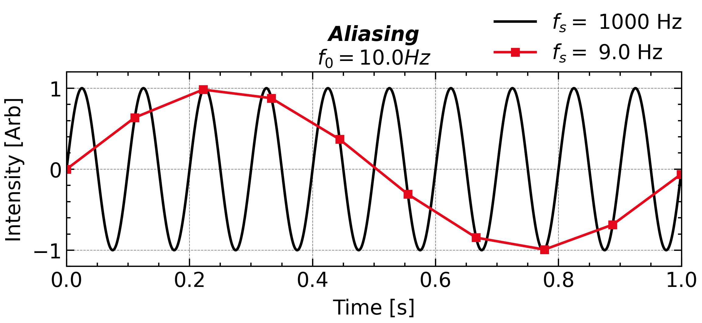
</p>
Such phenomenon is essentially unrelated to the Fourier transform as its frequency range ends up to $f_s/2$ and can be directly observed by naked eye. In real life, aliasing can be visualized by recording the running car wheel (or helicopter propeller) and television (or computer screen) with your smart phone. 

This effect always happens when you (down-)sampling the signal, a common way to avoid it is to apply a low pass filter so that the high frequency component doesn't contribute to the unreal signal. In the instrumental implementation, that filter typically consists of a set of resistor, inductor, and capacity and is putted before the analog-digital converter.

- **Generate the Timestamps**

  ```python
  import numpy as np
  
  # Length of signal, N
  n = 100
  fs = 10
  T = 1.0
  
  dt = 1 / fs
  
  # Way 1: Given sampling frequency, fs
  t =	 np.arange(0, n) / fs 
  # t = 0.0, 0.1, 0.2, ..., 9.9
  
  # Way 2: Given sampling period, dt
  t =	 np.arange(0, n) / fs 
  
  # Way 3: Given Signal Duration, T
  t = np.linspace(0, T, n, endpoint = False)
  
  ```

  - Tips: Set `endpoint = False` so that the last point is not included in the time array, which ensures that the sampling frequency is equal to $f_s$.

- **Generate the Signal**

  ```python
  # Assign wave (angular) frequency (omega = 2 * np.pi * frequency)
  f0 = 3
  f1 = 6
  amp1 = 1
  amp2 = 2
  omega0 = 2 * np.pi * f0
  omega1 = 2 * np.pi * f1
  
  # Way 1: Directly generate the signal
  sig = amp1 * np.sin(omega0 * t) + amp2 * np.sin(omega1 * t)
  
  # Way 2: Generate a complex function and then take the real (cosine) or imaginary (sine) part
  sig = (amp1 * np.exp(1j * omega0 * t) + amp2 * np.exp(1j * omega1 * t)).imag
  
  # Way 3: Use a function or anonymous function to generate the signal
  def sig_func(t):
      return amp1 * np.sin(omega0 * t) + amp2 * np.sin(omega1 * t)
  # or
  sig_func = lambda t: amp1 * np.sin(omega0 * t) + amp2 * np.sin(omega1 * t)
  
  sig = sig_func(t)
  ```

------

### Common Waveforms

In addition to sine waves, there are some other commonly used waveforms built-in functions that are provided by `scipy.signal` module. These functions can be used to generate various types of signals for testing, simulation, and analysis purposes. Below is a brief overview of some typical waveforms:

<p align = 'center'>

</p>

#### **Chirp Waveform (`chirp`)**

Generates a swept-frequency (chirp) signal, which is often used in radar, sonar, and frequency response analysis.

```python
scipy.signal.chirp(
    t: array_like,                 # Time array
    f0: float,                     # Initial frequency at time t=0
    t1: float,                     # Final time for frequency sweep
    f1: float,                     # Final frequency at time t1
    method: str = 'linear',       # Frequency sweep type: 'linear', 'quadratic', 'logarithmic', 'hyperbolic'
    phi: float = 0                # Initial phase in degrees
)
```

------

#### **Gaussian Pulse (`gausspulse`)**

Generates a Gaussian-modulated sinusoidal pulse, commonly used in ultrasound and narrow-band radar simulations.

```python
scipy.signal.gausspulse(
    t: array_like,             # Time array
    fc: float = 1000,          # Center frequency (Hz)
    bw: float = 0.5,           # Fractional bandwidth in frequency domain
    bwr: float = -6,           # Reference level (dB) relative to peak for bandwidth measurement
    tpr: float = -60,          # Truncation level (dB) for pulse duration
    retquad: bool = False,     # If True, return quadrature (analytic) signal
    retenv: bool = False       # If True, return envelope of the signal
)
```

------

#### **Square Wave (`square`)**

Generates a square waveform, useful in digital signal simulations, PWM applications, and modulation experiments.

```python
scipy.signal.square(
    t: array_like,             # Time array
    duty: float = 0.5          # Duty cycle (fraction of period signal is high)
)
```

------

#### **Sawtooth Wave (`sawtooth`)**

Generates a sawtooth waveform, widely used in signal synthesis and electronics simulations.

```python
scipy.signal.sawtooth(
    t: array_like,             # Time array
    width: float = 1           # Width of rising ramp, from 0 to 1 (1 = triangle wave)
)
```

------

#### **Unit Impulse (`unit_impulse`)**

Generates a discrete-time impulse (Dirac delta function), fundamental for impulse response analysis.

```python
scipy.signal.unit_impulse(
    shape: int or tuple[int],  # Output shape
    idx: int or tuple[int] = None,  # Index at which the impulse is 1 (default: center)
    dtype: type = float        # Data type of output array
)
```

<div STYLE="page-break-after: always;"></div>

## How Do We See Frequencies in Data?

### Fourier Transform

Fourier transform provide the perfect way to convert the observed time series into the dual space--Frequency domain. Its definition can be written as follows

$$
\begin{align}
X(f) = \int_{-\infty}^{+\infty} x(t) e^{-2\pi i f t} \, \mathrm{d}t
\end{align}
$$
Correspondingly, the inverse (continuous) Fourier transform can be given as:

$$
\begin{align}
x(t)=\int_{-\infty}^{+\infty}X(f) e^{2\pi i f t} \mathrm{d}f
\end{align}
$$

However, a physical sample can only cover at discrete time nodes. Thus, ***Discrete-Time Fourier Transform (DTFT)*** presents an alternative expression in:
$$
\begin{align}
X(f)=\sum_{n=-\infty}^{+\infty} x[n \Delta t]\cdot e^{-i2\pi f (n\Delta t)}
\end{align}
$$

where $x[n]=x(n\Delta t)$ stands for a discrete signal and $T$ is the sampling period. This signal has infinite length and still unrealistic. For a finite signal, ***Discrete Fourier Transform (DFT)*** is the only one that applicable:
$$
\begin{align}
X[k] = X(k\Delta f) & = \sum_{n=0}^N x(n\Delta t) e^{-2\pi i k\Delta f t} \, \Delta  t \\
& = \sum_{n=0}^N x[n] e^{-2\pi i k\Delta f t} \, \Delta  t
\end{align}
$$


Ideally, according to the periodicity of $e^{-2\pi i ft}$, the DFT actually calculate the DTFT coefficients by extending the original series along and anti-along the time axis.

$$
\begin{align}
X[k] & = \lim_{M\rightarrow+\infty} \frac{1}{2M} \sum_{n=-(M-1)\times N}^{M \times N} x[n] e^{-2\pi i k {t}/{T}} \, \Delta  t\\
& \propto \sum_{n=-\infty}^{+\infty} x[n] e^{-2\pi i k {t}/{T}} \, \Delta  t
\end{align}
$$


It is worth noting that, $\Delta t$ is always taken as unity so that the expressions of both DTFT and DFT can be largely simplified as

$$
\begin{align}
X(f) &= \int_{-\infty}^{+\infty} x(t)\cdot e^{-i2\pi ft} \mathrm{d}t\\
X(f) &= \sum_{n=-\infty}^{+\infty} x[n]\cdot e^{-i2\pi fn}\\
X[k] &= \sum_{n=0}^N x[n]\cdot e^{-2\pi i kn}
\end{align}
$$


in most other tutorial. Nevertheless, this tutorial will keep that term as the constant coefficient matters in the real application—The absolute value matters!

<p align = 'center'>

</p>

<p align = 'center'>

</p>
With `numpy`, you can implement DFT through `numpy.fft.fft`:

```python
coef = np.fft.fft(sig)
# Corresponding frequency with both zero, positive, and negative frequency
```
Given a window length n and a sample spacing `dt` (i.e., `np.fft.fftfreq(N, dt)`):

```python
freq = np.fft.fftfreq(coef.size, dt)
# [0, 1, ...,   N/2-1,     -N/2, ..., -1] / (dt * N)   # if n is even
# [0, 1, ..., (N-1)/2, -(N-1)/2, ..., -1] / (dt * N)   # if n is odd
```
The size of the coefficients is  `N` and each coefficient consist of both its real and imaginary parts, which means a `2N` redundancy. That is because `numpy.fft.fft` is designed for not only the real input but also the complex inputs, which can actually represents `2N` variables with a signal size of `N`.

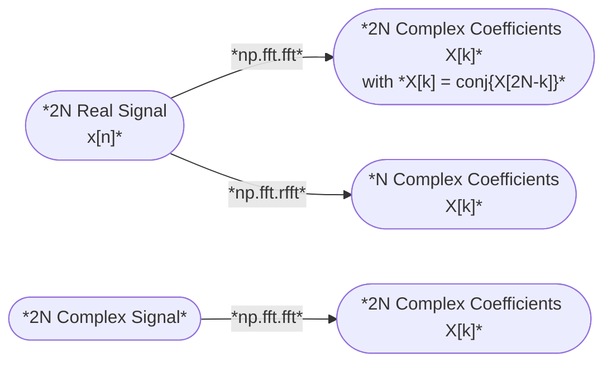
```mermaid
graph LR
A(["*2N Real Signal 
x[n]*"]) -->|"*np.fft.fft*"| B(["*2N Complex Coefficients X[k]*
with *X[k] = conj{X[2N-k]}*"])
A -->|"*np.fft.rfft*"| C(["*N Complex Coefficients
X[k]*"])

D(["*2N Complex Signal*"]) -->|"*np.fft.fft*"| E(["*2N Complex Coefficients X[k]*"])
```


For real input, the aforementioned `2N` redundancy allows you to get that `freqs[1 + i]` = `freqs[-i].conj` and therefore simplify the frequency spectrum but only adopt the positive frequency component.


```python
freq[::n // 2]
# [0, 1, ...,   N/2-1] / (DT * N)   if n is even
# [0, 1, ..., (N-1)/2] / (DT * N)   if n is odd
```

Or, a more suggested way to use `numpy.fft.rfft` (`numpy.fft.rfftfreq`) instead of `numpy.fft.fft` (`numpy.fft.fftfreq`), which is only designed for real input and intrinsically truncate the output coefficients and frequencies.

```python
coef = np.fft.rfft(sig)
freq = np.fft.rfftfreq(coef.size, dt)
```

Yet, please remember that only real signal can be used as an input of `numpy.fft.rfft` otherwise the imaginary parts are ignored by default.

### Windowing Effect

When performing spectral analysis using the DFT, we implicitly assume that the finite-duration signal is periodically extended. However, if the total sampling duration does not exactly match an integer multiple of the signal’s intrinsic period, a mismatch arises between the first and last sample points. This mismatch is interpreted by the DFT as a sharp discontinuity—or a jump—at the signal boundary.

<p align = 'center'>

</p>


This artificial discontinuity introduces **spectral leakage**, causing energy from specific frequency components to spread into adjacent frequencies, thereby distorting the true spectral content. To mitigate this issue, a **window function**—typically denoted $\mathcal{W}(t)$—is applied to taper the edges of the signal, reducing the contribution of the jump and suppressing leakage.

Typically, the wave function is a bell-shaped function with all non-negative values. Different window functions (e.g., rectangular, Hamming, Hanning, Blackman) offer different trade-offs between **frequency resolution** (main-lobe width) and **leakage suppression** (side-lobe attenuation). Choosing the appropriate window is essential for ensuring accurate and interpretable spectral results.

Here after, we are going to give an example of window function, the Hanning window, which is written as:
$$
\begin{align}
w(x)&=\frac{1}{2}\left[1-\mathrm{cos}(2\pi x)\right]\\
w[n]&=\frac{1}{2}\left[1-\mathrm{cos} \left(\frac{2\pi n}{N}\right)\right]
\end{align}
$$

It can be implemented in `numpy` as follow:

```python
# Without Normalization
sig *= np.hanning(sig.size)
```

However, applying a window modifies the signal’s amplitude and energy characteristics. This can introduce ambiguity when interpreting the resulting spectrum or comparing analyses across different window shapes. To ensure physical and quantitative consistency, **normalization** of the window function is often necessary. **Amplitude normalization** ensures that the peak value of the window is one, preserving the local signal scale. **Power normalization** adjusts the window so that the total energy of the signal—defined as the sum of squared values—remains unchanged after windowing. The amplitude and power normalization is also named <u>**$L_1$ and $L_2$ normalization**</u> as the amplitude and power can is proportional to the $L_1$ and $L_2$ norm of the signal, respectively. The choice of normalization method depends on the analytical goals, and plays a crucial role in ensuring accurate and meaningful spectral results.

The Hanning window has an average amplitude of $1/2=\int_0^1 w(x)\mathrm{d}x$ and an average power of 
$$
\begin{align}
\int_0^1 w^2(x)\mathrm{d} x = \frac{1}{4} \left\{\int_0^1 [1 - 2 \mathrm{cos}(2\pi x) + \mathrm{cos^2}(2\pi x)]\mathrm{d}x \right\}=\frac{1}{4}(1-0+\frac{1}{2}) = \frac{3}{8}
\end{align}
$$

A more quantitative estimation of the signal amplitude or power can be given by using a normalized window function.

```python
# Amplitude Normalization
sig *= np.hanning(sig.size) * 2

# Power Normalization
sig *= np.hanning(sig.size) * np.sqrt(8 / 3)
```

Some other window functions are also supported by `numpy` and `scipy`, which is summarized below:

<p align = 'center'>

    <i>Some Other Window Functions (without normalization).</i>
</p>


| **Name and Function** |                NumPy or SciPy Function                 |                           **w[n]**                           |              **Amplitude Normalization Factor**              |               **Power Normalization Factor **                |
| :-------------------: | :----------------------------------------------------: | :----------------------------------------------------------: | :----------------------------------------------------------: | :----------------------------------------------------------: |
| Rectangular (Boxcar)  |    `np.ones(N)` or `scipy.signal.windows.boxcar(N)`    |                             $1$                              |                             $1$                              |                             $1$                              |
|    Hann (Hanning)     |   `np.hanning(N)` or `scipy.signal.windows.hann(N)`    |  $0.5\left(1 - \cos\left(\frac{2\pi n}{N-1}\right)\right)$   |                          ${1}/{2}$                           |                       $\sqrt{{3}/{8}}$                       |
|        Hamming        |  `np.hamming(N)` or `scipy.signal.windows.hamming(N)`  |       $0.54 - 0.46\cos\left(\frac{2\pi n}{N-1}\right)$       |                            $0.54$                            |    $\sqrt{0.397}=\sqrt{\frac{25^2 + 21^2}{2 \cdot 46^2}}$    |
|       Blackman        | `np.blackman(N)` or `scipy.signal.windows.blackman(N)` | $0.42 - 0.5\cos\left(\frac{2\pi n}{N-1}\right) + 0.08\cos\left(\frac{4\pi n}{N-1}\right)$ |                            $0.42$                            | $\sqrt{0.274}=\sqrt{\frac{21^2 + 25^2 + 4^2}{2 \cdot 50^2}}$ |
|        Kaiser         |         `scipy.signal.windows.kaiser(N, beta)`         | $\frac{I_0\left(\beta\sqrt{1-\left(\frac{2n}{N-1}-1\right)^2}\right)}{I_0(\beta)}$ | $\frac{1}{2I_0(\beta)}\int_{-1}^{1} I_0\left(\beta\sqrt{1-x^2}\right) dx$ | $\sqrt{\frac{1}{2}\int_{-1}^{1} \left[\frac{I_0\left(\beta\sqrt{1-x^2}\right)}{I_0(\beta)}\right]^2 dx}$ |
|         Tukey         |         `scipy.signal.windows.tukey(N, alpha)`         | $0.5\left(1 + \cos\left(\frac{\pi(2n)}{\alpha N} - 1\right)\right)$ |                      $1 - {\alpha}/{2}$                      |       $\sqrt{1 - \frac{\alpha}{2} + \frac{\alpha}{4}}$       |
|       Gaussian        |        `scipy.signal.windows.gaussian(N, std)`         | $\exp\left(-\frac{1}{2}\left(\frac{n-\frac{N-1}{2}}{\sigma\frac{N-1}{2}}\right)^2\right)$ |                   $\sigma\sqrt{{\pi}/{2}}$                   |                     $\sigma\sqrt{\pi}/2$                     |
|       Bartlett        | `np.bartlett(N)` or `scipy.signal.windows.bartlett(N)` |       $1 - \frac{2\left|n-\frac{N-1}{2}\right|}{N-1}$        |                          ${1}/{2}$                           |                       $\sqrt{{1}/{3}}$                       |

- For Tukey: $\alpha$ is the cosine-tapered fraction $(0 \leq \alpha \leq 1)$
- For Kaiser: $I_0$ is the modified Bessel function of the first kind
- Gaussian approximations assume the window is appropriately scaled


<u>**As the magnitude and power spectra have different normalization factors, it is suggested that apply the normalization before the data outputting/plotting but not immediately after you proceed the Fourier transform.**</u>

In the end, we show the complete data processing diagram for ***windowed Fourier transform (WFT)***.

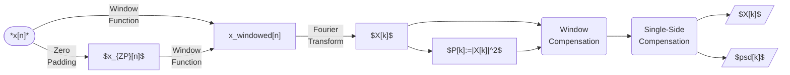
```mermaid
graph LR

A(["*x[n]*"]) -->|Window 
Function|B@{ shape: rect, label: "x_windowed[n]" }

A-->|Zero
Padding|C@{shape:rect, label: "$x_{ZP}[n]$"}

C -->|Window
Function|B

B -->|Fourier
Transform|D@{shape: rect, label: "$X[k]$"}

D -->H["$P[k]:=|X[k]|^2$"]

D --> E(Window
Compensation)

E --> F(Single-Side
Compensation)

F --> G@{ shape: lean-r, label: "$X[k]$"}


H --> E(Window
Compensation)

F --> K@{ shape: lean-r, label: "$psd[k]$"}

```


### Fence Effect and Zero-Padding

To further improve the interpretability of spectral results, addressing spectral leakage alone is not enough. Another source of distortion arises from the discretization of the frequency axis itself. When a signal's frequency component does not align exactly with the frequency bins defined by the DFT, its energy spreads into neighboring bins—a phenomenon known as the **fence effect**. To reduce this effect and achieve smoother spectral representations, we often apply a technique known as **zero-padding**, which is discussed below.

When using the Discrete Fourier Transform (DFT), we effectively project the signal onto a set of discrete frequency bins. If the actual frequency of a signal component does not align precisely with one of these bins, the energy spreads across multiple nearby bins—an artifact known as the **fence effect**. This leads to inaccurate spectral peak positions and broadening, especially when analyzing short-duration signals or signals with non-integer frequency components.

A common technique to mitigate the visual and analytical impact of the fence effect is **zero-padding**—extending the time-domain signal by appending zeros beyond its original length. While zero-padding does not increase the inherent frequency resolution, it interpolates the spectrum between the original DFT bins, producing a smoother and more detailed frequency-domain representation. This can help in better locating spectral peaks and distinguishing closely spaced features.

Zero-padding is particularly useful in peak detection, cross-spectral analysis, and visualization, where enhanced frequency granularity improves interpretability even though it doesn’t extract new information from the signal itself.

<p align = 'center'>

</p>
```python
n_padding = 29
coef = np.fft.rfft(sig, n = signal.size + n_padding)
freq = np.fft.rfftfreq(coef.size, dt)
```

<div STYLE="page-break-after: always;"></div>

## What Else Should You Know About the DFT and FFT?

### Gibbs Phenomenon

Although a discrete signal can be losslessly transformed using the Fourier transform, it still faces limitations when attempting to represent continuous functions with sharp discontinuities. A continuous function with an infinitely steep jump introduces an infinite derivative at the discontinuity. However, any finite, discrete sampling of that function cannot fully capture its high-frequency behavior near the jump.

From the perspective of the Fourier operator , the discontinuity is perceived as two adjacent sample points with a large difference, and a finite Fourier series will attempt to approximate this using a limited set of basis sinusoids. This leads to **overshooting and ringing** near the discontinuity—an effect known as the **Gibbs phenomenon**.

Mathematically speaking, even though the Fourier transform converges to the correct function almost everywhere, at the discontinuity itself it overshoots by a fixed percentage (~9%) regardless of how many harmonics are included. The oscillatory artifacts do not vanish with more terms; they merely become narrower and more localized.

The Gibbs phenomenon is not a numerical artifact but an intrinsic property of the Fourier basis when approximating non-smooth functions. In practical signal processing, techniques such as windowing, filtering, or switching to other basis functions (e.g., wavelets) are used to reduce its visible impact.

<p align = 'center'>

</p>

### Uncertainty Principle

In 

<p align = 'center'>
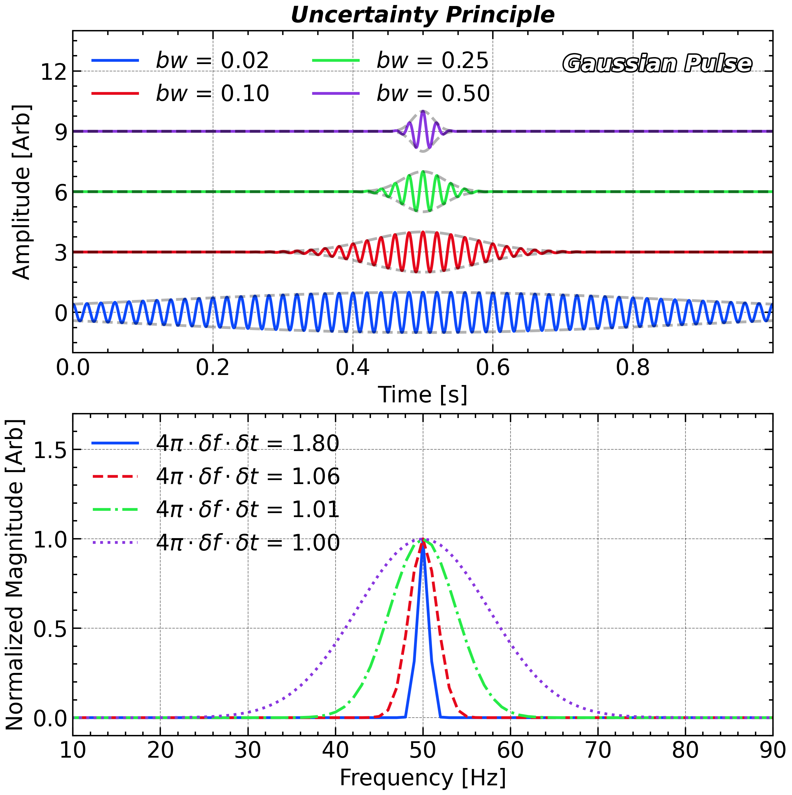
</p>

### Parseval's Theorem and Energy Conservation

> **Parseval's Theorem for CFT:**
> $$
> \begin{align}
> \int_{-\infty}^\infty x^2(t)\, dt = \int_{-\infty}^\infty X^2(f)\, df
> \end{align}
> $$
>
> 
>
> **for DFT:**
> $$
> \sum_{n=0}^{N-1}|x[n]|^2 = \frac{1}{N}\sum_{k=0}^{N-1}|X[k]|^2
> $$
>
> 

In the physical world, the square power of the amplitude often refers to some kind of ***energy*** or ***power***. For example, the square of the displacement ($x$) of a spring, $x^2$ is proportional to the elastic potential energy ($kx^2/2$, where $k$ describes the stiffness). In plasma physics, electromagnetic field contains the energy density ($u$) written as 

$$
u=u_E + u_B=\frac{1}{2}(\varepsilon_0 \mathit{E}^2 + \frac{1}{\mu_0}\mathit{B}^2)
$$


In this case, the ***energy*** of the signal naturally linked with the ***energy*** of the electromagnetic field. Nevertheless, the energy of a signal is an extensive property as it linearly increases with the length of the sample. In the ordinary investigation, the signal energy is always further converted as signal ***power***, which is an intensive property that describe the amplitude and is independent of signal length. The defition of power, *P*, can be written as:

$$
P&= \frac{1}{T}\int_{-T/2}^{T/2}|x(t)|^2 \mathrm{d}t\\
$$


or 
$$
\begin{align}
P&=\frac{1}{N\Delta t}\sum_{n=0}^{N-1}|x(n\Delta t)|^2 \Delta t\\
&=\frac{1}{N^2\Delta f}\sum_{k=0}^{N-1}|X(k\Delta f)|^2 \Delta f \\
&=\sum_{k=0}^{N-1} \boxed{\frac{1}{Nf_s} |X(k\Delta f)|^2}\, \Delta f\\
&=\sum_{k=0}^{N-1}PSD[k]\Delta f
\end{align}
$$


for DFT. Considering that DFT yields both positive and negative frequency, we typically fold the DFT result. Naturally, the definition of *power spectral density (PSD)* is given as:

$$
\begin{align}
&\sum_{k=0}^{N-1} PSD[k\Delta f] \Delta f =\\
\mathrm{For\ Even \ }N:\ &\Delta f \left[PSD[0] + \sum_{k=1}^{{N}/{2}-1} 2\cdot PSD[k\Delta f] + PSD[f_{N/2}]\right]\\
\mathrm{For\ Odd \ }N:\ &\Delta f \left[PSD[0] + \sum_{k=1}^{{(N-1)}/{2}} 2\cdot PSD[k\Delta f]\right]
\end{align}
$$


$PSD[0]$ represents the DC component and is ignored in the spectral analysis for the most(but not all) time.

```python
N = coef.size
fs = 1 / dt
psd = (np.abs(coef) ** 2) / (N * fs)

if N % 2 == 0:
    psd[1:-1] *= 2
else:
    psd[1:] *= 2
```

According to the lineairty of $\mathcal{F}$, $X[k]$ should also be proportional to the signal amplitude. Easily catch that the coefficient at the exact wave frequency has the form of 

$$
\begin{align}
|X[k]| = \frac{1}{2}A_k \cdot f_s \cdot T 
\end{align}
$$


1/2 in this equation arises from the fact that $\int_0^{2\pi}\mathrm{sin^2}x \mathrm{d}x=1/2$.

### More Properties of Fourier Transform

A super powerful property of Fourier transform is that:
$$
\mathcal{F}\left[\frac{\mathrm{d}}{\mathrm{d}t}x(t)\right]=(i2\pi f)\cdot X(f)
$$


which can be easily proved by doing derivative to the both sides of the inverse Fourier transform:
$$
\begin{align}
\frac{\mathrm{d}}{\mathrm{d}t}[x(t)]&=\int_{-\infty}^{+\infty} X(f) (i2\pi f)e^{i 2 \pi f t} \mathrm{d}f\\
&=\int_{-\infty}^{+\infty} \left[(i2\pi f)\cdot X(f)\right] e^{i 2 \pi f t} \mathrm{d}f\\
&=\mathcal{F}^{-1}\left[(i2\pi f)\cdot X(f)\right]
\end{align}
$$


It can be denoted as 
$$
{{\mathrm{d}}/{\mathrm{d}t}}\leftrightarrow i 2\pi f
$$


One can also extend this property to
$$
({{\mathrm{d}/}{\mathrm{d}t}})^n\leftrightarrow (i 2\pi f)^n
$$


In plasma physics, the conventional way to express the electromagnetic field.

It should be noted that this derivation property change a little bit for discrete Fourier transform:

$$
\begin{align}
\frac{\Delta x(t)}{\Delta  t}&=\int_{-\infty}^{+\infty}X(f) \frac{e^{2\pi i f (t+\Delta t)}-e^{2\pi i f t}}{\Delta t} \mathrm{d}f\\
&=\mathcal{F}^{-1}[\frac{e^{2\pi if \Delta t} - 1}{\Delta t}\cdot X(f)]
\end{align}
$$


| Property                   | Continuous-Time Fourier Transform (FT)                 | Discrete Fourier Transform (DFT/FFT)                         |
| -------------------------- | ------------------------------------------------------ | ------------------------------------------------------------ |
| Linearity                  | $\mathcal{F}\{a\,x(t) + b\,y(t)\} = a\,X(f) + b\,Y(f)$ | $\mathrm{DFT}\{a\,x[n] + b\,y[n]\} = a\,X[k] + b\,Y[k]$      |
| Time Shift                 | $x(t - t_0) \rightarrow X(f)\,e^{-j 2\pi f t_0}$       | $x[n - n_0] \rightarrow X[k]\,e^{-j 2\pi k n_0 / N}$         |
| Frequency Shift            | $x(t)\,e^{j 2\pi f_0 t} \rightarrow X(f - f_0)$        | $x[n]\,e^{j 2\pi k_0 n / N} \rightarrow X[(k - k_0)\bmod N]$ |
| Time-Domain Convolution    | $x(t) * h(t) \rightarrow X(f)\,H(f)$                   | $x[n] \circledast h[n] \rightarrow X[k]\,H[k]$ (circular)    |
| Time-Domain Multiplication | $x(t)\,h(t) \rightarrow X(f) * H(f)$                   | $x[n]\,h[n] \rightarrow X[k] * H[k] / N$                     |
| Derivative (Time Domain)   | $\frac{d^n x(t)}{dt^n} \rightarrow (j 2 \pi f)^n X(f)$ | $\Delta^n x[n] \rightarrow X[k] \cdot (e^{j 2 \pi k / N} - 1)^n$ |
| Conjugate Symmetry         | $x(t) \in \mathbb{R} \Rightarrow X(-f) = X^*(f)$       | $x[n] \in \mathbb{R} \Rightarrow X[N - k] = X^*[k]$          |
| Parseval's Theorem         | $\int |x(t)|^2\,dt = \int |X(f)|^2\,df$                | $\sum |x[n]|^2 = \frac{1}{N} \sum |X[k]|^2$                  |
| Frequency Resolution       | Continuous (infinitesimal)                             | $\Delta f = \frac{f_s}{N}$                                   |
| Spectral Periodicity       | $X(f)$ not periodic                                    | $X[k]$ is periodic with period $N$                           |
| Periodic Input Duality     | Periodic $x(t) \Rightarrow$ discrete $X(f)$            | Periodic $x[n] \Rightarrow$ sparse $X[k]$                    |

### The performance of `numpy.fft.fft` and `scipy.signal.fft`

The invention of the ***(Cooley–Tukey) Fast Fourier Transform (FFT) algorithm*** reduced the time complexity of DFT from $\mathcal{O}(N^2)$ to $\mathcal{O}(N\mathrm{log}N)$ by efficiently decomposing the DFT into smaller computations, i.e., [divide-and-conquer](https://en.wikipedia.org/wiki/Divide-and-conquer_algorithm).  

Most tutorials introduce the ***radix-2*** FFT, which splits the signal into ***two*** sub-signals with exactly the same length and requires the length of the signal to be an integer power of ***2***. This requirement is hard to satisfy in common applications without zero-padding, which actually includes unwanted modification of the original signal. To overcome that, ***radix-3*** and ***radix-5*** FFTs are developed and implemented. 

Still, the divide-and-conquer strategy fails when the signal length *N* consists of at least one big prime number factor (e.g, 10007) as the signal is hard to split. In that situation, the ***Bluestein's algorithm***, which is essentially a ***Chirping-Z transform***, is used. This algorithm takes the $\mathcal{F}$ operation as a convolution and then uses the *convolution theorem* in the calculation of DFT coefficients. The convolution property allows us to extend the signal length to a proper, highly composite number with zero-padding (denoted as *M*), but the coefficients and frequency resolution remain unchanged. The final time complexity of *Bluestein's algorithm* goes to $\mathcal{O}(N+M\mathrm{log}M)$, where the first term originates from the iterate all the frequency component.

<p align = 'center'>
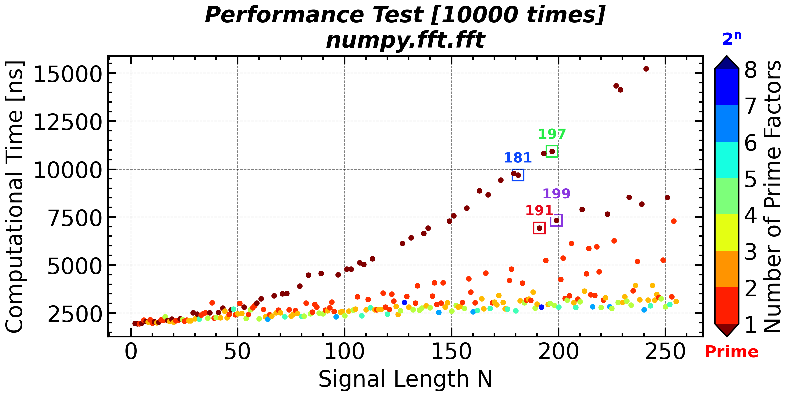
</p>


From the performance test, we observe that signals with prime-number lengths (dark red dots) often incur higher computational costs. For example:
$$
\begin{align}
N&=181=182-1=2^1\times\boxed{7^1\times13^1}-1\\
N&=197=198-1=2^1\times3^2\times\boxed{11^1}-1\\
\end{align}
$$
In contrast, signals with highly composite number lengths (dark blue dots), such as those with lengths being integer powers of 2, usually have the lowest computation time.

However, some prime numbers like: 
$$
\begin{align}
N&=191=192-1=2^6\times3^1-1\\
N&=199=200-1 = 2^3\times5^2-1
\end{align}
$$
can also exhibit relatively efficient performance due to their proximity to highly factorable numbers.

Modern implementation of the FFT algorithm, such as `pocketfft`, combines the above two methods (*Cooley–Tukey* and *Bluestein*). This *C++* package is used in both `numpy` and `scipy(1.4.0+)`  for their FFT implementation. Besides, `fftw`, which stands for the somewhat whimsical title of *"Fastest Fourier Transform in the West"*, is also very popular and used in the `fft/ifft` functions of *MATLAB*. Its *Python* implementation  can be found in the `pyfftw` package.

The `scipy.signal.fft` additionally provides an input parameter `workers:` *`int, optional`* to assign the maximum number of workers to use for parallel computation. If negative, the value wraps around from `os.cpu_count()`. For parallel computation, you need to input a batch of signals with shape of $N\times K$.

***<u>Reference</u>**:*

1. Cooley, James W., and John W. Tukey, 1965, “An algorithm for the machine calculation of complex Fourier series,” Math. Comput. 19: 297-301.
2. Bluestein, L., 1970, “A linear filtering approach to the computation of discrete Fourier transform”. IEEE Transactions on Audio and Electroacoustics. 18 (4): 451-455.
3. https://dsp.stackexchange.com/questions/24375/fastest-implementation-of-fft-in-c
4. https://www.fftw.org/

### Wiener–Khinchin Theorem

For a wide-sense stationary (WSS) random process $x(t)$, the **autocorrelation function** depends only on the time difference $\tau$, not on absolute time:
$
R_x(\tau) = \mathbb{E}[x(t)\,x(t + \tau)]
$
The **power spectral density** is defined as the **Fourier transform** of the autocorrelation function:
$
S_x(f) = \int_{-\infty}^{\infty} R_x(\tau)\,e^{-j 2\pi f \tau}\,d\tau
$
This is known as the **Wiener–Khinchin theorem**, and it is valid *only* under the assumption of WSS. The PSD $S_x(f)$ then describes how the total power of the signal is distributed across different frequency components. The relationship between PSD and the Fourier coefficients has been introduced in the previous section.

This theorem tells the intrinsic relationship between the *PSD* and *ACF*. Its contra-position claims that if the PSD doesn't equal to the Fourier transform of the ACF, the signal is not a *w.s.s* signal. The difference between them signify the nature of the solar wind parameters —— They are different from the NOISE! But, for some specific frequency range, they agree with each other well. It should be noticed that the closeness between them doesn't gurantee the signal to be *w.s.s*.

### Wide-Sense Stationarity

Without WSS, the autocorrelation $R_x(t_1, t_2)$ becomes a function of two independent time variables rather than just the lag $\tau$. In such cases, the expectation of the instantaneous wave power $\mathbb{E}[{x^2(t)}]=R_x(t, t)\neq R_x(0=t-t)$ is not independent on $t$. Hence, the Fourier transform of the autocorrelation no longer represents a meaningful or consistent frequency-domain power measure.

> **Therefore, only stationary processes have a well-defined power spectral density, and only then can the spectrum be interpreted as the distribution of power over frequency.**


This condition separates **deterministic Fourier transforms** (which apply to individual signals) from **statistical spectral analysis** (which applies to ensembles of signals or realizations of random processes).

$$
x(t) = A_1 \mathrm{sin}(\omega_1 t) + A_2 \mathrm{sin} \left (\omega_2t + \frac{1}{2}\beta t^2\right )
$$

$$
\begin{align}

R_x(t_1, t_2) & = \mathbb{E}[{x(t_1)x(t_2)}]\\
& = \mathbb{E} \left [A_1^2 \cdot \mathrm{sin}(\omega_1 t_1) \cdot \mathrm{sin}(\omega_1 t_2) + A_2^2 \cdot \mathrm{sin}\left(\omega_2 t_1 + \frac{1}{2}\beta t_1^2 \right ) \cdot \mathrm{sin}\left(\omega_2 t_2 + \frac{1}{2}\beta t_2^2 \right ) \right] \\
 & + A_0 A_1 \left\{ \mathbb{E}\left[\mathrm{sin}(\omega_1 t_1)\mathrm{sin}\left(\omega_2 t_2 + \frac{1}{2}\beta t_2^2 \right ) + \mathrm{sin}(\omega_1 t_2)\mathrm{sin}\left(\omega_2 t_1 + \frac{1}{2}\beta t_1^2 \right ) \right] \right\}

\end{align}
$$

Assuming the window length $T\gt \tau=t_2-t_1\gg 1/f_0$, the square term can be converted to an univariate function of $\tau = t_2-t_1$ by product-to-sum identity. The cross terms can be treated in a similar way ***unless*** $\omega_1 \approx \omega_2+\beta t$, in which condition the 

$$
\mathrm{sin}(\omega_1 t_1)\mathrm{sin}\left(\omega_2 t_2 + \frac{1}{2}\beta t_2^2 \right )=\frac{1}{2} \left[ \mathrm{cos}\left( \omega_1 t_1 -\omega_2 t_2-\frac{1}{2}\beta t_2^2 \right) - \mathrm{cos}\left( \omega_1 t_1 + \omega_2 t_2+\frac{1}{2}\beta t_2^2 \right) \right]
$$

The second terms traverse the whole wave phase from $0$ to $2\pi$ therefore has a expectation of zero. As $\omega_1 t_1-\omega_2 t_2-\frac{1}{2}\beta t_2^2\approx \omega_1 (t_1-t_2) + \frac{1}{2}\beta t_2^2$, the first term can neither written as a function of $\tau$ nor converge to zero in the statistical sense. Thus, it is not wide-sense stationary. When $\omega_1$ is well separated with $\omega_2+\beta t$, the first term again traverse the whole wave phase and the signal return to wide-sense stationary. 


### What If the Signal Is Not Stationary?

For nonstationary signals, the PSD is ill-defined or misleading. In such cases, time-frequency analysis techniques such as:

- **Short-Time Fourier Transform (STFT)**: analyzes local frequency content assuming approximate stationarity within short windows;
- **Wavelet Transform**: offers multi-scale, adaptive analysis of transient and time-varying features;

can be used to track how the spectrum evolves over time, even though no stationary PSD exists.

### Polynomial Trend as Seen by DFT


### Sliding Window

`numpy.lib.stride_tricks.sliding_window_view(x, window_shape, axis=None, *, subok=False, writeable=False)` provides the function for re-organizing the signal into several sub-chunk. This function can only give a stride of one. For a customized stride, you need to use `numpy.lib.stride_tricks.as_strided(x, shape=None, strides=None, subok=False, writeable=True)`. This function can be unsafe and crash your program.  

The `bottleneck` package, which is safer and more efficient,  is more suggested for common usage of moving windows, like moving-average and moving-maximum. The following code shows how to use the `bottleneck` functions and their expected results.

```python
# -------------------------------
# Method 1: sliding_window_view (fixed stride = 1)
# -------------------------------
window_size = 4
windows_stride1 = sliding_window_view(sig, window_shape=window_size)

# -------------------------------
# Method 2: as_strided (custom stride, use with caution!)
# -------------------------------
custom_stride = 2
n_windows = (len(sig) - window_size) // custom_stride + 1
shape = (n_windows, window_size)
strides = (sig.strides[0] * custom_stride, sig.strides[0])

windows_custom = as_strided(sig, shape=shape, strides=strides)

# -------------------------------
# Method 3: bottleneck (safe, NaN-aware window functions)
# -------------------------------
print("\n[3] bottleneck window functions:")
ma = bn.move_mean(sig, window=3, min_count=1)
mm = bn.move_max(sig, window=3, min_count=1)
std = bn.move_std(sig, window=3, min_count=1)

```

<div STYLE="page-break-after: always;"></div>

## How to Deal With Noise?

### What is Noise?

Noise refers to random or unwanted fluctuations that obscure the true underlying signal in your data. In spectral analysis, understanding the properties and sources of noise is crucial for interpreting results, estimating signal-to-noise ratio (SNR), and designing effective filtering or denoising strategies. In plasma physics, the noise originates from both physical (e.g., plasma turbulence) and non-physical process (e.g., measurement uncertainty). 

When the underlying process is **stochastic**—that is, governed by probabilistic rules—each individual time series obtained through measurement is called a **realization** (or sample path) of the underlying random process. While the random process describes the full ensemble of possible outcomes, a realization is a single, concrete instance that we analyze in practice.

<p align = 'center'>
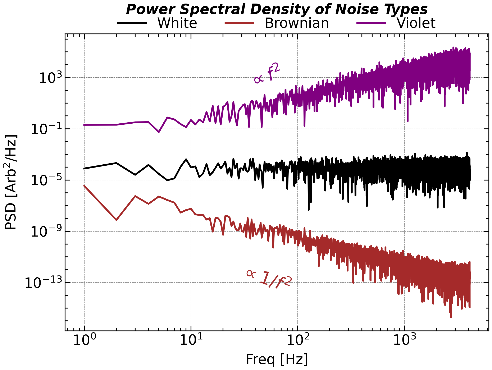
</p>

In audio engineering, electronics, physics, and many other fields, the color of noise or noise spectrum refers to the power spectrum of a noise signal (a signal produced by a stochastic process). Different colors of noise have significantly different properties. For example, as audio signals they will sound different to human ears, and as images they will have a visibly different texture. Therefore, each application typically requires noise of a specific color. This sense of 'color' for noise signals is similar to the concept of timbre in music (which is also called "tone color"; however, the latter is almost always used for sound, and may consider detailed features of the spectrum).

The practice of naming kinds of noise after colors started with white noise, a signal whose spectrum has equal power within any equal interval of frequencies. That name was given by analogy with white light, which was (incorrectly) assumed to have such a flat power spectrum over the visible range. Other color names, such as pink, red, and blue were then given to noise with other spectral profiles, often (but not always) in reference to the color of light with similar spectra. Some of those names have standard definitions in certain disciplines, while others are informal and poorly defined. Many of these definitions assume a signal with components at all frequencies, with a power spectral density per unit of bandwidth proportional to $1/f^\beta$ and hence they are examples of power-law noise. For instance, the spectral density of white noise is flat ($\beta$ = 0), while flicker or pink noise has $\beta$ = 1, and Brownian noise has $\beta$ = 2. Blue noise has $\beta$ = -1.

### Signal-to-Noise Ratio and Decibel

Signal-to-Noise Ratio (SNR) is a key metric that quantifies the strength of a signal relative to the background noise. It is widely used in signal processing, communications, and instrumentation to assess the quality and reliability of a measurement or transmission.

The SNR is defined as the ratio of the power of the signal to the power of the noise:
$$
\mathrm{SNR} = \frac{P_{\text{signal}}}{P_{\text{noise}}}
$$
where $P_{\text{signal}}$ is the average power of the signal, and $P_{\text{noise}}$ is the average power of the noise.

Since this ratio can span several orders of magnitude, it is often expressed in **decibels (dB)**:
$$
\mathrm{SNR}_{\mathrm{dB}} = 10 \log_{10} \left( \frac{P_{\text{signal}}}{P_{\text{noise}}} \right)
$$
For amplitude-based SNR (when measuring signal and noise in terms of root-mean-square (RMS) amplitude), the formula becomes:
$$
\mathrm{SNR}_{\mathrm{dB}} = 20 \log_{10} \left( \frac{A_{\text{signal}}}{A_{\text{noise}}} \right)
$$

#### Interpretation

- **Higher SNR** indicates a cleaner, more detectable signal.
- **0 dB** means the signal and noise power are equal.
- **Negative SNR** indicates the noise power exceeds signal power.

***Decibel (dB, Deci-Bel)***  is frequently used in describing the intensity of the signal. This quantity is defined as the 


|     Decibel     |  0   |  1   |  3   |  6   |  10  |  20  |
| :-------------: | :--: | :--: | :--: | :--: | :--: | :--: |
|  Energy Ratio   |  1   | 1.12 | 1.41 | 2.00 | 3.16 |  10  |
| Amplitude Ratio |  1   | 1.26 | 2.00 | 3.98 |  10  | 100  |


Due to the fact that $2^{10}\approx10^3$, 3 dB corresponds to a energy ratio of $10^{3/10}=\sqrt[10]{1000}\approx \sqrt[10]{1024}=2$.

The adoption of decibel instead of the conventional physical unit has three advantage:

- It allows the direction addition when compare the amplitude of the signal.
- When you are not confident about the magnitude of the uncalibrated data, you can just use dB to describe the ambiguous intensity.
- The [***Weber–Fechner law***](https://en.wikipedia.org/wiki/Weber-Fechner_law) states that human perception of stimulus intensity follows a logarithmic scale, which is why decibels—being logarithmic units—are used to align physical measurements with human sensory sensitivity, such as in sound and signal strength.

### Artificial Noise Generation

#### Method 1: Approximate $\mathrm{d}x/\mathrm{d}t$ by $\Delta x/\Delta t$
According to the property of Fourier transform, the convolution in the .
```python
time = np.linspace(0, 1, 10000, endpoint=False)
dt = time[1] - time[0]

white_noise = np.random.randn(time.size)
brownian_noise = np.cumsum(np.random.randn(time.size)) * dt
violet_noise = np.diff(np.random.randn(time.size + 1)) / dt
```

#### Method 2: Rescale the frequency spectrum of the white noise [Suggested]

```python
time = np.linspace(0, 1, 10000, endpoint=False)
dt = time[1] - time[0]
fs = 1 / dt
freq = np.fft.rfftfreq(len(time), dt)

brownian_noise_fft = np.fft.rfft(np.random.randn(time.size))
brownian_noise_fft[1:] /= freq[1:] ** 1
brownian_noise_fft[0] = 0
brownian_noise = np.fft.irfft(brownian_noise_fft)

violet_noise_fft = np.fft.rfft(np.random.randn(time.size))
violet_noise_fft[1:] /= freq[1:] ** -1
violet_noise_fft[0] = 0
violet_noise = np.fft.irfft(violet_noise_fft)
```

Besides these two methods, one can also get colored noise by filtering white noise. A colored noise that accurately follows its expected power spectrum requires the order of the filter to be high enough. Even though this 

### "Noise" of Noise
From the power spectra of noises, one can see that the PSD of the generated noise may randomly deviates from the theoretical expectation, i.e., the exactly power-law PSD. 

The Fourier coefficient computed as 
$$
\begin{align}

X[k]:=\sum_0^{N-1}x[n]\mathrm{e}^{\mathit{i}2\pi  n k}

\end{align}
$$
can be deemed as a <u>**weighted summation**</u> of the signal $x[n]$. When $x[n]$ are independent identically distributed (*i.i.d*) random variables, their weighted summation approaches the Normal distribution when *N* is large enough, according to the ***Central Limit Theorem***. Thus, the *PSD*, defined as the square sum of the real and imaginary parts, naturally follows the *Kappa* Distribution with the freedom of 2. The above statement requires that he real and imaginary parts are independent to each other, which can be proved by calculating their covariance.


<p align = 'center'>
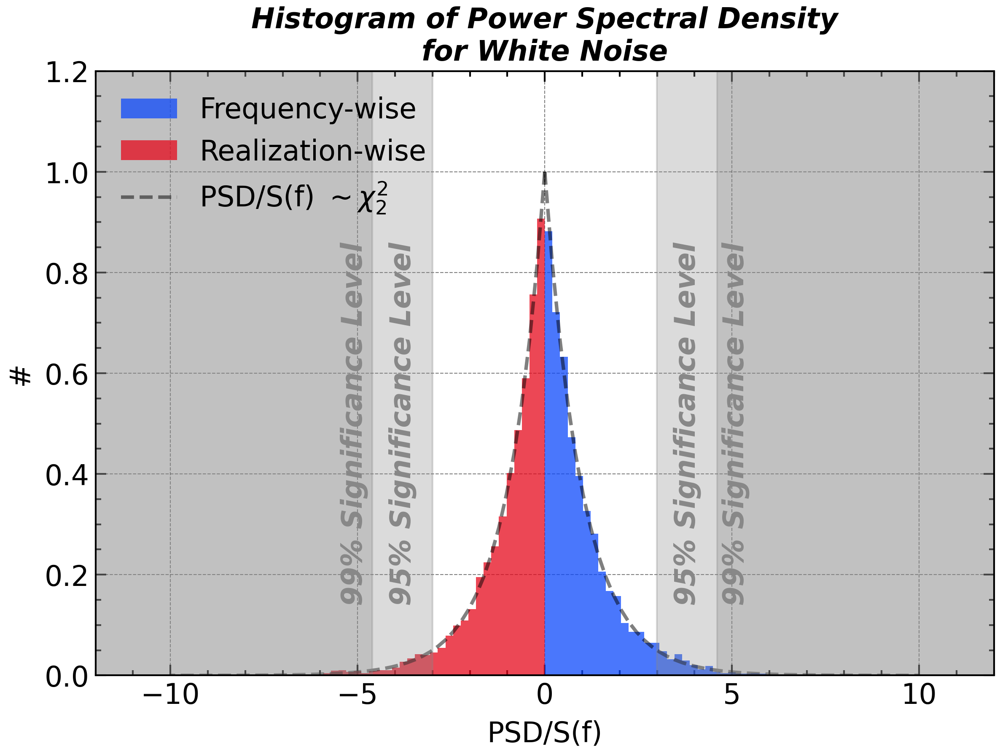
</p>

It should be noted that the periodic signals like $\mathrm{sin}\omega t$ are not *i.i.d*. These signals are not even *independent*, which means that even the **Lindeberg (-Feller) CLT**  can not guarantee their Fourier coefficients converged to a Normal distribution. Commonly, its *PDF* still follows a bell-shaped curves but the mean and variance dependent on the *SNR*.

[^1]: which proved that independent but not identical distributed random variables satisfy the CLT.

To reduce this kind of uncertainty, we are going to introduce the following three method: 1. Barlett Method; 2. Welch Method; and 3. Blackman–Tukey Method.

### Welch Method [`scipy.signal.welch`]
Welch proposed that the averaging the power spectral density instead of the coefficient can largely reduce the flutuation levels of the spectrum. Therefore, we may just get a.

The averaging operation must be taken after the conversion from coefficient to power other wise the averaged coefficients are actually unchanged.

This method can be implemented by `scipy.signal.welch` function:

```python
time = np.linspace(0, 1, 10000, endpoint=False)
fs = 1 / (time[1] - time[0])
freq = np.fft.rfftfreq(len(time), time[1] - time[0])

noise_white = np.random.randn(time.size)

coef_white = np.fft.rfft(noise_white, axis=-1).T
psd_white = (np.abs(coef_white) ** 2) / fs / time.size

freq_welch, psd_white_welch = scipy.signal.welch(noise_white, fs, window = 'hann', nperseg=2 ** 10)
```

Except for averaging, one can also  choose the median of the PSD across different segements and obtain a less disturbed PSD. This choice can be implemented by `scipy.signal.welch(signal, fs, average = 'median')`. The default parameter for `average` is `mean`, corresponding to the normal Welch method.

For each segement, you can also chose the window function to reduce the spectral leakage. The result of this method is shown below:

<p align = 'center'>
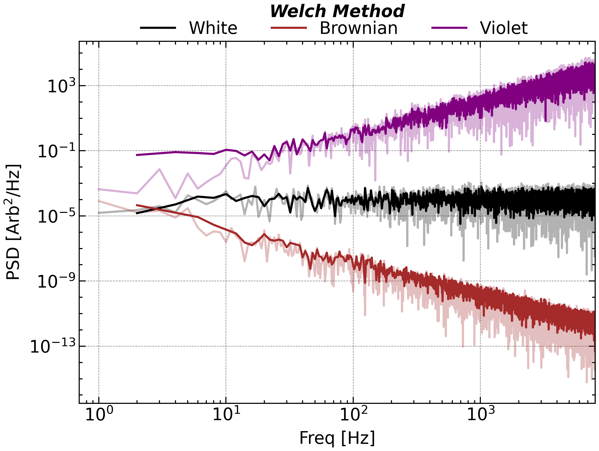
</p>

One can also verify that the distribution of the PSD convert to *Gamma* Distribution, which has a ***Probability Density Function (PDF)*** of:

$$
\begin{align}
PDF(x; \alpha, \lambda)=\frac{\lambda^\alpha}{\Gamma(\alpha)} x ^{\alpha - 1} e^{-\lambda x}
\end{align}
$$

The mean and variance of this distribution is $\alpha/\lambda$ and $\alpha / \lambda^2$. When the number of segments ($\alpha$) decrease/increase to 1/$+\infty$, the Gamma distribution degenerate to exponential/normal distribution.

<p align = 'center'>

</p>


In ***Bartlett Method***, the ratio of ``N_STEP`` and ``N_PER_SEG`` is fixed at unity, which means every segement has no overlapping with each other. It can be regarded as a special case of the *Welch Method* while it is actually proposed earlier.

### Blackman-Tukey Method

***Blackman-Tukey method*** gives another approach to a high SNR estimation of *PSD* based on the *W.S.S* properties of the signal and *Wiener–Khinchin theorem*. This method consists of three steps:

1. Calculate the (***double-sided***) ACF of the signal
2. Apply a window function to the ACF
3. Do DFT to the windowed ACF.


```mermaid
graph LR;
    A[Signal] --> B[ACF];
    B --> C[Window];
    C --> D[DFT];
    D --> E[PSD];
```


It should be keep in mind that these methods are all build based on the assumption of wide-sense stationarity of the signal.[Explain WSS here]. A noise signal, no matter its color, is wide-sense stationary. However, a real time series of a physics quantity cannot gurantee its wide-sense stationarity. Since W.S.S is the only presumption of these method, they are also termed ***Nonparametric Estimator***.

Apart from splitting the signal into several segments, one can also downsample the signal and get multiple sub-signal with different startup time. However, the maximum frequency of the yield spectrum will also be reduced by a factor of ``N_DOWNSAMPLE``. At the same time, the frequency resolution remains to be $(N\Delta t)^{-1}$. 

<p align = 'center'>

</p>

### Signal Over Noise

A signal composed of a deterministic sinusoidal component and additive noise can be written as:
$$
x(t) = s(t) + n(t)
$$
The Fourier coefficient at frequency $f$ is:
$$
\tilde{X}(f) = \tilde{S}(f) + \tilde{N}(f)
$$
where $\tilde{S}(f)$ is the deterministic signal component (a fixed complex number), and $\tilde{N}(f)$ is the Fourier transform of the noise. If the noise $n(t)$ is zero-mean wide-sense stationary, then:
$$
\tilde{N}(f) \sim \mathcal{CN}(0, \sigma_n^2)
$$
That is, $\tilde{X}(f)$ is a complex Gaussian random variable:
$$
\tilde{X}(f) \sim \mathcal{CN}(\mu, \sigma_n^2), \quad \mu = \tilde{S}(f)
$$
The power spectrum estimate is:
$$
\hat{S}_x(f) = |\tilde{X}(f)|^2
$$
Since $|\tilde{X}(f)|^2$ is the sum of squares of two independent Gaussian variables (real and imaginary parts), it strictly follows a non-central chi-squared distribution:
$$
\hat{S}_x(f) \sim \sigma_n^2 \cdot \chi^2(2, \lambda), \quad \lambda = \frac{|\mu|^2}{\sigma_n^2}
$$
In other words, the deterministic signal provides a **complex offset** (mean $\mu$), and the noise determines the **variance** $\sigma_n^2$. The resulting power spectrum estimate is exactly a non-central chi-squared distribution with 2 degrees of freedom.

<p align = 'center'>

</p>


<div STYLE="page-break-after: always;"></div>

## Faulty Sample

### Lomb-Scargle Periodogram [*scipy.signal.lombscargle*]

The Lomb-Scargle periodogram is a powerful method for estimating the power spectrum of unevenly sampled time series. Unlike the standard FFT-based periodogram, which requires uniformly spaced data, Lomb-Scargle is widely used in astronomy and geophysics where data gaps are common. This section introduces its mathematical foundation, physical interpretation, and provides practical examples using `scipy.signal.lombscargle`.

The basic idea of the Lomb-Scargle periodogram is to fit the observed time series by a sinusoidal function $A\mathrm{sin}{(2\pi ft)}+B\mathrm{cos}{(2\pi ft)}$ with frequency $f$ in the sense of mean square deviation. The yield coefficient A can be a estimate of the signal's magnitude at frequency $f$. 

Minimize the residual sum of squares:

$$
\chi^2(A,B) = \sum_{n=1}^N \bigl[x_n - \bar x - A\cos(\omega t_n) - B\sin(\omega t_n)\bigr]^2.
$$
Setting $\partial\chi^2/\partial A = \partial\chi^2/\partial B = 0$ yields the normal equations:

$$
\begin{pmatrix} \sum\cos^2(\omega t_n) & \sum\cos(\omega t_n)\,\sin(\omega t_n)\\[0.5em] \sum\cos(\omega t_n)\,\sin(\omega t_n) & \sum\sin^2(\omega t_n) \end{pmatrix} \begin{pmatrix}A\\ B\end{pmatrix} = \begin{pmatrix} \sum (x_n-\bar x)\cos(\omega t_n)\\[0.25em] \sum (x_n-\bar x)\sin(\omega t_n) \end{pmatrix}.
$$


Define
$$
\begin{align}
C &= \sum\cos^2(\omega t_n)\\
S &= \sum\sin^2(\omega t_n)\\
D &= \sum\cos(\omega t_n)\sin(\omega t_n)\\
X_c &= \sum(x_n-\bar x)\cos(\omega t_n)\\
X_s &= \sum(x_n-\bar x)\sin(\omega t_n)
\end{align}
$$
Then

$$
A = \frac{X_c\,S - X_s\,D}{C\,S - D^2},  \quad B = \frac{X_s\,C - X_c\,D}{C\,S - D^2}.
$$


$P(\omega) \;=\; \frac12\bigl(A^2 + B^2\bigr).$

Substituting the expressions for $A$ and $B$ yields a form that still involves the cross‐term $D$.

<p align = 'center'>
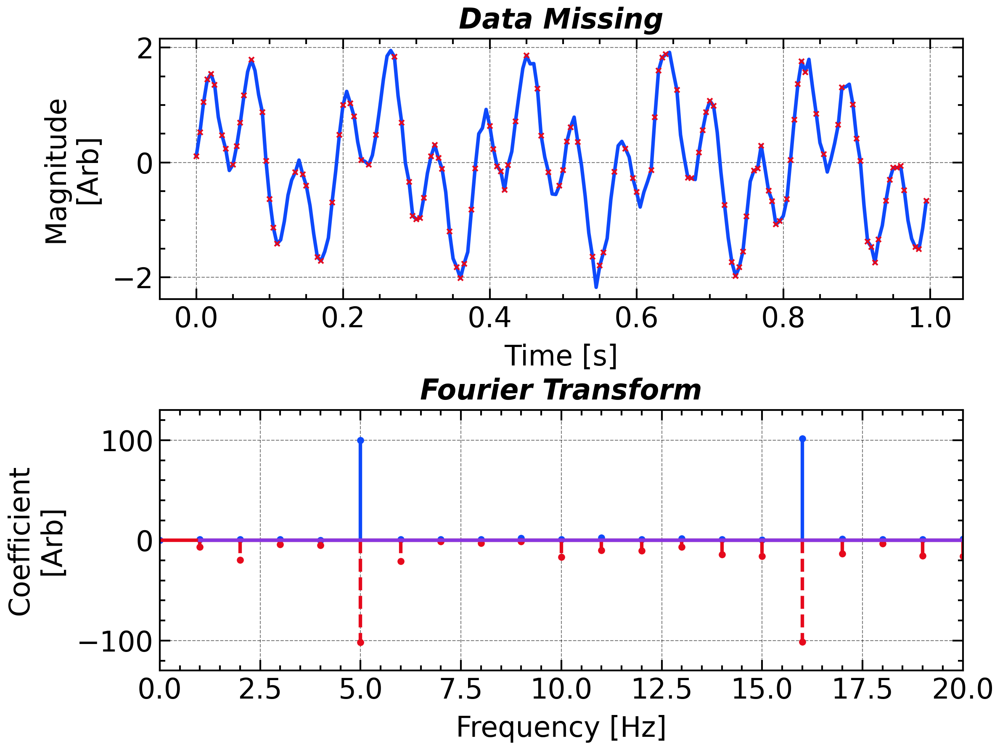
</p>

#### Introducing the Phase Offset $\tau$

To eliminate the cross‐term, shift the time origin:

$t_n' = t_n - \tau,$

and choose $\tau$ so that

$\sum_{n=1}^N \sin\bigl(2\omega t_n'\bigr) = 0 \quad\Longleftrightarrow\quad \tan(2\omega\tau) = \frac{\sum_{n=1}^N \sin(2\omega t_n)}{\sum_{n=1}^N \cos(2\omega t_n)}.$

This makes $\sum\cos(\omega t_n'),\sin(\omega t_n')=0$, diagonalizing the normal equations. The power then becomes

$P(\omega) = \frac12\left[ \frac{\bigl[\sum (x_n-\bar x)\cos\!\bigl(\omega (t_n-\tau)\bigr)\bigr]^2} {\sum \cos^2\!\bigl(\omega (t_n-\tau)\bigr)} \;+\; \frac{\bigl[\sum (x_n-\bar x)\sin\!\bigl(\omega (t_n-\tau)\bigr)\bigr]^2} {\sum \sin^2\!\bigl(\omega (t_n-\tau)\bigr)} \right].$


Compare with the original frequency spectrum, the Lomb-Scargle periodogram contains some irregular frequency leakage. The Lomb-Scargle periodogram finally converge to the Fourier periodogram when the sample time is uniformly distributed.

### Correlation Function

>A correlation function is a function that gives the statistical correlation between random variables, contingent on the spatial or temporal distance between those variables. If one considers the correlation function between random variables representing the same quantity measured at two different points, then this is often referred to as an autocorrelation function, which is made up of autocorrelations. Correlation functions of different random variables are sometimes called cross-correlation functions to emphasize that different variables are being considered and because they are made up of cross-correlations. ——Wikipedia

$$
\begin{align}
{R_{XY}}(t, t + \tau) := \mathbb{E}\left[ {X(t)} \overline{Y(t + \tau)} \right]
\end{align}
$$

where the overline represents the complex conjugate operation when $X$ and $Y$ are complex signal. Specifically, the correlation function between $X$ and itself is called autocorrelation function:

$$
\begin{align}
{R_{XX}}(t, t + \tau) := \mathbb{E}\left[ {X(t)} \overline{X(t + \tau)} \right]
\end{align}
$$
If $X$ is a wide-sense stationary signal, then ${R_{XX}}(t_1, t_1 + \tau)=R_{XX}(t_2, t_2 + \tau)$ for arbitrary $t_1, t_2,$ and $\tau$. Thus, the autocorrelation function can be written as a single-variate function $R_{XX}(\tau)=R_{XX}(t, t + \tau)$.

### Hilbert Transform [*scipy.signal.hilbert*]

The Hilbert transform is a fundamental tool for analyzing the instantaneous amplitude and phase of a signal. By constructing the analytic signal, it enables us to extract the envelope and instantaneous frequency, which are essential in the study of modulated waves and transient phenomena. This section demonstrates how to implement the Hilbert transform in Python and interpret its results in both physical and engineering contexts.

<p align = 'center'>
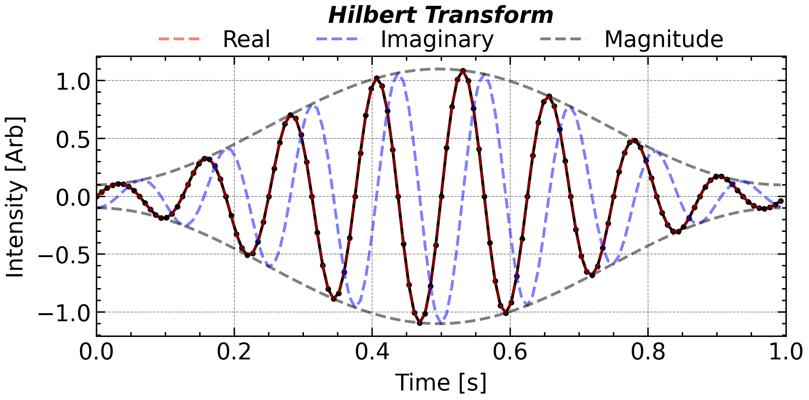
</p>


```python
omega = 2 * np.pi * 8.0
time = np.linspace(0, 1, 2 ** 7, endpoint=False)
# Modulate the Sine Wave with a offseted Hanning Window
signal = np.sin(omega * time) * (0.1 + np.hanning(time.size))
signal_ht = scipy.signal.hilbert(signal)

signal_ht.real, sighal_ht.imag, np.abs(signal_ht)
```

### Digital Filter

Digital filters are fundamental tools for shaping, extracting, or suppressing specific features in time series data. In essence, a digital filter is a mathematical algorithm that modifies the amplitude and/or phase of certain frequency components of a discrete signal. Filters can be designed to remove noise, isolate trends, block out-of-band interference, or even simulate the response of a physical system. Anti-aliasing is also a common application, where filters are used to prevent high-frequency components from distorting the signal before downsampling.

Digital filters are divided into two main types:

- **Finite Impulse Response (FIR):** The output depends only on the current and <u>**a finite number of past input samples**</u>. FIR filters are always stable and can have exactly linear phase.  A general FIR digital filter is implemented as:
  $$
  y[n] = \sum_{k=0}^{M} h[k]\, x[n-k]
  $$

  - $x[n], y[n]$: Input, Output signal
  - $h[k]$: Filter coefficients (impulse response), length $M+1$
  - $M$: Filter order

- **Infinite Impulse Response (IIR):** The output depends on both current and **<u>past input samples *and* past outputs</u>**. IIR filters can achieve sharp cutoffs with fewer coefficients, but may be unstable and generally do not preserve linear phase. A general IIR filter has both input and output recursion:
  $$
  y[n] = \sum_{k=0}^{M} b[k]\, x[n-k] - \sum_{l=1}^{N} a[l]\, y[n-l]
  $$

  - $b[k]$: Feedforward (input) coefficients
  - $a[l]$: Feedback (output) coefficients, usually $a[0] = 1$
  - $M, N$: Orders for input and output

#### Example: Moving Average

The **moving average filter** is actually a simple FIR filter. For a window length $L$, the coefficients are:
$$
h[k] = \frac{1}{L},\quad k = 0, 1, \ldots, L-1
$$
So the output is:
$$
y[n] = \frac{1}{L} \sum_{k=0}^{L-1} x[n-k]
$$
That is, the output is the **average of the most recent $L$ input samples**. **Therefore, the moving average filter is an FIR filter whose coefficients are all equal.**

#### Example: Low-pass FIR Filtering

Suppose we want to smooth a time series by attenuating frequencies above a certain threshold (e.g., removing noise above 50 Hz). This can be accomplished with an FIR filter designed using `scipy.signal.firwin`:

```python
import numpy as np
from scipy.signal import firwin, lfilter

fs = 200.0  # Sampling frequency (Hz)
nyq = fs / 2.0
cutoff = 50.0  # Desired cutoff frequency (Hz)
numtaps = 101  # Filter length (number of coefficients)

# Design FIR low-pass filter
fir_coeff = firwin(numtaps, cutoff / nyq)
# Apply to data
filtered_signal = lfilter(fir_coeff, 1.0, raw_signal)
```

For IIR filters (such as Butterworth, Chebyshev), the `scipy.signal.butter` function is commonly used. **Note:** Filtering can introduce edge effects—always inspect the beginning and end of the filtered signal.

<p align = 'center'>
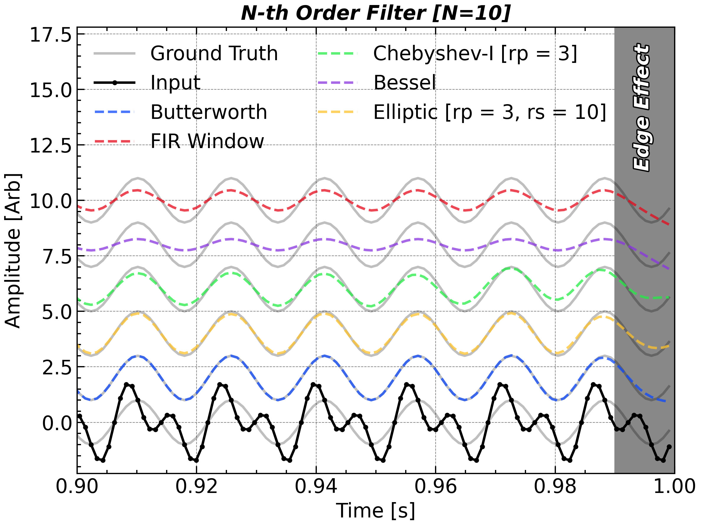
</p>


#### Frequency Response and Interpretation

The effect of a digital filter can be fully characterized by its *frequency response*, i.e., how it amplifies or suppresses each frequency. Use `scipy.signal.freqz` to plot the amplitude and phase response of your filter, and check that it matches your physical requirements (e.g., minimal ripple in the passband, sufficient attenuation in the stopband).

| Filter Type    | Function (`scipy.signal`) | Main Features                | Use Case                  |
| -------------- | ------------------------- | ---------------------------- | ------------------------- |
| FIR (window)   | `firwin`, `firwin2`       | Stable, linear phase         | Smoothing, band selection |
| Butterworth    | `butter`                  | Smooth, monotonic response   | General purpose           |
| Chebyshev I/II | `cheby1`, `cheby2`        | Sharper cutoff, ripples      | Strong suppression        |
| Elliptic       | `ellip`                   | Fastest cutoff, both ripples | Selective, small band     |
| Bessel         | `bessel`                  | Linear phase, slow rolloff   | Transient preservation    |
| Median         | `medfilt`, `medfilt1d`    | Nonlinear, preserves edges   | Spike removal             |


<p align = 'center'>
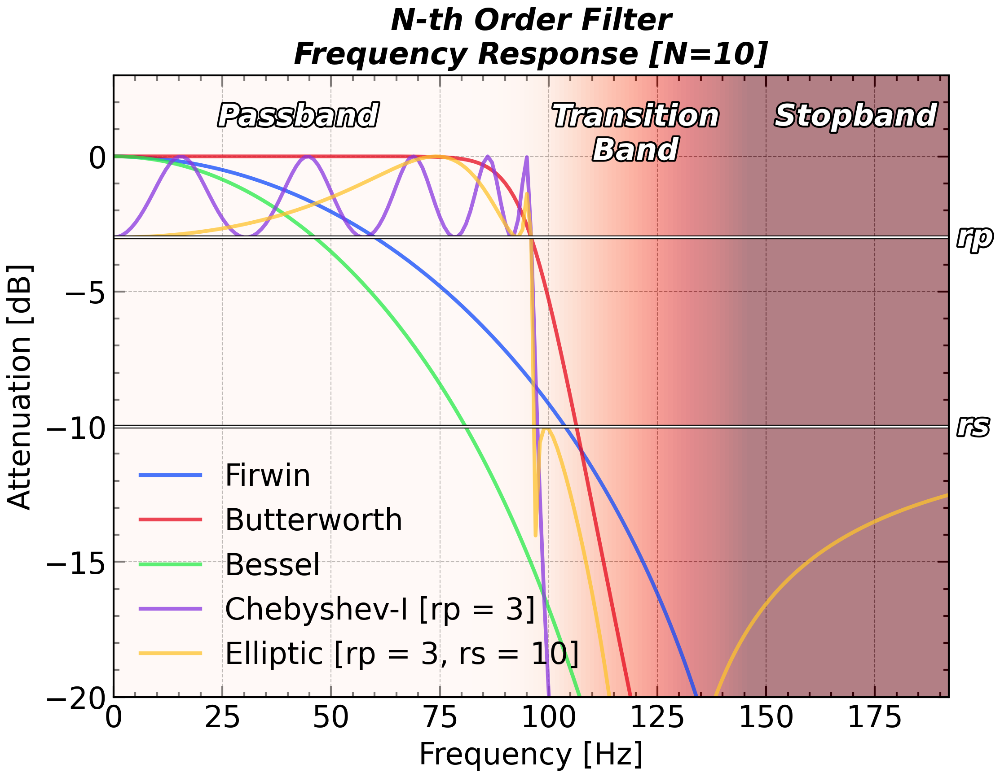
</p>

It is not suggested to apply a filter with an over-narrow bandwidth unless you are already confident about the central frequency and waveform of the signal. Like, if you apply a 5-Butterworth 6-10 Hz bandpass filter to a pure white noise, you are going to get a filtered signal that looks like a sine wave with a frequency around 8 Hz. Thus, you are introducing artificial waves into the signal.

<p align = 'center'>
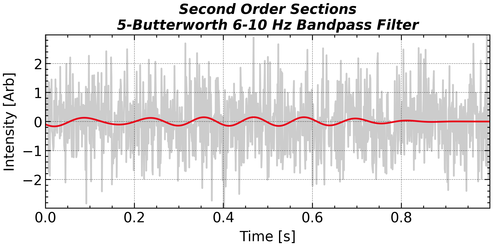
</p>

#### Practical Tips

- **Zero-phase Filtering:** Use `scipy.signal.filtfilt` for zero-phase filtering to avoid phase distortion, especially for waveform analysis.
- **Edge Effects:** Discard a small number of samples at both ends after filtering, or pad the signal before filtering to reduce transient effects.
- **Causality:** Standard filters are causal (output depends only on current and past inputs). Non-causal (zero-phase) filtering requires processing both forward and backward in time, and is not physically realizable in real-time applications.

### Interpolation

**Interpolation** is the process of estimating unknown values between discrete data points. In scientific data analysis, especially in signal processing and time series studies, interpolation plays a vital role in resampling, aligning datasets, filling gaps, and reconstructing higher-resolution signals from coarse measurements.

#### Why Do We Need Interpolation?

- **Resampling:** Convert irregularly sampled data to a regular time grid for spectral analysis.
- **Filling Gaps:** Restore missing or corrupted data in a time series.
- **Temporal Alignment:** Synchronize data from different sources with differing sampling rates.
- **Upsampling/Downsampling:** Increase or decrease data resolution, e.g., for visualization or model input.

#### Common Interpolation Methods

##### 1. Nearest-Neighbor and Linear Interpolation [`interp1d`]

Selects the value of the nearest known data point. Simple and fast, but produces a “blocky” or step-like signal.

```python
scipy.interpolate.interp1d(
    x: array_like,           # 1D array of independent variable (e.g., time)
    y: array_like,           # N-D array of dependent data values
    kind: str = 'linear',    # 'linear', 'nearest', 'cubic', etc.
    axis: int = -1,          
    fill_value: Union[str, float, tuple] = 'extrapolate',
    bounds_error: bool = False
)
```

##### 2. Spline Interpolation [`CubicSpline`]

Fits smooth polynomial curves (usually cubic) through the data. Produces smooth and visually appealing results, but can introduce overshoot or ringing near sharp transitions.

```python
scipy.interpolate.CubicSpline(
    x: array_like,                      # 1D array of increasing x-values
    y: array_like,                      # 1D or 2D array of values to interpolate
    bc_type: Union[str, tuple] = 'not-a-knot',  # Boundary condition type
    extrapolate: Union[bool, str] = True
)
```

##### 3. Akima Interpolation [`Akima1DInterpolator`]

Akima interpolation is a piecewise method based on fitting local polynomials between data points using adaptive slopes that depend on the trends of neighboring intervals. Unlike cubic splines, it does not enforce global smoothness but instead focuses on avoiding oscillations and overshoots near sharp transitions. This makes Akima interpolation particularly effective for datasets with non-uniform behavior or outliers, where traditional spline methods may produce unwanted ringing. It maintains a good balance between smoothness and stability and is especially useful in applications requiring visually reliable curve fitting without excessive global influence.

Assumes that the data is periodic and uniformly sampled. The signal is extended using its discrete Fourier transform (DFT), and interpolation is performed in the frequency domain by zero-padding and inverse transforming. Fourier interpolation is ideal for band-limited signals and preserves the frequency content, but it may introduce artifacts if the periodicity assumption is violated.

```python
scipy.interpolate.Akima1DInterpolator(
    x: array_like,       # 1D array of x data
    y: array_like        # 1D array of y data
)
```

##### 4. Fourier Interpolation [`resample`]

Assumes data is periodic and uses the Fourier series for reconstruction. Ideal for band-limited signals with uniform sampling, preserves frequency content.

```python
scipy.signal.resample(
    x: array_like,           # Input 1D array (signal)
    num: int,                # Number of samples in output
    t: Optional[array_like] = None,   # Original time vector (optional)
    axis: int = 0,
    window: Union[str, tuple, array_like, callable] = None,
    domain: str = 'time'     # 'time' or 'freq'
)
```

##### 5. Sinc Interpolation

**Sinc interpolation** is the theoretical ideal method for reconstructing a uniformly sampled, band-limited signal from its discrete samples. According to the Shannon sampling theorem, a continuous signal with no frequency components above the Nyquist frequency can be perfectly reconstructed from its samples using a sinc function as the interpolation kernel:
$$
x(t) = \sum_{n=-\infty}^{+\infty} x[n]\, \mathrm{sinc}\left(\frac{t - nT_s}{T_s}\right)
$$
where $T_s$ is the sampling interval, and $\mathrm{sinc}(x) = {\sin(\pi x)}/{\pi x}$.

- **Perfect for band-limited, uniformly sampled signals** (theoretical limit).
- **Preserves all frequency content up to the Nyquist frequency.**
- The interpolation kernel is infinitely wide (non-local), so true sinc interpolation is not practically achievable (requires truncation or windowing).
- In practice, *windowed sinc* or a finite sum is used.

```python
def sinc_interp(t_interp, sig, t):
    dt = t[1] - t[0]
    weight = np.sinc((t_interp[:, None] - t[None, :]) / dt)
    return weight @ sig

sinc_interp(t_interp, sig, t)
```

<p align = 'center'>
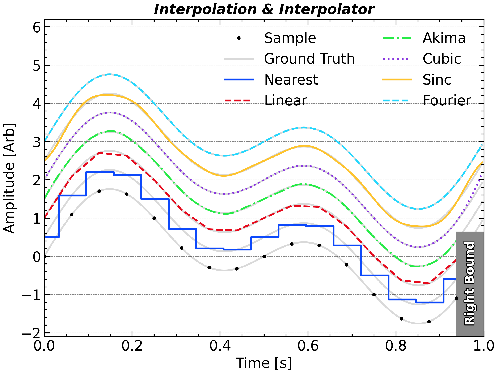
</p>

#### Interpolation and the Frequency Domain

**Interpolation in the time domain directly impacts the signal’s frequency content:**

- **Nearest-neighbor** acts as a zero-order hold, introducing high-frequency artifacts.
- **Linear** acts as a convolution with a triangle ($\mathrm{sinc^2}$ in frequency), attenuating high-frequency components.
- **Spline/Polynomial** offers smoother spectra but can still introduce artifacts at sharp features.
- **Sinc interpolation** and **Fourier interpolation** (i.e., zero-padding in the frequency domain) yield the most faithful reconstruction for band-limited signals.

> **Tip:**
>  For spectral analysis, prefer linear, sinc, or Fourier interpolation for uniformly sampled, band-limited signals. Spline interpolation is suitable for smooth, low-noise signals, but beware of overshoot and frequency artifacts.

#### 

### Cepstrum

A non-sinuous, periodic signal usually has a broad Fourier spectrum concentrating at not only the fundamental frequency $f_0$ but also its harmonic $f_n=nf_0$. Like, a sawtooth waves have a Fourier coefficient decreases with $1/n$ where $n$ is the harmonic order while the coefficients at the rest frequencies remain zero. Therefore, there exists a periodic structure with period of $f_0$ in the Fourier domain. 

<p align = 'center'>

<i>An example of cepstrum for a sawtooth wave with the fundamental frequency of 4 Hz</i>
</p>

Inspiring by this fact, B. P. Bogert, M. J. Healy, and J. W. Tukey introduce the ***Cepstral Analysis*** in 1963. The norm of the Fourier coefficients is taken logarithm and then inverse Fourier transformed for detecting the harmonic signature of the signal. 

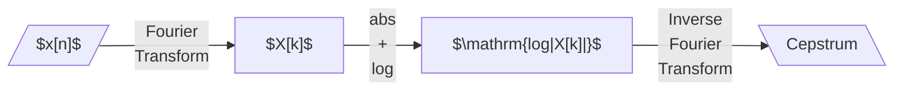
```mermaid
flowchart LR
A@{ shape: lean-r, label: "$x[n]$"} --Fourier<br>Transform--> B["$X[k]$"] --abs<br>+<br>log--> C["$\mathrm{log|X[k]|}$"] --Inverse<br>Fourier<br>Transform--> D@{ shape: lean-l, label: Cepstrum}
```

This resulting "spectrum" is named as its variant ($\mathrm{spec \rightarrow ceps}$) —Cepstrum. Correspondingly, "frequency" is converted to "quefrency", which has the unit same as time's.

The initial aim of cepstrum is to analysis the seismic echoes, which can be modeled as:

$$
y(t) = x(t) +\alpha x(t-\tau)
$$

which has a Fourier transform of

$$
\begin{align}
Y(f) &= X(f) + \alpha X(f) e^{j2\pi f \tau}=X(f)(1+\alpha e^{j2\pi f \tau})\\
|Y(f)|^2 &= |X(f)|^2 [1+2\alpha \mathrm{cos}({j2\pi f \tau})+\alpha^2]
\end{align}
$$

$$
\begin{align}
\mathrm{log}(|Y(f)|^2) &= \mathrm{log}(|X(f)|^2) + \mathrm{log}[1+2\alpha \mathrm{cos}({j2\pi f \tau})+\alpha^2]\\
& \approx \mathrm{log}(|X(f)|^2) + 2\alpha \mathrm{cos}({j2\pi f \tau})
\end{align}
$$

Therefore, the echoes introduce the periodic structure in $\mathrm{log}(|Y(f)|^2)$. When parameter $\alpha$ is small enough, the periodic structure has a perfect sinuous waveform. Interestingly, the periodic sawtooth waves we introduced first can actually be interpreted as an initial signal accompanied with its three non-decayed echoes. That's the reason cepstral analysis works. 

However, it doesn't mean that the cepstral analysis work for the signals composited with echoes. Another common application of cepstral analysis is the [voice recognition](https://ieeexplore.ieee.org/document/859069). The principle behind is that the both the musical instrument and vocal fold has an eigen frequency thus the power of the voice naturally concentrate near the fundamental and harmonics.


```python
''' Python Implication of Cepstrum '''

freq = np.fft.rfftfreq(sig.size, dt)
coef = np.fft.rfft(sig)

log_abs_coef = np.log(np.abs(coef))

# Optional, Remove DC component for cepstrum calculation
log_abs_coef -= np.mean(log_abs_coef)

cepstrum = np.fft.rfft(log_abs_coef)
df = freq[1] - freq[0]
quefrency = np.fft.rfftfreq(log_abs_coef.size, df)
```

<div STYLE="page-break-after: always;"></div>

## Time-Frequency Spectrum

### Short-Time Fourier Transform

The Short-Time Fourier Transform (STFT) extends traditional Fourier analysis to non-stationary signals by introducing time localization via windowing. This allows us to track how the frequency content of a signal evolves over time. This section explains the trade-off between time and frequency resolution, the role of window functions, and practical implementation with `scipy.signal.shortTimeFFT`. It should be noted that function `scipy.signal.stft` is considered legacy and will no longer receive updates. While `scipy` currently have no plans to remove it, they recommend that new code uses more modern alternatives `shortTimeFFT` instead.

```python
window = 4096
step = 100
hann_window = scipy.signal.windows.hann(window, sym = True) # Hanning Window
STFT = scipy.signal.ShortTimeFFT(hann_window, hop=step, fs = fs, scale_to='psd', fft_mode = 'onesided2X')  # create the STFT object
stft_psd = STFT.stft(sig)  # perform the STFT
stft_time = np.arange(0, stft_psd.shape[1]) * STFT.hop / fs - STFT.win.size / 2 / fs  # time vector for STFT
stft_frequency = np.fft.rfftfreq(window, d=dt)  # frequency vector for STFT
```

<p align = 'center'>
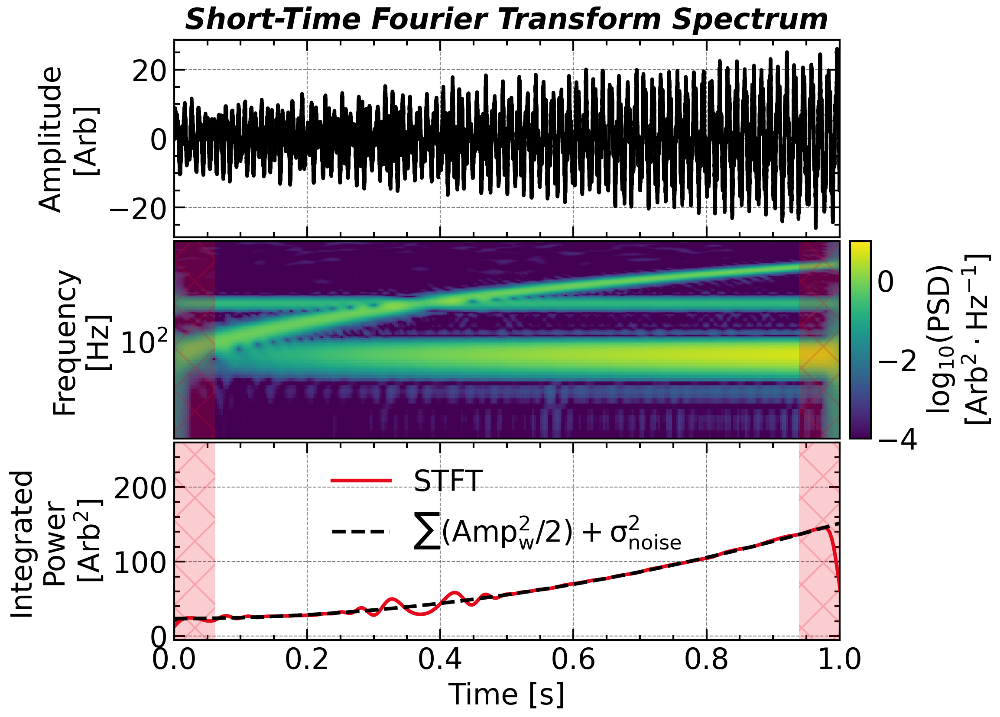
</p>

### Wavelet Analysis

Wavelet analysis offers a versatile framework for multi-resolution time-frequency analysis, especially for signals with localized features or abrupt transitions. By decomposing a signal into wavelets, we gain simultaneous insight into both frequency and time domains. This section introduces the fundamentals of wavelet theory, common wavelet families, and hands-on examples using Python packages such as `pywt`, `scipy`, and `squeezzeypy`.

<p align = 'center'>
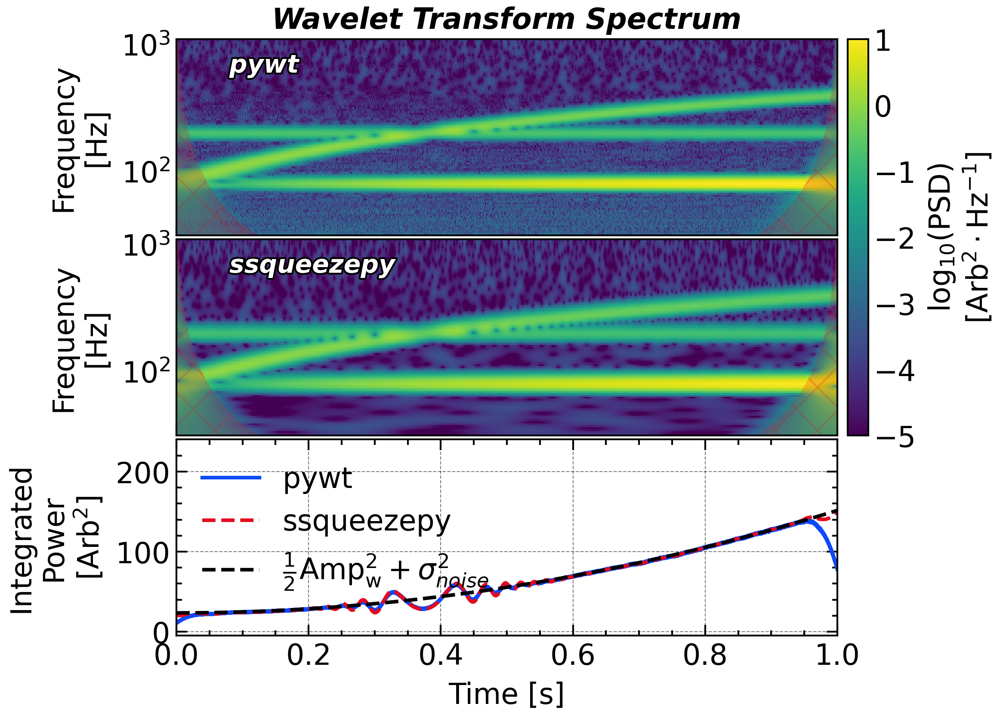
</p>

```python
scales = 2 ** np.linspace(4, 12, 160, endpoint = False)

bandwidth = 12.0
central_frequency = 1.0

# Way 1: pywavelets
wavelet = 'cmor%.1f-%.1f' % (bandwidth, central_frequency)
coef, f = pywt.cwt(sig, scales, wavelet, dt, method = 'fft')
coef *= np.sqrt(np.sqrt(bandwidth) * np.sqrt(2 * np.pi))  # amplitude normalization for Morlet
psd = (np.abs(coef) ** 2) * (2 * dt)
df = (f[0] / f[1] - 1) * f / np.sqrt(f[0] / f[1])

# Way 2: ssqueezepy
coef, scales = ssqueezepy.cwt(sig, ('morlet', {'mu': bandwidth}), scales = bandwidth / (2 * np.pi) * scales.astype(np.float32), fs = 1 / dt, l1_norm = False)
f = bandwidth / (2 * np.pi) / dt / scales
df = (f[0] / f[1] - 1) * f / np.sqrt(f[0] / f[1])
psd = (np.abs(coef) ** 2) * (2 * dt)

# Way 3:
# There is a cwt function provided by scipy.signal. 
# However, this function is deprecated since version 1.12.0. 
# They recommend using PyWavelets instead.

# widths = bandwidth * scales / (2 * np.pi)
# coef = scipy.signal.cwt(
#     signal,
#     scipy.signal.morlet2,
#     widths = widths,
#     w = bandwidth,
#     dtype = np.complex128
# )
# frequency = 1 / dt / scales

# Cone of Influence (COI)
coi = (np.sqrt(4) * bandwidth / (2 * np.pi) / f).astype(float)
```

#### Continuous and Discrete Wavelet

<div STYLE="page-break-after: always;"></div>

## Multi-Dimensional Signal

### Principal Component Analysis / Minimum Variance Analysis

Principal Component Analysis (PCA) and Minimum Variance Analysis (MVA) are closely related, eigen‐vector–based techniques for extracting the dominant directional structure in multivariate data. PCA is a general statistical tool; MVA is the same mathematics applied to three-component field measurements (e.g., **B** in space physics) with special attention to the minimum-variance direction. 

The central ideas of these two methods are:

- **PCA**: Rotate the data into a new orthogonal basis such that each successive axis captures the greatest possible remaining variance.
- **MVA**: Apply PCA to a 3 × N vector time series and interpret the eigenvectors as the directions of maximum, intermediate, and minimum variance—often used to infer boundary normals or wave polarization axes.

------

#### Mathematical Formulation

1. **Collect & demean** the data matrix
   $$
   \mathbf{X}
   = \begin{bmatrix}
     x_1 & x_2 & \dots & x_N \\
     y_1 & y_2 & \dots & y_N \\
     z_1 & z_2 & \dots & z_N
   \end{bmatrix},
   \qquad
   \tilde{\mathbf{X}} = \mathbf{X} - \langle\mathbf{X}\rangle
   $$

2. **Form the covariance (spectral) matrix**
   $$
     \mathbf{C} \;=\; \frac{1}{N-1}\,\tilde{\mathbf{X}}\tilde{\mathbf{X}}^\mathsf{T}
   $$

3. **Solve the eigenproblem**
   
   $$
     \mathbf{C}\,\mathbf{e}_i \;=\; \lambda_i\,\mathbf{e}_i,
     \quad
     \lambda_1 \ge \lambda_2 \ge \lambda_3 \ge 0
   $$
   
4. **Interpretation**

   - **PCA**: Project the data onto the top *k* eigenvectors $\{\mathbf{e}_1,\dots,\mathbf{e}_k\}$ for dimensionality reduction.
   
   - **MVA**:
     - $\mathbf{e}_1$: maximum‐variance direction (largest fluctuations)
     
     - $\mathbf{e}_2$: intermediate direction
     
     - $\mathbf{e}_3$: minimum‐variance direction—often taken as the local discontinuity normal or the wave propagation vector.
     
       <p align = 'center'>
       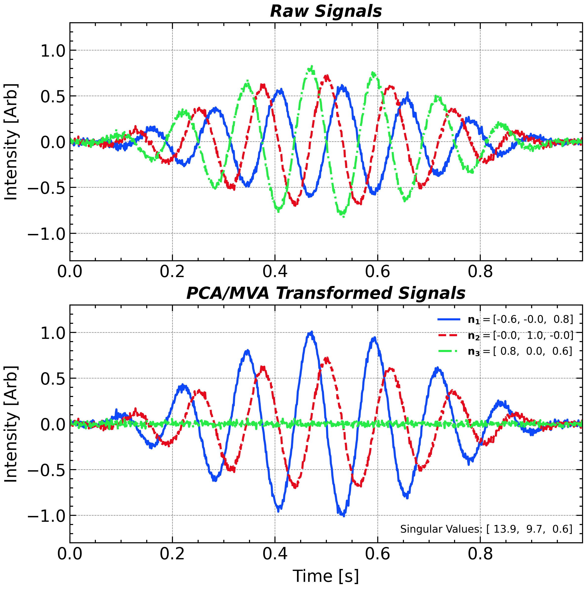
       </p>

```python
N = 2 ** 10
time = np.linspace(0, 1, N, endpoint=False)
omega = 2 * np.pi * 8.0

signal_x = np.sin(omega * time + np.pi * 0.0) * (0.6 * np.hanning(time.size)) + np.random.randn(time.size) * 0.02
signal_y = np.sin(omega * time + np.pi * 0.5) * (0.7 * np.hanning(time.size)) + np.random.randn(time.size) * 0.02
signal_z = np.sin(omega * time + np.pi * 1.0) * (0.8 * np.hanning(time.size)) + np.random.randn(time.size) * 0.02

signal = np.vstack((signal_x, signal_y, signal_z)).T
pca = sklearn.decomposition.PCA(n_components=3)
pca.fit(signal)

eigenvalues = pca.singular_values_
eigenvectors = pca.components_
```

### Spectral Matrix

A ***spectral matrix*** can be defined as 
$$
\hat{S}_{ij}= \hat{B}_i \hat{B}_j^*
$$

for a time series decomposed with both signal and noise, its Fourier coefficients follow the ***non-central chi-square distribution***, as introduced in the previous section. Taking a moving-average in the time or frequency domain helps improving the SNR as we did in the Welch method. 

```python
spec = np.einsum('fti,ftj->ftij', coef, coef.conj())

# Average in time or frequency domain
spec_avg = np.copy(spec)
spec_avg = bn.move_mean(spec_avg, window=time_window, min_count=1, axis=1)
spec_avg = bn.move_mean(spec_avg, window=freq_window, min_count=1, axis=0)
```

### Coherence

Coherence (or coherency in some literature) measures the degree of linear correlation between two signals at each frequency, serving as a frequency-resolved analog of the correlation coefficient. High coherence indicates a strong, consistent relationship, which is crucial for studies of wave propagation, coupled systems, and causality analysis. 

The mathematical definition of coherence is the ratio of the cross-spectral density to the product of the individual power spectral densities:
$$
C_{XY}(f) = \frac{|\hat{S}_{XY}(f)|^2}{\hat{S}_{XX}(f) \hat{S}_{YY}(f)}
$$


where $\hat{S}_{XY}(f)$ is the cross-spectral density between signals $X$ and $Y$, and $\hat{S}_{XX}(f)$, $\hat{S}_{YY}(f)$ are the power spectral densities of $X$ and $Y$, respectively. Coherence values range from 0 (no correlation) to 1 (perfect correlation).

```python
scipy.signal.coherence(
    x: array_like,               # First input signal (1D or 2D array)
    y: array_like,               # Second input signal (same shape as x)
    fs: float = 1.0,             # Sampling frequency (Hz)
    window: str or tuple = 'hann',  # Window function to apply to each segment
    nperseg: int = None,         # Segment length for FFT (default: 256)
    noverlap: int = None,        # Number of overlapping points (default: nperseg // 2)
    nfft: int = None,            # Number of FFT points (default: nperseg)
    detrend: str or function = 'constant',  # How to detrend each segment
    axis: int = -1               # Axis along which to compute coherence
)
# Returns:
# f : ndarray
#     Array of sample frequencies.
# Cxy : ndarray
#     Magnitude-squared coherence values (range: 0 to 1).

```

To be honest, I feel very hard to understand what does *coherent/coherence* means in many of the magnetospheric ULF/VLF waves investigations. It can be easily understood the coherence between two individual light or signal. However, in the *in-situ* observation, the spacecraft can only measure one signal without further distinguishment or separation. In some literature, the coherence between $E_x$ and $B_y$ are used to measure whether the observed VLF waves are coherent. These VLF waves always propagate along the geomagnetic field line, which point to the north near the magnetic equator. It makes some sense as a high coherence suggests the waves have a stable wave vector during this interval. But, it is still hard to expect the occurrence of interference as both $E_x$ and $B_y$ may just be the presence of one single wave. While, some other literatures use the coherence between the magnetic field components to 

- Coherency is meaningless without taking an average. 

### Combination with Maxwell's Equations: SVD Wave Analysis

Spectral analysis gains further physical meaning when interpreted alongside Maxwell’s equations. For electromagnetic signals, the spectral content reflects underlying wave propagation, polarization, and field coupling processes. 
$$
\begin{align}
\nabla \cdot \mathbf{E}(\mathbf{r},t) & = -\frac{\rho}{\varepsilon_0}\\

\nabla \cdot \mathbf{B}(\mathbf{r},t) & = 0\\

\nabla \times \mathbf{E}(\mathbf{r},t) & = -\frac{\partial \mathbf{B}(\mathbf{r},t)}{\partial t} \\

\nabla \times \mathbf{B}(\mathbf{r},t) & = \mu_0 \mathbf{J}(\mathbf{r},t)+\mu_0\varepsilon_0 \frac{\partial\mathbf{E}(\mathbf{r},t)}{\partial t}

\end{align}
$$

As the electromagnetic field $\mathbf{E(r},t)$ and $\mathbf{B(r}, t)$ are square-integrable, Maxwell's equations can be naturally transformed into the $(\mathbf{k},\omega)$-space with the basic replacement from $\nabla \leftrightarrow i\mathbf{k}$ and $\partial/\partial t\leftrightarrow -i\omega$:
$$
\begin{align}
i \mathbf{k\cdot \hat{E}(k,\omega)}&=-\hat{\rho_e}/\varepsilon_0 \\
i \mathbf{k\cdot \hat{B}(k,\omega)}&=0 \\
i \mathbf{k\times \hat{E}(k,\omega)}&=i\omega\mathbf{\hat{B}(k,\omega)} \\
i \mathbf{k\times \hat{B}(k,\omega)}&=\mu_0 \mathbf{\hat{J}(k,\omega)} -\mu_0 \varepsilon_0 i\omega\mathbf{\hat{E}(k,\omega)} \\

\end{align}
$$

However, a single spacecraft measurement only allows you to observe a one-dimensional (time) signal at one position, i.e., the spacecraft position, which literally moves in the space. Thus, the signal can only be converted into the frequency space as $\mathbf{\hat{B}(\omega)}$. The second equation is the only parameter-free equation and states that the wave vector, $\mathbf{k}$ must be perpendicular to the magnetic field disturbance, $\mathbf{\hat{B}(\omega)}$. Obviously, $\mathbf{k=0}$ is a trivial, but not useful solution for satisfying the divergence-free theorem. By constraining the norm of $\mathbf{k}$ to be unity, $\boldsymbol{\kappa}\mathbf{:=k/}k$, a more meaningful solution comes out. When the real part, $\Re{\hat{\mathbf{B}}(\omega)}$ and imaginary part, $\Im{\hat{\mathbf{B}}(\omega)}$ of $\mathbf{\hat{B}(\omega)}$ are highly orthogonal, they can span a linear space whose normal vector is naturally $\boldsymbol{\kappa}$. 
$$
\boldsymbol{\kappa}=\frac{\Re{\hat{\mathbf{B}}(\omega)}\times{\Im\hat{\mathbf{B}}(\omega)}}{|\Re{\hat{\mathbf{B}}(\omega)}\times{\Im\hat{\mathbf{B}}(\omega)}|}
$$
which perfectly satisfy that $\boldsymbol{\hat{\mathbf{B}}\cdot \kappa}=0$. 

However,  this $\mathbf{\hat{B}}$-based, namely, coefficient-based estimation may be influenced by the noise's contribution and thus is not so practical. Inspired by the Welch method, a spectral-based estimation is preferred as the spectral density is easily denoised. The spectral-based estimation can be given by refining the original proposition:

$$
\hat{S}_{ij}=\langle \hat{B}_i \hat{B}_j^* \rangle
$$

which can still be met by the original solution. After averaging the spectral matrix in time and frequency domain, this equation can not be perfectly satisfied any more. Thus, we will look for a weaker solution in the sense of minimization:
$$
\begin{align}
\min \limits_{\mathbf{||\boldsymbol{\kappa}||_2^2=1}} & ||\hat{S}\cdot \boldsymbol{\kappa}||_2^2\\ \Leftrightarrow \min \limits_{\mathbf{||\boldsymbol{\kappa}||_2^2=1}} \{&{\underline{||{\Re{\hat{S}}}\cdot \boldsymbol{\kappa}||_2^2}} + \underline{{||{\Im\hat{S}}\cdot \boldsymbol{\kappa}||_2^2}}\}\\
\end{align}
$$
[McPherron et al. (1972)](https://doi.org/10.1007/BF00219165) and [Means (1972)](https://doi.org/10.1029/JA077i028p05551) adopts the real and imaginary part in the minimization optimization for the estimation of wave propagation direction, respectively. Both of these two optimization problem can be solved by eigenvalue decomposition. Then, [Santolík et al. (2003)](https://doi.org/10.1029/2000RS002523) combine both terms and construct an augmented matrix ${A}$:

$$
{A} =
\begin{pmatrix}
\Re S_{11} & \Re S_{12} & \Re S_{13} \\
\Re S_{12} & \Re S_{22} & \Re S_{23} \\
\Re S_{13} & \Re S_{23} & \Re S_{33} \\
0 & -\Im S_{12} & -\Im S_{13} \\
\Im S_{12} & 0 & -\Im S_{23} \\
\Im S_{13} & \Im S_{23} & 0 \\
\end{pmatrix}
$$


The optimization problem
$$
\min\limits_{\Vert\boldsymbol{\kappa}\Vert_2^2=1} ||{A\cdot \mathbf{k}}||_2^2
$$
is directly solvable by applying a ***singular value decomposition(SVD)*** to matrix ${A}$
$$
{A}=U\cdot W\cdot V^T
$$
where $U$ is a $6\times3$ matrix with orthonormal columns, $W$ is a $3\times3$ diagonal matrix with three nonnegative singular values, and $V ^T$ is a $3\times 3$ matrix with orthonormal rows. Diagonal matrix $W$ representing the signal power in a descending order. 

- **<u>Compressibility</u>** describe the polarization 

$$
\begin{align}
\mathrm{Compressibility}(t,f):=\frac{PSD(B_\parallel)}{\sum_i PSD(B_i)}
\end{align}
$$


- **<u>Planarity</u>** 

$$
F=1-\sqrt{W_{2}/W_{0}}
$$

Without averaging the spectral matrix, the planarity $F(t,f)$ **<u>will be all one</u>**. It means that, when the observer only take one snapshot of the waves, it can not distinguish how does the waves propagate. After the averaging, the planarity actually describe that, **<u>whether the waves that observed at these time periods, frequencies share the common unitary wave vector.</u>**

```python
spec = np.einsum('fti,ftj->ftij', coef, coef.conj())
spec = bn.move_mean(spec, window=freq_window, min_count=1, axis=0)
spec = bn.move_mean(spec, window=time_window, min_count=1, axis=1)

spec_63 = np.concatenate([spec.real, spec.imag], axis=-2)
u, s, vh = np.linalg.svd(spec_63, full_matrices=False)

planarity = 1 - np.sqrt(s[:, :, 2] / s[:, :, 0])
ellipticity_along_k = s[:, :, 1] / s[:, :, 0]
```

Similarly, based on the averaged spectral matrix, one may define the coherence (coherency) between different components:
$$
Coherency:=\frac{|S_{ij}|}{\sqrt{S_{ii}S_{jj}}}
$$
<p align = 'center'>
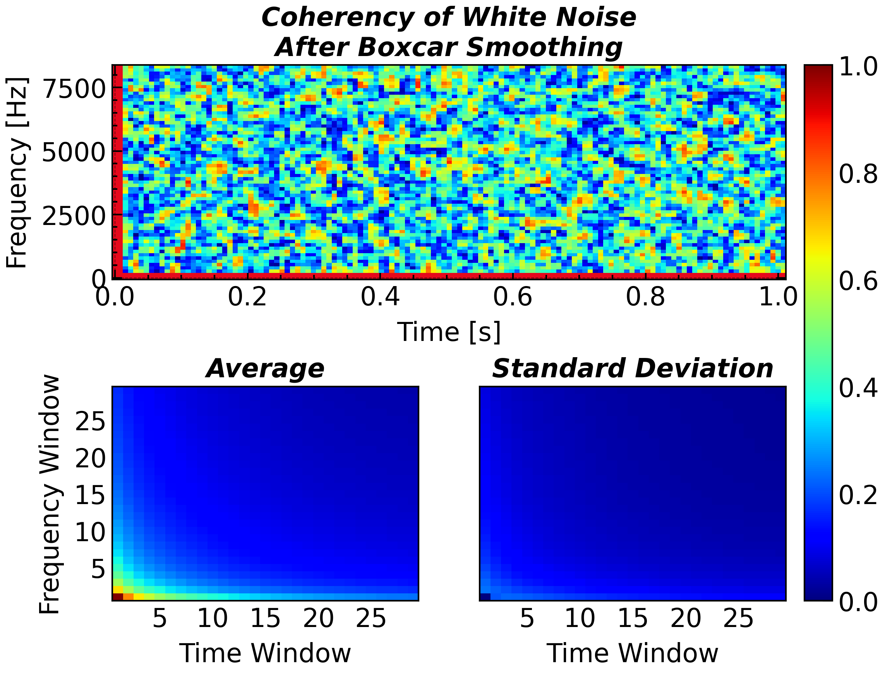
</p>

One should keep in mind that all interpretation about the observed waves is in the spacecraft inertial reference frame. A proper choice of coordinate system is especially necessary for a spinning spacecraft.


This section explores the synergy between spectral analysis and electromagnetic theory, demonstrating how to derive physical insights and constraints from both perspectives.

#### Ellipticity along $\mathbf{k}$

Polarization analysis examines the orientation and ellipticity of oscillatory signals, especially electromagnetic or plasma waves. By decomposing the signal into orthogonal components and analyzing their relative amplitude and phase, we can characterize wave mode, propagation direction, and physical source. This section introduces key polarization parameters, their spectral estimation, and relevant Python implementations.

Ellipticity can be defined as the ratio of the semi-major and semi-minor, which is estimated by:
$$
\epsilon=\frac{W_1}{W_0}
$$
For a noisy signal, T and S 2019 propose an improved method with a estimation of the noise level based on the eigen decomposition. In this method, they noise level is inferred by decomposing the real part of the spectral density matrix and the maximum/intermediate eigenvalues of the complex spectral density represents the summation of wave power and noise power. Therefore, the improved ellipticity is derived:
$$
\epsilon^\prime=\sqrt{\frac{\lambda_{r1}-\lambda_1}{\lambda_{r0}-\lambda_1}}
$$
This improved ellipticity performs better than the original one when SNR is low but the still randomly deviates from the ground true. Thus, a moving average in the time or frequency domain is still required as it promote the SNR. 

```python
coef_wf = np.einsum('ijk,ijlk->ijl', coef, vh)
spec_wf = np.einsum('fti,ftj->ftij', coef_wf, coef_wf.conj())
spec_wf = bn.move_mean(spec_wf, window=freq_window, min_count=1, axis=0)
spec_wf = bn.move_mean(spec_wf, window=time_window, min_count=1, axis=1)

coherence = np.abs(spec_wf[:, :, 0, 1]) / np.sqrt(np.abs(spec_wf[:, :, 0, 0] * spec_wf[:, :, 1, 1]))

eigenvalues_r, _ = np.linalg.eigh(spec_wf[:, :, :2, :2].real) # Ascending
eigenvalues, _ = np.linalg.eigh(spec_wf[:, :, :2, :2]) # Ascending

ellipticity_along_k = np.sqrt((eigenvalues_r[:, :, 0] - eigenvalues[:, :, 0]) \
                              / (eigenvalues_r[:, :, 1] - eigenvalues[:, :, 0]))
```


#### Ellipticity along $\mathbf{B}$

Both above two ellipticities are unsigned as the singular/eigen values are always non-negative. Another, but not alternative definition of the ellipticity, is the ratio of left-handed polarized signal power to the right-handed polarized power. This definition is signed and the the ellipse is defined in the plane that perpendicular to the background magnetic field:
$$
\epsilon_B=\frac{|\hat{B}_L|^2-|\hat{B}_R|^2}{|\hat{B}_L|^2+|\hat{B}_R|^2}
$$
with $B_L$ and $B_R$ defines below:
$$
\begin{align}
B_L = \frac{1}{\sqrt{2}}(B_{\perp1}+iB_{\perp2})\\
B_R = \frac{1}{\sqrt{2}}(B_{\perp1}-iB_{\perp2})
\end{align}
$$
with $\mathbf{e_{\perp1}}$, $\mathbf{e_{\perp2}}$, and $\mathbf{e_\parallel }$ constitute a right-hand system, i.e., $\mathbf{e_{\perp1}\times e_{\perp2}=e_\parallel}$.

It is also important as it may unveils the wave excitation mechanism (e.g., wave-particle resonance). This definition is totally irrelevant with the determination of the wave vector direction. Instead, field-aligned coordinates is required for its derivation.

#### Field-Aligned Coordinate

Field-Aligned Coordinates (FAC) are a specialized coordinate system used in space physics to analyze data collected along the geomagnetic field lines. By transforming measurements into FAC, we can isolate field-aligned structures and dynamics, such as auroral currents and plasma waves. This section explains the transformation process, its physical significance, and practical applications in magnetospheric studies. 

To transform a three-dimensional vector field $\mathbf{B}$ into FAC, we first need to calculate the unit vector along the magnetic field line, $\mathbf{b} = \mathbf{B}/|\mathbf{B}|$. The FAC system is then defined as follows:

```python
magf = np.array([bx, by, bz])
magf_avg = bn.move_mean(magf, axis=0)

dir_ref = np.array([1., 0., 0.])
dir_para = (magf_avg.T / np.linalg.norm(magf_avg, axis = 1)).T

dir_perp_1 = np.cross(dir_para, dir_ref)
dir_perp_1 = (dir_perp_1.T / np.linalg.norm(dir_perp_1, axis = 1)).T

dir_perp_2 = np.cross(dir_para, dir_perp_1)
dir_perp_2 = (dir_perp_2.T / np.linalg.norm(dir_perp_2, axis = 1)).T

# Amplitude Projection
magf_para = np.einsum(magf, dir_para, 'ij,ij ->i')
magf_perp_1 = np.einsum(magf, dir_perp_1, 'ij,ij ->i')
magf_perp_2 = np.einsum(magf, dir_perp_2, 'ij,ij ->i')

# Coefficient Projection
coef_para = np.einsum('ijk,jk->ij', coef, dir_para)
coef_perp_1 = np.einsum('ijk,jk->ij', coef, dir_perp_1)
coef_perp_2 = np.einsum('ijk,jk->ij', coef, dir_perp_2)
compressibility = np.abs(coef_para) ** 2 / (np.abs(coef_para) ** 2 + np.abs(coef_perp_1) ** 2 + np.abs(coef_perp_2) ** 2)

# Polarization
coef_lh = (coef_perp_1 - 1j * coef_perp_2) / np.sqrt(2)
coef_rh = (coef_perp_1 + 1j * coef_perp_2) / np.sqrt(2)

ellipticity_along_b = (np.abs(coef_rh) - np.abs(coef_lh)) / (np.abs(coef_rh) + np.abs(coef_lh))
```


#### Degree of Polarization

The **degree of polarization** quantifies the proportion of an electromagnetic fluctuation (such as a plasma wave) that is organized, or polarized, as opposed to random or unpolarized (noise-like) components. It is a fundamental parameter in space plasma physics, characterizing the coherence of observed wave signals.

The degree of polarization is defined as the fraction of the total wave power that is associated with a perfectly polarized (coherent) component. It is mathematically expressed as:
$$
D_p = \frac{\text{Power of the Polarized Component}}{\text{Total Power}}
$$

- $D_p = 1$: the signal is completely polarized.
- $0 < D_p < 1$: the signal is partially polarized.
- $D_p = 0$: the signal is totally unpolarized (random noise).

A high degree of polarization indicates that the observed fluctuations are dominated by coherent wave processes, while a low degree suggests that random or turbulent components are significant. The degree of polarization is widely used to distinguish wave modes, to separate physical signals from instrumental or background noise, and to assess the reliability of wave analysis.

In three-dimensional wave analysis, the **degree of polarization** quantifies how much of the measured signal is concentrated along a single, well-defined direction, versus being randomly distributed among all directions.

The 3D eigenvalue-based degree of polarization is defined as:
$$
D_{p,3D} = \frac{\lambda_1 - \lambda_2}{\lambda_1 + \lambda_2 + \lambda_3}
$$
where $\lambda_1 \geq \lambda_2 \geq \lambda_3$ are the eigenvalues of the (power or spectral) matrix constructed from the three orthogonal components of the wave field.

This definition is coordinate-invariant and widely used in space plasma physics to characterize the coherence and organization of wave signals in planetary magnetospheres and the solar wind. It is particularly powerful for distinguishing true wave modes from background turbulence or noise.

```python
w, v = np.linalg.eigh(spec)
degree_of_polarization = (w[:, :, 2] - w[:, :, 1]) / np.sum(w, axis = -1)
```

- Notice: `np.linalg.eigh` and `np.linalg.svd` return the eigen/singular values in an ascending / descending order.

<p align = 'center'>
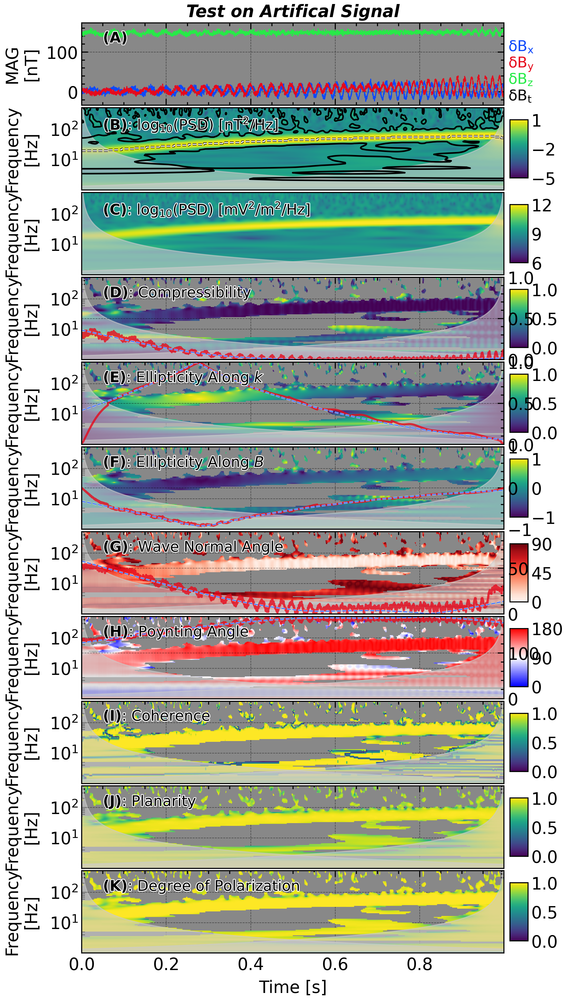
</p>
<div STYLE="page-break-after: always;"></div>

## Appendix

### NDArray Shaping

When create the 

### Jargon Sheet

|      Notation      |   Variable Name   |                         Explanation                          |
| :----------------: | :---------------: | :----------------------------------------------------------: |
|     $(t), (f)$     |      `t, f`       |       Continuous input, frequency ($f$) or time ($t$)        |
|     $[t], [f]$     |      `t, f`       |                        Discrete input                        |
|      $\omega$      |      `omega`      |             Angular frequency, $\omega = 2\pi f$             |
|       $x(t)$       |         -         |      Continuous signal $x$ as a function of time ($t$)       |
|  $x[n] = x(nf_S)$  |       `sig`       | An even sample of $x(t)$, the intensity is termed as ***Amplitude*** |
| $X[k]=X(kT^{-1})$  |      `coef`       | Fourier Transform Coefficient of $x(t)$, the intensity is termed as ***Magnitude*** |
|   $\mathcal{F}$    |         -         |                  Fourier Transform Operator                  |
|        $N$         |        `N`        |                        Signal length                         |
|        Arb         |         -         |                        Arbitrary Unit                        |
|       $w[n]$       |     `window`      |                       Window Function                        |
|    $\hat{B}_i$     |      `coef`       |                     Fourier Coefficient                      |
|      $S_{ij}$      |      `spec`       |                       Spectral Matrix                        |
|         -          |      `*_wf`       |                       Wave Frame (WF)                        |
|         -          |      `*_ma`       |                     Moving Average (MA)                      |
|         -          | `*_lh` and `*_rh` |            Left Handed (LH) and Right Handed (RH)            |
| $\mathrm{\Delta}t$ |       `dt`        |                       Sampling Period                        |
|       $f_s$        |       `fs`        |                      Sampling Frequency                      |
|   $\mathrm{Amp}$   |       `amp`       |                          Amplitude                           |
|                    |                   |                                                              |
|                    |                   |                                                              |
|                    |                   |                                                              |
|                    |                   |                                                              |
|                    |                   |                                                              |
|                    |                   |                                                              |
|                    |                   |                                                              |

</body>
</html>