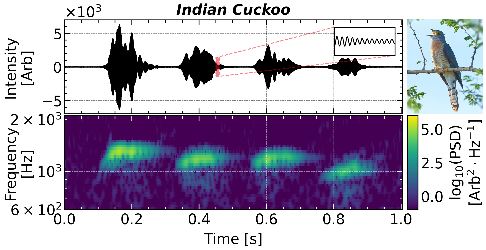
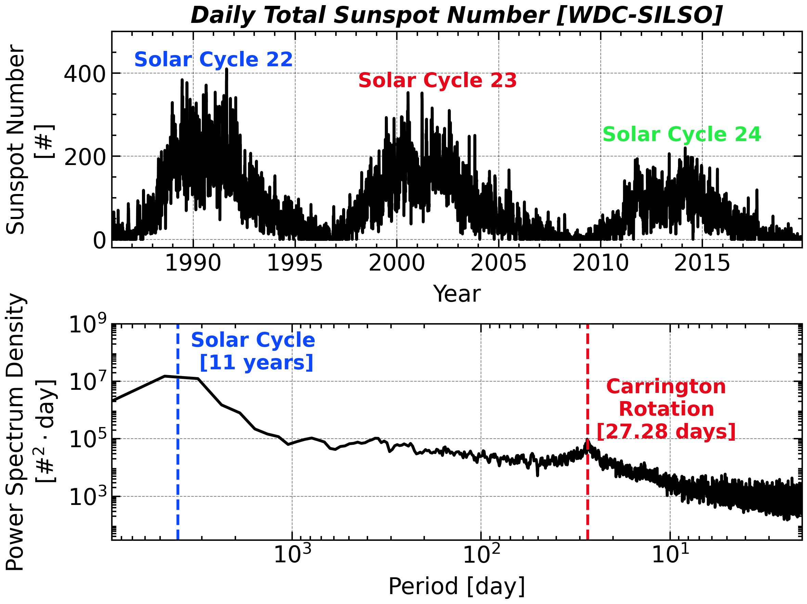
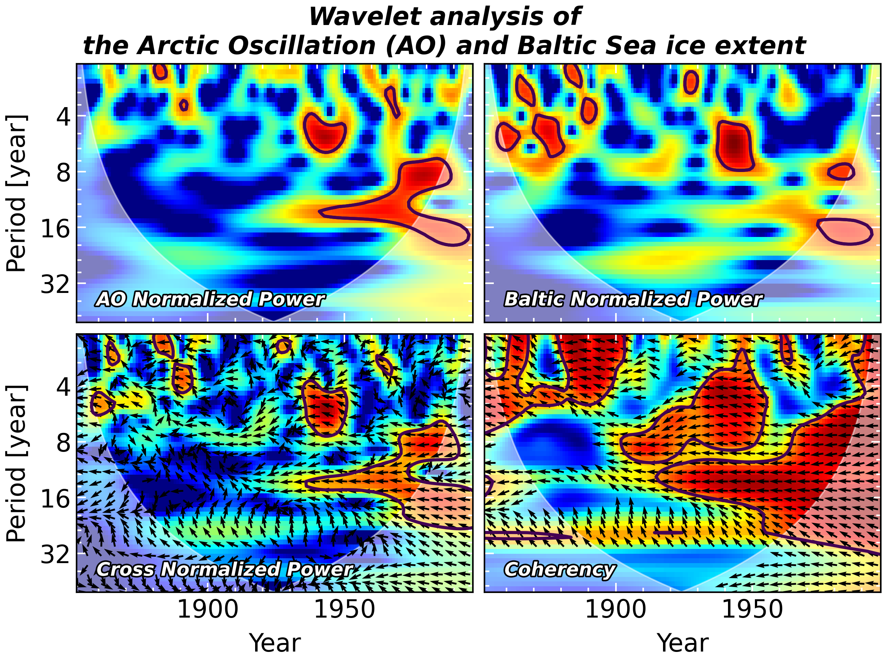
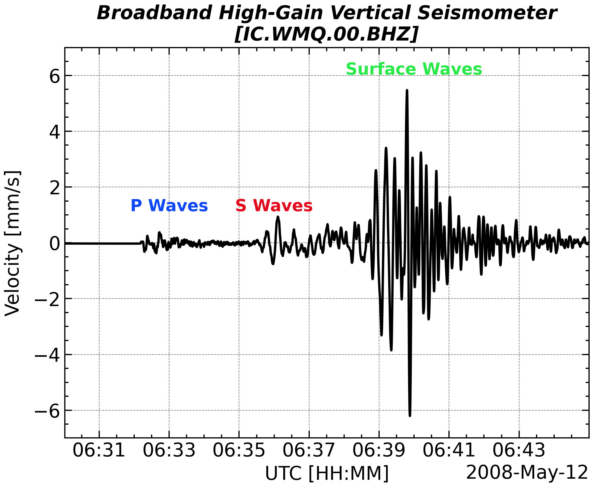
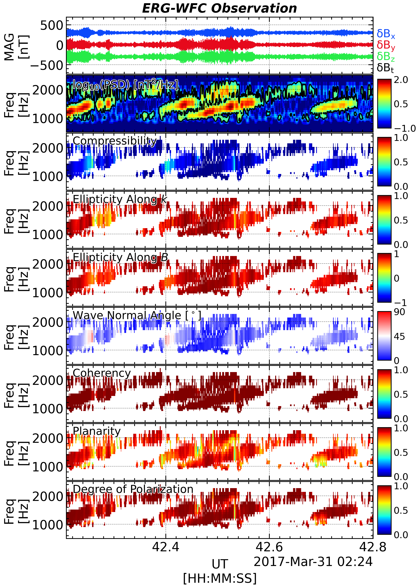

# Preface

This document serves as a practical guide to spectral analysis, driven by two key observations:

-   **<u>The Utility of Spectral Analysis</u>**: Signals are omnipresent in daily life—they can be seen, heard, or felt, like a whistling sound. While the variations in a signal might be intuitively perceived, precisely describing them can be challenging. Even when a raw time series hints at waveform and frequency, deeper aspects such as harmonics often remain elusive. Processing such signals is fundamental across diverse fields, including physics, engineering, and data science. Through effective spectral analysis, crucial information—like the chirping signature of a bird's song—can be readily extracted.

-   **<u>The Need for a Practical Handbook</u>**: Traditional spectral analysis textbooks can be daunting, often spanning hundreds of pages and demanding a robust mathematical background. Concepts like "compact support," while mathematically rigorous, frequently prove irrelevant for practical research and can consume valuable time and patience. Furthermore, these theoretical texts rarely provide practical Python implementations.

This document aims to bridge that gap by offering a **practical guide** to spectral analysis. It focuses on essential concepts and real-world applications, designed for readers with a basic understanding of Python and signal processing. It deliberately avoids delving into the deep mathematical intricacies, which are extensively covered in classic, highly-rated academic texts.

**<u>Below are representative spectral‑analysis results that we will showcase, so you can decide whether this guide meets your needs:</u>**

<!-- tabs:start -->

#### **Indian Cuckoo**

<audio id="audio" controls="" preload="none">
  <source id="mp3" src="Data/indian_cuckoo_short.wav">
</audio>

<i>(Above): The Time Series of the Voice of Indian Cuckoo; (Bottom) Its Time-Frequency Spectrogram.</i>

#### **Sunspot Number**

<i>(Above): The Time Series of a Sunspot number; (Bottom) Its Frequency Spectrogram.</i>

#### ** AO-Baltic Coherrence**

<i>(Above): The Time Series of a Sunspot number; (Bottom) Its Frequency Spectrogram.</i>

#### ** Mode Decomposition**

#### ** Chorus Wave SVD Analysis**

<!-- tabs:end -->
