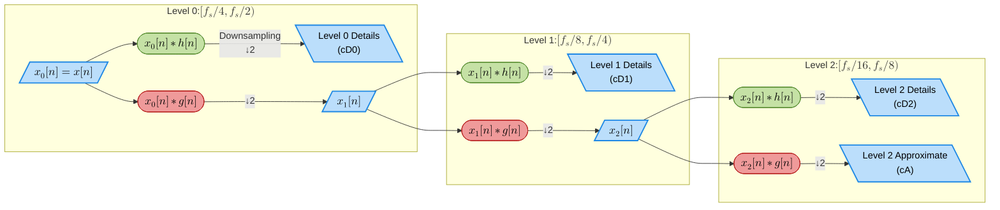
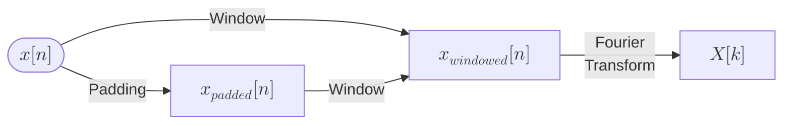

# Preface0

For many students, their first real encounter with spectral analysis often unfolds like this:

One day, they notice an intriguing phenomenon in a time-domain signal and eagerly share their discovery with an advisor or senior colleague. The response is calmly delivered: "You should try some Fourier or wavelet analysis."

Returning to their desk, they dig out an old calculus textbook, flip through several pages, and quickly realize it won’t help. Next comes the trusted solution: a swift Google search for “Fourier Analysis tutorial". Eventually, they stumble upon a highly recommended *Digital Signal Processing* textbook with an impressive 4.3/5.0 book rating.  After a marathon weekend, they manage to read through the 50-plus pages of Chapter 1, *Signals and Systems*. However, by Chapter 2, Linear Time-Invariant Systems, fatigue sets in—only to realize that the actual Fourier series material is still more than 120 pages away.

At this juncture, most students pragmatically pivot to google *"Fourier Analysis by xxx"*  and get an answer with some unfamiliar jargon from *StackOverflow*, grabbing a ready-made code snippet to forge ahead.

Yet, a few determined souls persist—spending days gathering materials, watching lectures online, coding, and compiling a detailed report. Proudly, they present their hard work to their advisor, only to be met with the classic understated response: “Why so little progress this week?”

