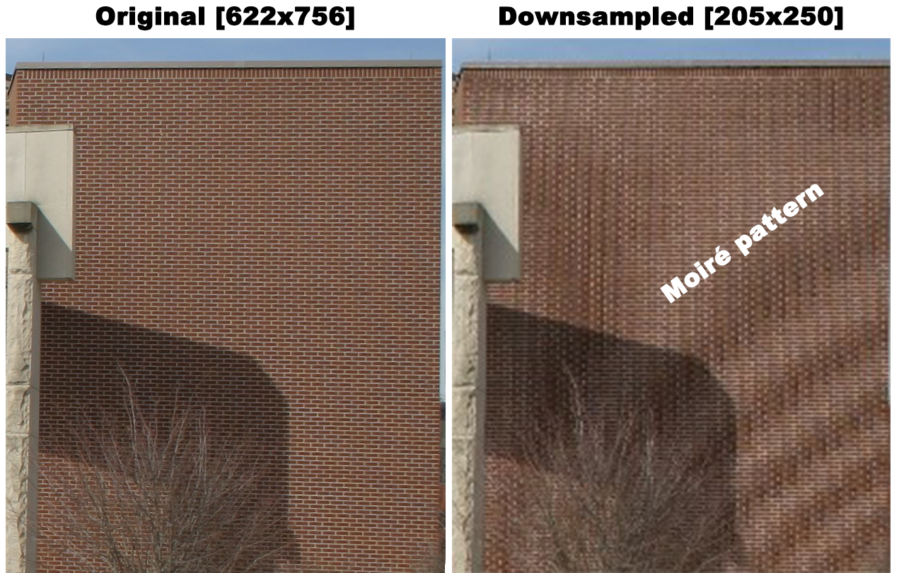
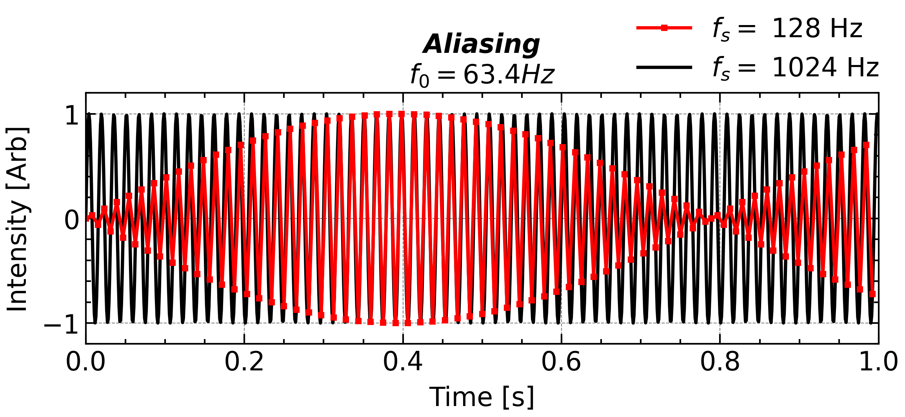
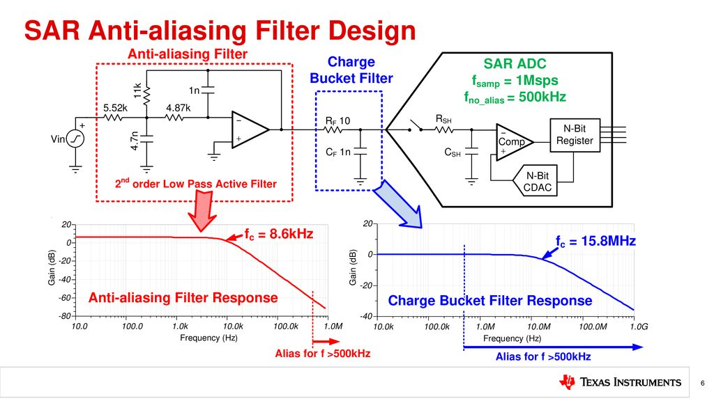
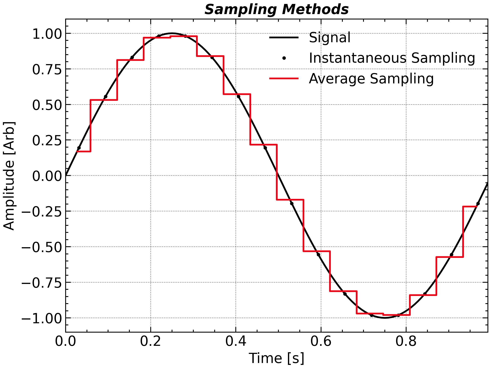

# Initialize Your Data

## Sampling

> **[Nyquist-Shannon Sampling Theorem](https://en.wikipedia.org/wiki/Nyquist%E2%80%93Shannon_sampling_theorem):** A band-limited continuous-time signal $x(t)$ containing no frequency components higher than $f_{max}$,  can be perfectly reconstructed from its samples if it is sampled at a rate:
$$
f_s > 2f_{max} 
$$
> The frequency upper limitation $f_s/2$ is also called ***<u>Nyquist Frequency</u>***.

When you measure a high frequency signal with a low cadence instrument, you will not only miss the high frequency component, **<u>but also measure an erroneous signal</u>**, so called ***<u>Aliasing</u>***.

<p align = 'center'></p><p align = 'center'>
    <i>Aliasing effcet in a virtual signal sampling.</i>
</p>
<u>**Do Not Interpret Your Data with A Target Frequency near or even above Nyquist Frequency.**</u>


Such a phenomenon is essentially unrelated to the Fourier transform as its frequency range ends up to $f_s/2$ and can be directly observed by naked eye. In real life, aliasing can be visualized by compressing the image with grid structure or recording the running helicopter propeller/car wheel.

<p align = 'center'> </p>
<p align = 'center'><i>Aliasing effect in daily life</i><p>

<u>**A sampling frequency of two times of the wave frequency can not guarantee fully capturing the waveform.**</u> This fact is even true for pure sine waves. 

<p align = 'center'>

</p>
This effect always happens when you (down-)sampling the signal, a common way to avoid it is to apply a low pass filter so that the high frequency component doesn't contribute to the unreal signal. 

<p align = 'center'>

</p>

In the instrumental implementation, that filter typically consists of a set of resistor, inductor, and capacity and is putted before the analog-digital converter.

## Read Signals From Data

[Numpy](https://numpy.org/doc/stable/reference/routines.io.html), [Scipy.io](https://docs.scipy.org/doc/scipy/tutorial/io.html), and [Pandas](https://pandas.pydata.org/docs/reference/io.html) provide several input/output interfaces for reading the commonly used data format.

- MATLAB `.mat` (v7.2 and below): **`scipy.io.loadmat('*.mat')`**—handles structs, nested arrays; HDF5 v7.3 requires HDF5 libraries.
- IDL `.sav`: **`scipy.io.readsav('*.sav')`** gives you a dict-like structure.
- NetCDF3 (`.nc`): **`scipy.io.netcdf.NetCDFFile('*.nc','r')`**, though it’s deprecated—prefer **`netCDF4`/`xarray`**.
- NASA CDF (`.cdf`): **`spacepy.pycdf.CDF('*.cdf');`**—dict-like API with lazy loading, but needs the NASA CDF C library
- Raw Binary, e.g., `.dat`: **`numpy.fromfile('*.dat', dtype = [np.int8, np.float64, ...])`**
- Text, e.g., `.txt, .csv, .TAB`: **`pandas.read_csv('*.txt', sep = '\s+')`**

## Generate Signals Artificially

- **Generate the ** ***Relative Timestamps*** **given two of signal length ($N$), total duration ($T$), and sampling frequency ($f_s$).**

    ```python
    N, T = 100, 1
    t = np.linspace(0, T, N, endpoint = False)
    ```

    Correspondingly, the ungiven parameter can be derived uniquely.

    ```python
    dt = T / N
    fs = 1 / dt
    ```

- **Generate the signal**

  - Real sine wave

  ```python
  omega0 = 2 * np.pi * 20
  sig = np.sin(omega0 * t)
  ```

  - Complex sine wave

  ```python
  sig = np.exp(j * omega * t)
  ```

  <p align = 'center'>
  
  </p>

  - **<u>Using these `scipy.signal` built-in functions</u>** helps to **<u>improve your code readability and reduce your chances of creating bugs: </u>**    


## From ***Unix Timestamps*** to `np.datetime`

- A Unix timestamp is the number of seconds that have elapsed since January 1, 1970 (midnight UTC/GMT), not counting leap seconds.

    ```python
    t = (t * 1e9).astype('datetime64[ns]')
    t = t.astype('datetime64[s]')
    ```

- If you need to consider leap seconds in your investigation, use `astropy`.

    ```mermaid
    ---
    config:
      theme: 'base'
    ---
    
    flowchart LR
    A[*pandas.Timestamp*] --*.to_numpy()--> B[*datetime.datetime*] --np.datetime64(*)--> C[*numpy.datetime64*] --astropy.time.Time(*)--> D[astropy.time.Time]
    B --pd.Timestamp(*)--> A
    C --.astype(object)--> B
    A --astropy.time.Time(*)--> D
    B --astropy.time.Time(*)--> D
    D --.to_datetime(*)--> B
    A --np.datetime64(*)--> C
    C --pd.Timestamp(*)--> A
    ```

    

    

    

## Sampling Method

After get your data, you should know that **what does each timestamps represent?** Is it a **Snapshot** Sample or an **Integrated/Average** Sample?

<p align = 'center'>

</p>

Due to the limitations of electronic circuitry and measurement principles, the acquisition of real-world signals always requires a finite sampling time. As a result, strictly perfect instantaneous sampling does not exist. However, if the sampling time is much shorter than the interval between data points or the timescale of interest, the measurement can be reasonably approximated as instantaneous.

While artificial signal can be sampled in either ways, just be aware at what you are actually doing if you want to make the comparison between the observations and simulations.


<div STYLE="page-break-after: always;"></div>