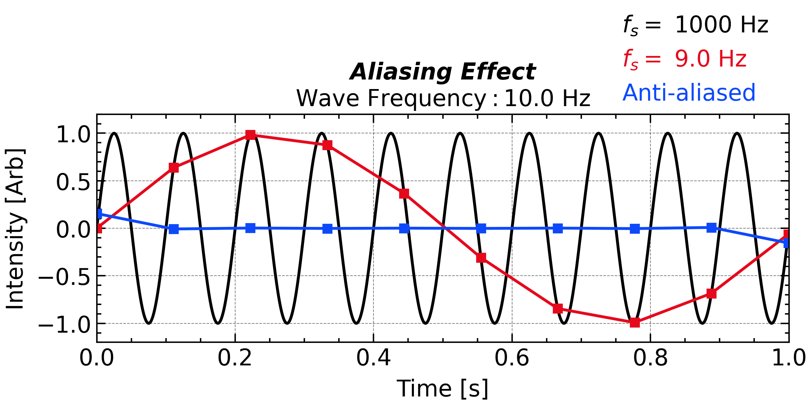
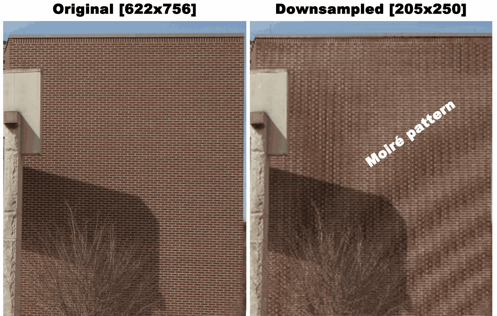
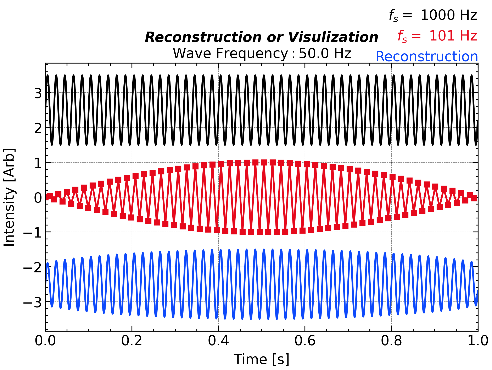
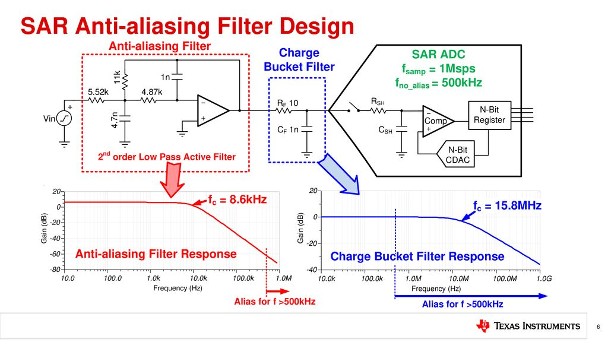
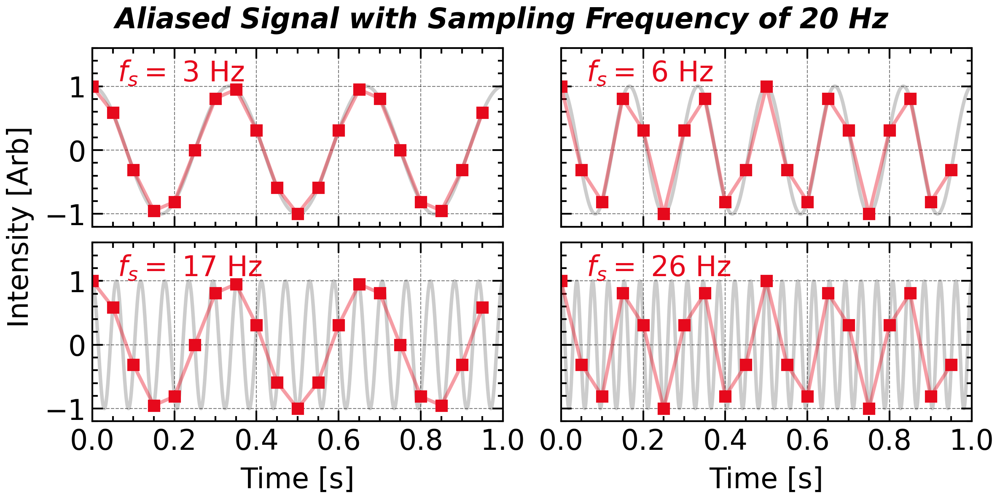
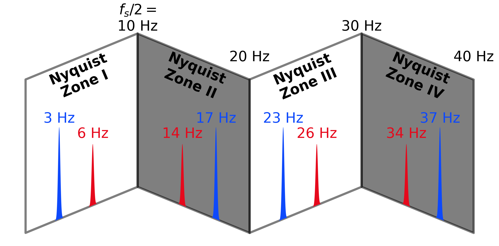
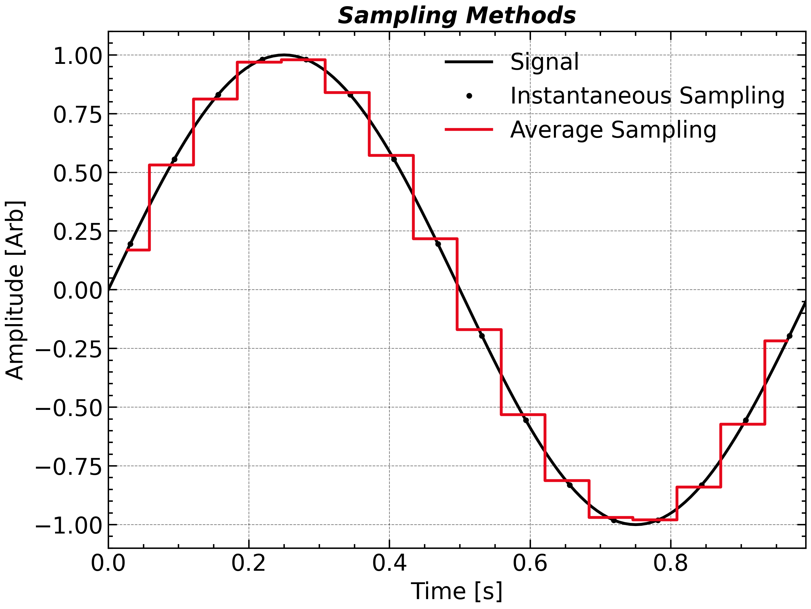
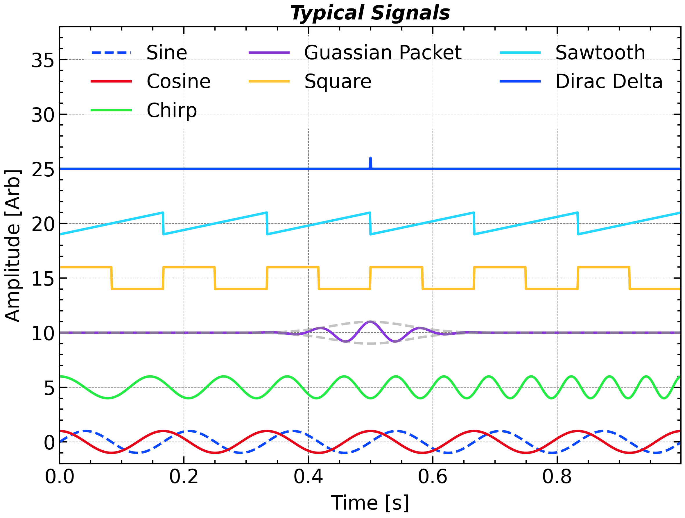

# <center> Data Initialization

## Sampling


> **[Nyquist-Shannon Sampling Theorem](https://en.wikipedia.org/wiki/Nyquist%E2%80%93Shannon_sampling_theorem):** 
>
> If a continuous, band-limited signal $x(t)$ contains no frequencies higher than $f_{max}$, then it can be perfectly reconstructed from its samples—provided the sampling rate $f_s$ is greater than twice that maximum frequency:
$$
f_s > 2f_{max}
$$
> The value $f_s/2$ is known as the **<u>*Nyquist Frequency*</u>**, and it represents the highest frequency that can be captured without aliasing.

### Aliasing

All the data that await analysis are yield from ***<u>sampling</u>***, no matter it originates from the real-world observation or a simulation program. When one measure a high frequency signal with a low cadence instrument, one will not only miss the high frequency component, **<u>but also measure a signal that may lead misunderstanding</u>**, so called ***<u>[Aliasing](https://en.wikipedia.org/wiki/Aliasing)</u>***. 

<p align = 'center'></p><p align = 'center'>
    <i>Aliasing effcet in a virtual signal sampling.</i>
</p>


**With an insufficient sampling rate, the measurement cannot faithfully capture the signal’s waveform.** In the example above, sampling a 10 Hz sine wave at 9 Hz produces an apparent 1 Hz oscillation (aliasing): because the sampling frequency is 1 Hz lower than the true signal frequency, successive samples advance through the wave’s phase by only a small amount each time, so it takes about one second for the samples to span an entire cycle from trough to peak and back. 

<p align = 'center'> </p>
Such a phenomenon is essentially unrelated to the Fourier transform as its frequency range ends up to $f_s/2$ and can be directly observed by naked eye. In real life, aliasing can be visualized by compressing the image with grid structure or recording the running helicopter propeller/car wheel. Particularly, the aliasing effect in image downsampling is called ***<u>[Moiré Pattern](https://en.wikipedia.org/wiki/Moir%C3%A9_pattern)</u>***.

<p align = 'center'></p>

<p align = 'center'><i>Aliasing effect in daily life. You can also zoom-in the left-most panel to see the difference before/after compression.</i><p>

### Reconstruction

<u>**Even a sampling frequency of two times of the wave frequency can not guarantee fully "capturing" the waveform by naked eye.**</u> This fact is even true for pure sine waves. Like when you sample a 50 Hz sinusoidal waves with a 101 Hz sampling frequency, you will still see something like a wave packet, which shows the amplitude modulation. 

This fact actually signify the **<u>difference between "visualization" and "reconstruction"</u>**. When visualizing the signal, one may not only plot the sampled points, but also connect them with lines. However, such connections can only be made assuming that the signal between two sampled points is linear, which is not true for sinusoidal waves. Therefore, the visualization can be misleading. Human senses actually automatically make such assumptions and interpretations, which is why aliasing can be so deceptive.

However, when reconstructing [see Chapter 6/Reconstruction and Interpolation](chap6.md#reconstruction-and-interpolation) the signal, one can use the **<u>[Whittaker–Shannon interpolation formula (a.k.a sinc interpolation)](https://en.wikipedia.org/wiki/Whittaker%E2%80%93Shannon_interpolation_formula)</u>** to perfectly reconstruct the original signal from its samples, provided that the sampling frequency is greater than twice the maximum frequency of the signal. This reconstruction is mathematically guaranteed and does not rely on any assumptions about the signal between sampled points.

<p align = 'center'>

</p><p align = 'center'>
    <i>A sampling frequency (128 Hz) that slightly higher than the Nyquist frequency (2 × 62.4=124.8 Hz). The sampled signal is shown as a wave packet.</i>
</p>
Ideally, you can perfectly reconstruct the complete signal when you got a **<u>long enough samples</u>** when the sampling frequency is slightly higher than the Nyquist frequency. However, **<u>every realistic sample has a finite length</u>**. Thus, reconstruction is still imperfect especially when the sample length is not far longer than the wave period, as shown by the above cases near the edges. The principle behind this (i.e., finite-length rectangular window) will be introduced in [Chapter 2/Windowing Effect](chap2.md#windowing-effect) of this document. 

In terms of experience, the higher sampling frequency you have, the shorter sample length is required. 

### Application: Anti-Aliasing Filter

Aliasing effect always happens when you (down-)sampling the signal, a common way to avoid it is to apply a low pass filter (so called, ***<u>anti-aliasing filter</u>***) so that the high frequency component doesn't contribute to the unreal signal. This technique and its python implementation, `scipy.signal.decimate`, will be introduced in [Chapter 5](chap5.md). In the instrumental implementation, that filter typically consists of a set of resistor, inductor, and capacity and is putted before the analog-digital converter.

<p align = 'center'>

</p><p align = 'center'>
    <i>An example circuit diagram of anti-aliasing filter.</i>
</p>


### Application: Nyquist Folding Receiver

<p align = 'center'>

</p>


<p align = 'center'>

</p>

### Sampling Method

After get your data, you should know that **what does each timestamps represent?** Is it accurately the time you get the **instantaneous sample** or the **middle point** of the whole **sampling period**?

<p align = 'center'>

</p>
Real instruments always integrate over a finite dwell time, so truly instantaneous samples do not exist. If that dwell time is much shorter than the sampling interval—or shorter than the timescales of interest—the measurement can be **approximated as instantaneous**. Otherwise, the averaging acts like a low-pass filter, providing some built-in anti-aliasing.

For artificial signals you can choose either approach, **but be mindful of which one you are using when comparing simulations with real observations**.


## Read Signals From Data

[Numpy](https://numpy.org/doc/stable/reference/routines.io.html), [Scipy.io](https://docs.scipy.org/doc/scipy/tutorial/io.html), and [Pandas](https://pandas.pydata.org/docs/reference/io.html) provide several input/output interfaces for reading the commonly used data format.

- MATLAB `.mat` (v7.2 and below): **`scipy.io.loadmat('*.mat')`**—handles structs, nested arrays; HDF5 v7.3 requires HDF5 libraries.
- IDL `.sav`: **`scipy.io.readsav('*.sav')`** gives you a dict-like structure.
- NetCDF3 (`.nc`): **`scipy.io.netcdf.NetCDFFile('*.nc','r')`**, though it’s deprecated—prefer **`netCDF4`/`xarray`**.
- NASA CDF (`.cdf`): **`spacepy.pycdf.CDF('*.cdf');`**—dict-like API with lazy loading, but needs the NASA CDF C library
- Raw Binary, e.g., `.dat`: **`numpy.fromfile('*.dat', dtype = [np.int8, np.float64, ...])`**
- Text, e.g., `.txt, .csv, .TAB`: **`pandas.read_csv('*.txt', sep = '\s+')`**

If you feel your data processing speed is limited by the data I/O, you should consider using the most efficient python package. This is always task-specific, and you should profile your code to find the bottleneck. 

## Generate Signals Artificially

- **Generate the ** ***Relative Timestamps*** **given two of signal length (`N`), total duration (`T`), and sampling frequency (`fs`).**

    ```python
    N, T = 100, 1
    t = np.linspace(0, T, N, endpoint = False)
    # [0.0, 0.01, 0.02, ..., 0.99]
    # Ensure parameter endpoint is set to False, or use
    # t = np.linspace(0, T, N + 1, endpoint = True)
    # to get a series with dt = T / N
    # [0.0, 0.01, 0.02, ..., 1.00]
    ```

    Correspondingly, the ungiven parameter can be derived uniquely.

    ```python
    dt = T / N
    fs = 1 / dt
    ```

- **Generate the signal**

  - Real sine wave

  ```python
  omega0 = 2 * np.pi * 6.0
  sig = np.sin(omega0 * t)
  ```
  
  - Complex sine wave according to Euler's formula $e^{i\theta}=\mathrm{cos}\theta+i\mathrm{sin}\theta$:
  
  ```python
  sig = np.exp(1j * omega * t) #where 1j is the imaginary unit
  ```
  
  The usage of complex signal bring convenience for phase operation (e.g., $e^{i\theta_1}\cdot e^{i\theta_2}=\mathrm{cos}[\theta_1+\theta_2]+i\mathrm{sin}[\theta_1+\theta_2]$). In addition, it aids in shortening the code sometime, but also reduce the readability.
  
  <p align = 'center'>
  
  </p>
  
  - **<u>Using these `scipy.signal` built-in functions</u>** helps to **<u>improve your code readability and reduce your chances of creating bugs: </u>**    
  
    ```python
    sig_cos = np.cos(omega0 * t)
    
    sig_chrip = scipy.signal.chirp(t, f0 = omega0 / 2 / np.pi, t1 = 1, f1 = omega0 / 2 / np.pi * 3)
    # f0: Frequency at t = 0
    # f1: Frequency at t = t1
    
    sig_gauss_pulse = scipy.signal.gausspulse((t - np.mean(t)), fc = omega0 / 1 / np.pi, bw = 0.5)
    # fc: central frequency
    # bw: bandwidth
    
    sig_square = scipy.signal.square(omega0 * t)
    
    sig_sawtooth = scipy.signal.sawtooth(omega0 * t)
    
    sig_unit_impulse = scipy.signal.unit_impulse(t.size, idx = 'mid')
    # idx : None or int or tuple of int or 'mid', optional
    ```


## Management of Timestamps

There are several packages in Python for managing timestamps, and the choice depends on your project's specific requirements—such as high precision, time zone support, or compatibility with other libraries. Each package has its own advantages and disadvantages. In general, selecting a well-maintained package with a large user community can simplify finding help and resources when needed. 

| Library  |                          Advantages                          |
| :------: | :----------------------------------------------------------: |
|  Pandas  | Rich time series functionality, easy integration with DataFrames **[Use in Reading Table Files]** |
|  NumPy   | Efficient for large arrays and vectorized time operations **[Use in Data Analysis]** |
| datetime | Part of Python standard library for basic date/time operations **[Use in Timestamps Format Conversion]** |
| Astropy  | High precision handling of special time formats and leap seconds **[Use in Time System Conversion]** |


`datetime` as a built-in package, is always supported by different third-party package, therefore is suitable to be used during **format conversion**. While, `numpy.datetime64` is more efficient in **data processing** and **scientific computing**. `pandas.Timestamp` and `astropy.time.Time` are more powerful in **reading table files** and **time system conversion**, respectively.

- **Use `numpy.datetime64` to represent the timestamps**. It is a fixed-size data type that represents dates and times in a variety of formats, including year-month-day, hour-minute-second, and nanoseconds since the Unix epoch. It is also compatible with many NumPy's array operations, making it easy to perform calculations and manipulations on large datasets.

    ```python
    import numpy as np
    import pandas as pd
    import astropy.time
    import datetime
    
    # Using pandas
    t_pd = pd.Timestamp('2000-01-01T00:00:00')
    
    # Using astropy
    t_astropy = astropy.time.Time('2000-01-01T00:00:00')
    
    # Using datetime
    t_datetime = datetime.datetime(2000, 1, 1, 0, 0)
    
    # Convert to numpy.datetime64
    t_np = np.datetime64(t_pd)
    t_np = np.datetime64(t_astropy.to_datetime())
    t_np = np.datetime64(t_datetime)
    ```


- **convert** the precision to milliseconds or nanoseconds.

    ```python
    t_np = np.datetime64('2000-01-01T00:00:00')
    t_np_ms = t_np.astype('datetime64[ms]') # np.datetime64('2000-01-01T00:00:00.000')
    t_np_ns = t_np.astype('datetime64[ns]') # np.datetime64('2000-01-01T00:00:00.000000000')
    ```

- A **<u>*Unix timestamp*</u>** is the number of seconds that have elapsed since January 1, 1970 (midnight UTC/GMT), not counting leap seconds. Use `*.astype(float)` to convert `numpy.datetime64[s]` to Unix timestamp. When the unit is not seconds, the result is the number of time units since the epoch.

    ```python
    # np.datetime64 to Unix timestamp
    t_np.astype(float) # np.float64(946684800.0)
    t_np.astype('datetime64[ns]').astype(float) # np.float64(9.466848e+17)
    ```
    
- If you need to consider **<u>*leap seconds*</u>** in your investigation, use `astropy`.

    ```mermaid
    ---
    config:
      theme: 'base'
    ---
    
    flowchart LR
    A[*pandas.Timestamp*] --*.to_datetime64()--> B[*datetime.datetime*] --np.datetime64(*)--> C[*numpy.datetime64*] --astropy.time.Time(*)--> D[astropy.time.Time]
    B --pd.Timestamp(*)--> A
    C --.astype(object)--> B
    A --astropy.time.Time(*)--> D
    B --astropy.time.Time(*)--> D
    D --.to_datetime(*)--> B
    A --np.datetime64(*)--> C
    C --pd.Timestamp(*)--> A
    ```

- `np.timedelta64(timedelta, unit)` is a fixed-size data type that represents a duration, the difference between two dates or times. It can be used to perform arithmetic operations on dates and times, such as adding or subtracting a certain number of days or hours. The input `timedelta` can only be integer. You can also use `*.astype('timedelta64[s]')` to convert integer seconds to `np.timedelta64`.
  
  
    ```python
    # Generate numpy.datetime64 array using year_array, month_array, and day_array
    year = np.array([2023, 2023, 2023])
    month = np.array([1, 2, 3])
    day = np.array([1, 2, 3])
    t_array = np.array([np.datetime64(f"{y:04d}-{m:02d}-{d:02d}") for y, m, d in zip(year, month, day)])
    
    # Generate numpy.datetime64 array using year_array and doy_array (day of year)
    doy = np.array([1, 32, 60])  # Day of year for Jan 1, Feb 1, Mar 1 in a non-leap year
    t_array = np.array([np.datetime64(f"{y:04d}-01-01") + np.timedelta64(d - 1, 'D') for y, d in zip(year, doy)])
    
    # Generate numpy.datetime64 array using year and doy (day of year)
    year = 2023
    doy = np.array([1, 32, 60])
    t_array = np.datetime64(f"{year:04d}-01-01") + (doy - 1).astype('timedelta64[D]')
    ```

- `pd.Timestamp()` and `np.datetime64()` can not take **array** as input. So ***<u>list comprehension</u>*** is required in the conversion

    ```python
    # Convert datetime_array to pandas.Timestamp array
    datetime_array_to_pd = [pd.Timestamp(dt) for dt in datetime_array]
    ```
    

<div STYLE="page-break-after: always;"></div>