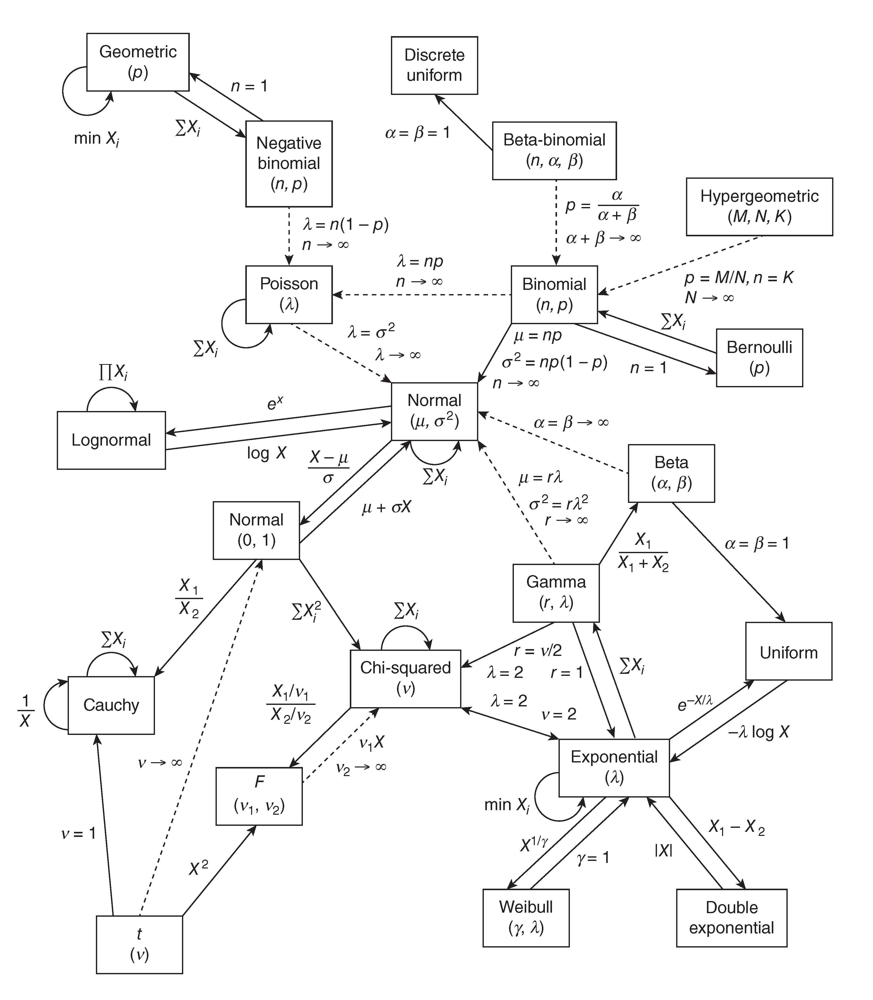

## Appendix

## Weighted Summation

In spectral analysis—whether it’s the Fourier transform, a filter, a kind of similarity, an interpolator, or a wavelet transform—the core operation is always a **weighted summation**. By designing appropriate weights, we amplify the information we care about and suppress what we don’t, allowing us to distill an N-point signal into concise, abstract, and generalizable features. As a result, nearly every outcome of spectral analysis exhibits additive properties—for example, the noise spectrum follows a chi-square distribution. From another viewpoint, weighted summation is essentially a convolution; by the convolution theorem, it is equivalent to multiplication in the dual domain. This insight also suggests alternative ways to construct kernels in spectral analysis, such as the FBSP wavelet in the continuous wavelet transform, which is obtained via spectral-domain interpolation.

When you are lost in the mathematical derivation, remember that the core operation is always a weighted summation. This perspective can help you understand the underlying principles and guide your implementation.

## NDArray Shaping

When create the `numpy.ndarray`, arrange the dimension in the sequence of `Frequency -> Time -> Dimension(s) -> Channel(s)-> Others`. This arrangement is nothing but my personal preference. One of the reason is the STFT and wavelet package by default return the matrix in the order of `Frequency -> Time`.    In this convention, one should use `np.stack([a, b], axis = -1)` when combining two channels. 

## Naming Convention

Naming the variable with the format of `noun_adjective` like `spec_complex` for the complex spectral matrix.

Naming the function with the format of `verb_noun_adverb/adjective` like `smooth_spec_boxcar`. 

A doc-string is always appreciated. One easy way to do that is to generate them through LLM-based chatbot like copilot and check/revise them.

For more details, I suggest to use the naming conventions from *Google Python Style Guide*. In brief

### 3.16 Naming

`module_name`, `package_name`, `ClassName`, `method_name`, `ExceptionName`, `function_name`, `GLOBAL_CONSTANT_NAME`, `global_var_name`, `instance_var_name`, `function_parameter_name`, `local_var_name`, `query_proper_noun_for_thing`, `send_acronym_via_https`.

Names should be descriptive. This includes functions, classes, variables, attributes, files and any other type of named entities.

Avoid abbreviation. In particular, do not use abbreviations that are ambiguous or unfamiliar to readers outside your project, and do not abbreviate by deleting letters within a word.

Always use a `.py` filename extension. Never use dashes.


#### 3.16.1 Names to Avoid

- single character names, except for specifically allowed cases:

  - counters or iterators (e.g. `i`, `j`, `k`, `v`, et al.)
  - `e` as an exception identifier in `try/except` statements.
  - `f` as a file handle in `with` statements
  - private [type variables](https://google.github.io/styleguide/pyguide.html#typing-type-var) with no constraints (e.g. `_T = TypeVar("_T")`, `_P = ParamSpec("_P")`)
  - names that match established notation in a reference paper or algorithm (see [Mathematical Notation](https://google.github.io/styleguide/pyguide.html#math-notation))

  Please be mindful not to abuse single-character naming. Generally speaking, descriptiveness should be proportional to the name’s scope of visibility. For example, `i` might be a fine name for 5-line code block but within multiple nested scopes, it is likely too vague.

- dashes (`-`) in any package/module name

- `__double_leading_and_trailing_underscore__` names (reserved by Python)

- offensive terms

- names that needlessly include the type of the variable (for example: `id_to_name_dict`)


#### 3.16.2 Naming Conventions

- “Internal” means internal to a module, or protected or private within a class.
- Prepending a single underscore (`_`) has some support for protecting module variables and functions (linters will flag protected member access). Note that it is okay for unit tests to access protected constants from the modules under test.
- Prepending a double underscore (`__` aka “dunder”) to an instance variable or method effectively makes the variable or method private to its class (using name mangling); we discourage its use as it impacts readability and testability, and isn’t *really* private. Prefer a single underscore.
- Place related classes and top-level functions together in a module. Unlike Java, there is no need to limit yourself to one class per module.
- Use CapWords for class names, but lower_with_under.py for module names. Although there are some old modules named CapWords.py, this is now discouraged because it’s confusing when the module happens to be named after a class. (“wait – did I write `import StringIO` or `from StringIO import StringIO`?”)
- New *unit test* files follow PEP 8 compliant lower_with_under method names, for example, `test_<method_under_test>_<state>`. For consistency(*) with legacy modules that follow CapWords function names, underscores may appear in method names starting with `test` to separate logical components of the name. One possible pattern is `test<MethodUnderTest>_<state>`.


#### 3.16.3 File Naming

Python filenames must have a `.py` extension and must not contain dashes (`-`). This allows them to be imported and unittested. If you want an executable to be accessible without the extension, use a symbolic link or a simple bash wrapper containing `exec "$0.py" "$@"`.


#### 3.16.4 Guidelines derived from [Guido](https://en.wikipedia.org/wiki/Guido_van_Rossum)’s Recommendations

| Type                       | Public               | Internal                          |
| -------------------------- | -------------------- | --------------------------------- |
| Packages                   | `lower_with_under`   |                                   |
| Modules                    | `lower_with_under`   | `_lower_with_under`               |
| Classes                    | `CapWords`           | `_CapWords`                       |
| Exceptions                 | `CapWords`           |                                   |
| Functions                  | `lower_with_under()` | `_lower_with_under()`             |
| Global/Class Constants     | `CAPS_WITH_UNDER`    | `_CAPS_WITH_UNDER`                |
| Global/Class Variables     | `lower_with_under`   | `_lower_with_under`               |
| Instance Variables         | `lower_with_under`   | `_lower_with_under` (protected)   |
| Method Names               | `lower_with_under()` | `_lower_with_under()` (protected) |
| Function/Method Parameters | `lower_with_under`   |                                   |
| Local Variables            | `lower_with_under`   |                                   |

#### 3.16.5 Mathematical Notation

For mathematically-heavy code, short variable names that would otherwise violate the style guide are preferred when they match established notation in a reference paper or algorithm.

When using names based on established notation:

1. Cite the source of all naming conventions, preferably with a hyperlink to academic resource itself, in a comment or docstring. If the source is not accessible, clearly document the naming conventions.
2. Prefer PEP8-compliant `descriptive_names` for public APIs, which are much more likely to be encountered out of context.
3. Use a narrowly-scoped `pylint: disable=invalid-name` directive to silence warnings. For just a few variables, use the directive as an endline comment for each one; for more, apply the directive at the beginning of a block.

### Jargon Sheet

|      Notation      |   Variable Name   |                         Explanation                          |
| :----------------: | :---------------: | :----------------------------------------------------------: |
|     $(t), (f)$     |      `t, f`       |       Continuous input, frequency ($f$) or time ($t$)        |
|     $[t], [f]$     |      `t, f`       |                        Discrete input                        |
|      $\omega$      |      `omega`      |             Angular frequency, $\omega = 2\pi f$             |
|       $x(t)$       |         -         |      Continuous signal $x$ as a function of time ($t$)       |
|  $x[n] = x(nf_S)$  |       `sig`       | An even sample of $x(t)$, the intensity is termed as ***Amplitude*** |
| $X[k]=X(kT^{-1})$  |      `coef`       | Fourier Transform Coefficient of $x(t)$, the intensity is termed as ***Magnitude*** |
|   $\mathcal{F}$    |         -         |                  Fourier Transform Operator                  |
|        $N$         |        `N`        |                        Signal length                         |
|        Arb         |         -         |                        Arbitrary Unit                        |
|       $w[n]$       |     `window`      |                       Window Function                        |
|    $\hat{B}_i$     |      `coef`       |                     Fourier Coefficient                      |
|      $S_{ij}$      |      `spec`       |                       Spectral Matrix                        |
|         -          |      `*_wf`       |                       Wave Frame (WF)                        |
|         -          |      `*_ma`       |                     Moving Average (MA)                      |
|         -          | `*_lh` and `*_rh` |            Left Handed (LH) and Right Handed (RH)            |
| $\mathrm{\Delta}t$ |       `dt`        |                       Sampling Period                        |
|       $f_s$        |       `fs`        |                      Sampling Frequency                      |
|   $\mathrm{Amp}$   |       `amp`       |                          Amplitude                           |
|                    |                   |                                                              |
|                    |                   |                                                              |
|                    |                   |                                                              |
|                    |                   |                                                              |
|                    |                   |                                                              |
|                    |                   |                                                              |
|                    |                   |                                                              |


## Sliding Window

`numpy.lib.stride_tricks.sliding_window_view(x, window_shape, axis=None, *, subok=False, writeable=False)` provides the function for re-organizing the signal into several sub-chunk. This function can only give a stride of one. For a customized stride, you need to use `numpy.lib.stride_tricks.as_strided(x, shape=None, strides=None, subok=False, writeable=True)`. This function can be unsafe and crash your program.  

The `bottleneck` package, which is safer and more efficient,  is more suggested for common usage of moving windows, like moving-average and moving-maximum. The following code shows how to use the `bottleneck` functions and their expected results.

```python
# -------------------------------
# Method 1: sliding_window_view (fixed stride = 1)
# -------------------------------
window_size = 4
windows_stride1 = sliding_window_view(sig, window_shape=window_size)

# -------------------------------
# Method 2: as_strided (custom stride, use with caution!)
# -------------------------------
custom_stride = 2
n_windows = (len(sig) - window_size) // custom_stride + 1
shape = (n_windows, window_size)
strides = (sig.strides[0] * custom_stride, sig.strides[0])

windows_custom = as_strided(sig, shape=shape, strides=strides)

# -------------------------------
# Method 3: bottleneck (safe, NaN-aware window functions)
# -------------------------------
ma = bn.move_mean(sig, window=3, min_count=1)
mm = bn.move_max(sig, window=3, min_count=1)
std = bn.move_std(sig, window=3, min_count=1)

```

## Table of Common Distributions

Please keep in mind that all signals contain uncertainty. If you want to start a theoretical derivation on some signal properties, consider it from the perspective of probability. 

<p align = 'center'></p>
<p align = 'center'><i>Table of Common Distributions</i></p>

