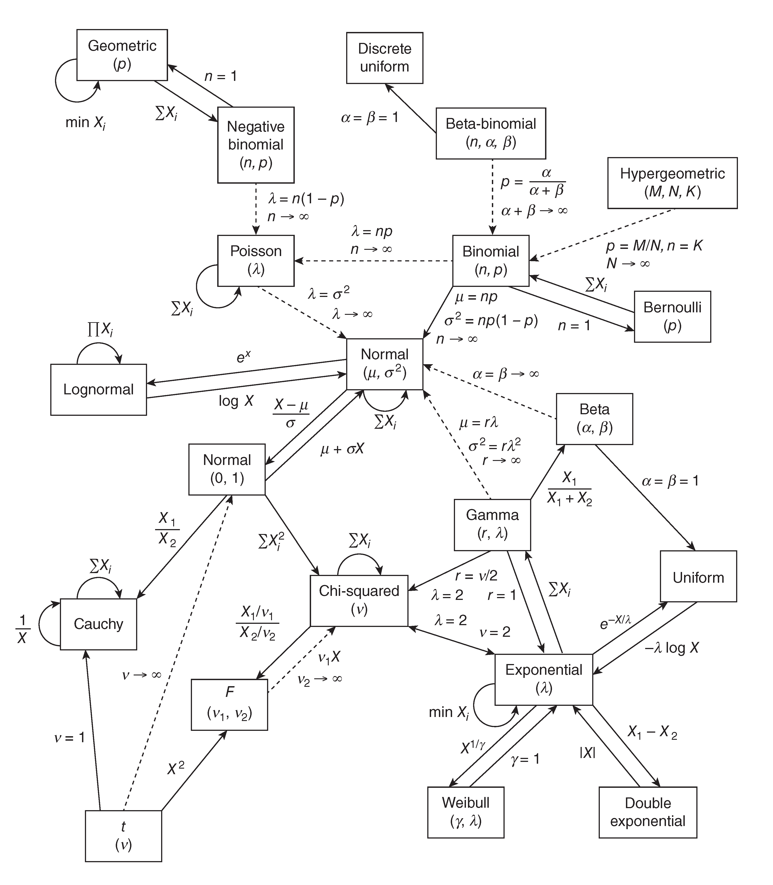

## Appendix

# Weighted Summation

Whether it’s a <u>Fourier transform</u>, digital <u>filter</u>, interpolator, or wavelet transform, they all do the same thing: a **weighted summation** of the signal. Properly chosen weights (kernel / window / basis function) amplify the components we care about and suppress the rest, distilling an $N$-point sequence $x\in\mathbb{R}^N$ into **compact, generalizable** features.

### Unifying Essence: Weighted Inner Product

Write any local/global operation as
$$
y[t] \;=\; \sum_{k} w_t[k]\; x[k] \;=\; \langle x,\; w_t\rangle,
$$
where $w_t$ varies with position/scale/frequency (a moving window, a scaled wavelet, a band filter, etc.). Under this definition, most spectral-analysis outcomes are **additive**: linear superposition in the input maps to linear superposition in the feature domain. For Gaussian white noise, many power estimators (e.g., the raw periodogram) follow a $\chi^2$ law (degrees of freedom depend on averaging/smoothing), providing the statistical basis for uncertainty and variance control.

### View 1: Convolution (Time-Domain Localization)

If $w_t[k]=h[t-k]$ depends on $t$ only by shift, we obtain **discrete convolution**
$$
y[t]=(h*x)[t]=\sum_k h[k]\,x[t-k].
$$

- Examples
  - FIR/IIR filtering: $h$ is the impulse response; FIR via direct convolution, IIR via recursion (an equivalent weighted accumulation).
  - STFT: at each center $t$, weight by window $g$ and take inner products with complex exponentials.
  - Interpolation: kernel interpolation (e.g., Lanczos, B-splines) is convolution/sample-and-hold with an interpolation kernel.

### View 2: Frequency-Domain Multiplication (Spectral Sculpting)

By the convolution theorem, time-domain convolution equals frequency-domain pointwise multiplication:
$$
\mathcal{F}\{h*x\}(\omega)=H(\omega)\,X(\omega).
$$

- Examples
  - Frequency-domain filter design: specify $H(\omega)$ (pass/stop/transition bands), then invert to obtain $h$.
  - CWT with FBSP (Fourier B-spline) kernels: construct smooth/compact $H(\omega)$ directly, then transform back.

### View 3: Linear Projection (Geometry & Statistics)

Matrix form:
$$
y = W x,\qquad
W=
\begin{bmatrix}
-\\ w_1^\top \\ -\\ \vdots \\ -\\ w_m^\top \\ -
\end{bmatrix}.
$$
Each row $w_i$ is an **inner-product projection**. This links directly to **PCA**: PCA chooses eigenvectors of the data covariance as weights to maximize projected variance and minimize reconstruction error.

- Examples
  - Orthogonal bases (DFT/DCT/orthogonal wavelets): $W$ is orthogonal/unitary, conserving energy (Parseval).
  - Overcomplete dictionaries & sparse coding (STFT, redundant wavelets, curvelets): select a few “active” weights via regularization.
  - Least squares/Ridge: penalization controls variance/bias of weights in noise.

### Three “Chisels” for Designing Weights

1. **Target selectivity**: emphasize desired time–frequency/scale/direction regions; suppress others.
2. **Constraints & regularization**: smoothness, compact support, zero mean, minimum phase, MMSE, sparsity, etc.
3. **Statistical robustness**: control variance (averaging/multitaper/multiscale aggregation) and correct bias (window compensation, gain calibration).

### Common Pitfalls & Remedies

- **Spectral leakage/side-lobe artifacts** → choose appropriate windows; redesign $H(\omega)$ in frequency domain if needed.
- **Boundary effects** → make extension strategy explicit and flag “valid region” in plots.
- **Phase distortion** → for linear phase use symmetric FIR; for zero-phase use `filtfilt` (mind edge handling/stability).
- **DOF mismatch** → when reporting noise spectra and confidence intervals, state how smoothing/averaging changed the DOF.

### Things to Remember

- Everything is $\langle x, w\rangle$: locally it’s **convolution**; in frequency it’s **multiplication**; in linear algebra it’s **projection**.
- Efficiency follows structure: shift-invariance ⇒ convolution; FFT ⇒ $O(N\log N)$; orthogonal bases ⇒ fast transforms (FFT/DWT/DCT).
- Statistics are baked in: weights set the bias–variance trade-off; $\chi^2$ approximations give uncertainty; aggregation (averaging/multitaper) boosts robustness.

Here’s a tighter, no-fluff version you can drop in.

# NDArray Shaping

shape spectral data as
$$
 (Frequency,, Time,, Dimension,, Channel,, \dots) ;=; (F, T, D, C, \dots)
$$
Rationale: matches many STFT/CWT APIs `(F, T)`, simplifies plotting and reductions, keeps channels/metadata at the tail.

**Combine channels**

```python
y = np.stack([ch1, ch2], axis=-1)  # (..., C=2)
```

**Common ops**

```python
avg_over_time = S.mean(axis=1)           # (F, D, C, ...)  average over time
band_mean     = S[f0:f1].mean(axis=0)    # (T, D, C, ...)  bandded mean
mag_over_D    = np.linalg.norm(S, axis=2)# (F, T, C, ...), magnetude over dimension
S_cal = S * g[np.newaxis,np.newaxis,np.newaxis,:]  # g: (C,)
```

**Convert layouts**

```python
# libs expecting time-last
x_tlast = np.moveaxis(x, 1, -1)      # (F,T,...) -> (F,...,T)
x_back  = np.moveaxis(x_tlast, -1, 1)

x_nchw = np.expand_dims(np.moveaxis(x, -1, 0), 0)
```

**Performance & hygiene**

```python
S = np.ascontiguousarray(S)   # after transpose/moveaxis
S_F = np.asfortranarray(S)    # if a Fortran-ordered lib needs it
```


Here’s a crisper, better-organized version you can drop in.

# Naming Convention (Compact)

**Local conventions**

- **Variables:** `noun_adjective`, e.g., `spec_complex` (complex spectrogram), `trace_clean`.
- **Functions:** `verb_noun[_adverb|_adjective]`, e.g., `smooth_spec_boxcar`, `estimate_bandpower_fast`.
- **Docstrings:** always include one. Generate a first draft with an LLM (e.g., Copilot) and revise for accuracy.

**Follow Google Python Style Guide (brief)**

- Use: `module_name`, `package_name`, `ClassName`, `method_name`, `ExceptionName`,
   `function_name`, `GLOBAL_CONSTANT_NAME`, `global_var_name`, `instance_var_name`,
   `function_parameter_name`, `local_var_name`, `query_proper_noun_for_thing`, `send_acronym_via_https`.
- Names must be **descriptive**. Avoid ambiguous abbreviations and dropped-letter shortenings.
- Python files must end with `.py`; never use dashes in filenames.

### Names to avoid

- Single letters (except standard cases: `i/j/k` loop counters, `e` in `except`, `f` file handle, private type vars like `_T`, or symbols matching a referenced paper’s notation).
- `__double_leading_and_trailing__` (reserved).
- Offensive terms.
- Redundant type suffixes (e.g., `id_to_name_dict` → `id_to_name`).

### Conventions & visibility

- “Internal” = module-internal or protected/private in a class.
- Prefer single underscore `_name` for protected members; avoid `__dunder` privacy (name-mangling hurts readability/testing).
- Group related classes and top-level functions in the same module.
- Class names use `CapWords`; module files use `lower_with_under.py`.
- **Unit tests:** PEP 8 names, e.g., `test_<method_under_test>_<state>` (underscore segments allowed after `test`).

### File naming

- `.py` extension, no dashes. If you need an executable without the extension, use a symlink or tiny shell wrapper.

### Quick reference (public vs. internal)

| Type                   | Public               | Internal              |
| ---------------------- | -------------------- | --------------------- |
| Packages/Modules       | `lower_with_under`   | `_lower_with_under`   |
| Classes/Exceptions     | `CapWords`           | `_CapWords`           |
| Functions/Methods      | `lower_with_under()` | `_lower_with_under()` |
| Constants (global/cls) | `CAPS_WITH_UNDER`    | `_CAPS_WITH_UNDER`    |
| Variables              | `lower_with_under`   | `_lower_with_under`   |
| Params/Locals          | `lower_with_under`   | —                     |

### Mathematical notation (when it truly helps)

- Short symbols are fine if they match a cited paper/algorithm.
- Document the source of the notation (link in comment/docstring).
- For public APIs, prefer descriptive `pep8_names`.
- Silence lints narrowly: `# pylint: disable=invalid-name` (end-line for a few vars, or at block start for many).

### Minimal docstring template

```python
def smooth_spec_boxcar(spec_complex: np.ndarray, width: int) -> np.ndarray:
    """
    Smooth a complex spectrogram with a centered boxcar along the frequency axis.

    Args:
        spec_complex: Array shaped (..., F, T, C, ...) or (F, T, ...); complex-valued.
        width: Positive odd window length in frequency bins.

    Returns:
        Smoothed spectrogram with the same shape and dtype as input.

    Raises:
        ValueError: If width < 1 or even.
    """
    ...
```

**TL;DR:** Be descriptive, use `lower_with_under` for functions/vars, `CapWords` for classes, constants in `CAPS_WITH_UNDER`, keep internals prefixed with `_`, and always include a docstring.

### Jargon Sheet

|      Notation      |   Variable Name   |                         Explanation                          |
| :----------------: | :---------------: | :----------------------------------------------------------: |
|     $(t), (f)$     |      `t, f`       |       Continuous input, frequency ($f$) or time ($t$)        |
|     $[t], [f]$     |      `t, f`       |                        Discrete input                        |
|      $\omega$      |      `omega`      |             Angular frequency, $\omega = 2\pi f$             |
|       $x(t)$       |         -         |      Continuous signal $x$ as a function of time ($t$)       |
|  $x[n] = x(nf_S)$  |       `sig`       | An even sample of $x(t)$, the intensity is termed as ***Amplitude*** |
| $X[k]=X(kT^{-1})$  |      `coef`       | Fourier Transform Coefficient of $x(t)$, the intensity is termed as ***Magnitude*** |
|   $\mathcal{F}$    |         -         |                  Fourier Transform Operator                  |
|        $N$         |        `N`        |                        Signal length                         |
|        Arb         |         -         |                        Arbitrary Unit                        |
|       $w[n]$       |     `window`      |                       Window Function                        |
|    $\hat{B}_i$     |      `coef`       |                     Fourier Coefficient                      |
|      $S_{ij}$      |      `spec`       |                       Spectral Matrix                        |
|         -          |      `*_wf`       |                       Wave Frame (WF)                        |
|         -          |      `*_ma`       |                     Moving Average (MA)                      |
|         -          | `*_lh` and `*_rh` |            Left Handed (LH) and Right Handed (RH)            |
| $\mathrm{\Delta}t$ |       `dt`        |                       Sampling Period                        |
|       $f_s$        |       `fs`        |                      Sampling Frequency                      |
|   $\mathrm{Amp}$   |       `amp`       |                          Amplitude                           |
|                    |                   |                                                              |
|                    |                   |                                                              |
|                    |                   |                                                              |
|                    |                   |                                                              |
|                    |                   |                                                              |
|                    |                   |                                                              |
|                    |                   |                                                              |


## Sliding Window

`numpy.lib.stride_tricks.sliding_window_view(x, window_shape, axis=None, *, subok=False, writeable=False)` provides the function for re-organizing the signal into several sub-chunk. This function can only give a stride of one. For a customized stride, you need to use `numpy.lib.stride_tricks.as_strided(x, shape=None, strides=None, subok=False, writeable=True)`. This function can be unsafe and crash your program.  

The `bottleneck` package, which is safer and more efficient,  is more suggested for common usage of moving windows, like moving-average and moving-maximum. The following code shows how to use the `bottleneck` functions and their expected results.

```python
# -------------------------------
# Method 1: sliding_window_view (fixed stride = 1)
# -------------------------------
window_size = 4
windows_stride1 = sliding_window_view(sig, window_shape=window_size)

# -------------------------------
# Method 2: as_strided (custom stride, use with caution!)
# -------------------------------
custom_stride = 2
n_windows = (len(sig) - window_size) // custom_stride + 1
shape = (n_windows, window_size)
strides = (sig.strides[0] * custom_stride, sig.strides[0])

windows_custom = as_strided(sig, shape=shape, strides=strides)

# -------------------------------
# Method 3: bottleneck (safe, NaN-aware window functions)
# -------------------------------
ma = bn.move_mean(sig, window=3, min_count=1)
mm = bn.move_max(sig, window=3, min_count=1)
std = bn.move_std(sig, window=3, min_count=1)

```

## Table of Common Distributions

Please keep in mind that all signals contain uncertainty. If you want to start a theoretical derivation on some signal properties, consider it from the perspective of probability. 

<p align = 'center'></p>
<p align = 'center'><i>Table of Common Distributions</i></p>

