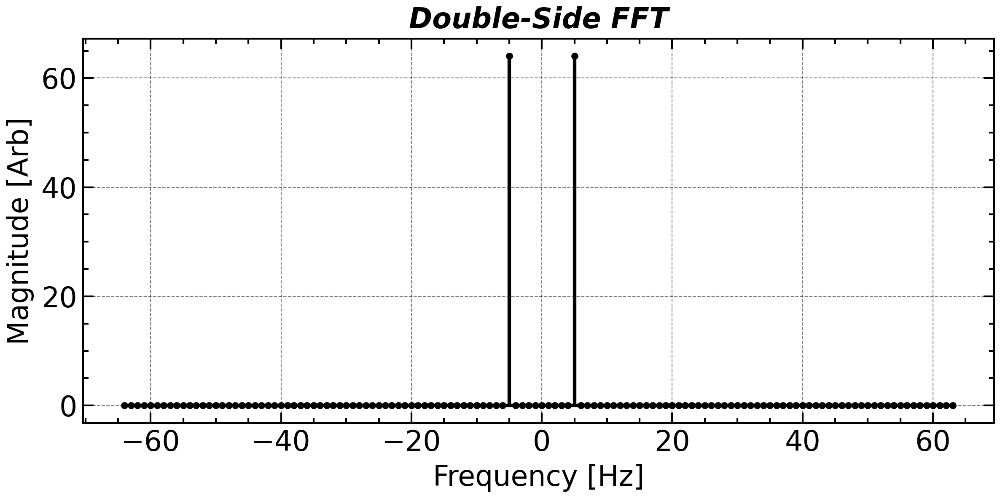
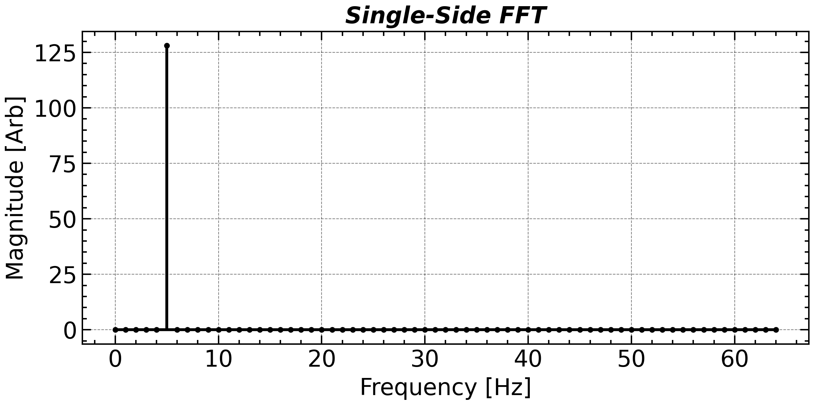
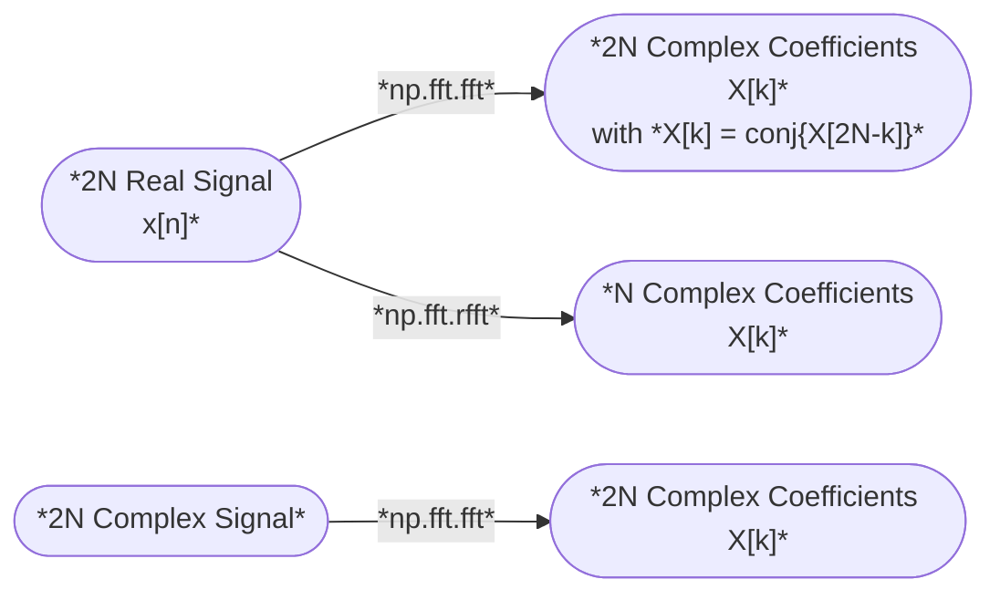
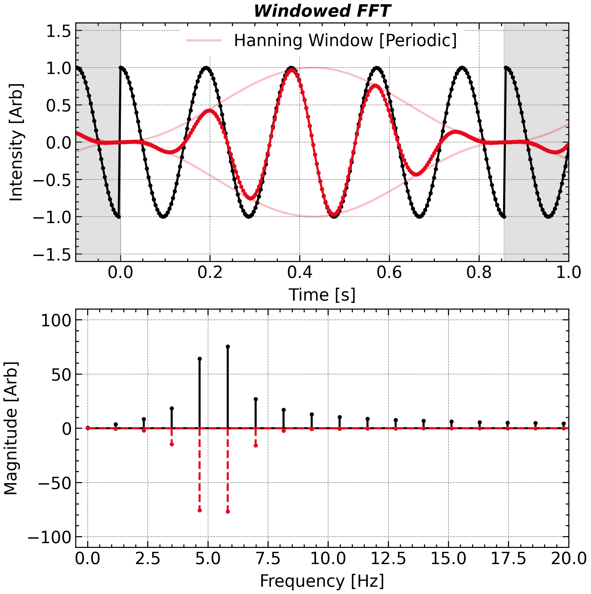
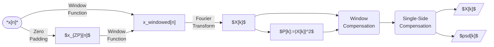
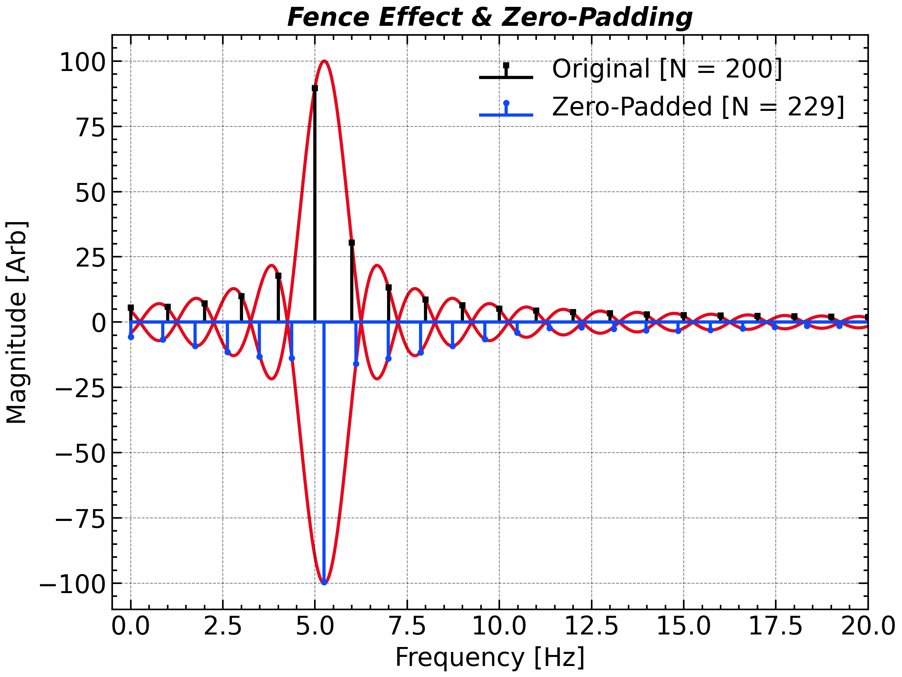

# How Do We See Frequencies in Data?

## Fourier Transform

Fourier transform provide the perfect way to convert the observed time series into the dual space--Frequency domain. Its definition can be written as follows

$$
\begin{align}
X(f) = \int_{-\infty}^{+\infty} x(t) e^{-2\pi i f t} \, \mathrm{d}t
\end{align}
$$
Correspondingly, the inverse (continuous) Fourier transform can be given as:

$$
\begin{align}
x(t)=\int_{-\infty}^{+\infty}X(f) e^{2\pi i f t} \mathrm{d}f
\end{align}
$$

However, a physical sample can only cover at discrete time nodes. Thus, ***Discrete-Time Fourier Transform (DTFT)*** presents an alternative expression in:
$$
\begin{align}
X(f)=\sum_{n=-\infty}^{+\infty} x(n \Delta t)\cdot e^{-i2\pi f (n\Delta t)}
\end{align}
$$

where $x[n]=x(n\Delta t)$ stands for a discrete signal and $T$ is the sampling period. This signal has infinite length and is still unrealistic. For a finite signal, the ***Discrete Fourier Transform (DFT)*** is the only one that applicable:
$$
\begin{align}
X[k] = X(k\Delta f) & = \sum_{n=0}^N x(n\Delta t) e^{-2\pi i k\Delta f t} \, \Delta  t \\
& = \sum_{n=0}^N x[n] e^{-2\pi i k\Delta f t} \, \Delta  t
\end{align}
$$

In many lecture notes, the sample period $\Delta t$ is set to unity so that the formulas can be simplified. So, remember that all the related quantities are not in SI (*Système International d'Unités*) in that case。

Ideally, according to the periodicity of $e^{-2\pi i ft}$, the DFT actually calculates the DTFT coefficients by extending the original series along and anti-along the time axis.

## Double-side ***versus*** Single-side 

In frequency analysis using the Fast Fourier Transform (FFT), the spectrum can be represented in two main formats: **double-sided** and **single-sided**, depending on the properties of the input signal and the goal of the analysis.

- **Double-Sided FFT** includes both positive and negative frequency components, symmetrically arranged around zero. It shows the full complex-valued spectrum, which is useful when the signal is complex or when phase symmetry matters. For real signals, the negative-frequency part is the complex conjugate of the positive-frequency part, making the negative side redundant in terms of magnitude.

- `np.fft.fftfreq(N, dt)`

  ```python
  coef = np.fft.fft(sig)
  # Corresponding frequency with both zero, positive, and negative frequency
  
  freq = np.fft.fftfreq(coef.size, dt)
  # [0, 1, ...,   N/2-1,     -N/2, ..., -1] / (dt * N)   # if n is even
  # [0, 1, ..., (N-1)/2, -(N-1)/2, ..., -1] / (dt * N)   # if n is odd
  ```

  Then you can use `np.fft.fftshift` to rearrange the `coef` and `freq` so that the frequency is monotonically increasing:

  ```python
  freq = np.fft.fftshift(freq)
  coef = np.fft.fftshift(coef)
  ```

  <p align = 'center'></p>

- **Single-Sided FFT** presents only the non-negative frequency components (from 0 up to Nyquist frequency). This format is typically used for **real-valued signals** when the **power spectral density** or **amplitude spectrum** is of interest. To preserve energy equivalence, the magnitudes (except at 0 and Nyquist) are usually **doubled** to account for the omitted negative frequencies.

In summary, use the **double-sided form** for full-spectrum analysis (e.g., for complex signals or inverse transforms), and the **single-sided form** for clearer interpretation of real-signal power content.

<p align = 'center'>

</p>


The size of the coefficients is  `N` and each coefficient consist of both its real and imaginary parts, which means a `2N` redundancy. That is because `numpy.fft.fft` is designed for not only the real input but also the complex inputs, which can actually represents `2N` variables with a signal size of `N`.




For real input, use `numpy.fft.rfft` (`numpy.fft.rfftfreq`) instead of `numpy.fft.fft` (`numpy.fft.fftfreq`), which is only designed for real input and intrinsically truncate the output coefficients and frequencies.

```python
coef = np.fft.rfft(sig)
freq = np.fft.rfftfreq(coef.size, dt)
```

Yet, please remember that only real signal can be used as an input to `numpy.fft.rfft` otherwise the imaginary parts are ignored by default.

## Windowing Effect

When performing spectral analysis using the DFT, we implicitly assume that the finite-duration signal is periodically extended. 
$$
\begin{align}
X[k] & = \lim_{M\rightarrow+\infty} \frac{1}{2M} \sum_{n=-(M-1)\times N}^{M \times N} x[n] e^{-2\pi i k {t}/{T}} \, \Delta  t\\
& \propto \sum_{n=-\infty}^{+\infty} x[n] e^{-2\pi i k {t}/{T}} \, \Delta  t
\end{align}
$$
However, if the total sampling duration does not exactly match an integer multiple of the signal’s intrinsic period, a mismatch arises between the first and last sample points. This mismatch is interpreted by the DFT as a sharp discontinuity—or a jump—at the signal boundary. It arises since the first and last measurements seen by the Fourier operator is next to each other while it is actually not.

<p align = 'center'>

</p>


This artificial discontinuity introduces **spectral leakage**, causing energy from specific frequency components to spread into adjacent frequencies, thereby distorting the true spectral content. To mitigate this issue, a **window function**—typically denoted ${w}(t)$—is applied to taper the edges of the signal, reducing the contribution of the jump and suppressing leakage.

Different window functions (e.g., rectangular, Hamming, Hanning, Blackman) offer different trade-offs between **frequency resolution** (main-lobe width) and **leakage suppression** (side-lobe attenuation). You should try these window functions yourself and choose the most suitable one.

The Hanning window, which is a very wide used window function, can be written as:
$$
\begin{align}
w(t)&=\frac{1}{2}\left[1-\mathrm{cos}(2\pi t)\right]\\
w[n]&=\frac{1}{2}\left[1-\mathrm{cos} \left(\frac{2\pi n}{N}\right)\right]
\end{align}
$$

It can be implemented in `numpy` as follow:

```python
# Without Normalization
sig *= np.hanning(sig.size)
```

However, applying a window modifies the signal’s amplitude and energy characteristics. This can introduce ambiguity when interpreting the resulting spectrum or comparing analyses across different window shapes. To ensure physical and quantitative consistency, **normalization** of the window function is often necessary. **Amplitude normalization** ensures that the peak value of the window is one, preserving the local signal scale. **Power normalization** adjusts the window so that the total energy of the signal—defined as the sum of squared values—remains unchanged after windowing. The amplitude and power normalization is also named <u>**$L_1$ and $L_2$ normalization**</u> as the amplitude and power can is proportional to the $L_1$ and $L_2$ norm of the signal, respectively. The choice of normalization method depends on the analytical goals, and plays a crucial role in ensuring accurate and meaningful spectral results.

The Hanning window has an average amplitude of $1/2=\int_0^1 w(x)\mathrm{d}x$ and an average power of 
$$
\begin{align}
\int_0^1 w^2(x)\mathrm{d} x = \frac{1}{4} \left\{\int_0^1 [1 - 2 \mathrm{cos}(2\pi x) + \mathrm{cos^2}(2\pi x)]\mathrm{d}x \right\}=\frac{1}{4}(1-0+\frac{1}{2}) = \frac{3}{8}
\end{align}
$$

A more quantitative estimation of the signal amplitude or power can be given by using a normalized window function.

```python
# Amplitude Normalization
sig *= np.hanning(sig.size) * 2

# Power Normalization
sig *= np.hanning(sig.size) * np.sqrt(8 / 3)
```

Some other window functions are also supported by `numpy` and `scipy`, which is summarized below:

<p align = 'center'>

    <i>Some Other Window Functions (without normalization).</i>
</p>


| **Name and Function** |                NumPy or SciPy Function                 |                           **w[n]**                           |              **Amplitude Normalization Factor**              |               **Power Normalization Factor **                |
| :-------------------: | :----------------------------------------------------: | :----------------------------------------------------------: | :----------------------------------------------------------: | :----------------------------------------------------------: |
| Rectangular (Boxcar)  |    `np.ones(N)` or `scipy.signal.windows.boxcar(N)`    |                             $1$                              |                             $1$                              |                             $1$                              |
|    Hann (Hanning)     |   `np.hanning(N)` or `scipy.signal.windows.hann(N)`    |  $0.5\left(1 - \cos\left(\frac{2\pi n}{N-1}\right)\right)$   |                          ${1}/{2}$                           |                       $\sqrt{{3}/{8}}$                       |
|        Hamming        |  `np.hamming(N)` or `scipy.signal.windows.hamming(N)`  |       $0.54 - 0.46\cos\left(\frac{2\pi n}{N-1}\right)$       |                            $0.54$                            |    $\sqrt{0.397}=\sqrt{\frac{25^2 + 21^2}{2 \cdot 46^2}}$    |
|       Blackman        | `np.blackman(N)` or `scipy.signal.windows.blackman(N)` | $0.42 - 0.5\cos\left(\frac{2\pi n}{N-1}\right) + 0.08\cos\left(\frac{4\pi n}{N-1}\right)$ |                            $0.42$                            | $\sqrt{0.274}=\sqrt{\frac{21^2 + 25^2 + 4^2}{2 \cdot 50^2}}$ |
|        Kaiser         |         `scipy.signal.windows.kaiser(N, beta)`         | $\frac{I_0\left(\beta\sqrt{1-\left(\frac{2n}{N-1}-1\right)^2}\right)}{I_0(\beta)}$ | $\frac{1}{2I_0(\beta)}\int_{-1}^{1} I_0\left(\beta\sqrt{1-x^2}\right) dx$ | $\sqrt{\frac{1}{2}\int_{-1}^{1} \left[\frac{I_0\left(\beta\sqrt{1-x^2}\right)}{I_0(\beta)}\right]^2 dx}$ |
|         Tukey         |         `scipy.signal.windows.tukey(N, alpha)`         | $0.5\left(1 + \cos\left(\frac{\pi(2n)}{\alpha N} - 1\right)\right)$ |                      $1 - {\alpha}/{2}$                      |       $\sqrt{1 - \frac{\alpha}{2} + \frac{\alpha}{4}}$       |
|       Gaussian        |        `scipy.signal.windows.gaussian(N, std)`         | $\exp\left(-\frac{1}{2}\left(\frac{n-\frac{N-1}{2}}{\sigma\frac{N-1}{2}}\right)^2\right)$ |                   $\sigma\sqrt{{\pi}/{2}}$                   |                     $\sigma\sqrt{\pi}/2$                     |
|       Bartlett        | `np.bartlett(N)` or `scipy.signal.windows.bartlett(N)` |       $1 - \frac{2\left|n-\frac{N-1}{2}\right|}{N-1}$        |                          ${1}/{2}$                           |                       $\sqrt{{1}/{3}}$                       |

- For Tukey: $\alpha$ is the cosine-tapered fraction $(0 \leq \alpha \leq 1)$
- For Kaiser: $I_0$ is the modified Bessel function of the first kind
- Gaussian approximations assume the window is appropriately scaled

<u>**As the magnitude and power spectra have different normalization factors, it is suggested that apply the normalization before the data outputting/plotting but not immediately after you proceed the Fourier transform.**</u>

In the end, we show the complete data processing diagram for ***windowed Fourier transform (WFT)***.




## Fence Effect and Zero-Padding

To further improve the interpretability of spectral results, addressing spectral leakage alone is not enough. Another source of distortion arises from the discretization of the frequency axis itself. When a signal's frequency component does not align exactly with the frequency bins defined by the DFT, its energy spreads into neighboring bins—a phenomenon known as the **fence effect**. To reduce this effect and achieve smoother spectral representations, we often apply a technique known as **zero-padding**, which is discussed below.

When using the Discrete Fourier Transform (DFT), we effectively project the signal onto a set of discrete frequency bins. If the actual frequency of a signal component does not align precisely with one of these bins, the energy spreads across multiple nearby bins—an artifact known as the **fence effect**. This leads to inaccurate spectral peak positions and broadening, especially when analyzing short-duration signals or signals with non-integer frequency components.

A common technique to mitigate the visual and analytical impact of the fence effect is **zero-padding**—extending the time-domain signal by appending zeros beyond its original length. While zero-padding does not increase the inherent frequency resolution, it interpolates the spectrum between the original DFT bins, producing a smoother and more detailed frequency-domain representation. This can help in better locating spectral peaks and distinguishing closely spaced features.

Zero-padding is particularly useful in peak detection, cross-spectral analysis, and visualization, where enhanced frequency granularity improves interpretability even though it doesn’t extract new information from the signal itself.

<p align = 'center'>

</p>
```python
n_padding = 29
coef = np.fft.rfft(sig, n = signal.size + n_padding)
freq = np.fft.rfftfreq(coef.size, dt)
```

<div STYLE="page-break-after: always;"></div>