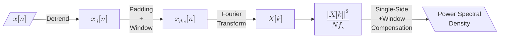
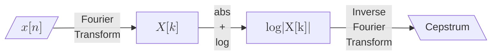
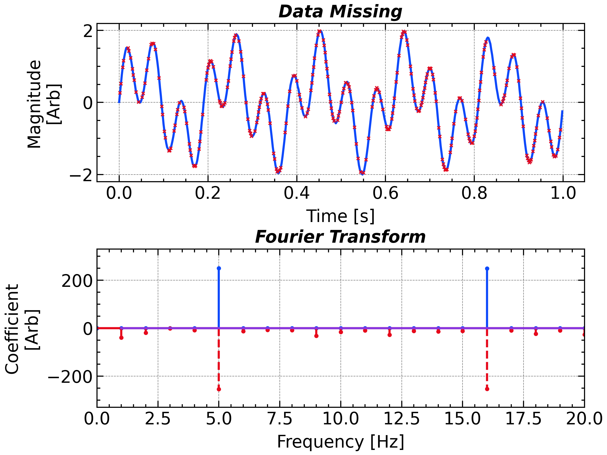
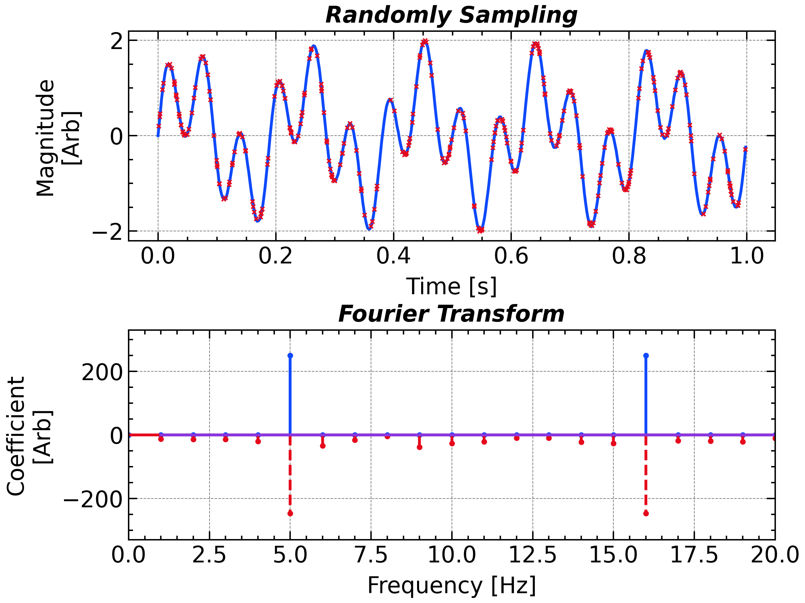

# Power Spectral Density

## Parseval's Theorem and Energy Conservation

> **Parseval's Identity**: The identity asserts that the sum of squares of the Fourier coefficients of a function is equal to the integral of the square of the function,
$$
\sum_{n=0}^{N-1} |x[n]|^{2} \Delta t
 \;=\;
 \sum_{k=0}^{N-1} |X[k]|^{2} \Delta f
$$
 where $x[n]$ is the discrete time signal, $X[k]$ is its Discrete Fourier Transform (DFT), $\Delta t$ is the time interval between samples, and $\Delta f$ is the frequency interval between DFT bins. This theorem essentially states that the total energy of a signal in the time domain is equal to the total energy in the frequency domain. 


In the physical world, the square power of the amplitude often refers to some kind of ***energy*** or ***power***. For example, the square of the displacement ($x$) of a spring, $x^2$ is proportional to the elastic potential energy ($kx^2/2$, where $k$ describes the stiffness). The electromagnetic field contains the energy density ($u$) written as 
$$
u=u_E + u_B=\frac{1}{2}(\varepsilon_0 \mathit{E}^2 + \frac{1}{\mu_0}\mathit{B}^2)
$$


In this case, the ***energy*** of the signal naturally linked with the ***energy*** of the electromagnetic field. Nevertheless, the energy of a signal is an extensive property as it linearly increases with the length of the sample. In the ordinary investigation, the signal energy is always further converted as signal ***power***, which is an intensive property that describe the amplitude and is independent of signal length. The definition of power, *P*, can be written as:

$$
P= \frac{1}{T}\int_{-T/2}^{T/2}|x(t)|^2 \mathrm{d}t
$$

## Power Spectral Density

For a signal to have a well-defined power spectral density, its second-order statistics must be time invariant. In a wide-sense stationary (WSS) process, the autocorrelation function depends only on the time lag ($\tau$) between two points, not on the specific times at which the measurements are taken. This property ensures that when we take the Fourier transform of the autocorrelation function—per the Wiener–Khinchin theorem—we obtain a unique and stable PSD that reflects the average distribution of power over frequency.

In contrast, if a signal is nonstationary, its mean and autocorrelation can vary with time. This variability means the instantaneous power may change over time, and the autocorrelation function becomes a function of two independent time variables rather than just the lag. As a result, any spectral estimate derived from such a time-varying autocorrelation would itself be time-dependent and ambiguous. Thus, without the WSS assumption, the PSD fails to capture a consistent picture of the signal's frequency content, making it ill-defined or misleading.
$$
\begin{align}
P&=\frac{1}{N\Delta t}\sum_{n=0}^{N-1}|x(n\Delta t)|^2 \Delta t\\
&=\frac{1}{N^2\Delta f}\sum_{k=0}^{N-1}|X(k\Delta f)|^2 \Delta f \\
&=\sum_{k=0}^{N-1} \boxed{\frac{1}{Nf_s} |X(k\Delta f)|^2}\, \Delta f\\
&=\sum_{k=0}^{N-1}\boxed{PSD[k]}\Delta f
\end{align}
$$

$$
\begin{align}
\int_{-\infty}^\infty x^2(t)\, dt = \int_{-\infty}^\infty X^2(f)\, df
\end{align}
$$

$$
\sum_{n=0}^{N-1}|x[n]|^2 = \frac{1}{N}\sum_{k=0}^{N-1}|X[k]|^2
$$

for DFT. Considering that DFT yields both positive and negative frequency, we typically fold the DFT result. Naturally, the definition of *power spectral density (PSD)* is given as:

$$
\begin{align}
&\sum_{k=0}^{N-1} PSD[k] \Delta f =\\
\mathrm{For\ Even \ }N:\ &\Delta f \left[PSD[0] + \sum_{k=1}^{{N}/{2}-1} 2\cdot PSD[k] + PSD[{N/2}]\right]\\
\mathrm{For\ Odd \ }N:\ &\Delta f \left[PSD[0] + \sum_{k=1}^{{(N-1)}/{2}} 2\cdot PSD[k]\right]
\end{align}
$$


$PSD[0]$ represents the DC component and is ignored in the spectral analysis for the most (but not all) time.

According to the lineairty of $\mathcal{F}$, $X[k]$, after single-side compensation, should also be proportional to the sine wave amplitude. Easily catch that the coefficient at the exact wave frequency has the form of 

$$
\begin{align}
|X[k]| = \frac{1}{2}A_k \cdot f_s \cdot T 
\end{align}
$$


$1/2$ in this equation arises from the fact that $\int_0^{2\pi}\mathrm{sin^2}x \mathrm{d}x=1/2$.

```python
window = np.hanning(N) # Symmetric Hanning Window
x_win = x * window

# Normalization factor (sum of squares of window coefficients)
norm_window = np.sum(window**2)

# Compute one-sided FFT
X = np.fft.rfft(x_win)
freq = np.fft.rfftfreq(N, d=dt)

# Estimate PSD with proper scaling:
psd = (np.abs(X)**2) / (fs * norm_window)

# Single-side compensation: double non-DC (and non-Nyquist if N is even)
if N % 2 == 0:
    psd[1:-1] *= 2
else:
    psd[1:] *= 2
```

- Alternative Approach: `scipy.signal.welch` is a more robust and efficient implementation of PSD estimation. It divides the signal into overlapping segments, applies a window to each segment, computes the FFT, and averages the results. This method reduces variance in the PSD estimate and is particularly useful for long signals. With a `npersge=N` and `noverlap=0`, it is equivalent to the above implementation.

  ```python
  # scipy.signa.welch
  freq, psd = scipy.signal.welch(x, fs=fs, window='hann', nperseg=N, noverlap=0, detrend=False)
  ```

  The `hann` window used in `scipy.signal.welch` is ***periodic*** instead of ***symmetric***. 

## Wide-Sense Stationarity

Wide-Sense Stationarity (WSS) is a key concept in signal processing that describes a signal whose statistical properties do not change over time. Specifically, a signal x(t) is considered WSS if:

1. **Constant Mean:**

   The mean of the signal is constant for all time: $$ \mathbb{E}[x(t)] = \mu, \quad \forall t $$

2. **Time-Invariant Autocorrelation:**

   The autocorrelation function depends only on the time difference (lag) between two time instants, not on the absolute time: $$ R_x(t_1, t_2) = R_x(\tau), \quad \tau = t_2 - t_1 $$

These conditions imply that even if the signal itself is random, its first two moments are invariant to shifts in time. This invariance simplifies the analysis significantly since one can characterize such a signal solely by its mean and autocorrelation function.

## Correlation Function [`scipy.signal.correlate`]

>A correlation function is a function that gives the statistical correlation between random variables, contingent on the spatial or temporal distance between those variables. If one considers the correlation function between random variables representing the same quantity measured at two different points, then this is often referred to as an autocorrelation function, which is made up of autocorrelations. Correlation functions of different random variables are sometimes called cross-correlation functions to emphasize that different variables are being considered and because they are made up of cross-correlations. ——Wikipedia

$$
\begin{align}
{R_{XY}}(t, t + \tau) := \mathbb{E}\left[ {X(t)} \overline{Y(t + \tau)} \right]
\end{align}
$$

where the overline represents the complex conjugate operation when $X$ and $Y$ are complex signal. Specifically, the correlation function between $X$ and itself is called autocorrelation function:

$$
\begin{align}
{R_{XX}}(t, t + \tau) := \mathbb{E}\left[ {X(t)} \overline{X(t + \tau)} \right]
\end{align}
$$
If $X$ is a wide-sense stationary signal, then ${R_{XX}}(t_1, t_1 + \tau)=R_{XX}(t_2, t_2 + \tau)$ for arbitrary $t_1, t_2,$ and $\tau$. Thus, the autocorrelation function can be written as a single-variate function $R_{XX}(\tau)=R_{XX}(t, t + \tau)$.

## Wiener–Khinchin Theorem

For a wide-sense stationary (WSS) random process $x(t)$, the **autocorrelation function** depends only on the time difference $\tau$, not on absolute time:
$$
R_x(\tau) = \mathbb{E}[x(t)\,x(t + \tau)]
$$
The **power spectral density** is defined as the **Fourier transform** of the autocorrelation function:
$$
S_x(f) = \int_{-\infty}^{\infty} R_x(\tau)\,e^{-j 2\pi f \tau}\,d\tau
$$
This is known as the **Wiener–Khinchin theorem**, and it is valid *only* under the assumption of WSS. The PSD $S_x(f)$ then describes how the total power of the signal is distributed across different frequency components. The relationship between PSD and the Fourier coefficients has been introduced in the previous section.

This theorem tells the intrinsic relationship between the *PSD* and *ACF*. Its contra-position claims that if the PSD doesn't equal to the Fourier transform of the ACF, the signal is not a *w.s.s* signal. The difference between them signify the nature of the solar wind parameters —— They are different from the NOISE! But, for some specific frequency range, they agree with each other well. It should be noticed that the closeness between them doesn't gurantee the signal to be *w.s.s*.

## What If the Signal Is Not Stationary?

- If the constant mean condition (first condition) is not satisfied—say, due to an underlying background trend—you should first apply detrending. Techniques such as subtracting the mean (constant detrending) or removing a linear trend (linear detrending) help modify the signal so that its mean becomes approximately constant.

  ```python
  scipy.signal.welch(x, fs, detrend = 'constants' (default) | 'linear' | Fasle)
  ```

  

- <p align = 'center'>
  
  </p>

- If the time-invariant autocorrelation condition (second condition) is not met, which indicates that the signal's higher-order statistics vary with time, traditional spectral analysis (like using the Wiener–Khinchin theorem) may no longer yield a meaningful power spectral density. In such cases, it is advisable to use time-frequency analysis methods, such as the Short-Time Fourier Transform (STFT) or the Wavelet Transform, to properly capture the signal's evolving spectral content.

The concept of *W.S.S* essentially guides us in selecting an appropriate window for spectral analysis. On one hand, the window length should be longer than the oscillation period to capture a complete cycle of the fluctuations. On the other hand, the window length should be shorter than the characteristic scale over which power or frequency variations occur, so that the signal within the window can be approximated as wide-sense stationary.




## Cepstrum

A non-sinuous, periodic signal usually has a broad Fourier spectrum concentrating at not only the fundamental frequency $f_0$ but also its harmonic $f_n=nf_0$. Like, a sawtooth waves have a Fourier coefficient decreases with $1/n$ where $n$ is the harmonic order while the coefficients at the rest frequencies remain zero. Therefore, there exists a periodic structure with period of $f_0$ in the Fourier domain. 

<p align = 'center'>
    </p>
<p align = 'center'>
<i>An example of cepstrum for a sawtooth wave with the fundamental frequency of 4 Hz</i>
</p>


Inspiri ng by this fact, B. P. Bogert, M. J. Healy, and J. W. Tukey introduce the ***Cepstral Analysis*** in 1963. The norm of the Fourier coefficients is taken logarithm and then inverse Fourier transformed for detecting the harmonic signature of the signal. 



This resulting "spectrum" is named as its variant ($\mathrm{spec \rightarrow ceps}$) —Cepstrum. Correspondingly, "frequency" is converted to "quefrency", which has the unit same as time's.

The initial aim of cepstrum is to analysis the seismic echoes, which can be modeled as:

$$
y(t) = x(t) +\alpha x(t-\tau)
$$

which has a Fourier transform of

$$
\begin{align}
Y(f) &= X(f) + \alpha X(f) e^{j2\pi f \tau}=X(f)(1+\alpha e^{j2\pi f \tau})\\
|Y(f)|^2 &= |X(f)|^2 [1+2\alpha \mathrm{cos}({j2\pi f \tau})+\alpha^2]
\end{align}
$$

$$
\begin{align}
\mathrm{log}(|Y(f)|^2) &= \mathrm{log}(|X(f)|^2) + \mathrm{log}[1+2\alpha \mathrm{cos}({j2\pi f \tau})+\alpha^2]\\
& \approx \mathrm{log}(|X(f)|^2) + 2\alpha \mathrm{cos}({j2\pi f \tau})
\end{align}
$$

Therefore, the echoes introduce the periodic structure in $\mathrm{log}(|Y(f)|^2)$. When parameter $\alpha$ is small enough, the periodic structure has a perfect sinuous waveform. Interestingly, the periodic sawtooth waves we introduced first can actually be interpreted as an initial signal accompanied with its three non-decayed echoes. That's the reason cepstral analysis works. 

However, it doesn't mean that the cepstral analysis work for the signals composited with echoes. Another common application of cepstral analysis is the [voice recognition](https://ieeexplore.ieee.org/document/859069). The principle behind is that the both the musical instrument and vocal fold has an eigen frequency thus the power of the voice naturally concentrate near the fundamental and harmonics.


```python
''' Python Implication of Cepstrum '''

freq = np.fft.rfftfreq(sig.size, dt)
coef = np.fft.rfft(sig)

log_abs_coef = np.log(np.abs(coef))

# Optional, Remove DC component for cepstrum calculation
log_abs_coef -= np.mean(log_abs_coef)

cepstrum = np.fft.rfft(log_abs_coef)
df = freq[1] - freq[0]
quefrency = np.fft.rfftfreq(log_abs_coef.size, df)
```

## Lomb-Scargle Periodogram [`scipy.signal.lombscargle`]

The **Lomb-Scargle periodogram** estimates a signal’s power spectrum **directly from unevenly sampled data**, avoiding interpolation.
For each angular frequency $\omega$ it fits
$$
x(t_n)\;\approx\;A\cos\omega t_n + B\sin\omega t_n,
$$
and defines the normalized power
$$
P(\omega)=\tfrac12\!\left[
\frac{\bigl[\sum (x_n-\bar x)\cos\omega(t_n-\tau)\bigr]^{\!2}}
     {\sum\cos^{2}\omega(t_n-\tau)}
\;+\;
\frac{\bigl[\sum (x_n-\bar x)\sin\omega(t_n-\tau)\bigr]^{\!2}}
     {\sum\sin^{2}\omega(t_n-\tau)}
\right],
$$
with phase offset
$$
\tan(2\omega\tau)=
\frac{\sum\sin 2\omega t_n}{\sum\cos 2\omega t_n},
$$
which decorrelates the sine–cosine terms and minimizes leakage.

The Lomb–Scargle periodogram fits sinusoids directly to the data using a least-squares approach—with an optimized phase shift that decouples the sine and cosine terms—so it inherently minimizes spectral leakage. Since this method is tailored for unevenly sampled data, the effect of windowing is already embedded in its formulation, making an additional window function unnecessary. 

When the sampling is uniform, $P(\omega)$ converges to the classic FFT periodogram.

```python
omega0 = 2 * np.pi * 5.0

# Data Missing
t = np.linspace(0, 1, 500, endpoint=False)
sig = np.sin(omega0 * t) + np.sin(omega0 * 3.2 * t) + np.random.randn(t.size) * 0.01
data_miss_idx = np.random.choice(np.arange(t.size), t.size - 200)
sig[data_miss_idx] = np.nan

# Randomly Sampling
t = np.random.uniform(0, 1, 300)
t.sort()
sig = np.sin(omega0 * t) + np.sin(omega0 * 3.2 * t) + np.random.randn(t.size) * 0.01

ls_amp = np.abs(scipy.signal.lombscargle(t[~np.isnan(sig)], sig[~np.isnan(sig)], 2 * np.pi * freq[1:], normalize='amplitude'))
```


<!-- tabs:start -->

#### **Data Missing**

<p align="center">    </p>

#### **Randomly Spampling**

<p align="center">    </p>

<!-- tabs:end -->

<div STYLE="page-break-after: always;"></div>