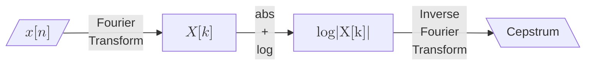

# Power Spectral Density

## Parseval's Theorem and Energy Conservation
In the physical world, the square power of the amplitude often refers to some kind of ***energy*** or ***power***. For example, the square of the displacement ($x$) of a spring, $x^2$ is proportional to the elastic potential energy ($kx^2/2$, where $k$ describes the stiffness). In plasma physics, electromagnetic field contains the energy density ($u$) written as 

$$
u=u_E + u_B=\frac{1}{2}(\varepsilon_0 \mathit{E}^2 + \frac{1}{\mu_0}\mathit{B}^2)
$$


In this case, the ***energy*** of the signal naturally linked with the ***energy*** of the electromagnetic field. Nevertheless, the energy of a signal is an extensive property as it linearly increases with the length of the sample. In the ordinary investigation, the signal energy is always further converted as signal ***power***, which is an intensive property that describe the amplitude and is independent of signal length. The defition of power, *P*, can be written as:

$$
P= \frac{1}{T}\int_{-T/2}^{T/2}|x(t)|^2 \mathrm{d}t
$$


or 
$$
\begin{align}
P&=\frac{1}{N\Delta t}\sum_{n=0}^{N-1}|x(n\Delta t)|^2 \Delta t\\
&=\frac{1}{N^2\Delta f}\sum_{k=0}^{N-1}|X(k\Delta f)|^2 \Delta f \\
&=\sum_{k=0}^{N-1} \boxed{\frac{1}{Nf_s} |X(k\Delta f)|^2}\, \Delta f\\
&=\sum_{k=0}^{N-1}PSD[k]\Delta f
\end{align}
$$

$$
\begin{align}
\int_{-\infty}^\infty x^2(t)\, dt = \int_{-\infty}^\infty X^2(f)\, df
\end{align}
$$

$$
\sum_{n=0}^{N-1}|x[n]|^2 = \frac{1}{N}\sum_{k=0}^{N-1}|X[k]|^2
$$

for DFT. Considering that DFT yields both positive and negative frequency, we typically fold the DFT result. Naturally, the definition of *power spectral density (PSD)* is given as:

$$
\begin{align}
&\sum_{k=0}^{N-1} PSD[k\Delta f] \Delta f =\\
\mathrm{For\ Even \ }N:\ &\Delta f \left[PSD[0] + \sum_{k=1}^{{N}/{2}-1} 2\cdot PSD[k\Delta f] + PSD[f_{N/2}]\right]\\
\mathrm{For\ Odd \ }N:\ &\Delta f \left[PSD[0] + \sum_{k=1}^{{(N-1)}/{2}} 2\cdot PSD[k\Delta f]\right]
\end{align}
$$


$PSD[0]$ represents the DC component and is ignored in the spectral analysis for the most(but not all) time.

```python
N = coef.size
fs = 1 / dt
psd = (np.abs(coef) ** 2) / (N * fs)

if N % 2 == 0:
    psd[1:-1] *= 2
else:
    psd[1:] *= 2
```

According to the lineairty of $\mathcal{F}$, $X[k]$ should also be proportional to the signal amplitude. Easily catch that the coefficient at the exact wave frequency has the form of 

$$
\begin{align}
|X[k]| = \frac{1}{2}A_k \cdot f_s \cdot T 
\end{align}
$$


1/2 in this equation arises from the fact that $\int_0^{2\pi}\mathrm{sin^2}x \mathrm{d}x=1/2$.

## Wiener–Khinchin Theorem

For a wide-sense stationary (WSS) random process $x(t)$, the **autocorrelation function** depends only on the time difference $\tau$, not on absolute time:
$$
R_x(\tau) = \mathbb{E}[x(t)\,x(t + \tau)]
$$
The **power spectral density** is defined as the **Fourier transform** of the autocorrelation function:
$$
S_x(f) = \int_{-\infty}^{\infty} R_x(\tau)\,e^{-j 2\pi f \tau}\,d\tau
$$
This is known as the **Wiener–Khinchin theorem**, and it is valid *only* under the assumption of WSS. The PSD $S_x(f)$ then describes how the total power of the signal is distributed across different frequency components. The relationship between PSD and the Fourier coefficients has been introduced in the previous section.

This theorem tells the intrinsic relationship between the *PSD* and *ACF*. Its contra-position claims that if the PSD doesn't equal to the Fourier transform of the ACF, the signal is not a *w.s.s* signal. The difference between them signify the nature of the solar wind parameters —— They are different from the NOISE! But, for some specific frequency range, they agree with each other well. It should be noticed that the closeness between them doesn't gurantee the signal to be *w.s.s*.

## Wide-Sense Stationarity

Without WSS, the autocorrelation $R_x(t_1, t_2)$ becomes a function of two independent time variables rather than just the lag $\tau$. In such cases, the expectation of the instantaneous wave power $\mathbb{E}[{x^2(t)}]=R_x(t, t)\neq R_x(0=t-t)$ is not independent on $t$. Hence, the Fourier transform of the autocorrelation no longer represents a meaningful or consistent frequency-domain power measure.

> **Therefore, only stationary processes have a well-defined power spectral density, and only then can the spectrum be interpreted as the distribution of power over frequency.**

## What If the Signal Is Not Stationary?

For nonstationary signals, the PSD is ill-defined or misleading. In such cases, time-frequency analysis techniques such as:

- **Short-Time Fourier Transform (STFT)**: analyzes local frequency content assuming approximate stationarity within short windows;
- **Wavelet Transform**: offers multi-scale, adaptive analysis of transient and time-varying features;

can be used to track how the spectrum evolves over time, even though no stationary PSD exists.

## Constant and Linear Detrend

To prevent the periodic signals of interest being drowns in the boring background variation, It is always suggested to detrend the signal before the Fourier transform. Constant and Linear detrends are commonly used but polynomial detrend is also not rare.

```python
scipy.signal.welch(x, fs, detrend = 'constants' (default) | 'linear' | Fasle)
```

<p align = 'center'>

</p>
A slowing change signal is intrinsically not *w.s.s.* as its mean values varies with time. It turns into *w.s.s* after an appropriate detrend.


## Cepstrum

A non-sinuous, periodic signal usually has a broad Fourier spectrum concentrating at not only the fundamental frequency $f_0$ but also its harmonic $f_n=nf_0$. Like, a sawtooth waves have a Fourier coefficient decreases with $1/n$ where $n$ is the harmonic order while the coefficients at the rest frequencies remain zero. Therefore, there exists a periodic structure with period of $f_0$ in the Fourier domain. 

<p align = 'center'>

<i>An example of cepstrum for a sawtooth wave with the fundamental frequency of 4 Hz</i>
</p>

Inspiring by this fact, B. P. Bogert, M. J. Healy, and J. W. Tukey introduce the ***Cepstral Analysis*** in 1963. The norm of the Fourier coefficients is taken logarithm and then inverse Fourier transformed for detecting the harmonic signature of the signal. 



This resulting "spectrum" is named as its variant ($\mathrm{spec \rightarrow ceps}$) —Cepstrum. Correspondingly, "frequency" is converted to "quefrency", which has the unit same as time's.

The initial aim of cepstrum is to analysis the seismic echoes, which can be modeled as:

$$
y(t) = x(t) +\alpha x(t-\tau)
$$

which has a Fourier transform of

$$
\begin{align}
Y(f) &= X(f) + \alpha X(f) e^{j2\pi f \tau}=X(f)(1+\alpha e^{j2\pi f \tau})\\
|Y(f)|^2 &= |X(f)|^2 [1+2\alpha \mathrm{cos}({j2\pi f \tau})+\alpha^2]
\end{align}
$$

$$
\begin{align}
\mathrm{log}(|Y(f)|^2) &= \mathrm{log}(|X(f)|^2) + \mathrm{log}[1+2\alpha \mathrm{cos}({j2\pi f \tau})+\alpha^2]\\
& \approx \mathrm{log}(|X(f)|^2) + 2\alpha \mathrm{cos}({j2\pi f \tau})
\end{align}
$$

Therefore, the echoes introduce the periodic structure in $\mathrm{log}(|Y(f)|^2)$. When parameter $\alpha$ is small enough, the periodic structure has a perfect sinuous waveform. Interestingly, the periodic sawtooth waves we introduced first can actually be interpreted as an initial signal accompanied with its three non-decayed echoes. That's the reason cepstral analysis works. 

However, it doesn't mean that the cepstral analysis work for the signals composited with echoes. Another common application of cepstral analysis is the [voice recognition](https://ieeexplore.ieee.org/document/859069). The principle behind is that the both the musical instrument and vocal fold has an eigen frequency thus the power of the voice naturally concentrate near the fundamental and harmonics.


```python
''' Python Implication of Cepstrum '''

freq = np.fft.rfftfreq(sig.size, dt)
coef = np.fft.rfft(sig)

log_abs_coef = np.log(np.abs(coef))

# Optional, Remove DC component for cepstrum calculation
log_abs_coef -= np.mean(log_abs_coef)

cepstrum = np.fft.rfft(log_abs_coef)
df = freq[1] - freq[0]
quefrency = np.fft.rfftfreq(log_abs_coef.size, df)
```


<div STYLE="page-break-after: always;"></div>