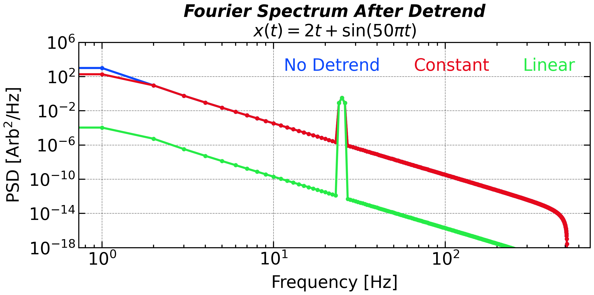
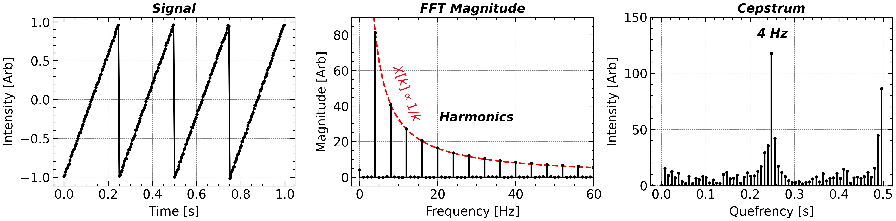
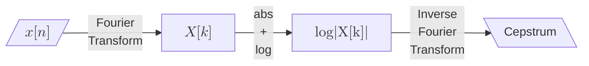
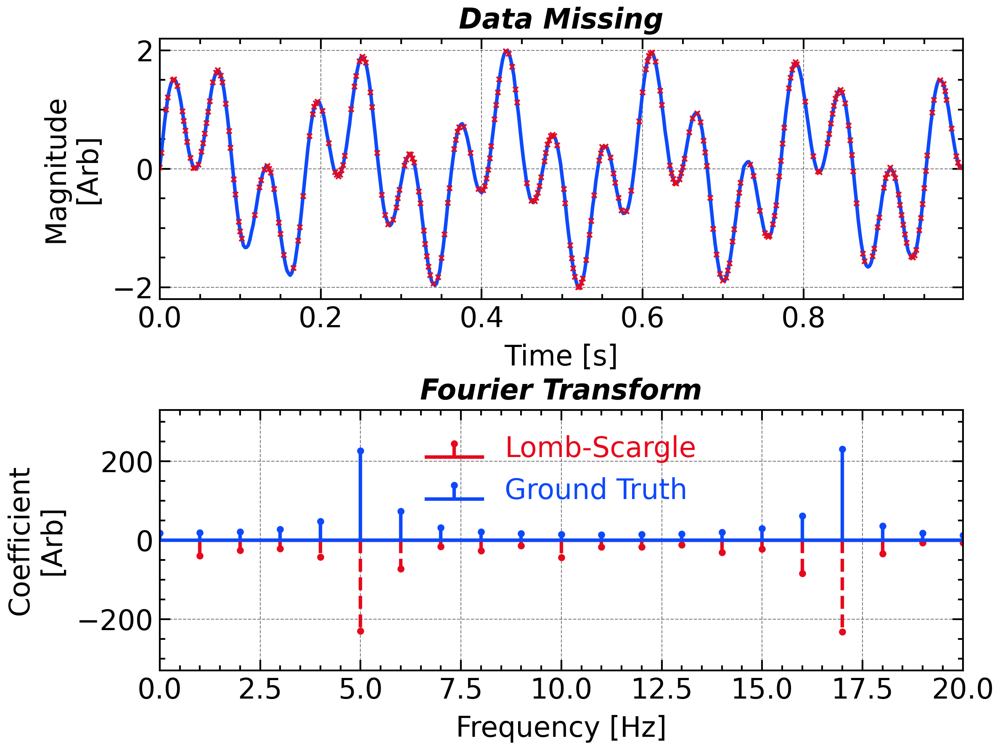
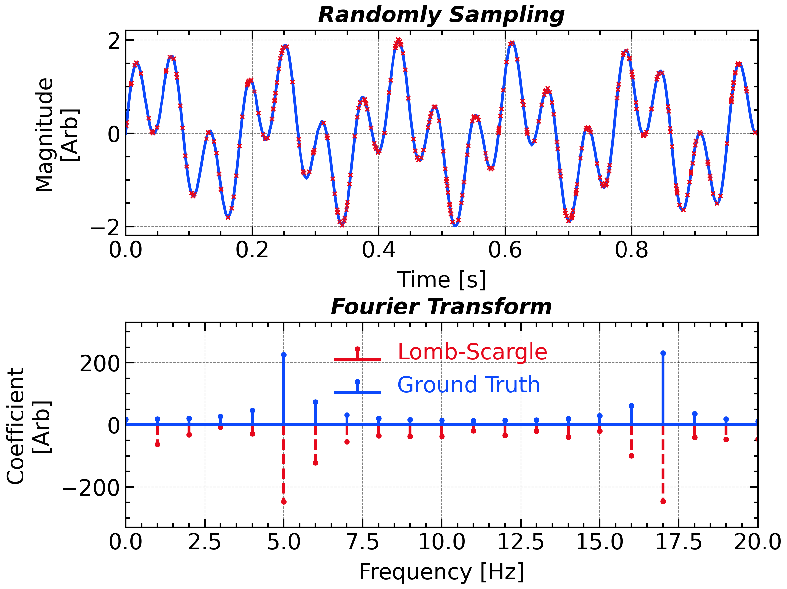
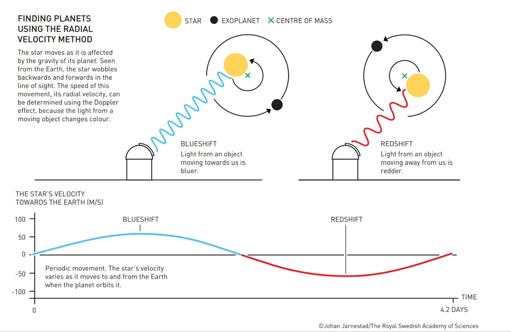
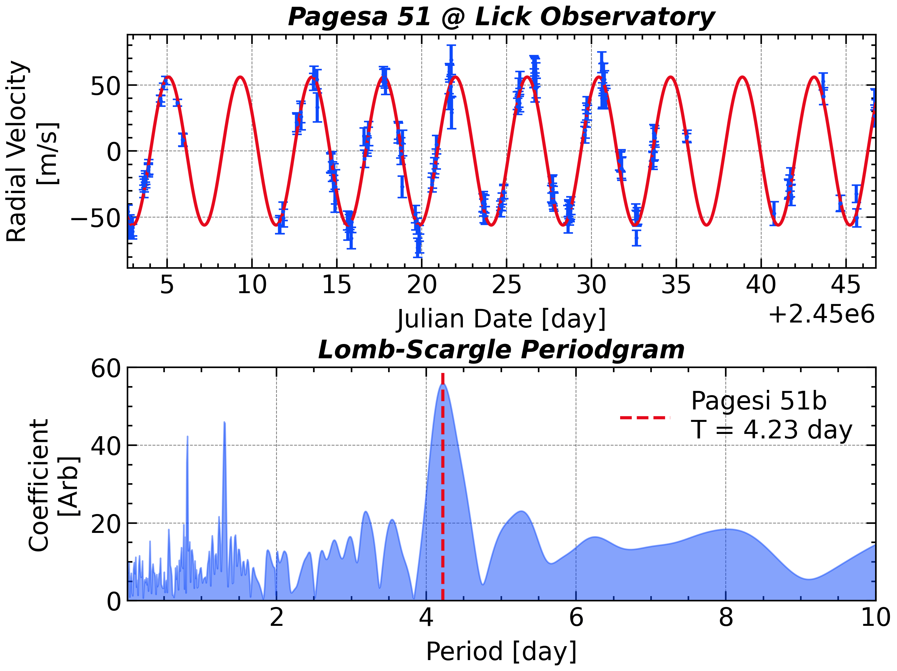

# Power Spectral Density

## [Parseval's Theorem](https://en.wikipedia.org/wiki/Parseval%27s_theorem) and Energy Conservation

> **Parseval's Identity**: The identity asserts that the sum of squares of the Fourier coefficients of a function is equal to the integral of the square of the function. The CFT version of Parseval's Identity can be expressed as:
$$
\int_{-\infty}^\infty x^2(t)\, dt = \int_{-\infty}^\infty X^2(f)\, df
$$
and the DFT Version:
$$
\sum_{n=0}^{N-1} |x[n]|^{2} \delta t
 \;=\;
 \sum_{k=0}^{N-1} |X[k]|^{2} \delta f
$$
> This theorem essentially states that the total energy of a signal in the time domain is equal to the total energy in the frequency domain. 
>

In the physical world, the square power of the amplitude often refers to some kind of ***energy*** or ***power***. For example, the square of the displacement ($x$) of a spring, $x^2$ is proportional to the elastic potential energy ($kx^2/2$, where $k$ describes the stiffness). The electromagnetic field in the vacuum contains the energy density ($u$) written as 
$$
u=u_E + u_B=\frac{1}{2}(\varepsilon_0 \mathit{E}^2 + \frac{1}{\mu_0}\mathit{B}^2)
$$
In these cases, the ***energy*** of the signal naturally linked with the ***energy*** of the electromagnetic field. Nevertheless, the energy of a signal is an extensive property as it linearly increases with the length of the sample. In the ordinary investigation, the signal energy is always further converted as signal ***power***, which is an intensive property that describe the amplitude and is independent of signal length. The definition of power, *P*, can be written as:
$$
P= \frac{1}{T}\int_{-T/2}^{T/2}|x(t)|^2 \mathrm{d}t
$$
## [Power Spectral Density](https://en.wikipedia.org/wiki/Spectral_density)

The Parseval's Identity also reveals that it is possible to measure the energy contribution from each individual frequency by Fourier transform.  The quantity, ***<u>Power Spectral Density (PSD)</u>***, describes how the power of a signal is distributed with frequency.

According to Parseval's theorem, the total power of a signal can be computed in either the time domain or the frequency domain. The total power can be expressed as:
$$
\begin{align*}
P&=\frac{1}{N\delta t}\sum_{n=0}^{N-1}|x[n]|^2 \delta t \\
&=\frac{1}{N^2\delta f}\sum_{k=0}^{N-1}|X[k]|^2 \delta f \\
&=\sum_{k=0}^{N-1} \boxed{\frac{1}{Nf_s} |X[k]|^2}\, \delta f\\
&=\sum_{k=0}^{N-1}\boxed{PSD[k]}\delta f
\end{align*}
$$
for DFT. Considering that DFT yields both **positive and negative** frequency, we typically **fold** the DFT result. Naturally, the definition of PSD is given as:
$$
PSD[k]= \left\{ 
\begin{align*}
\frac{1}{Nf_s} |X[k]|^2, \ & k = 0\ \mathrm{or}\ k = N / 2\}\\
\frac{2}{Nf_s} |X[k]|^2, \ & k \notin \{0, N / 2\}\\

\end{align*}
\right.
$$
$PSD[0]$ represents the DC component and is **ignored** in the spectral analysis for the most (but not all) time.

According to the linearity of $\mathcal{F}$, $X[k]$, after single-side compensation, should also be proportional to the sine wave amplitude ($A_k$). Easily catch that the coefficient and power spectral density at the exact wave frequency has the form of 
$$
\begin{align}
PSD[k]& = \frac{P[k]}{\delta f} = \frac{A_k^2/2}{f_s/N}  = \frac{2}{Nf_s} |X[k]|^2   \\
\Rightarrow|X[k]|& = \frac{1}{2}\cdot A_k \cdot N 
\end{align}
$$
$1/2$ in this equation arises from the fact that $({\int_0^{2\pi}\mathrm{sin^2}x \mathrm{d}x})/{2\pi}=1/2$.

- `numpy.fft` implementation of PSD calculation:

    ```python
    window = np.hanning(N + 1)[:-1] # Periodic Hanning Window
    x_w = x * window

    # Normalization factor (sum of squares of window coefficients)
    norm_window = np.sum(window**2)

    # Compute one-sided FFT
    coef = np.fft.rfft(x_w)
    freq = np.fft.rfftfreq(N, d=dt)

    # Estimate PSD with proper scaling:
    psd = (np.abs(coef)**2) / (N * fs * norm_window)

    # Single-side compensation: double non-DC (and non-Nyquist if N is even)
    if N % 2 == 0:
        psd[1:-1] *= 2
    else:
        psd[1:] *= 2
    ```

- `scipy.signal.welch` is a more robust and efficient implementation of PSD estimation through Welch's method. This method will be introduced later in [Chapter 5](chap5.md). But it still provide a concise way to estimate PSD in one line of code, whose results can be exactly the same as above if the parameters are set properly.

  ```python
  freq, psd = scipy.signal.welch(x, fs=fs, window='hann', nperseg=N, noverlap=0, detrend=False)
  ```
  
  - The `hann` window used in `scipy.signal.welch` is ***periodic*** instead of ***symmetric***. 

## [Correlation Function](https://en.wikipedia.org/wiki/Correlation_function) [`scipy.signal.correlate`]

The correlation function has a similar form as the energy of the signal:
$$
\begin{align}
{R_{xy}}(t, t + \tau) := \mathbb{E}\left[ {x(t)} {y^*(t + \tau)} \right]
\end{align}
$$
where the asterisk symbol represents the complex conjugate operation when $X$ and $Y$ are complex signal. Specifically, the correlation function between $X$ and itself is called **<u>*autocorrelation function (ACF)*</u>**:
$$
\begin{align}
{R_{xx}}(t, t + \tau) := \mathbb{E}\left[ {x(t)} {x^*(t + \tau)} \right]
\end{align}
$$
The correlation function not only measures the similarity between two signals, but also reveals the time lag ($\tau$) between them. The autocorrelation function measures how similar a signal is to itself at different time lags, providing insights into the signal's periodicity and temporal structure.

Especially, under certain conditions, the autocorrelation function shows intrinsic relationship with the power spectral density, which will be introduced in the next section.

## [Wide-Sense Stationarity](https://en.wikipedia.org/wiki/Stationary_process#Weak_or_wide-sense_stationarity)

If you want the calculated power spectrum to be representative for the entire signal, meaning $PSD(f,t)=PSD(f)$, then the signal needs to satisfy the **<u>*Wide-Sense Stationarity (WSS)*</u>**condition. The core idea behind this is that only when a signal's intrinsic statistical properties are constant over time can we use a single, static spectrum to describe it meaningfully. *WSS* is the mathematical framework that provides this guarantee of statistical stability.

Specifically, a signal $x(t)$ is considered *WSS* if it has:

- **Constant Mean:**

   The mean of the signal is constant for all time: $$ \mathbb{E}[x(t)] = \mu, \quad \forall t $$

- **Time-Invariant Autocorrelation:**

   The autocorrelation function depends only on the time difference (lag) between two time instants, not on the absolute time: $$ R_x(t_1, t_2) = R_x(\tau), \quad \tau = t_2 - t_1 $$

These conditions imply that even if the signal itself is random, its first two moments are invariant to shifts in time. Under these conditions, the autocorrelation reduces to a single-variable function $R_x(\tau)$, and the **<u>*Wiener–Khinchin theorem*</u>** that we are going to introduce, will ensures a **well-defined PSD**.

## [Wiener–Khinchin Theorem](https://en.wikipedia.org/wiki/Wiener%E2%80%93Khinchin_theorem)

For a *WSS* signal $x(t)$, the **power spectral density** can be derived as the **Fourier transform** of the autocorrelation function:
$$
S_x(f) = \int_{-\infty}^{\infty} R_x(\tau)\,e^{-j 2\pi f \tau}\,d\tau
$$
This is known as the **<u>*[Wiener–Khinchin theorem](https://en.wikipedia.org/wiki/Wiener%E2%80%93Khinchin_theorem)*</u>**, and it is valid *only* under the assumption of WSS. The $PSD(f)$ then describes how the total power of the signal is distributed across different frequency components. 

This theorem tells the intrinsic relationship between the *PSD* and *ACF*. This relationship is particularly useful because it allows us to compute the power spectral density from time-domain data by first calculating the autocorrelation function and then applying the Fourier transform. This approach is often more robust, especially for signals that may be noisy or have missing data.

## Application: Angular Power Spectrum of the Cosmic Microwave Background (CMB)


## What If the Signal Is Not Stationary? [`scipy.signal.detrend`]

If the constant mean condition (first condition) is not satisfied, say, due to an underlying background trend, you should first apply **<u>*detrend*</u>**. Techniques such as subtracting the mean (constant detrend) or removing a linear trend (linear detrend) help modify the signal so that its mean becomes approximately constant.

```python
scipy.signal.welch(x, fs, detrend = 'constants' (default) | 'linear' | Fasle)
```

<p align = 'center'>

</p>

If the time-invariant autocorrelation condition (second condition) is not met, which indicates that the signal's higher-order statistics vary with time, traditional spectral analysis (like using the Wiener–Khinchin theorem) may no longer yield a meaningful power spectral density. In such cases, it is advisable to use time-frequency analysis methods, such as the Short-Time Fourier Transform (STFT) or the Wavelet Transform, to properly capture the signal's evolving spectral content.

The concept of *W.S.S* essentially guides us in **selecting an appropriate window** for spectral analysis. On one hand, the window length should be longer than the oscillation period to capture a complete cycle of the fluctuations. On the other hand, the window length should be shorter than the characteristic scale over which power or frequency variations occur, so that the signal within the window can be approximated as wide-sense stationary.

## [Cepstrum](https://en.wikipedia.org/wiki/Cepstrum)

A non-sinuous, periodic signal usually has a broad Fourier spectrum concentrating at not only the fundamental frequency $f_0$ but also its **harmonic** $f_n=nf_0$. Like, a sawtooth waves have a Fourier coefficient decreases with $1/n$ where $n$ is the harmonic order while the coefficients at the rest frequencies remain zero. Therefore, there exists a periodic structure with period of $f_0$ in the Fourier domain. 

<p align = 'center'>
    </p>
<p align = 'center'>
<i>An example of cepstrum for a sawtooth wave with the fundamental frequency of 4 Hz</i>
</p>


Inspiri ng by this fact, B. P. Bogert, M. J. Healy, and J. W. Tukey introduce the ***Cepstral Analysis*** in 1963. The norm of the Fourier coefficients is taken logarithm and then inverse Fourier transformed for detecting the harmonic signature of the signal. 


```mermaid
flowchart LR
A@{ shape: lean-r, label: "$$x[n]$$"} --Fourier<br>Transform--> B["$$X[k]$$"] --abs<br>+<br>log--> C["$$\mathrm{log|X[k]|}$$"] --Inverse<br>Fourier<br>Transform--> D@{ shape: lean-l, label: Cepstrum}
```

This resulting "spectrum" is named as its variant ($\mathrm{spec \rightarrow ceps}$) —Cepstrum. Correspondingly, "frequency" is converted to "quefrency", which has the unit same as time's.

The initial aim of cepstrum is to analysis the seismic echoes, which can be modeled as:
$$
y(t) = x(t) +\alpha x(t-\tau)
$$
It has a Fourier transform of
$$
\begin{align}
Y(f) &= X(f) + \alpha X(f) e^{j2\pi f \tau}=X(f)(1+\alpha e^{j2\pi f \tau})\\
|Y(f)|^2 &= |X(f)|^2 [1+2\alpha \mathrm{cos}({j2\pi f \tau})+\alpha^2]
\end{align}
$$

$$
\begin{align}
\mathrm{log}(|Y(f)|^2) &= \mathrm{log}(|X(f)|^2) + \mathrm{log}[1+2\alpha \mathrm{cos}({j2\pi f \tau})+\alpha^2]\\
& \approx \mathrm{log}(|X(f)|^2) + 2\alpha \mathrm{cos}({j2\pi f \tau})
\end{align}
$$
Therefore, the echoes introduce the periodic structure in $\mathrm{log}(|Y(f)|^2)$. When parameter $\alpha$ is small enough, the periodic structure has a perfect sinuous waveform. Interestingly, the periodic sawtooth waves we introduced first can actually be interpreted as an initial signal accompanied with its three non-decayed echoes. That's the reason cepstral analysis works. 

However, it doesn't mean that the cepstral analysis only work for the signals composited with echoes. Another common application of cepstral analysis is the [voice recognition](https://ieeexplore.ieee.org/document/859069). The principle behind is that the both the musical instrument and vocal fold has an eigen frequency thus the power of the voice naturally concentrate near the fundamental and harmonics.

```python
''' Python Implication of Cepstrum '''

freq = np.fft.rfftfreq(sig.size, dt)
coef = np.fft.rfft(sig)

log_abs_coef = np.log(np.abs(coef))

# Optional, Remove DC component for cepstrum calculation
log_abs_coef -= np.mean(log_abs_coef)

cepstrum = np.fft.rfft(log_abs_coef)
df = freq[1] - freq[0]
quefrency = np.fft.rfftfreq(log_abs_coef.size, df)
```

## [Lomb-Scargle Periodogram](https://en.wikipedia.org/wiki/Least-squares_spectral_analysis#The_generalized_Lomb%E2%80%93Scargle_periodogram) [`scipy.signal.lombscargle`]

The **Lomb-Scargle periodogram** estimates a signal’s power spectrum **directly from unevenly sampled data**.
For each angular frequency $\omega$ it fits
$$
x(t_n)\;\approx\;A\cos\omega t_n + B\sin\omega t_n,
$$
and defines the normalized power
$$
P(\omega)=\frac12\!\left[
\frac{\bigl[\sum (x_n-\bar x)\cos\omega(t_n-\tau)\bigr]^{\!2}}
     {\sum\cos^{2}\omega(t_n-\tau)}
\;+\;
\frac{\bigl[\sum (x_n-\bar x)\sin\omega(t_n-\tau)\bigr]^{\!2}}
     {\sum\sin^{2}\omega(t_n-\tau)}
\right],
$$
with phase offset
$$
\tan(2\omega\tau)=
\frac{\sum\sin 2\omega t_n}{\sum\cos 2\omega t_n},
$$
which decorrelates the sine–cosine terms and minimizes leakage.

The Lomb–Scargle periodogram fits sinusoids directly to the data using a least-squares approach—with an optimized phase shift that decouples the sine and cosine terms—so it inherently minimizes spectral leakage. Since this method is tailored for unevenly sampled data, the effect of windowing is already embedded in its formulation, making an additional window function unnecessary. 

When the sampling is uniform, $P(\omega)$ converges to the classic FFT periodogram.

```python
omega0 = 2 * np.pi * 5.0

# Data Missing
t = np.linspace(0, 1, 500, endpoint=False)
sig = np.sin(omega0 * t) + np.sin(omega0 * 3.2 * t) + np.random.randn(t.size) * 0.01
data_miss_idx = np.random.choice(np.arange(t.size), t.size - 200)
sig[data_miss_idx] = np.nan

ls_amp = np.abs(scipy.signal.lombscargle(t[~np.isnan(sig)], sig[~np.isnan(sig)], 2 * np.pi * freq[1:], normalize='amplitude'))

# Randomly Sampling
t = np.random.uniform(0, 1, 300)
t.sort()
sig = np.sin(omega0 * t) + np.sin(omega0 * 3.2 * t) + np.random.randn(t.size) * 0.01

ls_amp = np.abs(scipy.signal.lombscargle(t[~np.isnan(sig)], sig[~np.isnan(sig)], 2 * np.pi * freq[1:], normalize='amplitude'))
```

<!-- tabs:start -->

#### **Data Missing**

<p align="center">    </p>

#### **Randomly Spampling**

<p align="center">    </p>

<!-- tabs:end -->

## Application: Discovery of Exoplanet: 51b Pagesi

<p align="center">    </p>


<p align="center">    </p>


<div STYLE="page-break-after: always;"></div>