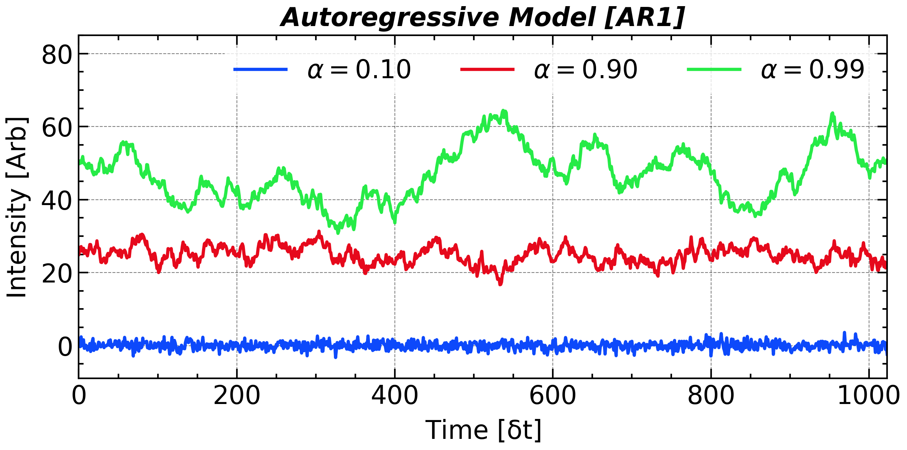

# Handling Noise

## Noise Colors and Classification

Every real‑world measurement—whether from a spacecraft magnetometer, a seismometer, or a studio microphone—contains the desired signal plus unwanted fluctuations we lump together as ***noise***. These fluctuations can originate from the sensor (thermal agitation, quantization), the environment (vibrations, electromagnetic interference) or the intrinsic randomness of the source.

A compact way to describe noise is by its **PSD slope**, traditionally labeled with colors:

| **Noise Color** | **$PSD\propto f^{-\beta}$** |      **Typical Examples / Sources**       |
| :-------------: | :---------: | :---------------------------------------: |
|      White      |    $\beta$ = 0    |       Thermal/electronic background       |
|      Pink       |    $\beta$ = 1    |         Music, biological rhythms         |
|   Brown (Red)   |    $\beta$ = 2    | Brownian motion, accumulated random walks |
|      Blue       |   $\beta$ = –1    |      Halftoning dither, mask design       |
|     Violet      |   $\beta$ = –2    |            Quantization noise             |

These color names condense how energy spreads across frequencies and guide filter choice, window length, and averaging strategies.

<p align = 'center'>

</p>

## Artificial Noise Generation

```python
time = np.linspace(0, 1, 10000, endpoint=False)
dt = time[1] - time[0]
fs = 1 / dt
freq = np.fft.rfftfreq(len(time), dt)

brownian_noise_fft = np.fft.rfft(np.random.randn(time.size))
brownian_noise_fft[1:] /= freq[1:] ** 1
brownian_noise_fft[0] = 0
brownian_noise = np.fft.irfft(brownian_noise_fft)

violet_noise_fft = np.fft.rfft(np.random.randn(time.size))
violet_noise_fft[1:] /= freq[1:] ** -1
violet_noise_fft[0] = 0
violet_noise = np.fft.irfft(violet_noise_fft)
```

Besides these two methods, one can also get colored noise by filtering white noise. A colored noise that accurately follows its expected power spectrum requires the order of the filter to be high enough. Even though this 

## Autoregressive (AR) Model

Many real-world disturbances carry just a hint of “inertia”: the next value mostly echoes the present one, plus a fresh random jolt. Such behaviour is well captured by a first-order autoregressive model:
$$
x[n+1]=\alpha x[n] + \mathcal{N}(0,1)
$$
whose single coefficient $\alpha$ sets the memory length. When $\alpha=0$ the series is white noise; as $\alpha\to1^{-}$ it approaches an integrated (Brownian) path with power piling up at low frequencies. 


<p align = 'center'></p>
<p align = 'center'><i> AR1 Time series with different AR1 coefficient ($\alpha=$0.10, 0.90, and 0.99).</i></p>

The spectrum makes this clear:
$$
\mathbb{E}[PSD(f)]=\frac{\sigma^2(1-\alpha^2)}{1+\alpha^2-2\alpha \mathrm{cos}(2\pi f/f_s)}
$$

which is flat for $\alpha=0$ and climbs like $1/f^{2}$ near $f=0$ for $\alpha\approx1$. Thus AR (1) offers the simplest realistic noise model—white at one extreme, red at the other—while remaining easy to simulate and fit.

The $$\alpha$$ parameter can be estimated by the lag-1 autocorrelation of the time series. 
$$
\alpha = \frac{\sum_{n=0}^{N-2}(x[n]-\bar{x})(x[n+1]-\bar{x})}{\sum_{n=0}^{N-1}(x[n]-\bar{x})^2}
$$
Higher-order AR models can capture more complex correlations, but require more data to fit reliably.

## "Noise" of Noise
From the power spectra of noises, one can see that the PSD of the generated noise may randomly deviates from the theoretical expectation, i.e., the exactly power-law PSD. 

The Fourier coefficient computed as 
$$
\begin{align}

X[k]:=\sum_0^{N-1}x[n]\mathrm{e}^{\mathit{i}2\pi  n k}

\end{align}
$$
can be deemed as a <u>**weighted summation**</u> of the signal $x[n]$. When $x[n]$ are independent identically distributed (*i.i.d*) random variables, their weighted summation approaches the Normal distribution when *N* is large enough, according to the ***Central Limit Theorem***. Thus, the *PSD*, defined as the square sum of the real and imaginary parts, naturally follows the *Kappa* Distribution with the freedom of 2. The above statement requires that he real and imaginary parts are independent to each other, which can be proved by calculating their covariance.


<p align = 'center'>

</p>
### Significance Level

A Fourier spectrum always has some peaks no matter the signal is really periodic or totally random. It is of course not appreciated if you interpret a random Fourier peak as a sign of periodicity. 

The ***significance level*** comes out for the assessment of these Fourier power peak. It uses the hypothesis testing to testify whether the peak is significance. The null hypothesis is that 
$$
x[n]\sim N(\mu, \sigma)
$$
Thus, the power spectral density follows the exponential distribution $PSD/S(f)\sim \chi_2^2$. The $95\%$ and $99\%$ percentile of this distribution is $2.995$ and $4.605$, respectively. Therefore, 95% and 99% significance level of the PSD is $2.995\sigma$ and $4.605\sigma$.

### Welch Method [`scipy.signal.welch`]
Welch proposed that the averaging the power spectral density instead of the coefficient can largely reduce the flutuation levels of the spectrum. Therefore, we may just get a.

The averaging operation must be taken after the conversion from coefficient to power other wise the averaged coefficients are actually unchanged.

This method can be implemented by `scipy.signal.welch` function:

```python
time = np.linspace(0, 1, 10000, endpoint=False)
fs = 1 / (time[1] - time[0])
freq = np.fft.rfftfreq(len(time), time[1] - time[0])

noise_white = np.random.randn(time.size)

coef_white = np.fft.rfft(noise_white, axis=-1).T
psd_white = (np.abs(coef_white) ** 2) / fs / time.size

freq_welch, psd_white_welch = scipy.signal.welch(noise_white, fs, window = 'hann', nperseg=2 ** 10)
```

Except for averaging, one can also  choose the median of the PSD across different segements and obtain a less disturbed PSD. This choice can be implemented by `scipy.signal.welch(signal, fs, average = 'median')`. The default parameter for `average` is `mean`, corresponding to the normal Welch method.

For each segement, you can also chose the window function to reduce the spectral leakage. The result of this method is shown below:

<p align = 'center'>

</p>

One can also verify that the distribution of the PSD convert to *Gamma* Distribution, which has a ***Probability Density Function (PDF)*** of:

$$
\begin{align}
PDF(x; \alpha, \lambda)=\frac{\lambda^\alpha}{\Gamma(\alpha)} x ^{\alpha - 1} e^{-\lambda x}
\end{align}
$$

The mean and variance of this distribution is $\alpha/\lambda$ and $\alpha / \lambda^2$. When the number of segments ($\alpha$) decrease/increase to 1/$+\infty$, the Gamma distribution degenerate to exponential/normal distribution.

<p align = 'center'>

</p>


In ***Bartlett Method***, the ratio of ``N_STEP`` and ``N_PER_SEG`` is fixed at unity, which means every segement has no overlapping with each other. It can be regarded as a special case of the *Welch Method* while it is actually proposed earlier.

### Blackman-Tukey Method

***Blackman-Tukey method*** gives another approach to a high SNR estimation of *PSD* based on the *W.S.S* properties of the signal and *Wiener–Khinchin theorem*. This method consists of three steps:

1. Calculate the (***double-sided***) ACF of the signal
2. Apply a window function to the ACF
3. Do DFT to the windowed ACF.


It should be keep in mind that these methods are all build based on the assumption of wide-sense stationarity of the signal.[Explain WSS here]. A noise signal, no matter its color, is wide-sense stationary. However, a real time series of a physics quantity cannot gurantee its wide-sense stationarity. Since W.S.S is the only presumption of these method, they are also termed ***Nonparametric Estimator***.

Apart from splitting the signal into several segments, one can also downsample the signal and get multiple sub-signal with different startup time. However, the maximum frequency of the yield spectrum will also be reduced by a factor of ``N_DOWNSAMPLE``. At the same time, the frequency resolution remains to be $(N\Delta t)^{-1}$. 

<p align = 'center'>

</p>


## Signal-to-Noise Ratio (SNR) and Decibels

**SNR** measures how clearly the signal emerges from noise:
$$
\mathrm{SNR} = \frac{P_{\text{signal}}}{P_{\text{noise}}}
$$
where $P_{\text{signal}}$ and $P_{\text{noise}}$ are the average powers of the signal and noise, respectively.

Because the ratio can span orders of magnitude, it is usually expressed in **decibels (dB)**:
$$
\mathrm{SNR}_{\mathrm{dB}} = 10 \log_{10} \left( \frac{P_{\text{signal}}}{P_{\text{noise}}} \right)
$$
For amplitude‑based measurements (root‑mean‑square values):
$$
\mathrm{SNR}_{\mathrm{dB}} = 20 \log_{10} \left( \frac{A_{\text{signal}}}{A_{\text{noise}}} \right)
$$

***Decibel Quick Reference\***


|     Decibel     |  0   |  1   |  3   |  6   |  10  |  20  |
| :-------------: | :--: | :--: | :--: | :--: | :--: | :--: |
|  Energy Ratio   |  1   | 1.12 | 1.41 | 2.00 | 3.16 |  10  |
| Amplitude Ratio |  1   | 1.26 | 2.00 | 3.98 |  10  | 100  |

Due to the fact that $2^{10}\approx10^3$, 3 dB corresponds to a energy ratio of $10^{3/10}=\sqrt[10]{1000}\approx \sqrt[10]{1024}=2$.

The adoption of decibel instead of the conventional physical unit has three advantage:

- It allows the directive addition when compare the amplitude of the signal.
- When you are not confident about the magnitude of the uncalibrated data, you can just use dB to describe the ambiguous intensity.
- The [***Weber–Fechner law***](https://en.wikipedia.org/wiki/Weber-Fechner_law) states that human perception of stimulus intensity follows a logarithmic scale, which is why decibels—being logarithmic units—are used to align physical measurements with human sensory sensitivity, such as in sound and signal strength.


## Signal Over Noise

A signal composed of a deterministic sinusoidal component $s(t)$ and additive noise $n(t)$ can be written as:
$$
x(t) = s(t) + n(t)
$$
Correspondingly, the Fourier coefficient at frequency $f$ is the sum of the signal and noise components::
$$
{X}(f) = {S}(f) + {N}(f)
$$
where ${S}(f)$ is the deterministic signal component (a fixed complex number), and ${N}(f)$ is the Fourier transform of the noise. If the noise $n(t)$ is zero-mean wide-sense stationary, then:
$$
\tilde{N}(f) \sim \mathcal{CN}(0, \sigma_n^2)
$$
That is, ${X}(f)$ is a complex Gaussian random variable:
$$
{X}(f) \sim \mathcal{CN}(\mu, \sigma_n^2), \quad \mu = {S}(f)
$$
The power spectrum estimate is:
$$
{S}_x(f) = |{X}(f)|^2
$$
Since $|{X}(f)|^2$ is the sum of squares of two independent Gaussian variables (real and imaginary parts), it strictly follows a non-central chi-squared distribution:
$$
{S}_x(f) \sim \sigma_n^2 \cdot \chi^2(2, \lambda), \quad \lambda = \frac{|\mu|^2}{\sigma_n^2}
$$
In other words, the deterministic signal provides a **complex offset** (mean $\mu$), and the noise determines the **variance** $\sigma_n^2$. The resulting power spectrum estimate is exactly a **<u>non-central chi-squared distribution</u>** with 2 degrees of freedom.

<p align = 'center'>

</p>


<div STYLE="page-break-after: always;"></div>