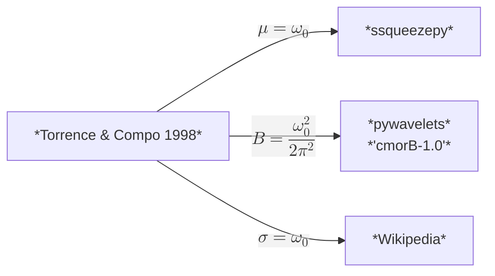

# Time-Frequency Spectrum

## Short-Time Fourier Transform

The Short-Time Fourier Transform (STFT) extends traditional Fourier analysis to non-stationary signals by introducing time localization via windowing. This allows us to track how the frequency content of a signal evolves over time. This section explains the trade-off between time and frequency resolution, the role of window functions, and practical implementation with `scipy.signal.shortTimeFFT`. It should be noted that function `scipy.signal.stft` is considered legacy and will no longer receive updates. While `scipy` currently have no plans to remove it, they recommend that new code uses more modern alternatives `shortTimeFFT` instead.

```python
window = 4096
step = 100
hann_window = scipy.signal.windows.hann(window, sym = True) # Hanning Window
STFT = scipy.signal.ShortTimeFFT(hann_window, hop=step, fs = fs, scale_to='psd', fft_mode = 'onesided2X')  # create the STFT object
stft_psd = STFT.stft(sig)  # perform the STFT
stft_time = np.arange(0, stft_psd.shape[1]) * STFT.hop / fs - STFT.win.size / 2 / fs  # time vector for STFT
stft_frequency = np.fft.rfftfreq(window, d=dt)  # frequency vector for STFT
```

<p align = 'center'>

</p>

## Continuous Wavelet Analysis

Wavelet analysis offers a versatile framework for multi-resolution time-frequency analysis, especially for signals with localized features or abrupt transitions. By decomposing a signal into wavelets, we gain simultaneous insight into both frequency and time domains. This section introduces the fundamentals of wavelet theory, common wavelet families, and hands-on examples using Python packages such as `pywt`, `scipy`, and `squeezzeypy`.

<p align = 'center'>

</p>

```python
scales = 2 ** np.linspace(4, 12, 160, endpoint = False)

bandwidth = 12.0
central_frequency = 1.0

# Way 1: pywavelets
wavelet = 'cmor%.1f-%.1f' % (bandwidth, central_frequency)
coef, f = pywt.cwt(sig, scales, wavelet, dt, method = 'fft')
coef *= np.sqrt(np.sqrt(bandwidth) * np.sqrt(2 * np.pi))  # amplitude normalization for Morlet
psd = (np.abs(coef) ** 2) * (2 * dt)
df = (f[0] / f[1] - 1) * f / np.sqrt(f[0] / f[1])

# Way 2: ssqueezepy
coef, scales = ssqueezepy.cwt(sig, ('morlet', {'mu': bandwidth}), scales = bandwidth / (2 * np.pi) * scales.astype(np.float32), fs = 1 / dt, l1_norm = False)
f = bandwidth / (2 * np.pi) / dt / scales
df = (f[0] / f[1] - 1) * f / np.sqrt(f[0] / f[1])
psd = (np.abs(coef) ** 2) * (2 * dt)

# Way 3:
# There is a cwt function provided by scipy.signal. 
# However, this function is deprecated since version 1.12.0. 
# They recommend using PyWavelets instead.

# widths = bandwidth * scales / (2 * np.pi)
# coef = scipy.signal.cwt(
#     signal,
#     scipy.signal.morlet2,
#     widths = widths,
#     w = bandwidth,
#     dtype = np.complex128
# )
# frequency = 1 / dt / scales

# Cone of Influence (COI)
coi = (np.sqrt(4) * bandwidth / (2 * np.pi) / f).astype(float)
```

## Morlet Wavelet

Morlet wavelet is one of the most commonly-used continuous mother wavelet, which is written as:
$$
\psi(\eta):=\pi^{-1/4} e^{-{\eta^2}/{2}} e^{i\omega_0\eta}
$$
with scale function $\eta=s\cdot t$ where $s$ denotes `scale`.

<u>**Admissibility Condition**</u>:
$$
\int_{-\infty}^{+\infty} \psi(\eta) \mathrm{d}\eta=\sqrt{2}\pi^{1/4} e^{-\omega_0^2/2} = \pi^{-1/4}e^{-\omega_0^2/2}\int_{-\infty}^{+\infty} e^{-\eta^2/2} \mathrm{d}\eta = \int_{-\infty}^{+\infty} \delta\psi(\eta) \mathrm{d}\eta = \neq0
$$

$$
\psi^\prime(\eta)=\psi(\eta)-\delta\psi(\eta)=\pi^{-1/4}e^{-\eta^2/2}\left[e^{i\omega_0\eta}-e^{-\omega_0^2/2}\right]
$$

**<u>Normalization</u>**:
$$
\psi^{\prime\prime}=\frac{\psi^{\prime}}{\left[{\int_{-\infty}^{+\infty} [\psi^\prime(\eta)]^2 \mathrm{d}\eta}\right]^{-1/2}}=c_{\omega_0}\psi^{\prime}
$$

$$
c_{\omega_0}=\left[\int_{-\infty}^{+\infty} [\psi^\prime(\eta)]^2 \mathrm{d}\eta\right]^{-1/2}=\left(1+e^{-\omega_0^2}-2e^{-\frac{3}{4}\omega_0^2}\right)^{-{1}/{2}}
$$
<u>**Central Frequency:**</u>
$$
\omega_c=\omega_0\frac{1}{1-e^{-\omega_0 \omega_c}}
$$
<u>**Scale to Period:**</u>
$$
2x^2(1-e^{-\omega_0x})-2\omega_0x-1+e^{-\omega_0x}=0
$$
For large $\omega_0$, $e^{-\omega_0x}\rightarrow 0$,
$$
2x^2-2\omega_0 x-1=0
$$

$$
x_0=\frac{2\omega_0\pm\sqrt{4\omega_0^2+8}}{4}=\frac{\omega_0\pm\sqrt{2+\omega_0^2}}{2}
$$


For small $\omega_0$, the asymptotic solution can be given by substituting $e^{-\omega_0x}\approx1-\omega_0x+\frac{1}{2}(-\omega_0x)^2$ 
$$
\begin{align}
2x^2\left(\omega_0x-\frac{1}{2}\omega_0^2x^2\right)-2\omega_0x-\left(\omega_0x-\frac{1}{2}\omega_0^2x^2\right)&=0\\
(-\omega_0x)\left[\omega_0x^3- 2x^2 + 2+1 - \frac{1}{2}\omega_0x \right]&=0\\
\Rightarrow \omega_0x^3- 2x^2  - \frac{1}{2}\omega_0x + 3&=0
\end{align}
$$
the asymptotic solution can be given by
$$
x_0=\sqrt{\frac{3}{2}}+\frac{\omega_0}{4}+\mathcal{O}(\omega_0^2)
$$
Thus, we can get the ratio of period and scale as
$$
\mathrm{\frac{period}{scale}}= \frac{2\pi}{x_0}\delta t
$$




## Wavelet Family


<div STYLE="page-break-after: always;"></div>