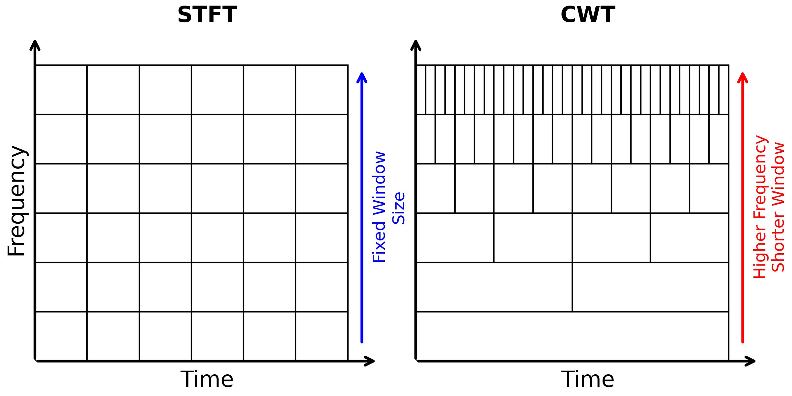
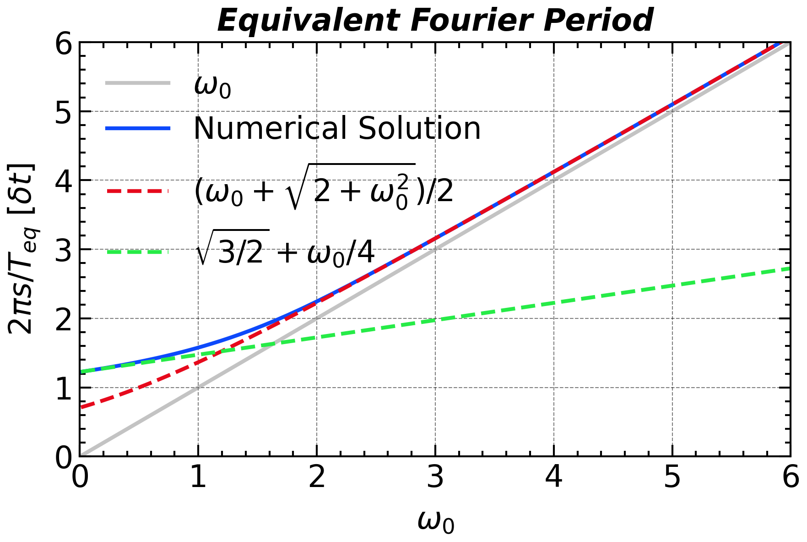
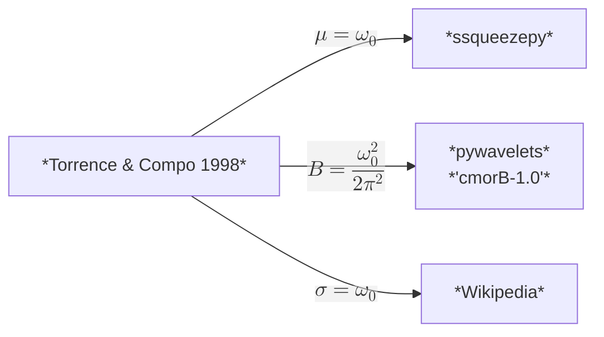
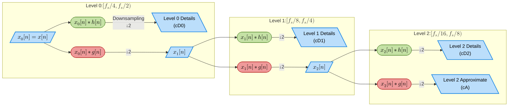
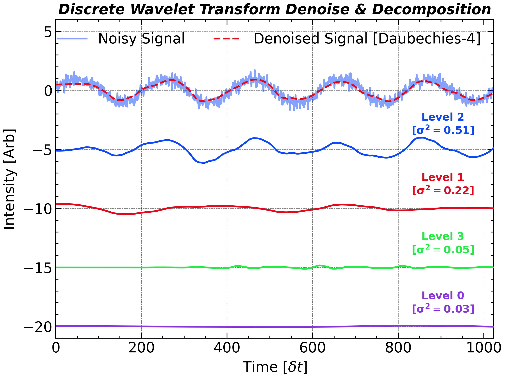
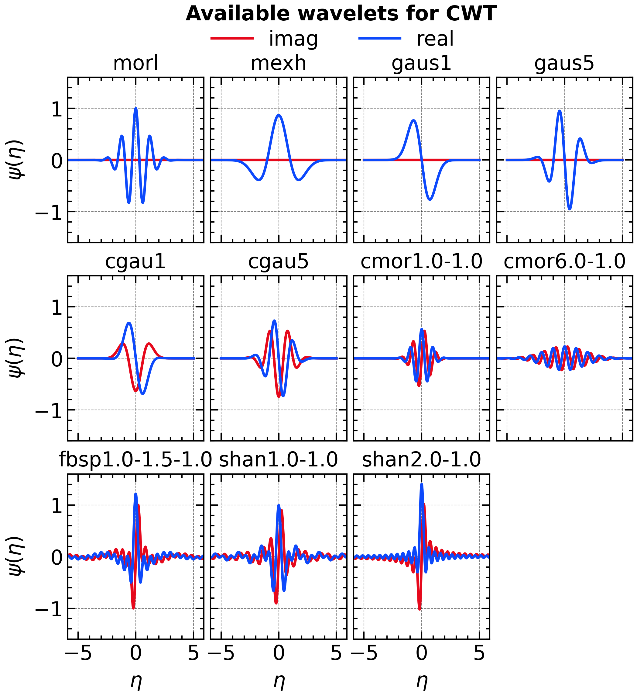
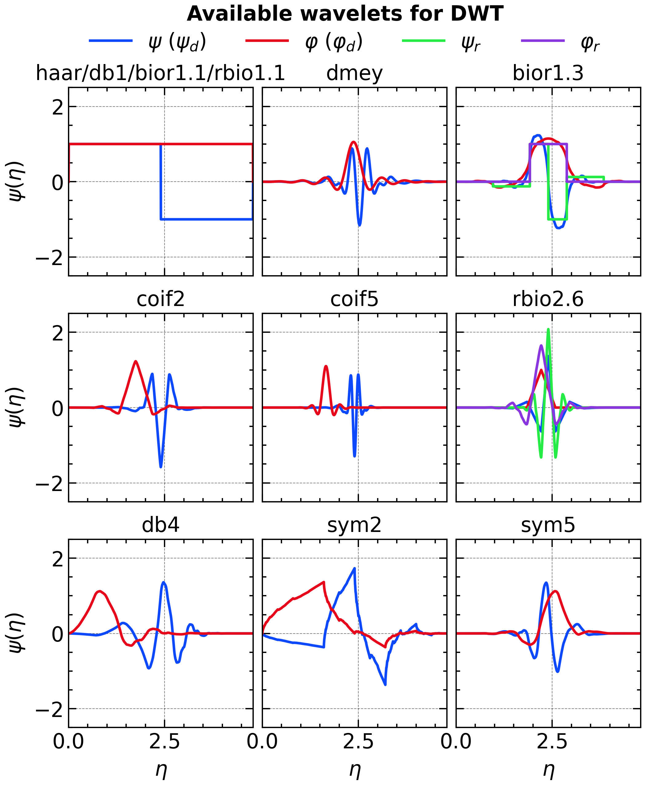

# Wavelet and Time-Frequency Analysis

## Short-Time Fourier Transform

The Short-Time Fourier Transform (STFT) extends traditional Fourier analysis to non-stationary signals by introducing time localization via windowing. This allows us to track how the frequency content of a signal evolves over time. This section explains the trade-off between time and frequency resolution, the role of window functions, and practical implementation with `scipy.signal.shortTimeFFT`. It should be noted that function `scipy.signal.stft` is considered legacy and will no longer receive updates. While `scipy` currently have no plans to remove it, they recommend that new code uses more modern alternatives `shortTimeFFT` instead.

```python
N_window = 4096
N_step = 100

# Hanning Window
window_hann = scipy.signal.windows.hann(N_window, sym = True) 

# create the STFT object
STFT = scipy.signal.ShortTimeFFT(window_hann, hop=N_step, fs = fs, scale_to='psd', fft_mode = 'onesided2X')  

# perform the STFT
psd_stft = STFT.stft(sig)  
time_stft = np.arange(0, psd_stft.shape[1]) * STFT.hop / fs - STFT.win.size / 2 / fs
frequency_stft = np.fft.rfftfreq(window_hann, d=dt)
```

<p align = 'center'>

</p>
The red hashed region indicates the **cone of influence (COI)**, which represents the area where edge effects may distort the STFT results due to the finite length of the signal and windowing. The COI is typically defined as half the window length on either side of the time axis, beyond which the STFT results should be interpreted with caution. The affected results is sensitive to the padding method and therefore more subjective. Thus they are often masked out in visualizations to highlight the reliable region of the time-frequency representation.

## Continuous Wavelet Analysis

Although the STFT can represent a signal on the time–frequency plane, it does so with a **fixed window**: a short window yields good resolution at high frequencies but blurs low-frequency components, while a long window does the opposite—there is no way to optimize both simultaneously. 

<p align = 'center'>

</p>

The **wavelet transform** turns this static trade-off into an **adaptive resolution** by scaling its analysis “window” with frequency—long windows for low frequencies and short windows for high frequencies—making it particularly well-suited to multiscale, transient features in non-stationary signals.

<p align = 'center'>

</p>


Formally, both methods project the signal onto a family of basis functions via inner products: the STFT uses windowed sinusoids as its basis, whereas the continuous wavelet transform replaces the sinusoid with a scalable, time-localized “mother wavelet.” It is this additional scale parameter that provides the core advantage of wavelet analysis, as we will explore in the next section.

In Python, there are two classic packages for performing continuous wavelet transforms: **pywt** and **ssqueezepy**. As shown below, **pywt** offers a comprehensive set of basic features, while **ssqueezepy** delivers high computational efficiency and supports synchrosqueezing wavelets. Older versions of **SciPy** also provided a `cwt` function, but this functionality has been deprecated in more recent releases.


```python
import pywt
import ssqueezepy

N_per_octave = 12
scales = 2 ** np.linspace(4, 12, 8 * N_per_octave, endpoint = False)

bandwidth = 12.0
central_frequency = 1.0

# pywavelets
wavelet = 'cmor%.1f-%.1f' % (bandwidth, central_frequency)
coef, f = pywt.cwt(sig, scales, wavelet, dt, method = 'fft')
coef *= np.sqrt(np.sqrt(bandwidth) * np.sqrt(2 * np.pi))  # amplitude normalization for Morlet
psd = (np.abs(coef) ** 2) * (2 * dt)
df = (f[0] / f[1] - 1) * f / np.sqrt(f[0] / f[1])

# ssqueezepy
coef, scales = ssqueezepy.cwt(sig, ('morlet', {'mu': bandwidth}), scales = bandwidth / (2 * np.pi) * scales.astype(np.float32), fs = 1 / dt, l1_norm = False)
f = bandwidth / (2 * np.pi) / dt / scales
df = (f[0] / f[1] - 1) * f / np.sqrt(f[0] / f[1])
psd = (np.abs(coef) ** 2) * (2 * dt)

coi = (np.sqrt(4) * bandwidth / (2 * np.pi) / f).astype(float)
```

The COI of wavelet is defined as the e-folding time of the wavelet at each scale, which is the time it takes for the wavelet amplitude to decay to $1/e$ of its maximum value.

## Morlet Wavelet

Morlet (or Gabor) wavelet is one of the most commonly-used continuous mother wavelet, which has the **<u>approximate</u>** form of:
$$
\psi_{approx}(\eta):=\pi^{-1/4} {e^{-{\eta^2}/{2}}} \cdot {e^{i\omega_0\eta}}
$$
with scale function $\eta=s\cdot t$ where $s$ denotes `scale` in the large $\omega_0$ domain. 

This mother wavelet is a Gaussian-windowed complex sinusoid, which provides a good balance between time and frequency localization. The parameter $\omega_0$ is the non-dimensional frequency, which controls the number of oscillations within the Gaussian envelope. A common choice is $\omega_0=6$, which provides a good trade-off between time and frequency resolution.

**<u>But if you want to use an $\omega_0$ smaller than 5, you should be aware of the following issues:</u>**

- **<u>Admissibility</u>**: The strict form of Morlet wavelet should satisfy the **admissibility condition**, which requires the wavelet to have zero mean. However, the standard Morlet wavelet does not strictly satisfy this condition because

$$
\begin{align}
\int_{-\infty}^{+\infty} \psi_{approx}(\eta) \mathrm{d}\eta &= \sqrt{2}\pi^{1/4} e^{-\omega_0^2/2}\\
&= \int_{-\infty}^{+\infty} \boxed{\pi^{-1/4}e^{-\omega_0^2/2}e^{-\eta^2/2}} \mathrm{d}\eta = \int_{-\infty}^{+\infty} \delta\psi(\eta) \mathrm{d}\eta\\
&\neq 0
\end{align}
$$

​	To address this, a correction term is often subtracted to ensure zero mean.
$$
\psi_{adm}(\eta)=\psi_{approx}(\eta)-\delta\psi(\eta)=\pi^{-1/4}e^{-\eta^2/2}\left[e^{i\omega_0\eta}-e^{-\omega_0^2/2}\right]
$$

- **<u>Normalization</u>**: To ensure the corrected morlet wavelet has unit energy, we normalize it so that its L2 norm equals 1. The normalization factor is given by the inverse of the square root of the integral of the squared magnitude of the wavelet.

$$
\psi(\eta)=\frac{\psi_{adm}}{\left[{\int_{-\infty}^{+\infty} [\psi^\prime(\eta)]^2 \mathrm{d}\eta}\right]^{-1/2}}=c_{\omega_0}\psi_{adm} = \boxed{\left(1+e^{-\omega_0^2}-2e^{-\frac{3}{4}\omega_0^2}\right)^{-{1}/{2}}}\psi_{adm}
$$

The Final form of Morlet wavelet is:
$$
\psi(\eta)=ta)={\left(1+e^{-\omega_0^2}-2e^{-\frac{3}{4}\omega_0^2}\right)^{-{1}/{2}}}\pi^{-1/4}e^{-\eta^2/2}\left[e^{i\omega_0\eta}-e^{-\omega_0^2/2}\right]
$$
when $\omega_0\geq 5$, the correction term $e^{-\omega_0^2/2}$ is negligible, and the approximate form $\psi_{approx}$ is often used directly. 

- **<u>Frequency Response:</u>** Another issue that must be considered is the frequency response of the corrected Morlet wavelet, which is no longer a simple Gaussian centered at $\omega_0$. Instead, it has a more complex shape due to the subtraction of the correction term:

$$
\hat{\psi}(\omega)=c_{\omega_0}\pi^{-1/4}\left[e^{-(\omega-\omega_0)^2/2}-e^{-\omega_0^2/2}e^{-\omega^2/2}\right]
$$

This affects the relationship between scale and equivalent Fourier period, as well as the central frequency of the wavelet.

- **Equivalent Fourier Period:** For Morlet wavelets with a small $\omega_0$, the Gaussian envelope $e^{-\eta^2/2}$ dominates over the carrier oscillation $e^{-i\omega_0\eta}$. As a result, the CWT power spectrum of an input sine wave no longer peaks at the naive period $T = 2\pi/\omega_0$. Instead, its maximum shifts to the equivalent Fourier period $T_{\mathrm{eq}}$, which more accurately captures the signal’s power distribution in the frequency domain.
  $$
  \begin{align}
  s=\arg\max_s \left|\hat{\psi}\left(\frac{2\pi s}{T_{eq}}\right)\right|\\
  \end{align}
  $$
  The equivalent Fourier period can be found by solving the equation:


$$
\frac{\partial}{\partial s}|\hat{\psi}(2\pi s/T)|=2x^2(1-e^{-\omega_0x})-2\omega_0x-1+e^{-\omega_0x}=0
$$
​	For large $\omega_0$, $e^{-\omega_0x}\rightarrow 0$,
$$
2x^2-2\omega_0 x-1=0
$$

$$
x_0=\frac{2\omega_0\pm\sqrt{4\omega_0^2+8}}{4}=\frac{\omega_0\pm\sqrt{2+\omega_0^2}}{2}
$$

​	For small $\omega_0$, the asymptotic solution can be given by substituting $e^{-\omega_0x}\approx1-\omega_0x+\frac{1}{2}(-\omega_0x)^2$ 
$$
\begin{align}
2x^2\left(\omega_0x-\frac{1}{2}\omega_0^2x^2\right)-2\omega_0x-\left(\omega_0x-\frac{1}{2}\omega_0^2x^2\right)&=0\\
(-\omega_0x)\left[\omega_0x^3- 2x^2 + 2+1 - \frac{1}{2}\omega_0x \right]&=0\\
\Rightarrow \omega_0x^3- 2x^2  - \frac{1}{2}\omega_0x + 3&=0
\end{align}
$$
​	the asymptotic solution can be given by
$$
x_0=\sqrt{\frac{3}{2}}+\frac{\omega_0}{4}+\mathcal{O}(\omega_0^2)
$$
​	Thus, we can get the ratio of period and scale as
$$
T_{eq}= s\cdot\frac{2\pi}{x_0} \cdot \delta t
$$

<p align = 'center'>

</p>


​	This ratio is often used to convert between scale and equivalent Fourier period when interpreting wavelet transforms. For large $\omega_0$, it approaches the commonly used approximation $2\pi/\omega_0$.

- <u>**Central Frequency:**</u> The central frequency $\omega_c$ of the Morlet wavelet is defined as the frequency at which the wavelet's Fourier transform attains its maximum, i.e.,
  $$
  \begin{align}
  \omega_c &= \arg\max_\omega |\hat{\psi}(\omega)|\\
  \end{align}
  $$
  It can be derived from the Fourier transform of the admissible Morlet wavelet:

$$
\omega_c=\omega_0\frac{1}{1-e^{-\omega_0 \omega_c}}
$$


​	The central frequency indicates where a wavelet is most responsive in the frequency domain, while the scale-to-period ratio specifies the scale at which it best matches a sine wave of a given period. For large $\omega_0$, this ratio converges to $2\pi/\omega_0$, a commonly used approximation.

- **<u>Parameter Relationships in Different Literatures</u>**: Different implementations of the Morlet wavelet use different parameterizations. The following diagram summarizes the relationships among the parameters $\mu$, $B$, and $\sigma$ used in various references and libraries. 



## Discrete Wavelet Transform

The Discrete Wavelet Transform (DWT) decomposes a signal into **approximation coefficients** (representing low-frequency components that capture the coarse structure) and **detail coefficients** (representing high-frequency components that capture rapid changes and local details). In contrast to the FFT—which decomposes a signal into sine and cosine functions spanning the entire duration—the DWT breaks the signal into wavelets that are localized in both time and frequency. This inherent multi-resolution analysis enables the DWT to capture transient time-domain information while still revealing its frequency content, effectively offering both temporal and spectral insights.



The decomposition can be iteratively applied, resulting in **multi-level DWT**, offering multi-resolution analysis. Reconstruction from these coefficients exactly recovers the original signal (except minor numerical errors).

- **Single-Level DWT Example**

Let’s perform single-level decomposition and reconstruction:

```python
import pywt

sig = [1, 2, 3, 4, 5, 6]
cA, cD = pywt.dwt(sig, 'db1')  # Haar wavelet

print("Approximation (cA):", cA)
# lessCopyEditApproximation (cA): [2.12, 4.95, 7.78]  

print("Detail (cD):", cD)
# Detail (cD): [-0.71, -0.71, -0.71]

# Reconstruction
reconstructed = pywt.idwt(cA, cD, 'db1')
print("Reconstructed:", reconstructed)
# Reconstructed: [1. 2. 3. 4. 5. 6.]
```

- **Multi-Level DWT Example**

Multi-level decomposition provides more granular frequency analysis. Here’s a two-level decomposition example:

```python
import pywt

sig = [1, 2, 3, 4, 5, 6, 7, 8]
coeffs = pywt.wavedec(sig, 'db1', level=2)
cA2, cD2, cD1 = coeffs

print("cA2:", cA2)
# cA2: [ 5. 13.]  

print("cD2:", cD2)
# cD2: [-2. -2.]  

print("cD1:", cD1)
# cD1: [-0.71 -0.71 -0.71 -0.71]

reconstructed = pywt.waverec(coeffs, 'db1')
print("Reconstructed:", reconstructed)
# Reconstructed: [1. 2. 3. 4. 5. 6. 7. 8.]
```

Here, different levels represent signal features at different frequency bands.

Different wavelet families (e.g., Daubechies, Symlets, Coiflets, Biorthogonal) offer various trade-offs in terms of compact support, symmetry, and vanishing moments. The choice of wavelet affects the decomposition quality and should be selected based on the signal characteristics and analysis goals.

## Wavelet Thresholding for Signal Denoising

Wavelet denoising leverages the idea that noise predominantly appears as low-amplitude coefficients, whereas meaningful signals appear as larger coefficients. We remove noise by applying a threshold to detail coefficients, retaining major signal features.

Two common thresholding methods:

- **Hard Thresholding**: Sets coefficients smaller than threshold to zero, others remain unchanged (may cause discontinuities).
- **Soft Thresholding**: Smoothly reduces coefficients above the threshold towards zero (creates smoother results).

We generate a noisy sinusoidal signal and denoise it using soft thresholding.

**Steps:**

1. Decompose signal using DWT.

2. Estimate noise level $\sigma$ from detail coefficients and compute threshold:
   $$
   T = \sigma \sqrt{2\ln(N)}
   $$

3. Apply soft thresholding to detail coefficients.

4. Reconstruct the denoised signal.

<p align = 'center'>

</p>

Example implementation:

```python
# Generate synthetic noisy sinusoidal signal
np.random.seed(0)
N = 2 ** 10
t = np.linspace(0, 1, N)
sig_clean = np.sin(2 * np.pi * 5 * t)
sig_nosiy = sig_clean + np.random.normal(0, 0.3, size=N)

# Wavelet decomposition
wavelet = 'db4'
coeffs = pywt.wavedec(sig_nosiy, wavelet)
cA, cDs = coeffs[0], coeffs[1:]

# Threshold calculation
sigma = np.median(np.abs(details[-1])) / 0.6745
T = sigma * np.sqrt(2 * np.log(N))

# Soft thresholding
denoised_details = [pywt.threshold(d, T, mode='soft') for d in details]

# Reconstruction
denoised_signal = pywt.waverec([cA] + denoised_details, wavelet)
```

The left plot shows the noisy signal. On the right, after soft thresholding denoising, the signal is smoother, closely approximating the original clean signal. Most noise is effectively removed, while preserving key signal features.

Got it. I’ll prepare a compact, tutorial-style summary of the listed wavelets, grouped by type, with intuitive descriptions and a couple of structured tables for clarity. I’ll also include an explanation of biorthogonal wavelets and their dual basis structure. I’ll let you know once it’s ready.


## Wavelet Families in PyWavelets (Continuous vs. Discrete)

### Continuous Wavelets (CWT)

The story starts with the *Gabor window* (1946), a Gaussian-modulated sinusoid that set the benchmark for joint time–frequency resolution. Early-1980s geophysics added explicit scale, giving the *Morlet* wavelet—the work-horse of the continuous wavelet transform (CWT). Shortly after, the real, symmetric *Mexican-Hat* (second derivative of a Gaussian) became popular for edge and peak detection, while *Paul* wavelets generalized higher-order Gaussian derivatives for finer phase tracking. In 1986 Yves Meyer produced the first rigorously admissible CWT mother, compact in the *frequency* domain. Finally, band-limited designs such as the *Shannon* and frequency-B-spline wavelets (early 1990s) offered idealized rectangular spectra for theoreticians and filter-bank designers.

| Wavelet Name                  | Brief Description                                            | Key Properties                                               | Function/Scale Expression                                    |
| ----------------------------- | ------------------------------------------------------------ | ------------------------------------------------------------ | ------------------------------------------------------------ |
| **Complex Gaussian (cgau)**   | Complex-valued derivatives of a Gaussian function; higher order means more oscillations. | Good time-frequency localization; complex-valued; infinite support. | $\psi(t) = C \frac{d^n}{dt^n}(e^{-t^2})$                     |
| **Complex Morlet (cmor)**     | Gaussian-windowed complex sinusoid; useful for capturing phase information and oscillations. | Excellent time-frequency balance; complex-valued; infinite support. | $\psi(t) = C e^{-t^2/(2\sigma^2)} e^{i2\pi f_c t}$           |
| **Morlet (morl)**             | Real-valued Gaussian-windowed sinusoid, widely used for general analysis. | Good time-frequency localization; infinite support.          | $\psi(t) = \pi^{-1/4} e^{-t^2/2} \cos(\omega_0 t)$           |
| **Frequency B-Spline (fbsp)** | Band-limited complex wavelet defined by frequency-domain B-splines. | Adjustable bandwidth and smoothness; complex-valued; infinite support. | Defined in frequency domain by B-spline filters.             |
| **Mexican Hat (mexh)**        | Real-valued second derivative of Gaussian; bell-shaped wavelet for edge detection. | Good localization; real-valued; infinite support.            | $\psi(t) = (1 - t^2) e^{-t^2/2}$                             |
| **Shannon (shan)**            | Ideal rectangular band-pass wavelet; perfectly band-limited in frequency domain. | Ideal frequency localization; poor time localization; complex-valued; infinite support. | Frequency domain rectangular function; inverse FT yields sinc function. |
| **Gaussian (gaus)**           | Real-valued Gaussian derivatives (DOG); higher orders mean more oscillations. | Good localization for feature detection; real-valued; infinite support. | $\psi(t) = \frac{d^n}{dt^n}(e^{-t^2/2})$                     |

<p align = 'center'>

</p>
### Discrete Wavelets (DWT)

The discrete lineage begins with the step-like *Haar* basis (1910). Jan-Olov Strömberg’s 1983 work showed how to sample continuous wavelets without losing orthogonality, paving the way for Ingrid Daubechies’ breakthrough (1988): compactly supported, arbitrarily smooth orthonormal wavelets (db N). Compression soon demanded linear phase, so biorthogonal pairs appeared—the 5/3 tap *Le Gall–Tabatabai* (1988) for loss-less, and the longer 9/7 *Cohen–Daubechies–Feauveau* (1992) for lossy JPEG 2000. Stéphane Mallat’s pyramidal algorithm and subsequent wavelet-packet extension (late 1980s–1990) made $\mathcal{O}(N)$ multiresolution analysis practical. *Symlets* and *Coiflets* fine-tuned phase and moment symmetry, and Wim Sweldens’ *lifting scheme* (1995) recast any biorthogonal filter bank as fast, in-place, integer arithmetic—ideal for hardware codecs.

| Wavelet Name                   | Brief Description                                            | Key Properties                                        | Scale Recurrence Relation                                    |
| ------------------------------ | ------------------------------------------------------------ | ----------------------------------------------------- | ------------------------------------------------------------ |
| **Daubechies (db)**            | Orthonormal wavelets with compact support; "db1" is Haar wavelet. Higher orders smoother, longer filters. | Orthogonal; asymmetric (except db1); compact support. | $\phi(t) = \sqrt{2} \sum_{k} h[k] \phi(2t - k)$              |
| **Symlets (sym)**              | Modified Daubechies wavelets with improved symmetry, reducing phase distortion. | Orthogonal; near-symmetric; compact support.          | $\phi(t) = \sqrt{2} \sum_{k} h[k] \phi(2t - k)$              |
| **Coiflets (coif)**            | Designed for equal vanishing moments in scaling and wavelet functions; smoother approximation. | Orthogonal; near-symmetric; compact support.          | $\phi(t) = \sqrt{2} \sum_{k} h[k] \phi(2t - k)$              |
| **Biorthogonal (bior & rbio)** | Uses separate wavelets for analysis and synthesis, forming dual bases; symmetric filters with linear phase. | Biorthogonal; symmetric; compact support.             | $\phi_d(t) = \sqrt{2} \sum_{k} h_d[k] \phi_d(2t - k)$, $\phi_r(t) = \sqrt{2} \sum_{k} h_r[k] \phi_r(2t - k)$ |
| **Discrete Meyer (dmey)**      | Finite approximation of the Meyer wavelet, with excellent smoothness and frequency characteristics. | Orthonormal; nearly symmetric; finite approximation.  | Defined by frequency domain filter approximation.            |

<p align = 'center'>

</p>

### Key Terms Explained:

- **Vanishing Moments** ($p$): The number of moments (derivatives) that vanish at zero, indicating how well the wavelet can represent polynomial functions.
  $$
  M_k=\int_{-\infty}^{+\infty} t^k \psi(t) dt = 0 \quad \text{for } k = 0, 1, \ldots, p-1
  $$

  $$
  M_p=\int_{-\infty}^{+\infty} t^p \psi(t) dt \neq 0
  $$

- **Orthonormal:** Wavelets that form an orthogonal basis with unit norm, useful for efficient reconstruction without redundancy.
  $$
  \int_{-\infty}^{+\infty} \psi_i(t) \psi_j(t) dt = \delta_{ij}
  $$

- **Biorthogonal:** Involves two wavelet sets forming dual bases, one set for analysis and another for synthesis; allows symmetric filters and linear phase.
  $$
  \int_{-\infty}^{+\infty} \phi_{d,i}(t) \psi_{r,j}(t) dt = \delta_{ij}\\
    \int_{-\infty}^{+\infty} \phi_{r,i}(t) \psi_{d,j}(t) dt = \delta_{ij}
  $$
  
- **Support:** The region in time where the wavelet is non-zero.

    - **Infinite Support:** Wavelets extending indefinitely in time, typically with exponential or Gaussian decay.
    
    - **Finite Support:** Wavelets explicitly confined within a finite time interval, completely vanishing outside this interval.


<div STYLE="page-break-after: always;"></div>