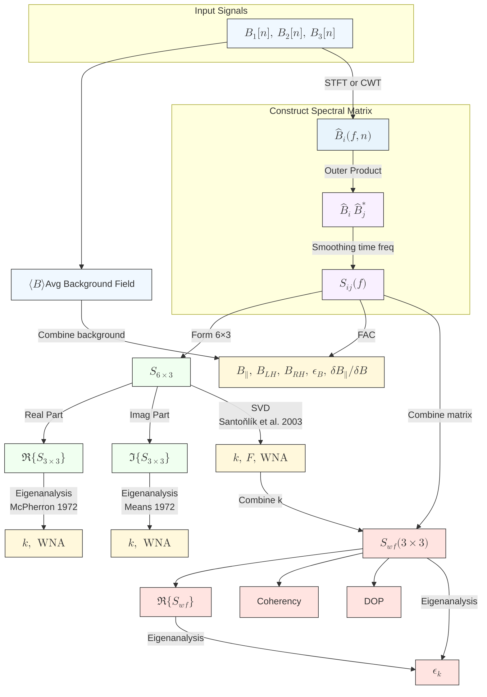

# Multi-Channel Analysis

### Principal Component Analysis / Minimum Variance Analysis

Principal Component Analysis (PCA) and Minimum Variance Analysis (MVA) are eigenvector-based methods for uncovering dominant directional structures in multivariate data. Both techniques seek an orthogonal transformation of the original measurements, 
$$
\mathbf{x}_{3\times N} \;=\;
\begin{bmatrix}
x_{1}[1], & x_{1}[2], & \cdots & x_{1}[N] \\
x_{2}[1], & x_{2}[2], & \cdots & x_{2}[N] \\
x_{3}[1], & x_{3}[2], & \cdots & x_{3}[N]
\end{bmatrix}
$$


, into a new basis whose axes are ordered by the variance they explain.

First, subtract the mean from each component to obtain $\widetilde{\mathbf{x}} = \mathbf{x} - \langle\mathbf{x}\rangle$. The covariance matrix
$$
\mathbf{C}_{3\times 3} = \frac{1}{N-1}\,\widetilde{\mathbf{x}}\;\widetilde{\mathbf{x}}^\mathsf{T}
$$
is then diagonalized by solving
$$
\mathbf{C}\,\mathbf{e}_i = \lambda_i\,\mathbf{e}_i,\quad \lambda_1 \ge \lambda_2 \ge \lambda_3 \ge 0
$$
The eigenvectors $\{\mathbf{e}_i\}$ form the axes of the rotated coordinate system: projecting onto the first $k$ eigenvectors yields the best $k$-dimensional approximation in the least-squares sense (PCA), while in MVA one typically interprets $\mathbf{e}_3$, the direction of minimum variance, as the local discontinuity normal or wave propagation direction.

```python
N = 2 ** 10
t = np.linspace(0, 1, N, endpoint=False)
omega = 2 * np.pi * 8.0
noise_level = 0.02

sig_x = np.sin(omega * t + np.pi * 0.0) * (0.6 * np.hanning(t.size)) + np.random.randn(t.size) * noise_level
sig_y = np.sin(omega * t + np.pi * 0.5) * (0.7 * np.hanning(t.size)) + np.random.randn(t.size) * noise_level
sig_z = np.sin(omega * t + np.pi * 1.0) * (0.8 * np.hanning(t.size)) + np.random.randn(t.size) * noise_level

signal = np.vstack((sig_x, sig_y, sig_z)).T
pca = sklearn.decomposition.PCA(n_components=3)
pca.fit(signal)

eigenvalues = pca.singular_values_
eigenvectors = pca.components_
```

In this framework, $\mathbf{e}_1$ (maximum-variance), $\mathbf{e}_2$ (intermediate), and $\mathbf{e}_3$ (minimum-variance) provide a natural triad for dimensionality reduction, feature extraction, and physical interpretation of multicomponent time series.

<p align = 'center'>

<p>

### Spectral Matrix

A ***spectral matrix*** $\hat{S}$ can be defined as
$$
\hat{S}_{ij}= \langle {X}_i {X}_j^* \rangle
$$

where $\langle X \rangle$ denotes the smooth operator, $X_i$ is the frequency coefficient of the $i$-th component of a multichannel signal (e.g., Fourier or wavelet coefficient), and $X_j^*$ is the complex conjugate of the $j$-th component. The spectral matrix is a generalization of the power spectral density to multiple channels, capturing both auto-spectral (diagonal) and cross-spectral (off-diagonal) relationships.

```python
spec = np.einsum('fti,ftj->ftij', coef, coef.conj())
```

This matrix is Hermitian and positive semi-definite, with diagonal elements representing the power spectral densities of each component and off-diagonal elements encoding cross-spectral relationships. 

It contains all second-order statistical information about the multichannel signal in the frequency domain, including power distributions, correlations, and phase relationships. By transforming the signal frequency coefficients `coef` (e.g., from a Fourier or wavelet transform) into the spectral matrix, we can analyze the signal with multiple signature of the matrix/linear algebra.

The spectral matrix can be averaged over time and frequency to reduce noise and improve statistical reliability, just like the Welch method:

```python
# Moving average smoothing
spec_ma = bn.move_mean(spec, window=freq_window, min_count=1, axis=0)
spec_ma = bn.move_mean(spec, window=time_window, min_count=1, axis=1)
```

Instead, one may also apply a Gaussian smoothing kernel in time and frequency domain to achieve a similar effect. The width of the Gaussian kernel is commonly chose as a multiple of the scale, thus the smoothing kernel is longer at lower frequencies and shorter at higher frequencies.

```python
# Gaussian smoothing
a = 1
spec_sm = np.copy(spec)
for i, s in enumerate(scales):
    spec_sm[i] = scipy.ndimage.gaussian_filter1d(spec[i], sigma = s * a, axis = axis, mode = 'constant', cval = 0.0)
```

### Coherence

Coherence (or coherency in some literature) measures the degree of linear correlation between two signals at each frequency, serving as a frequency-resolved analog of the correlation coefficient. High coherence indicates a strong, consistent relationship, which is crucial for studies of wave propagation, coupled systems, and causality analysis. 

The mathematical definition of coherence is the ratio of the cross-spectral density to the product of the individual power spectral densities:
$$
C_{xy}(f) = \frac{|\hat{S}_{xy}(f)|^2}{\hat{S}_{xx}(f) \hat{S}_{yy}(f)}
$$


where $\hat{S}_{XY}(f)$ is the cross-spectral density between signals $x$ and $y$, and $\hat{S}_{xx}(f)$, $\hat{S}_{yy}(f)$ are the power spectral densities of $x$ and $y$, respectively. Coherence values range from 0 (no correlation) to 1 (perfect correlation).

**<u>Coherence is a function of not only the spectral matrix but also the smoothing operator $\langle...\rangle$.</u>** Without any smoothing, the coherency is always unity no matter the signal is coherent or noisy and thus meaningless.  A real coherent signal can resist a high coherency while the off-diagonal term $S_{xy}$ contributed by random noise will cancel out in the smoothing operation. Two common approaches of smoothing have been introduced in the last section.

<p align = 'center'>

</p>


```python
coherence_xy = np.abs(spec_sm[:, :, 0, 1]) ** 2 / (spec_sm[:, :, 0, 0] * spec_sm[:, :, 1, 1])
```

### Combination with Maxwell's Equations: SVD Wave Analysis

Spectral analysis gains further physical meaning when interpreted alongside Maxwell’s equations. For electromagnetic signals, the spectral content reflects underlying wave propagation, polarization, and field coupling processes. 
$$
\begin{align}
\nabla \cdot \mathbf{E}(\mathbf{r},t) & = -\frac{\rho}{\varepsilon_0}\\

\nabla \cdot \mathbf{B}(\mathbf{r},t) & = 0\\

\nabla \times \mathbf{E}(\mathbf{r},t) & = -\frac{\partial \mathbf{B}(\mathbf{r},t)}{\partial t} \\

\nabla \times \mathbf{B}(\mathbf{r},t) & = \mu_0 \mathbf{J}(\mathbf{r},t)+\mu_0\varepsilon_0 \frac{\partial\mathbf{E}(\mathbf{r},t)}{\partial t}

\end{align}
$$

As the electromagnetic field $\mathbf{E(r},t)$ and $\mathbf{B(r}, t)$ are square-integrable, Maxwell's equations can be naturally transformed into the $(\mathbf{k},\omega)$-space with the basic replacement from $\nabla \leftrightarrow i\mathbf{k}$ and $\partial/\partial t\leftrightarrow -i\omega$:
$$
\begin{align}
i \mathbf{k\cdot \hat{E}(k,\omega)}&=-\hat{\rho_e}/\varepsilon_0 \\
i \mathbf{k\cdot \hat{B}(k,\omega)}&=0 \\
i \mathbf{k\times \hat{E}(k,\omega)}&=i\omega\mathbf{\hat{B}(k,\omega)} \\
i \mathbf{k\times \hat{B}(k,\omega)}&=\mu_0 \mathbf{\hat{J}(k,\omega)} -\mu_0 \varepsilon_0 i\omega\mathbf{\hat{E}(k,\omega)} \\

\end{align}
$$

However, a single spacecraft measurement only allows you to observe a one-dimensional (time) signal at one position, i.e., the spacecraft position, which literally moves in the space. Thus, the signal can only be converted into the frequency space as $\mathbf{\hat{B}(\omega)}$. The second equation is the only parameter-free equation and states that the wave vector, $\mathbf{k}$ must be perpendicular to the magnetic field disturbance, $\mathbf{\hat{B}(\omega)}$. Obviously, $\mathbf{k=0}$ is a trivial, but not useful solution for satisfying the divergence-free theorem. By constraining the norm of $\mathbf{k}$ to be unity, $\boldsymbol{\kappa}\mathbf{:=k/}k$, a more meaningful solution comes out. When the real part, $\Re{\hat{\mathbf{B}}(\omega)}$ and imaginary part, $\Im{\hat{\mathbf{B}}(\omega)}$ of $\mathbf{\hat{B}(\omega)}$ are highly orthogonal, they can span a linear space whose normal vector is naturally $\boldsymbol{\kappa}$. 
$$
\boldsymbol{\kappa}=\frac{\Re{\hat{\mathbf{B}}(\omega)}\times{\Im\hat{\mathbf{B}}(\omega)}}{|\Re{\hat{\mathbf{B}}(\omega)}\times{\Im\hat{\mathbf{B}}(\omega)}|}
$$
which perfectly satisfy that $\boldsymbol{\hat{\mathbf{B}}\cdot \kappa}=0$. 

However,  this $\mathbf{\hat{B}}$-based, namely, coefficient-based estimation may be influenced by the noise's contribution and thus is not so practical. Inspired by the Welch method, a spectral-based estimation is preferred as the spectral density is easily denoised. The spectral-based estimation can be given by refining the original proposition:

$$
\hat{S}_{ij}=\langle \hat{B}_i \hat{B}_j^* \rangle
$$

which can still be met by the original solution. After averaging the spectral matrix in time and frequency domain, this equation can not be perfectly satisfied any more. Thus, we will look for a weaker solution in the sense of minimization:
$$
\begin{align}
\min \limits_{\mathbf{||\boldsymbol{\kappa}||_2^2=1}} & ||\hat{S}\cdot \boldsymbol{\kappa}||_2^2\\ \Leftrightarrow \min \limits_{\mathbf{||\boldsymbol{\kappa}||_2^2=1}} \{&{\underline{||{\Re{\hat{S}}}\cdot \boldsymbol{\kappa}||_2^2}} + \underline{{||{\Im\hat{S}}\cdot \boldsymbol{\kappa}||_2^2}}\}\\
\end{align}
$$
[McPherron et al. (1972)](https://doi.org/10.1007/BF00219165) and [Means (1972)](https://doi.org/10.1029/JA077i028p05551) adopts the real and imaginary part in the minimization optimization for the estimation of wave propagation direction, respectively. Both of these two optimization problem can be solved by eigenvalue decomposition. Then, [Santolík et al. (2003)](https://doi.org/10.1029/2000RS002523) combine both terms and construct an augmented matrix ${A}$:

$$
{A} =
\begin{pmatrix}
\Re S_{11} & \Re S_{12} & \Re S_{13} \\
\Re S_{12} & \Re S_{22} & \Re S_{23} \\
\Re S_{13} & \Re S_{23} & \Re S_{33} \\
0 & -\Im S_{12} & -\Im S_{13} \\
\Im S_{12} & 0 & -\Im S_{23} \\
\Im S_{13} & \Im S_{23} & 0 \\
\end{pmatrix}
$$


The optimization problem
$$
\min\limits_{\Vert\boldsymbol{\kappa}\Vert_2^2=1} ||{A\cdot \mathbf{k}}||_2^2
$$
is directly solvable by applying a ***singular value decomposition(SVD)*** to matrix ${A}$
$$
{A}=U\cdot W\cdot V^T
$$
where $U$ is a $6\times3$ matrix with orthonormal columns, $W$ is a $3\times3$ diagonal matrix with three nonnegative singular values, and $V ^T$ is a $3\times 3$ matrix with orthonormal rows. Diagonal matrix $W$ representing the signal power in a descending order. 

**<u>Compressibility</u>** describe the ratio of the parallel power to the total power. It is a measure of how much of the wave power is associated with compressional (parallel) fluctuations versus transverse (perpendicular) fluctuations.
$$
\begin{align}
\mathrm{Compressibility}:=\frac{PSD(B_\parallel)}{\sum_i PSD(B_i)}
\end{align}
$$

**<u>Planarity</u>** is a measure of how "planar" or "two-dimensional" the wave fluctuations are. It quantifies the extent to which the wave power is concentrated in a plane, as opposed to being distributed in three dimensions. A planarity of 1 indicates that the fluctuations are perfectly planar, while a planarity of 0 indicates isotropic fluctuations. It is defined as the ratio of the smallest singular value to the largest singular value of the spectral matrix:
$$
F=1-\sqrt{W_{2}/W_{0}}
$$

Without averaging the spectral matrix, the planarity $F(t,f)$ **<u>will be all one</u>**. It means that, when the observer only take one snapshot of the waves, it can not distinguish how does the waves propagate. After the averaging, the planarity actually describe that, **<u>whether the waves that observed at these time periods, frequencies share the common unitary wave vector.</u>**

```python
spec = np.einsum('fti,ftj->ftij', coef, coef.conj())
spec = bn.move_mean(spec, window=freq_window, min_count=1, axis=0)
spec = bn.move_mean(spec, window=time_window, min_count=1, axis=1)

spec_63 = np.concatenate([spec.real, spec.imag], axis=-2)
u, s, vh = np.linalg.svd(spec_63, full_matrices=False)

planarity = 1 - np.sqrt(s[:, :, 2] / s[:, :, 0])
ellipticity_along_k = s[:, :, 1] / s[:, :, 0]
```


One should keep in mind that all interpretation about the observed waves is in the spacecraft inertial reference frame. A proper choice of coordinate system is especially necessary for a spinning spacecraft.


This section explores the synergy between spectral analysis and electromagnetic theory, demonstrating how to derive physical insights and constraints from both perspectives.

**<u>Ellipticity along Background Magnetic Field</u>**

Both above two ellipticities are unsigned as the singular/eigen values are always non-negative. Another, but not alternative definition of the ellipticity, is the ratio of left-handed polarized signal power to the right-handed polarized power. This definition is signed and the the ellipse is defined in the plane that perpendicular to the background magnetic field:

$$
\epsilon_B = \frac{|\hat{B}_L|^2-|\hat{B}_R|^2}{|\hat{B}_L|^2+|\hat{B}_R|^2}
$$

with $B_L$ and $B_R$ defines below:
$$
\begin{align}
B_L = \frac{1}{\sqrt{2}}(B_{\perp1}+iB_{\perp2})\\
B_R = \frac{1}{\sqrt{2}}(B_{\perp1}-iB_{\perp2})
\end{align}
$$
with $\mathbf{e_{\perp1}}$, $\mathbf{e_{\perp2}}$, and $\mathbf{e_\parallel }$ constitute a right-hand system, i.e., $\mathbf{e_{\perp1}\times e_{\perp2}=e_\parallel}$.

It is also important as it may unveils the wave excitation mechanism (e.g., wave-particle resonance). This definition is totally irrelevant with the determination of the wave vector direction. Instead, field-aligned coordinates is required for its derivation.

**<u>Ellipticity along Wave Vector</u>**

Polarization analysis examines the orientation and ellipticity of oscillatory signals, especially electromagnetic or plasma waves. By decomposing the signal into orthogonal components and analyzing their relative amplitude and phase, we can characterize wave mode, propagation direction, and physical source. This section introduces key polarization parameters, their spectral estimation, and relevant Python implementations.

Ellipticity can be defined as the ratio of the semi-major and semi-minor, which is estimated by:
$$
\epsilon=\frac{W_1}{W_0}
$$
For a noisy signal, T and S 2019 propose an improved method with a estimation of the noise level based on the eigen decomposition. In this method, they noise level is inferred by decomposing the real part of the spectral density matrix and the maximum/intermediate eigenvalues of the complex spectral density represents the summation of wave power and noise power. Therefore, the improved ellipticity is derived:
$$
\epsilon^\prime=\sqrt{\frac{\lambda_{r1}-\lambda_1}{\lambda_{r0}-\lambda_1}}
$$
This improved ellipticity performs better than the original one when SNR is low but the still randomly deviates from the ground true. Thus, a moving average in the time or frequency domain is still required as it promote the SNR. 

```python
coef_wf = np.einsum('ijk,ijlk->ijl', coef, vh)
spec_wf = np.einsum('fti,ftj->ftij', coef_wf, coef_wf.conj())
spec_wf = bn.move_mean(spec_wf, window=freq_window, min_count=1, axis=0)
spec_wf = bn.move_mean(spec_wf, window=time_window, min_count=1, axis=1)

coherence = np.abs(spec_wf[:, :, 0, 1]) / np.sqrt(np.abs(spec_wf[:, :, 0, 0] * spec_wf[:, :, 1, 1]))

eigenvalues_r, _ = np.linalg.eigh(spec_wf[:, :, :2, :2].real) # Ascending
eigenvalues, _ = np.linalg.eigh(spec_wf[:, :, :2, :2]) # Ascending

ellipticity_along_k = np.sqrt((eigenvalues_r[:, :, 0] - eigenvalues[:, :, 0]) / (eigenvalues_r[:, :, 1] - eigenvalues[:, :, 0]))
```

<u>**Field-Aligned Coordinate**</u>

Field-Aligned Coordinates (FAC) are a specialized coordinate system used in space physics to analyze data collected along the geomagnetic field lines. By transforming measurements into FAC, we can isolate field-aligned structures and dynamics, such as auroral currents and plasma waves. This section explains the transformation process, its physical significance, and practical applications in magnetospheric studies. 

To transform a three-dimensional vector field $\mathbf{B}$ into FAC, we first need to calculate the unit vector along the magnetic field line, $\mathbf{b} = \mathbf{B}/|\mathbf{B}|$. The FAC system is then defined as follows:

```python
magf = np.array([bx, by, bz])
magf_avg = bn.move_mean(magf, axis=0)

dir_ref = np.array([1., 0., 0.])
dir_para = (magf_avg.T / np.linalg.norm(magf_avg, axis = 1)).T

dir_perp_1 = np.cross(dir_para, dir_ref)
dir_perp_1 = (dir_perp_1.T / np.linalg.norm(dir_perp_1, axis = 1)).T

dir_perp_2 = np.cross(dir_para, dir_perp_1)
dir_perp_2 = (dir_perp_2.T / np.linalg.norm(dir_perp_2, axis = 1)).T

# Amplitude Projection
magf_para = np.einsum(magf, dir_para, 'ij,ij ->i')
magf_perp_1 = np.einsum(magf, dir_perp_1, 'ij,ij ->i')
magf_perp_2 = np.einsum(magf, dir_perp_2, 'ij,ij ->i')

# Coefficient Projection
coef_para = np.einsum('ijk,jk->ij', coef, dir_para)
coef_perp_1 = np.einsum('ijk,jk->ij', coef, dir_perp_1)
coef_perp_2 = np.einsum('ijk,jk->ij', coef, dir_perp_2)
compressibility = np.abs(coef_para) ** 2 / (np.abs(coef_para) ** 2 + np.abs(coef_perp_1) ** 2 + np.abs(coef_perp_2) ** 2)

# Polarization
coef_lh = (coef_perp_1 - 1j * coef_perp_2) / np.sqrt(2)
coef_rh = (coef_perp_1 + 1j * coef_perp_2) / np.sqrt(2)

ellipticity_along_b = (np.abs(coef_rh) - np.abs(coef_lh)) / (np.abs(coef_rh) + np.abs(coef_lh))
```

**<u>Degree of Polarization</u>**

The **degree of polarization** quantifies the proportion of an electromagnetic fluctuation (such as a plasma wave) that is organized, or polarized, as opposed to random or unpolarized (noise-like) components. It is a fundamental parameter in space plasma physics, characterizing the coherence of observed wave signals.

The degree of polarization is defined as the fraction of the total wave power that is associated with a perfectly polarized (coherent) component. It is mathematically expressed as:
$$
D_p = \frac{\text{Power of the Polarized Component}}{\text{Total Power}}
$$

- $D_p = 1$: the signal is completely polarized.
- $0 < D_p < 1$: the signal is partially polarized.
- $D_p = 0$: the signal is totally unpolarized (random noise).

A high degree of polarization indicates that the observed fluctuations are dominated by coherent wave processes, while a low degree suggests that random or turbulent components are significant. The degree of polarization is widely used to distinguish wave modes, to separate physical signals from instrumental or background noise, and to assess the reliability of wave analysis.

In three-dimensional wave analysis, the **degree of polarization** quantifies how much of the measured signal is concentrated along a single, well-defined direction, versus being randomly distributed among all directions.

The 3D eigenvalue-based degree of polarization is defined as:
$$
D_{p,3D} = \frac{\lambda_1 - \lambda_2}{\lambda_1 + \lambda_2 + \lambda_3}
$$
where $\lambda_1 \geq \lambda_2 \geq \lambda_3$ are the eigenvalues of the (power or spectral) matrix constructed from the three orthogonal components of the wave field.

This definition is coordinate-invariant and widely used in space plasma physics to characterize the coherence and organization of wave signals in planetary magnetospheres and the solar wind. It is particularly powerful for distinguishing true wave modes from background turbulence or noise.

```python
w, v = np.linalg.eigh(spec)
degree_of_polarization = (w[:, :, 2] - w[:, :, 1]) / np.sum(w, axis = -1)
```

- Notice: `np.linalg.eigh` and `np.linalg.svd` return the eigen/singular values in an ascending / descending order.


<!-- tabs:start -->

#### **Spectra**
<p align = 'center'></p>

#### **Line Plot**
<p align = 'center'></p>

<!-- tabs:end -->

Similar to **Coherence, Planarity and Degree of Polarization** are also a a functional properties of the smoothing operator. A strong smoothing operator will promote the planarity and degree of polarization as it suppresses the noise contribution. However, a too strong smoothing operator will also smear out the temporal and frequency variations of the wave properties. Thus, a proper choice of the smoothing operator is necessary.





<div STYLE="page-break-after: always;"></div>