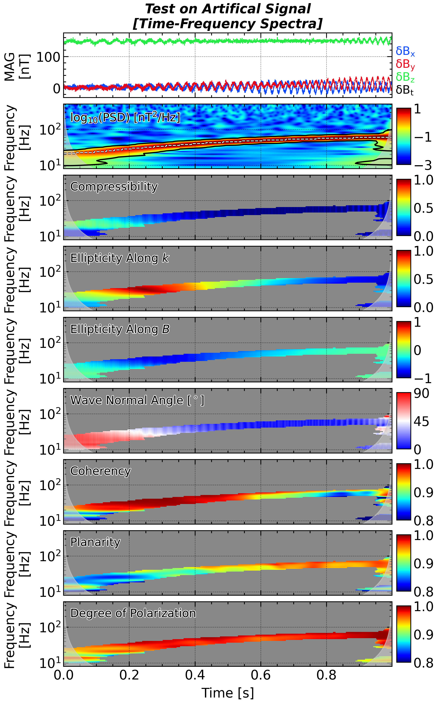
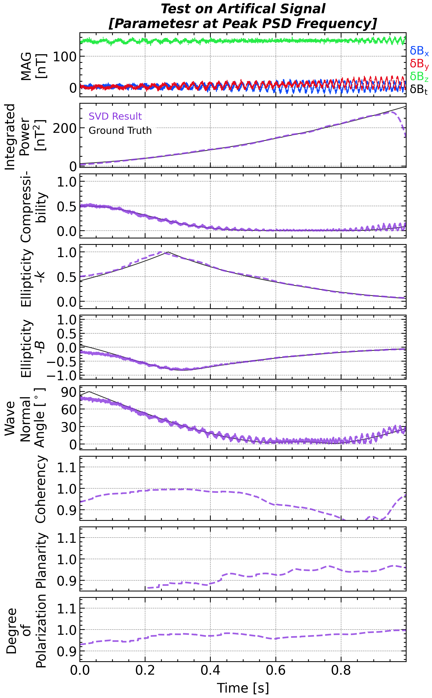

## Multi-Dimensional Signal

### Principal Component Analysis / Minimum Variance Analysis

Principal Component Analysis (PCA) and Minimum Variance Analysis (MVA) are closely related, eigen‐vector–based techniques for extracting the dominant directional structure in multivariate data. PCA is a general statistical tool; MVA is the same mathematics applied to three-component field measurements (e.g., **B** in space physics) with special attention to the minimum-variance direction. 

The central ideas of these two methods are rotating the data into a new orthogonal basis such that each successive axis captures the greatest possible remaining variance.

#### Mathematical Formulation

1. **Collect & demean** the data matrix
   $$
   \mathbf{X}
   = \begin{bmatrix}
     x_1 & x_2 & \dots & x_N \\
     y_1 & y_2 & \dots & y_N \\
     z_1 & z_2 & \dots & z_N
   \end{bmatrix},
   \qquad
   \tilde{\mathbf{X}} = \mathbf{X} - \langle\mathbf{X}\rangle
   $$

2. **Form the covariance (spectral) matrix**
   $$
   \mathbf{C} \;=\; \frac{1}{N-1}\,\tilde{\mathbf{X}}\tilde{\mathbf{X}}^\mathsf{T}
   $$

3. **Solve the eigenproblem**
   
   $$
     \mathbf{C}\,\mathbf{e}_i \;=\; \lambda_i\,\mathbf{e}_i,
     \quad
     \lambda_1 \ge \lambda_2 \ge \lambda_3 \ge 0
   $$
   
4. **Interpretation**

   - **PCA**: Project the data onto the top *k* eigenvectors $\{\mathbf{e}_1,\dots,\mathbf{e}_k\}$ for dimensionality reduction.
   
   - **MVA**:
     - $\mathbf{e}_1$: maximum‐variance direction (largest fluctuations)
     
     - $\mathbf{e}_2$: intermediate direction
     
     - $\mathbf{e}_3$: minimum‐variance direction—often taken as the local discontinuity normal or the wave propagation vector.
     
       <p align = 'center'>
       
       </p>
       
        ```python
        sklearn.decomposition.PCA(
           n_components: int | float | str | None = None,     # Number of components or variance ratio to keep
           copy: bool = True,                                 # If False, data may be overwritten during fitting
           whiten: bool = False,                              # If True, output is scaled to unit variance
           svd_solver: str = 'auto',                          # SVD method: 'auto', 'full', 'arpack', or 'randomized'
           tol: float = 0.0,                                  # Convergence tolerance (used only if svd_solver='arpack')
           iterated_power: int | str = 'auto',                # Power iterations for randomized SVD
           random_state: int | RandomState | None = None      # Seed or random generator for randomized SVD
        )
        # Returns:
       
        # pca : PCA object
        #     A fitted PCA estimator instance, ready for transformation and analysis.
       
        pca.fit(
            X: array-like of shape (n_samples, n_features),    # Training data matrix
        )
        ```

       

        ```python
        N = 2 ** 10
        t = np.linspace(0, 1, N, endpoint=False)
        omega = 2 * np.pi * 8.0
        noise_level = 0.02
       
        sig_x = np.sin(omega * t + np.pi * 0.0) * (0.6 * np.hanning(t.size)) + np.random.randn(t.size) * noise_level
        sig_y = np.sin(omega * t + np.pi * 0.5) * (0.7 * np.hanning(t.size)) + np.random.randn(t.size) * noise_level
        sig_z = np.sin(omega * t + np.pi * 1.0) * (0.8 * np.hanning(t.size)) + np.random.randn(t.size) * noise_level
       
        signal = np.vstack((sig_x, sig_y, sig_z)).T
        pca = sklearn.decomposition.PCA(n_components=3)
        pca.fit(signal)
       
        eigenvalues = pca.singular_values_
        eigenvectors = pca.components_
        ```

### Spectral Matrix

A ***spectral matrix*** can be defined as 
$$
\hat{S}_{ij}= \hat{B}_i \hat{B}_j^*
$$

for a time series decomposed with both signal and noise, its Fourier coefficients follow the ***non-central chi-square distribution***, as introduced in the previous section. Taking a moving-average in the time or frequency domain helps improving the SNR as we did in the Welch method. 

```python
spec = np.einsum('fti,ftj->ftij', coef, coef.conj())

# Average in time or frequency domain
spec_avg = np.copy(spec)
spec_avg = bn.move_mean(spec_avg, window=time_window, min_count=1, axis=1)
spec_avg = bn.move_mean(spec_avg, window=freq_window, min_count=1, axis=0)
```

### Coherence

Coherence (or coherency in some literature) measures the degree of linear correlation between two signals at each frequency, serving as a frequency-resolved analog of the correlation coefficient. High coherence indicates a strong, consistent relationship, which is crucial for studies of wave propagation, coupled systems, and causality analysis. 

The mathematical definition of coherence is the ratio of the cross-spectral density to the product of the individual power spectral densities:
$$
C_{XY}(f) = \frac{|\hat{S}_{XY}(f)|^2}{\hat{S}_{XX}(f) \hat{S}_{YY}(f)}
$$


where $\hat{S}_{XY}(f)$ is the cross-spectral density between signals $X$ and $Y$, and $\hat{S}_{XX}(f)$, $\hat{S}_{YY}(f)$ are the power spectral densities of $X$ and $Y$, respectively. Coherence values range from 0 (no correlation) to 1 (perfect correlation).

```python
scipy.signal.coherence(
    x: array_like,               # First input signal (1D or 2D array)
    y: array_like,               # Second input signal (same shape as x)
    fs: float = 1.0,             # Sampling frequency (Hz)
    window: str or tuple = 'hann',  # Window function to apply to each segment
    nperseg: int = None,         # Segment length for FFT (default: 256)
    noverlap: int = None,        # Number of overlapping points (default: nperseg // 2)
    nfft: int = None,            # Number of FFT points (default: nperseg)
    detrend: str or function = 'constant',  # How to detrend each segment
    axis: int = -1               # Axis along which to compute coherence
)
# Returns:
# f : ndarray
#     Array of sample frequencies.
# Cxy : ndarray
#     Magnitude-squared coherence values (range: 0 to 1).

```

To be honest, I feel very hard to understand what does *coherent/coherence* means in many of the magnetospheric ULF/VLF waves investigations. It can be easily understood the coherence between two individual light or signal. However, in the *in-situ* observation, the spacecraft can only measure one signal without further distinguishment or separation. In some literature, the coherence between $E_x$ and $B_y$ are used to measure whether the observed VLF waves are coherent. These VLF waves always propagate along the geomagnetic field line, which point to the north near the magnetic equator. It makes some sense as a high coherence suggests the waves have a stable wave vector during this interval. But, it is still hard to expect the occurrence of interference as both $E_x$ and $B_y$ may just be the presence of one single wave. While, some other literatures use the coherence between the magnetic field components to 

- Coherency is meaningless without taking an average. 

### Combination with Maxwell's Equations: SVD Wave Analysis

Spectral analysis gains further physical meaning when interpreted alongside Maxwell’s equations. For electromagnetic signals, the spectral content reflects underlying wave propagation, polarization, and field coupling processes. 
$$
\begin{align}
\nabla \cdot \mathbf{E}(\mathbf{r},t) & = -\frac{\rho}{\varepsilon_0}\\

\nabla \cdot \mathbf{B}(\mathbf{r},t) & = 0\\

\nabla \times \mathbf{E}(\mathbf{r},t) & = -\frac{\partial \mathbf{B}(\mathbf{r},t)}{\partial t} \\

\nabla \times \mathbf{B}(\mathbf{r},t) & = \mu_0 \mathbf{J}(\mathbf{r},t)+\mu_0\varepsilon_0 \frac{\partial\mathbf{E}(\mathbf{r},t)}{\partial t}

\end{align}
$$

As the electromagnetic field $\mathbf{E(r},t)$ and $\mathbf{B(r}, t)$ are square-integrable, Maxwell's equations can be naturally transformed into the $(\mathbf{k},\omega)$-space with the basic replacement from $\nabla \leftrightarrow i\mathbf{k}$ and $\partial/\partial t\leftrightarrow -i\omega$:
$$
\begin{align}
i \mathbf{k\cdot \hat{E}(k,\omega)}&=-\hat{\rho_e}/\varepsilon_0 \\
i \mathbf{k\cdot \hat{B}(k,\omega)}&=0 \\
i \mathbf{k\times \hat{E}(k,\omega)}&=i\omega\mathbf{\hat{B}(k,\omega)} \\
i \mathbf{k\times \hat{B}(k,\omega)}&=\mu_0 \mathbf{\hat{J}(k,\omega)} -\mu_0 \varepsilon_0 i\omega\mathbf{\hat{E}(k,\omega)} \\

\end{align}
$$

However, a single spacecraft measurement only allows you to observe a one-dimensional (time) signal at one position, i.e., the spacecraft position, which literally moves in the space. Thus, the signal can only be converted into the frequency space as $\mathbf{\hat{B}(\omega)}$. The second equation is the only parameter-free equation and states that the wave vector, $\mathbf{k}$ must be perpendicular to the magnetic field disturbance, $\mathbf{\hat{B}(\omega)}$. Obviously, $\mathbf{k=0}$ is a trivial, but not useful solution for satisfying the divergence-free theorem. By constraining the norm of $\mathbf{k}$ to be unity, $\boldsymbol{\kappa}\mathbf{:=k/}k$, a more meaningful solution comes out. When the real part, $\Re{\hat{\mathbf{B}}(\omega)}$ and imaginary part, $\Im{\hat{\mathbf{B}}(\omega)}$ of $\mathbf{\hat{B}(\omega)}$ are highly orthogonal, they can span a linear space whose normal vector is naturally $\boldsymbol{\kappa}$. 
$$
\boldsymbol{\kappa}=\frac{\Re{\hat{\mathbf{B}}(\omega)}\times{\Im\hat{\mathbf{B}}(\omega)}}{|\Re{\hat{\mathbf{B}}(\omega)}\times{\Im\hat{\mathbf{B}}(\omega)}|}
$$
which perfectly satisfy that $\boldsymbol{\hat{\mathbf{B}}\cdot \kappa}=0$. 

However,  this $\mathbf{\hat{B}}$-based, namely, coefficient-based estimation may be influenced by the noise's contribution and thus is not so practical. Inspired by the Welch method, a spectral-based estimation is preferred as the spectral density is easily denoised. The spectral-based estimation can be given by refining the original proposition:

$$
\hat{S}_{ij}=\langle \hat{B}_i \hat{B}_j^* \rangle
$$

which can still be met by the original solution. After averaging the spectral matrix in time and frequency domain, this equation can not be perfectly satisfied any more. Thus, we will look for a weaker solution in the sense of minimization:
$$
\begin{align}
\min \limits_{\mathbf{||\boldsymbol{\kappa}||_2^2=1}} & ||\hat{S}\cdot \boldsymbol{\kappa}||_2^2\\ \Leftrightarrow \min \limits_{\mathbf{||\boldsymbol{\kappa}||_2^2=1}} \{&{\underline{||{\Re{\hat{S}}}\cdot \boldsymbol{\kappa}||_2^2}} + \underline{{||{\Im\hat{S}}\cdot \boldsymbol{\kappa}||_2^2}}\}\\
\end{align}
$$
[McPherron et al. (1972)](https://doi.org/10.1007/BF00219165) and [Means (1972)](https://doi.org/10.1029/JA077i028p05551) adopts the real and imaginary part in the minimization optimization for the estimation of wave propagation direction, respectively. Both of these two optimization problem can be solved by eigenvalue decomposition. Then, [Santolík et al. (2003)](https://doi.org/10.1029/2000RS002523) combine both terms and construct an augmented matrix ${A}$:

$$
{A} =
\begin{pmatrix}
\Re S_{11} & \Re S_{12} & \Re S_{13} \\
\Re S_{12} & \Re S_{22} & \Re S_{23} \\
\Re S_{13} & \Re S_{23} & \Re S_{33} \\
0 & -\Im S_{12} & -\Im S_{13} \\
\Im S_{12} & 0 & -\Im S_{23} \\
\Im S_{13} & \Im S_{23} & 0 \\
\end{pmatrix}
$$


The optimization problem
$$
\min\limits_{\Vert\boldsymbol{\kappa}\Vert_2^2=1} ||{A\cdot \mathbf{k}}||_2^2
$$
is directly solvable by applying a ***singular value decomposition(SVD)*** to matrix ${A}$
$$
{A}=U\cdot W\cdot V^T
$$
where $U$ is a $6\times3$ matrix with orthonormal columns, $W$ is a $3\times3$ diagonal matrix with three nonnegative singular values, and $V ^T$ is a $3\times 3$ matrix with orthonormal rows. Diagonal matrix $W$ representing the signal power in a descending order. 

**<u>Compressibility</u>** describe the polarization 
$$
\begin{align}
\mathrm{Compressibility}:=\frac{PSD(B_\parallel)}{\sum_i PSD(B_i)}
\end{align}
$$


**<u>Planarity</u>** 
$$
F=1-\sqrt{W_{2}/W_{0}}
$$

Without averaging the spectral matrix, the planarity $F(t,f)$ **<u>will be all one</u>**. It means that, when the observer only take one snapshot of the waves, it can not distinguish how does the waves propagate. After the averaging, the planarity actually describe that, **<u>whether the waves that observed at these time periods, frequencies share the common unitary wave vector.</u>**

```python
spec = np.einsum('fti,ftj->ftij', coef, coef.conj())
spec = bn.move_mean(spec, window=freq_window, min_count=1, axis=0)
spec = bn.move_mean(spec, window=time_window, min_count=1, axis=1)

spec_63 = np.concatenate([spec.real, spec.imag], axis=-2)
u, s, vh = np.linalg.svd(spec_63, full_matrices=False)

planarity = 1 - np.sqrt(s[:, :, 2] / s[:, :, 0])
ellipticity_along_k = s[:, :, 1] / s[:, :, 0]
```

Similarly, based on the averaged spectral matrix, one may define the coherence (coherency) between different components:
$$
\mathrm{Coherency}:=\frac{|S_{ij}|}{\sqrt{S_{ii}S_{jj}}}
$$
<p align = 'center'>

</p>

One should keep in mind that all interpretation about the observed waves is in the spacecraft inertial reference frame. A proper choice of coordinate system is especially necessary for a spinning spacecraft.


This section explores the synergy between spectral analysis and electromagnetic theory, demonstrating how to derive physical insights and constraints from both perspectives.

**<u>Ellipticity along Background Magnetic Field</u>**

Both above two ellipticities are unsigned as the singular/eigen values are always non-negative. Another, but not alternative definition of the ellipticity, is the ratio of left-handed polarized signal power to the right-handed polarized power. This definition is signed and the the ellipse is defined in the plane that perpendicular to the background magnetic field:

$$
\epsilon_B = \frac{|\hat{B}_L|^2-|\hat{B}_R|^2}{|\hat{B}_L|^2+|\hat{B}_R|^2}
$$

with $B_L$ and $B_R$ defines below:
$$
\begin{align}
B_L = \frac{1}{\sqrt{2}}(B_{\perp1}+iB_{\perp2})\\
B_R = \frac{1}{\sqrt{2}}(B_{\perp1}-iB_{\perp2})
\end{align}
$$
with $\mathbf{e_{\perp1}}$, $\mathbf{e_{\perp2}}$, and $\mathbf{e_\parallel }$ constitute a right-hand system, i.e., $\mathbf{e_{\perp1}\times e_{\perp2}=e_\parallel}$.

It is also important as it may unveils the wave excitation mechanism (e.g., wave-particle resonance). This definition is totally irrelevant with the determination of the wave vector direction. Instead, field-aligned coordinates is required for its derivation.

**<u>Ellipticity along Wave Vector</u>**

Polarization analysis examines the orientation and ellipticity of oscillatory signals, especially electromagnetic or plasma waves. By decomposing the signal into orthogonal components and analyzing their relative amplitude and phase, we can characterize wave mode, propagation direction, and physical source. This section introduces key polarization parameters, their spectral estimation, and relevant Python implementations.

Ellipticity can be defined as the ratio of the semi-major and semi-minor, which is estimated by:
$$
\epsilon=\frac{W_1}{W_0}
$$
For a noisy signal, T and S 2019 propose an improved method with a estimation of the noise level based on the eigen decomposition. In this method, they noise level is inferred by decomposing the real part of the spectral density matrix and the maximum/intermediate eigenvalues of the complex spectral density represents the summation of wave power and noise power. Therefore, the improved ellipticity is derived:
$$
\epsilon^\prime=\sqrt{\frac{\lambda_{r1}-\lambda_1}{\lambda_{r0}-\lambda_1}}
$$
This improved ellipticity performs better than the original one when SNR is low but the still randomly deviates from the ground true. Thus, a moving average in the time or frequency domain is still required as it promote the SNR. 

```python
coef_wf = np.einsum('ijk,ijlk->ijl', coef, vh)
spec_wf = np.einsum('fti,ftj->ftij', coef_wf, coef_wf.conj())
spec_wf = bn.move_mean(spec_wf, window=freq_window, min_count=1, axis=0)
spec_wf = bn.move_mean(spec_wf, window=time_window, min_count=1, axis=1)

coherence = np.abs(spec_wf[:, :, 0, 1]) / np.sqrt(np.abs(spec_wf[:, :, 0, 0] * spec_wf[:, :, 1, 1]))

eigenvalues_r, _ = np.linalg.eigh(spec_wf[:, :, :2, :2].real) # Ascending
eigenvalues, _ = np.linalg.eigh(spec_wf[:, :, :2, :2]) # Ascending

ellipticity_along_k = np.sqrt((eigenvalues_r[:, :, 0] - eigenvalues[:, :, 0]) / (eigenvalues_r[:, :, 1] - eigenvalues[:, :, 0]))
```

<u>**Field-Aligned Coordinate**</u>

Field-Aligned Coordinates (FAC) are a specialized coordinate system used in space physics to analyze data collected along the geomagnetic field lines. By transforming measurements into FAC, we can isolate field-aligned structures and dynamics, such as auroral currents and plasma waves. This section explains the transformation process, its physical significance, and practical applications in magnetospheric studies. 

To transform a three-dimensional vector field $\mathbf{B}$ into FAC, we first need to calculate the unit vector along the magnetic field line, $\mathbf{b} = \mathbf{B}/|\mathbf{B}|$. The FAC system is then defined as follows:

```python
magf = np.array([bx, by, bz])
magf_avg = bn.move_mean(magf, axis=0)

dir_ref = np.array([1., 0., 0.])
dir_para = (magf_avg.T / np.linalg.norm(magf_avg, axis = 1)).T

dir_perp_1 = np.cross(dir_para, dir_ref)
dir_perp_1 = (dir_perp_1.T / np.linalg.norm(dir_perp_1, axis = 1)).T

dir_perp_2 = np.cross(dir_para, dir_perp_1)
dir_perp_2 = (dir_perp_2.T / np.linalg.norm(dir_perp_2, axis = 1)).T

# Amplitude Projection
magf_para = np.einsum(magf, dir_para, 'ij,ij ->i')
magf_perp_1 = np.einsum(magf, dir_perp_1, 'ij,ij ->i')
magf_perp_2 = np.einsum(magf, dir_perp_2, 'ij,ij ->i')

# Coefficient Projection
coef_para = np.einsum('ijk,jk->ij', coef, dir_para)
coef_perp_1 = np.einsum('ijk,jk->ij', coef, dir_perp_1)
coef_perp_2 = np.einsum('ijk,jk->ij', coef, dir_perp_2)
compressibility = np.abs(coef_para) ** 2 / (np.abs(coef_para) ** 2 + np.abs(coef_perp_1) ** 2 + np.abs(coef_perp_2) ** 2)

# Polarization
coef_lh = (coef_perp_1 - 1j * coef_perp_2) / np.sqrt(2)
coef_rh = (coef_perp_1 + 1j * coef_perp_2) / np.sqrt(2)

ellipticity_along_b = (np.abs(coef_rh) - np.abs(coef_lh)) / (np.abs(coef_rh) + np.abs(coef_lh))
```

**<u>Degree of Polarization</u>**

The **degree of polarization** quantifies the proportion of an electromagnetic fluctuation (such as a plasma wave) that is organized, or polarized, as opposed to random or unpolarized (noise-like) components. It is a fundamental parameter in space plasma physics, characterizing the coherence of observed wave signals.

The degree of polarization is defined as the fraction of the total wave power that is associated with a perfectly polarized (coherent) component. It is mathematically expressed as:
$$
D_p = \frac{\text{Power of the Polarized Component}}{\text{Total Power}}
$$

- $D_p = 1$: the signal is completely polarized.
- -- $0 < D_p < 1$: the signal is partially polarized.
- -- $D_p = 0$: the signal is totally unpolarized (random noise).

A high degree of polarization indicates that the observed fluctuations are dominated by coherent wave processes, while a low degree suggests that random or turbulent components are significant. The degree of polarization is widely used to distinguish wave modes, to separate physical signals from instrumental or background noise, and to assess the reliability of wave analysis.

In three-dimensional wave analysis, the **degree of polarization** quantifies how much of the measured signal is concentrated along a single, well-defined direction, versus being randomly distributed among all directions.

The 3D eigenvalue-based degree of polarization is defined as:
$$
D_{p,3D} = \frac{\lambda_1 - \lambda_2}{\lambda_1 + \lambda_2 + \lambda_3}
$$
where $\lambda_1 \geq \lambda_2 \geq \lambda_3$ are the eigenvalues of the (power or spectral) matrix constructed from the three orthogonal components of the wave field.

This definition is coordinate-invariant and widely used in space plasma physics to characterize the coherence and organization of wave signals in planetary magnetospheres and the solar wind. It is particularly powerful for distinguishing true wave modes from background turbulence or noise.

```python
w, v = np.linalg.eigh(spec)
degree_of_polarization = (w[:, :, 2] - w[:, :, 1]) / np.sum(w, axis = -1)
```

- Notice: `np.linalg.eigh` and `np.linalg.svd` return the eigen/singular values in an ascending / descending order.


<!-- tabs:start -->

#### **Spectra**
<p align = 'center'></p>

#### **Line Plot**
<p align = 'center'></p>

<!-- tabs:end -->

**Coherence, Planarity, and Degree of Polarization** are all a a functional properties 

<div STYLE="page-break-after: always;"></div>