Each card below links to a self-contained example: real data, working Python code, and the resulting figure. Click through for the full derivation and implementation.

::: {.gallery-grid}

<a href="gallery/aliasing.qmd">
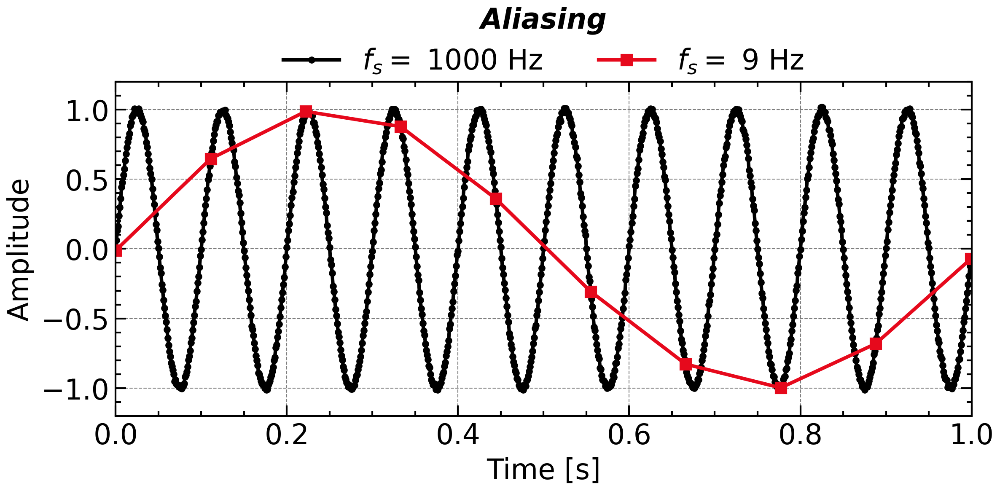

Aliasing &amp; the Nyquist Folding Receiver

Undersampling folds every Nyquist zone onto the same baseband; a modulated sample clock tags each zone by its FM depth, turning aliasing into a wideband receiver.

Ch.1 · Sampling

</a>

<a href="gallery/exoplanet.qmd">

Exoplanet 51 Peg b

Lomb–Scargle periodogram on unevenly sampled radial-velocity data, recovering the 4.23-day orbital period.

Ch.2 · Lomb–Scargle

</a>

<a href="gallery/piano.qmd">
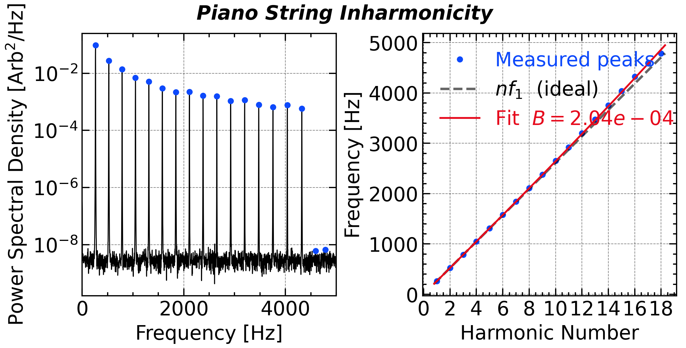

Piano String Inharmonicity

Spectral peak detection reveals how bending stiffness stretches piano overtones sharp — and why tuners apply octave stretch.

Ch.2 · Peak Detection

</a>

<a href="gallery/missing_fundamental.qmd">
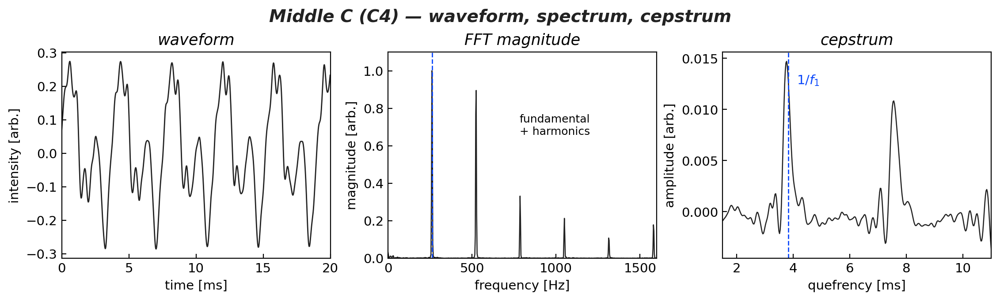

The Missing Fundamental

Delete a tone's fundamental and the pitch stays put — the waveform period and the cepstral peak both survive. With audio to hear it.

Ch.2 · Cepstrum

</a>

<a href="gallery/gearbox.qmd">

Gear-Box Fault Detection

Cepstrum analysis separates the gear-mesh harmonic family from background noise, localising a bearing defect.

Ch.2 · Cepstrum

</a>

<a href="gallery/sunspot.qmd">
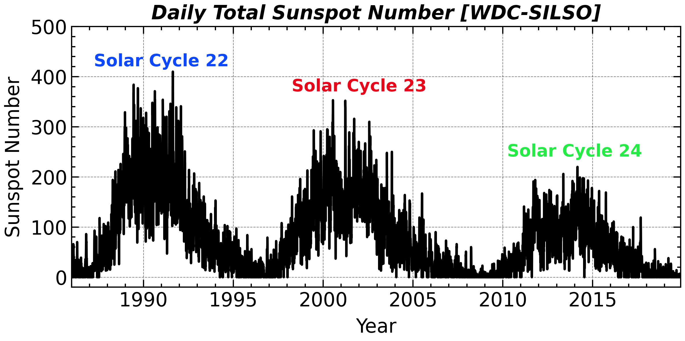

Sunspot Cycle

Welch PSD of 300 years of sunspot numbers — pinpointing the 11-year solar cycle and its harmonics.

Ch.3 · Welch PSD

</a>

<a href="gallery/cmb.qmd">
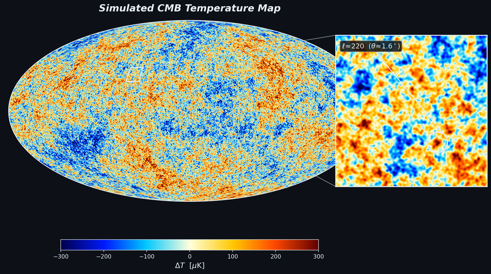

Cosmic Microwave Background

The Wiener–Khinchin theorem on the sphere: recovering the CMB acoustic-peak power spectrum from the oldest light in the Universe.

Ch.3 · Angular Power Spectrum

</a>

<a href="gallery/airy_diffraction.qmd">
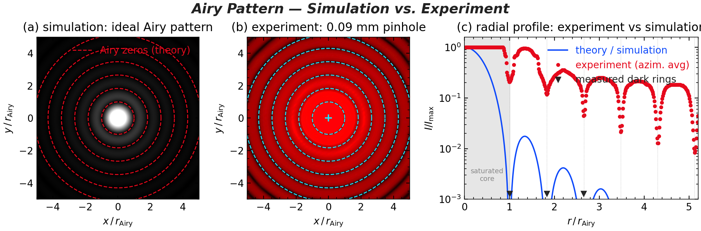

Airy Diffraction — Theory vs. Experiment

The Hankel transform predicts a circular aperture's diffraction rings; a real red-laser-through-a-pinhole photo confirms them to a few percent.

Ch.3 · Hankel Transform

</a>

<a href="gallery/spectral_pde.qmd">

Heat Conduction with the FFT

In Fourier space the Laplacian becomes −k², so the heat equation turns into one exponentially-decaying ODE per mode — solved exactly, with no time-stepping.

Ch.4 · Spectral Method

</a>

<a href="gallery/spectral_em.qmd">
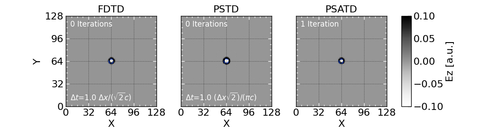

Electromagnetic Waves with the FFT

The same trick for light: the curl becomes i·k×, and each mode oscillates at ω=ck. Spectral solvers (PSTD/PSATD) keep the wavefront on the light-cone where finite differences ripple.

Ch.4 · Spectral Method

</a>

<a href="gallery/fft_multiplication.qmd">
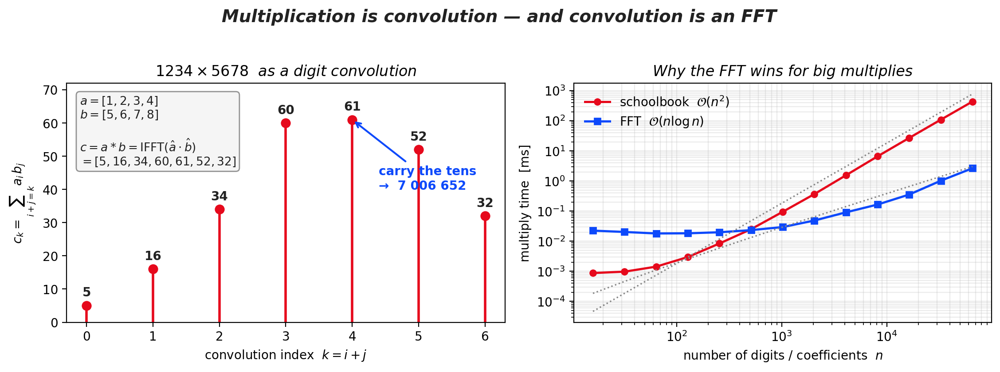

Fast Multiplication with the FFT

Multiplying two numbers is convolving their digits — so the convolution theorem multiplies million-digit integers and polynomials in O(n log n) instead of O(n²).

Ch.4 · Convolution

</a>

<a href="gallery/solar_wind.qmd">
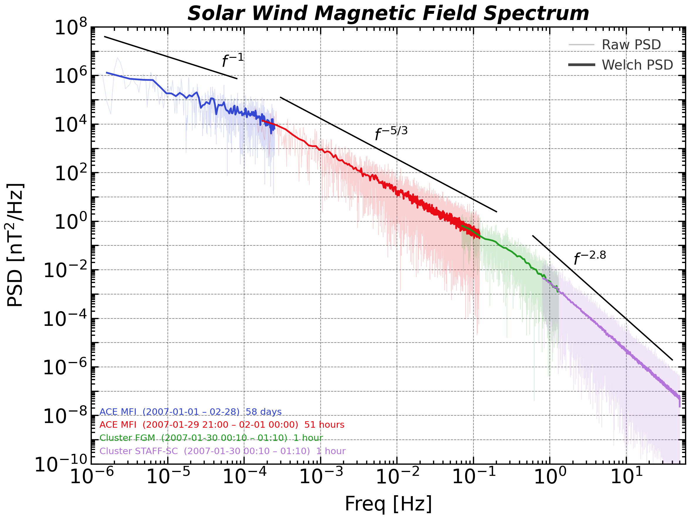

Solar-Wind Turbulence Spectrum

The Welch method tames six decades of raw periodogram scatter into the turbulent cascade — f⁻¹ injection, f⁻⁵ᐟ³ Kolmogorov, f⁻²·⁸ dissipation.

Ch.5 · Welch PSD

</a>

<a href="gallery/light_pollution.qmd">
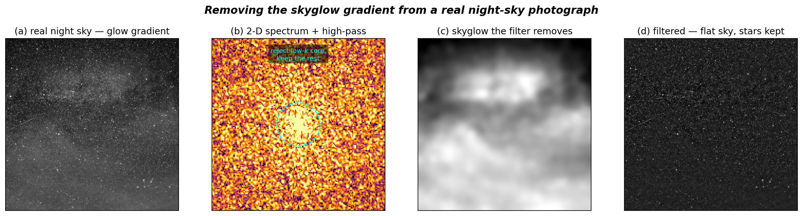

Filtering Light Pollution

Skyglow is a smooth low-frequency gradient; stars are high-frequency spikes. A 2-D high-pass filter models the city glow and subtracts it, restoring the stars.

Ch.6 · Filter Design

</a>

<a href="gallery/mains_hum.qmd">
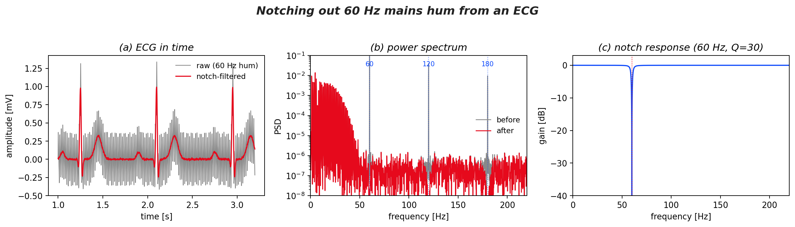

Notching Out 60 Hz Mains Hum

Power-line interference is a razor-sharp spectral line. A cascade of high-Q notch filters removes 60 Hz and its harmonics from an ECG, leaving the heartbeat untouched.

Ch.6 · Notch Filter

</a>

<a href="gallery/hilbert_am.qmd">
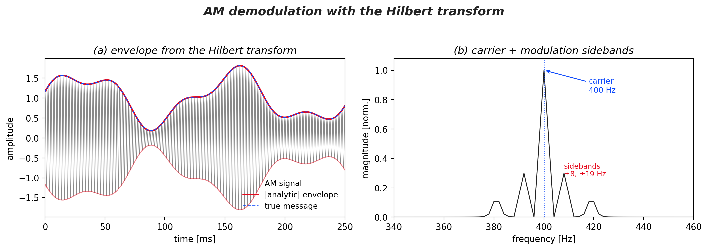

AM Demodulation (Hilbert)

The analytic signal turns a modulated carrier into a rotating vector whose length is the envelope — recovering an AM message exactly, in one transform.

Ch.6 · Hilbert Transform

</a>

<a href="gallery/phase_distortion.qmd">
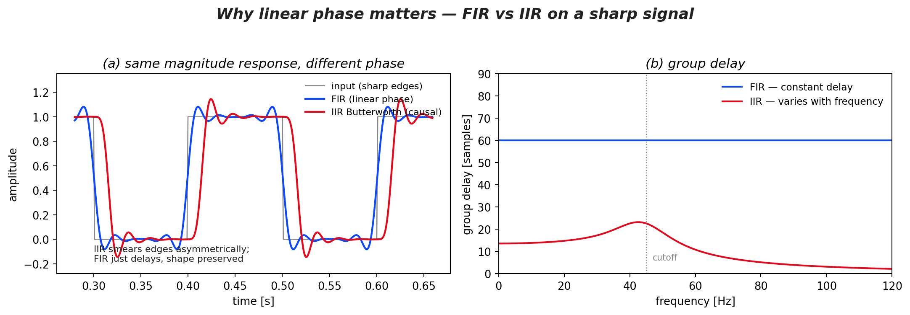

Why Linear Phase Matters

Two filters, the same magnitude response: the linear-phase FIR preserves a pulse's shape while the causal IIR smears its edges — the story is in the group delay.

Ch.6 · FIR vs IIR

</a>

<a href="gallery/decimation_alias.qmd">
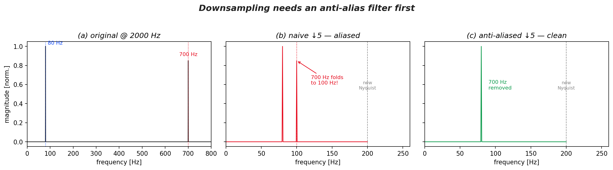

Downsampling Needs a Filter

Keep every 5th sample and a 700 Hz tone folds to a phantom 100 Hz. Low-pass first — the anti-alias filter — and it vanishes cleanly. You can't un-fold an alias.

Ch.6 · Decimation

</a>

<a href="gallery/cuckoo.qmd">
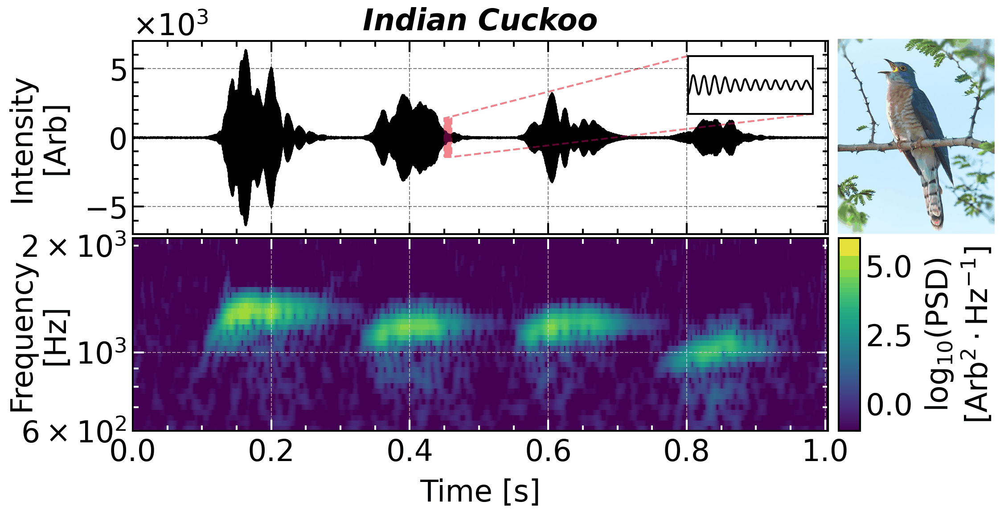

Indian Cuckoo Song

STFT spectrogram of a bird call — revealing four-note phrase structure invisible in the raw waveform.

Ch.7 · STFT

</a>

<a href="gallery/seismometer.qmd">
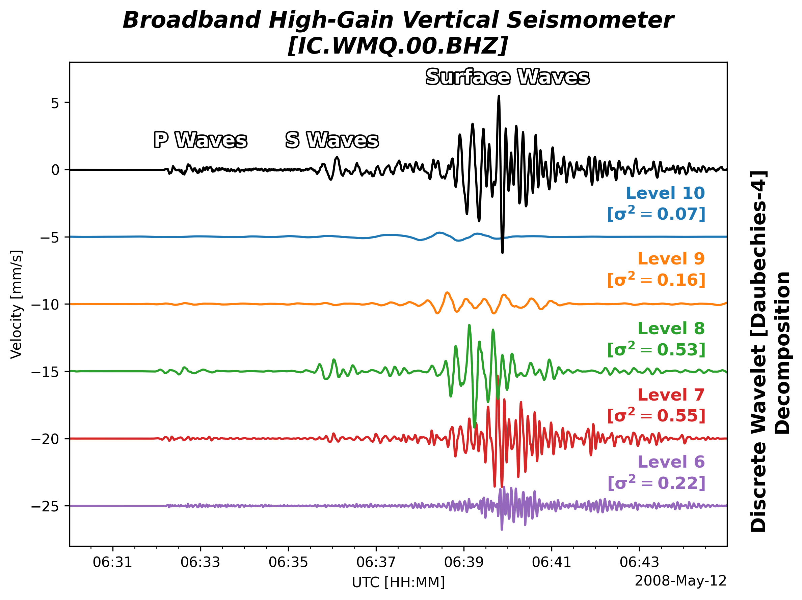

Earthquake Seismogram

Discrete wavelet decomposition of the 2008 Wenchuan earthquake — sorting P, S, and surface waves into octave frequency bands.

Ch.7 · DWT

</a>

<a href="gallery/gravitational_waves.qmd">
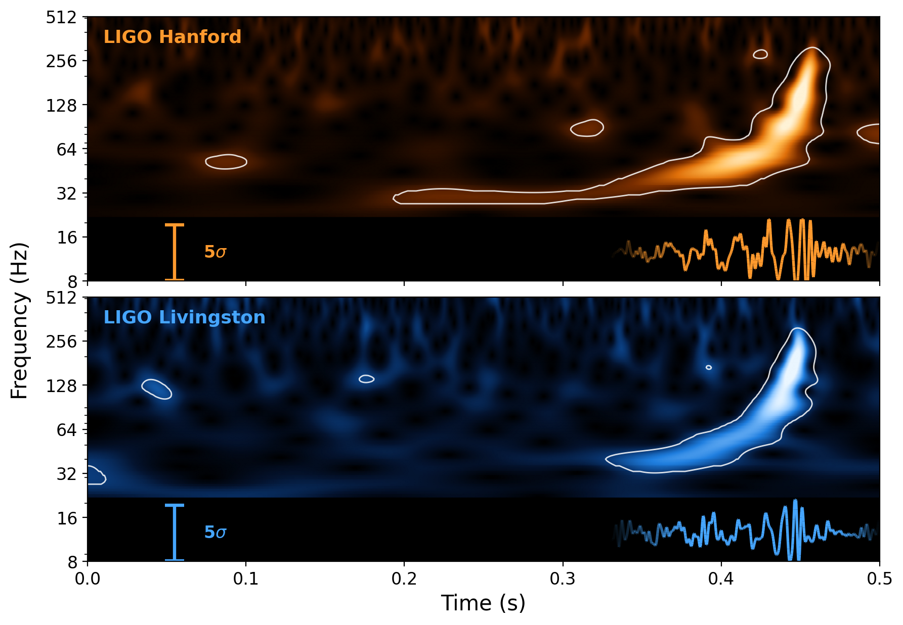

Gravitational Waves (GW150914)

Morlet-wavelet Q-scan of LIGO's first detection — the black-hole inspiral chirp, with an AR(1) 99.7% (3σ) significance contour.

Ch.7 · CWT

</a>

<a href="gallery/dwt_image.qmd">
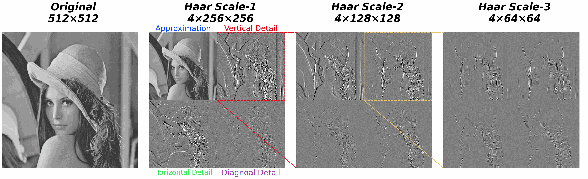

DWT Image Compression

Keep only the largest wavelet coefficients and a 256 KB image shrinks to 47, 14, even 4 KB — degrading gracefully, blurring rather than blocking.

Ch.7 · DWT

</a>

<a href="gallery/coherence.qmd">

AO–Baltic Coherence

Cross-spectral coherence between the Arctic Oscillation and Baltic Sea ice extent, identifying coupled climate modes.

Ch.8 · Coherence

</a>

<a href="gallery/chorus_svd.qmd">

Chorus-Wave Polarization (SVD)

From one spacecraft's 3-axis magnetometer, an SVD of the spectral matrix recovers the wave vector and polarization of magnetospheric chorus — Maxwell meets spectra.

Ch.8 · SVD

</a>

<a href="gallery/sound_localization.qmd">
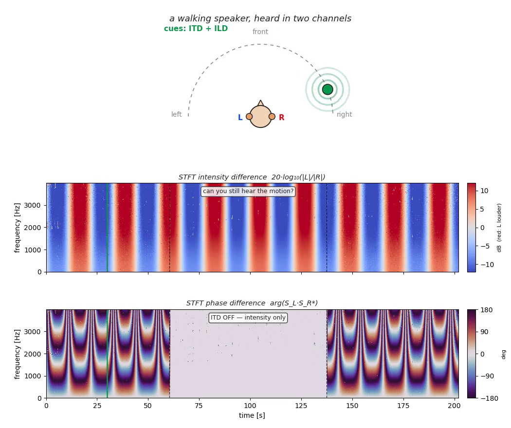

Hearing Direction (ITD &amp; ILD)

A voice walks left↔right in your headphones: inter-channel time and intensity differences, shown as STFT difference spectra — with an A/B test that switches the phase cue off mid-sentence.

Ch.8 · Cross-Spectral Phase

</a>

:::
