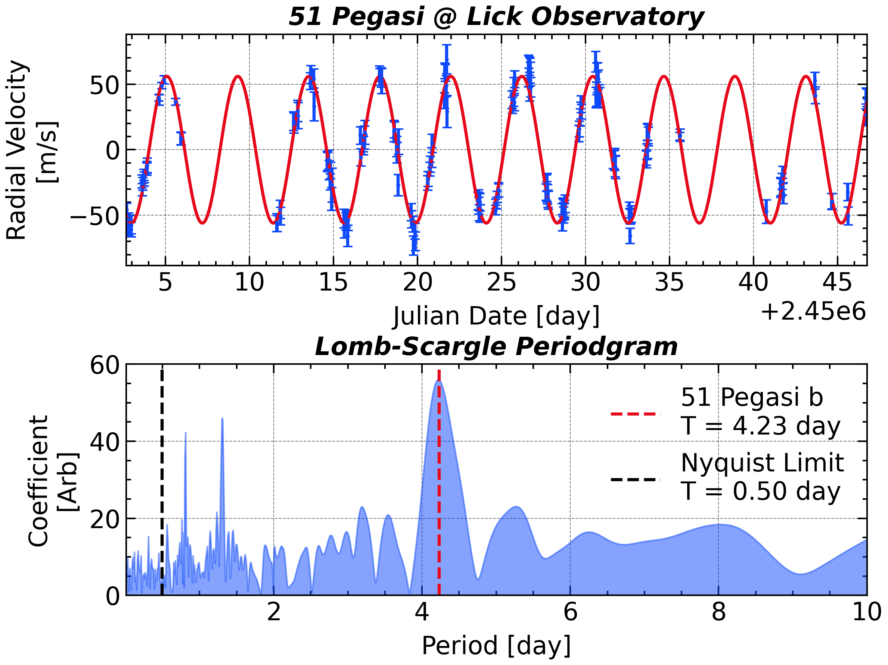

Each card below links to a self-contained example: real data, working Python code, and the resulting figure. Click through for the full derivation and implementation.

::: {.gallery-grid}

<a href="gallery/cuckoo.qmd">

Indian Cuckoo Song

STFT spectrogram of a bird call — revealing four-note phrase structure invisible in the raw waveform.

STFT · Audio

</a>

<a href="gallery/sunspot.qmd">

Sunspot Cycle

Welch PSD of 300 years of sunspot numbers — pinpointing the 11-year solar cycle and its harmonics.

PSD · Welch

</a>

<a href="gallery/exoplanet.qmd">

Exoplanet 51 Peg b

Lomb–Scargle periodogram on unevenly sampled radial-velocity data, recovering the 4.23-day orbital period.

Lomb–Scargle · Astronomy

</a>

<a href="gallery/gearbox.qmd">

Gear-Box Fault Detection

Cepstrum analysis separates the gear-mesh harmonic family from background noise, localising a bearing defect.

Cepstrum · Machinery

</a>

<a href="gallery/coherence.qmd">

AO–Baltic Coherence

Cross-spectral coherence between the Arctic Oscillation and Baltic Sea ice extent, identifying coupled climate modes.

Coherence · Climate

</a>

<a href="gallery/windowing.qmd">

Spectral Leakage &amp; Windowing

Side-by-side comparison of rectangular, Hann, and Kaiser windows — quantifying the leakage–resolution trade-off.

DFT · Windowing

</a>

<a href="gallery/dwt_image.qmd">

DWT Image Compression

Wavelet-domain hard-thresholding compresses a grayscale image by 10× with minimal perceptual loss.

DWT · Image

</a>

<a href="gallery/aliasing.qmd">

Aliasing

A 1.2 kHz tone sampled at 1 kHz appears at 200 Hz — the classic Nyquist violation made visible in the spectrum.

Aliasing · Nyquist

</a>

<a href="gallery/stft_cwt.qmd">

STFT vs. CWT

Fixed-window STFT versus adaptive-scale CWT on a chirp — demonstrating the Heisenberg uncertainty trade-off.

STFT · CWT · Wavelet

</a>

:::
