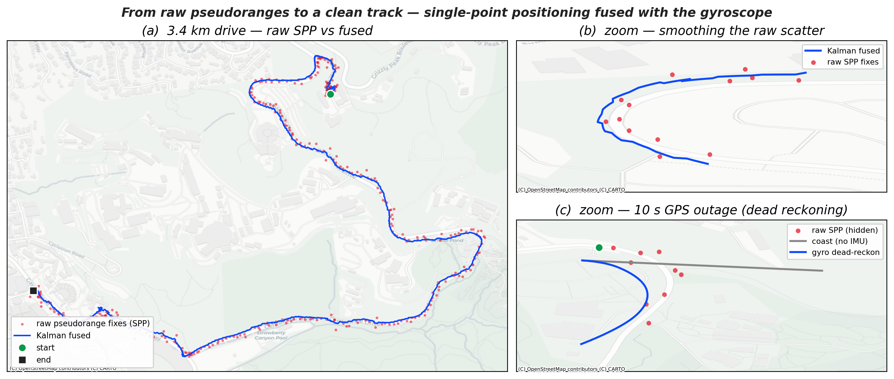
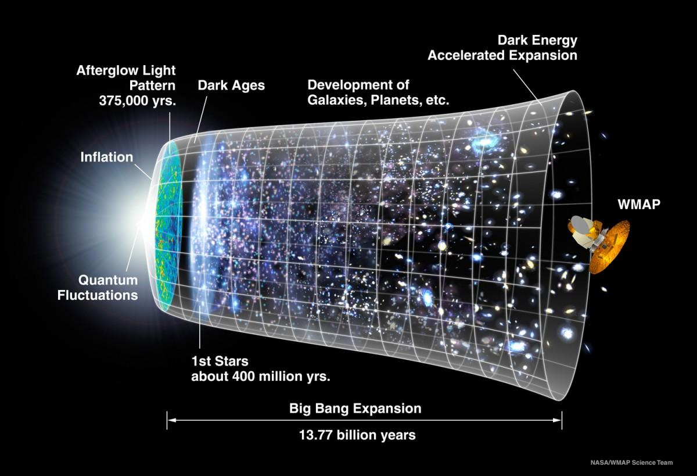
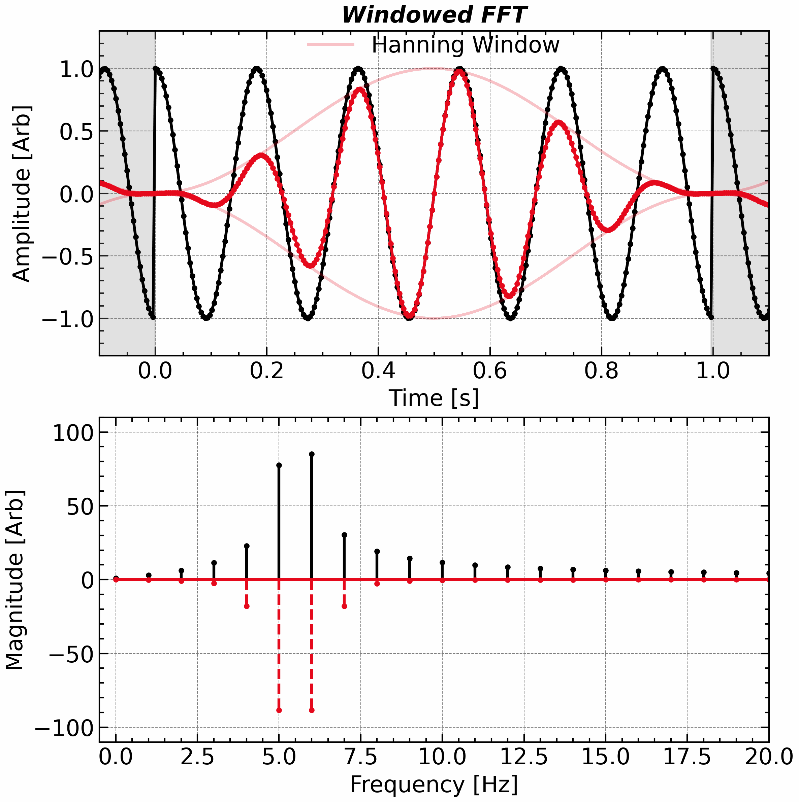

Each card below links to a self-contained example: real data, working Python code, and the resulting figure. Click through for the full derivation and implementation.

::: {.gallery-grid}

<a href="gallery/exoplanet.qmd">

Exoplanet 51 Peg b

Lomb–Scargle periodogram on unevenly sampled radial-velocity data, recovering the 4.23-day orbital period.

Ch.2 · Lomb–Scargle

</a>

<a href="gallery/piano.qmd">

Piano String Inharmonicity

Spectral peak detection reveals how bending stiffness stretches piano overtones sharp — and why tuners apply octave stretch.

Ch.2 · Peak Detection

</a>

<a href="gallery/missing_fundamental.qmd">

The Missing Fundamental

Delete a tone's fundamental and the pitch stays put — the waveform period and the cepstral peak both survive. With audio to hear it.

Ch.2 · Cepstrum

</a>

<a href="gallery/kalman_gps_imu.qmd">

GPS + IMU Sensor Fusion

A Kalman filter fuses GPS with a phone gyroscope; blank a 12 s "tunnel" and the gyro dead-reckons around a 100° bend while a no-IMU coast drives off the hillside.

Ch.6 · Kalman Filter

</a>

<a href="gallery/gearbox.qmd">

Gear-Box Fault Detection

Cepstrum analysis separates the gear-mesh harmonic family from background noise, localising a bearing defect.

Ch.2 · Cepstrum

</a>

<a href="gallery/sunspot.qmd">

Sunspot Cycle

Welch PSD of 300 years of sunspot numbers — pinpointing the 11-year solar cycle and its harmonics.

Ch.3 · Welch PSD

</a>

<a href="gallery/cmb.qmd">

Cosmic Microwave Background

The Wiener–Khinchin theorem on the sphere: recovering the CMB acoustic-peak power spectrum from the oldest light in the Universe.

Ch.3 · Angular Power Spectrum

</a>

<a href="gallery/windowing.qmd">

Spectral Leakage &amp; Windowing

Side-by-side comparison of rectangular, Hann, and Kaiser windows — quantifying the leakage–resolution trade-off.

Ch.4 · Windowing

</a>

<a href="gallery/aliasing.qmd">

Aliasing

A 1.2 kHz tone sampled at 1 kHz appears at 200 Hz — the classic Nyquist violation made visible in the spectrum.

Ch.4 · Nyquist

</a>

<a href="gallery/cuckoo.qmd">

Indian Cuckoo Song

STFT spectrogram of a bird call — revealing four-note phrase structure invisible in the raw waveform.

Ch.7 · STFT

</a>

<a href="gallery/seismometer.qmd">

Earthquake Seismogram

Discrete wavelet decomposition of the 2008 Wenchuan earthquake — sorting P, S, and surface waves into octave frequency bands.

Ch.7 · DWT

</a>

<a href="gallery/gravitational_waves.qmd">

Gravitational Waves (GW150914)

Morlet-wavelet Q-scan of LIGO's first detection — the black-hole inspiral chirp, with an AR(1) 99.7% (3σ) significance contour.

Ch.7 · CWT

</a>

<a href="gallery/dwt_image.qmd">

DWT Image Compression

Keep only the largest wavelet coefficients and a 256 KB image shrinks to 47, 14, even 4 KB — degrading gracefully, blurring rather than blocking.

Ch.7 · DWT

</a>

<a href="gallery/stft_cwt.qmd">

STFT vs. CWT

Fixed-window STFT versus adaptive-scale CWT on a chirp — demonstrating the Heisenberg uncertainty trade-off.

Ch.7 · STFT vs CWT

</a>

<a href="gallery/coherence.qmd">

AO–Baltic Coherence

Cross-spectral coherence between the Arctic Oscillation and Baltic Sea ice extent, identifying coupled climate modes.

Ch.8 · Coherence

</a>

:::
