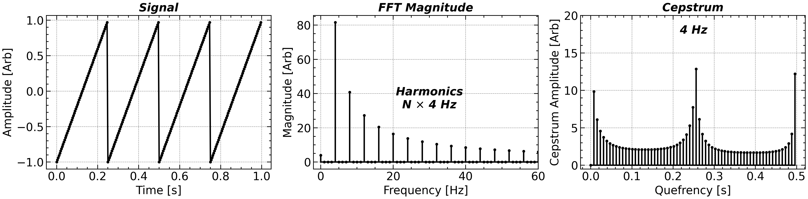

# Gear-Box Fault Detection

<a class="gallery-back" href="../gallery.qmd">← Back to Gallery</a>

**Topic:** Cepstrum analysis — separating source and transmission-path contributions in machinery vibration.
**Chapter:** [2 — Frequency Domain](../chap2.qmd)

---

## Background

A rotating gear-box produces vibration at the gear-mesh frequency $f_\text{mesh} = N_\text{teeth} \times f_\text{shaft}$ and its harmonics. A bearing fault modulates these harmonics at the fault frequency $f_\text{fault}$, creating a comb-like family of sidebands in the power spectrum. The **cepstrum** lifts the log-spectrum into the "quefrency" domain, turning multiplicative source–path convolutions into additive sums and making the sideband spacing (i.e., $f_\text{fault}$) directly readable as a peak location.

## Key idea

The real cepstrum is the inverse DFT of the log power spectrum:

$$
c[\tau] = \mathcal{F}^{-1}\!\left\{\ln |\hat{X}(f)|^2\right\}
$$

A family of harmonics spaced $\Delta f$ apart in frequency becomes a single peak at quefrency $\tau = 1/\Delta f$ in the cepstrum. Bearing defect frequencies are thus directly readable without needing to identify individual harmonics.

The **liftering** operation removes the low-quefrency structural response, isolating the fault signature:

$$
c_\text{liftered}[\tau] = c[\tau] \cdot w[\tau], \quad w[\tau] = \begin{cases} 0 & \tau < \tau_0 \\ 1 & \tau \geq \tau_0 \end{cases}
$$

## Code

```python
import numpy as np
import matplotlib.pyplot as plt
from scipy.io import loadmat

# Load CWRU bearing dataset (48 kHz, drive-end accelerometer)
mat = loadmat('docs/Data/gearbox/CWRU_48k_load_1_CNN_data.npz')
fs = 48_000
x = mat['drive_end_fault'].ravel()[:fs * 4]   # 4-second snippet

# PSD via Welch
f, Pxx = scipy.signal.welch(x, fs=fs, nperseg=4096, scaling='density')

# Real cepstrum
log_psd = np.log(Pxx + 1e-30)
cepstrum = np.fft.irfft(log_psd).real
quefrency = np.arange(len(cepstrum)) / fs * 1e3   # ms

fig, axes = plt.subplots(2, 1, figsize=(9, 6))

axes[0].semilogy(f / 1e3, Pxx)
axes[0].set_xlabel('Frequency (kHz)')
axes[0].set_ylabel('PSD (m²/s⁴/Hz)')
axes[0].set_title('Power Spectrum — bearing fault sidebands')

axes[1].plot(quefrency[1:500], cepstrum[1:500], lw=0.8)
axes[1].set_xlabel('Quefrency (ms)')
axes[1].set_ylabel('Cepstrum amplitude')
axes[1].set_title('Real Cepstrum — fault period visible as peak')

plt.tight_layout()
```

## Result

<div class="gallery-result">

</div>

The cepstrum peak at a quefrency corresponding to the ball-pass outer-race frequency is clearly visible, even though the individual sidebands in the power spectrum are hard to count by eye. Liftering above the structural quefrency leaves only the fault signature.

---

*See [Chapter 2](../chap2.qmd) for the cepstrum definition, liftering, and connection to homomorphic signal processing.*
