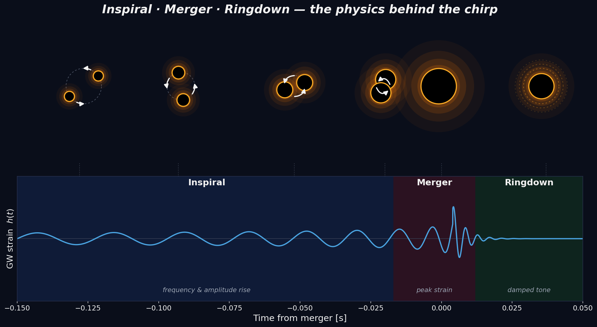

# Gravitational Waves (GW150914)

<a class="gallery-back" href="../gallery.qmd">← Back to Gallery</a>

**Topic:** Time–frequency analysis — continuous wavelet transform (Morlet) with an AR(1) significance test.
**Chapter:** [7 — Wavelet & Time-Frequency Analysis](../chap7.qmd)

---

## Background

On 14 September 2015 the two LIGO interferometers recorded **GW150914**, the first direct detection of gravitational waves — two black holes (~36 and ~29 $M_\odot$) merging ~1.3 billion light-years away. The radiated strain is the textbook **chirp**: as the binary inspirals, both the amplitude and the frequency sweep upward until the merger, then the remnant rings down.



*Inspiral → merger → ringdown: the upward frequency sweep is exactly what a time–frequency method should reveal.*

## Key idea

A single Fourier transform smears this non-stationary signal. The recipe instead is: **whiten** the strain (divide each Fourier bin by the local noise amplitude, flattening the coloured detector noise), take the **Morlet continuous wavelet transform**, and test the wavelet power against an **AR(1) red-noise** background — drawing the contour where it exceeds the $\chi^2_2$ confidence level (Torrence & Compo). The constant-$Q$ wavelet window narrows in time as frequency rises, so it tracks the accelerating chirp far better than a fixed-window STFT.

## Code

```python
import numpy as np, urllib.request
import scipy.signal as sig, scipy.interpolate, scipy.stats, ssqueezepy
import matplotlib.pyplot as plt, matplotlib.colors as mcolors
from matplotlib.colors import LinearSegmentedColormap
from matplotlib.collections import LineCollection
from scipy.ndimage import gaussian_filter
from ssqueezepy.experimental import scale_to_freq

fs = 4096; dt = 1 / fs
tm = 16.422; t0 = tm - 0.45                        # window start -> x runs 0..0.5 s

# LIGO Open Science Center strain (4096 Hz, 32 s around GW150914)
base = 'https://gwosc.org/s/events/GW150914/'
def fetch(tag):
    fn = f'{tag}_LOSC_4_V2-1126259446-32.txt.gz'
    urllib.request.urlretrieve(base + fn, fn)
    return np.loadtxt(fn)
H1, L1 = fetch('H-H1'), fetch('L-L1')
t = np.arange(len(H1)) * dt

def whiten(x):
    f, Pxx = sig.welch(x, fs=fs, nperseg=4 * fs)
    psd = scipy.interpolate.interp1d(f, Pxx, bounds_error=False, fill_value=np.inf)
    freqs = np.fft.rfftfreq(len(x), dt)
    return np.fft.irfft(np.fft.rfft(x) / np.sqrt(psd(freqs) / dt / 2.), n=len(x))
bb, ab = sig.butter(4, [30, 350], btype='band', fs=fs)

cmap_H = LinearSegmentedColormap.from_list('H', ['#000000','#2a0f00','#7a2e00','#e0700a','#ffb84d','#fff3d6'])
cmap_L = LinearSegmentedColormap.from_list('L', ['#000000','#04132e','#0a3b7a','#1f7fe0','#8fc8ff','#eaf6ff'])

yc, kk, Sbar = 12.5, 0.038, 5.0
def gradient_line(ax, x, y, color, lw):            # truncated ends fade out in alpha
    a = np.clip((x - x[0]) / 0.05, 0, 1) * np.clip((x[-1] - x) / 0.025, 0, 1)
    pts = np.array([x, y]).T.reshape(-1, 1, 2)
    seg = np.concatenate([pts[:-1], pts[1:]], axis=1)
    rgba = np.tile([*mcolors.to_rgb(color), 1.0], (len(seg), 1)); rgba[:, 3] = 0.5*(a[:-1] + a[1:])
    ax.add_collection(LineCollection(seg, colors=rgba, linewidths=lw))

fig, (axH, axL) = plt.subplots(2, 1, figsize=(9, 6.2), sharex=True)
fig.subplots_adjust(hspace=0.06, left=0.115, right=0.985, top=0.985, bottom=0.115)
for ax, raw, cmap, wcol, label in [(axH, H1, cmap_H, '#ff9a2e', 'LIGO Hanford'),
                                   (axL, L1, cmap_L, '#46a6ff', 'LIGO Livingston')]:
    Xw = whiten(raw)
    mw = (t > t0) & (t < tm + 0.05); xw = t[mw] - t0
    Wx, scales = ssqueezepy.cwt(Xw[mw], ('morlet', {'mu': 6}), fs=fs, l1_norm=False)
    freqs = scale_to_freq(scales, ('morlet', {'mu': 6}), mw.sum(), fs=fs)
    sel = (freqs >= 22) & (freqs <= 512); fr = freqs[sel]; Pw = np.abs(Wx[sel])**2
    ax.pcolormesh(xw, fr, np.sqrt(Pw), shading='gouraud', cmap=cmap,
                  vmax=np.percentile(np.sqrt(Pw)[:, xw > 0.30], 99.6))

    # AR(1) red-noise 99.7% (3 sigma) significance contour
    x  = Xw[mw] - Xw[mw].mean()
    a1 = max(np.corrcoef(x[:-1], x[1:])[0, 1], 0.0)
    Pbg = (1 - a1**2) / (1 + a1**2 - 2*a1*np.cos(2*np.pi*fr/fs))
    noise = xw < 0.25
    cal = np.median(Pw[:, noise].mean(1) / Pbg)
    sig3 = cal * Pbg * scipy.stats.chi2(2).ppf(0.997) / 2
    R = gaussian_filter(Pw, sigma=(1.6, 22.0)) / sig3[:, None]
    ax.contour(xw, fr, R, levels=[1.0], colors='w', linewidths=1.0, alpha=0.85)

    ws = sig.filtfilt(bb, ab, Xw)[mw]; ws = ws / ws[noise].std()
    keep = xw > 0.33
    gradient_line(ax, xw[keep], yc*10**(kk*np.clip(ws[keep], -6, 6)), wcol, 1.9)
    xb = 0.055
    ax.errorbar([xb], [yc], yerr=[[yc - yc*10**(-kk*Sbar)], [yc*10**(kk*Sbar) - yc]],
                fmt='none', ecolor=wcol, elinewidth=2.3, capsize=7, capthick=2.3)
    ax.text(xb + 0.018, yc, f'{Sbar:.0f}$\\sigma$', color=wcol, fontsize=12, va='center', ha='left', fontweight='bold')
    ax.set_yscale('log'); ax.set_ylim(8, 512); ax.set_xlim(0, 0.5)
    ax.set_yticks([8, 16, 32, 64, 128, 256, 512]); ax.set_yticklabels([8, 16, 32, 64, 128, 256, 512])
    ax.tick_params(labelsize=12)
    ax.text(0.02, 0.92, label, transform=ax.transAxes, color=wcol, fontsize=13, fontweight='bold', va='center')
    ax.set_facecolor('black')
axL.set_xlabel('Time (s)', fontsize=15); fig.supylabel('Frequency (Hz)', fontsize=15, x=0.03)
```

## Result

<div class="gallery-result">

</div>

Both detectors — 3000 km apart — show the identical bright track sweeping from ~35 Hz past ~250 Hz in the final ~0.2 s, comfortably inside the **99.7 % ($3\sigma$)** significance contour while the surrounding noise is not. The whitened strain (in units of the noise $\sigma$, scale bar at left) is overlaid over the time of interest.

---

*See [Chapter 7](../chap7.qmd) for the continuous wavelet transform, Morlet wavelets, and the AR(1) red-noise significance test.*
