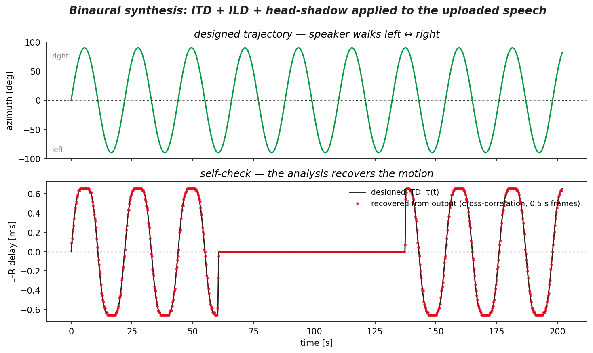

# Hearing Direction — ITD, ILD, and a Walking Speaker

<a class="gallery-back" href="../gallery.qmd">← Back to Gallery</a>

**Topic:** Two-channel (stereo) signal analysis — how inter-channel **time** and **intensity** differences encode a sound source's direction, synthesised, visualised as STFT difference spectra, and put to a listening test.
**Chapter:** [8 — Multi-Channel Signals](../chap8.qmd)

---

## Background

You can close your eyes and still point at whoever is speaking. Your auditory system does it with just **two channels** — the two ears — by comparing them:

- **ITD (interaural time difference).** A source off to one side is closer to one ear; the sound arrives there first. The head is ~21 cm around, so the delay reaches at most $\tau_{max} \approx 0.66$ ms at $\pm90°$: $\tau(\theta) \approx \tau_{max}\sin\theta$. In the frequency domain a pure delay is a **phase difference growing linearly with frequency**, $\Delta\phi = 2\pi f\,\tau$.
- **ILD (interaural level difference).** The head casts an acoustic shadow: the far ear hears the source quieter and duller (high frequencies attenuate most).

Rayleigh's classic **duplex theory** says the two cues split the spectrum: below ~1.5 kHz the wavelength is too long for a head shadow but the phase is unambiguous, so **ITD dominates**; above it the phase wraps (spatial aliasing) but the shadow is strong, so **ILD takes over**.

This example *synthesises* those cues — imprinting a known, moving direction onto a mono voice recording — and then *analyses* them back out of the two channels, with a built-in listening experiment.

## Key idea

**Synthesis.** Take a mono speech recording and a target trajectory $\theta(t)$ (here: the speaker walks left ↔ right, one pass every 22 s). Apply to the two output channels:

1. a **time-varying fractional delay** $\pm\tau(t)/2$ (the ITD) — implemented by resampling with `np.interp`;
2. **opposite gains** $\mp 4\,\text{dB}\cdot\sin\theta$ (the broadband ILD);
3. a **head-shadow filter** — the far ear gets a low-passed mix, so the shadowed side sounds duller.

**Analysis.** Compute the STFT of both channels and compare them bin by bin:

- the **intensity-difference spectrum** $20\log_{10}(|S_L|/|S_R|)$ flips sign as the speaker crosses the midline;
- the **phase-difference spectrum** $\arg(S_L S_R^*)$ shows the delay directly: at each instant the phase grows linearly with frequency and wraps at $\pm180°$, producing arch-shaped fringes whose density is proportional to $|\tau(t)|$ — the direction, read off a single picture.

**The experiment.** Between **60.5 s and 137.5 s** the ITD is switched **off** (the ILD stays on). The switch-off happens exactly when the speaker is at the **far left** — the moment the phase cue is strongest — and mid-sentence, so nothing else changes; the switch-on lands at the **far right**, also mid-sentence. Listen on headphones: does the motion survive on intensity alone?

## Code

```python
import numpy as np, soundfile as sf, scipy.signal as sig

mono, fs = sf.read('speech.wav')                    # a mono voice recording
N = len(mono); t = np.arange(N)/fs

theta = np.deg2rad(90)*np.sin(2*np.pi*t/22)         # walking trajectory
tau   = 0.66e-3*np.sin(theta)                       # ITD, right ear leads for theta>0
tau  *= ~((t >= 60.5) & (t < 137.5))                # A/B test: ITD off mid-file

delay = lambda x, d: np.interp(t - d, t, x)         # time-varying fractional delay
mono_lp = sig.filtfilt(*sig.butter(1, 1200, fs=fs), mono)   # head-shadow version

s = np.sin(theta)
shadowL, shadowR = 0.55*np.clip(+s, 0, 1), 0.55*np.clip(-s, 0, 1)
L = 10**(-4*s/20) * ((1-shadowL)*delay(mono, +tau/2) + shadowL*delay(mono_lp, +tau/2))
R = 10**(+4*s/20) * ((1-shadowR)*delay(mono, -tau/2) + shadowR*delay(mono_lp, -tau/2))

# analysis: STFT difference spectra
f, tt, SL = sig.stft(L, fs, nperseg=4096, noverlap=4096-2205)
_,  _, SR = sig.stft(R, fs, nperseg=4096, noverlap=4096-2205)
level_dB  = 20*np.log10(np.abs(SL)/np.abs(SR))      # ILD spectrum
phase_deg = np.angle(SL*np.conj(SR), deg=True)      # ITD spectrum: 2*pi*f*tau, wrapped
```

## Result

Put on headphones and watch the speaker walk:

<div class="gallery-result">
<video controls preload="metadata" style="width:100%;">
<source src="../Data/binaural_walking_speaker.mp4" type="video/mp4" />
</video>
</div>

*Top: the walking trajectory. Middle: the STFT intensity-difference spectrum — red columns (L louder) alternate with blue (R louder) as the speaker crosses. Bottom: the phase-difference spectrum — the arch-shaped fringes are $\Delta\phi = 2\pi f\tau(t)$ wrapping at ±180°; the arches are densest when the speaker is at ±90° and vanish when the ITD is switched off between the dashed lines.*

The two spectra are the two localisation cues, made visible. The **phase panel** is the richer one: at any instant, reading the fringe spacing vertically gives the delay ($\Delta\phi = 2\pi f\tau$, so one full wrap every $1/\tau$ Hz), and its sign gives the side — a complete direction estimate from a single column of pixels. It also shows *why high-frequency phase is useless for localisation*: by a few kHz the fringes wrap several times, and which wrap you are on is ambiguous — the spatial-aliasing limit that duplex theory is about.

In the **ITD-off section** the phase spectrum collapses to zero while the intensity stripes march on unchanged. On headphones, most listeners find the voice still moves left–right — a ±4 dB swing is enough to drag the image — but it flattens and loses its "out there" quality, sticking closer to the ears; the low-frequency part of the voice in particular stops carrying direction, exactly as duplex theory predicts. The switch is placed mid-sentence at the trajectory extremes ($\theta = -90°$ off, $+90°$ on), where the missing cue is most audible.

<div class="gallery-result">

</div>

One honest limitation belongs in any two-channel localisation story: with two omnidirectional channels, **front and back are indistinguishable** — every ITD/ILD pair is shared by a mirror position behind you (the *cone of confusion*). Real ears break the tie with direction-dependent pinna filtering and with head movements; a fixed two-microphone array cannot. That is why this demo's trajectory — and any two-channel direction finder — lives on the frontal arc $|\theta| \le 90°$.

---

*See [Chapter 8](../chap8.qmd) for cross-spectra and coherence, and the [chorus-wave SVD example](chorus_svd.qmd) for direction-finding with more channels.*
