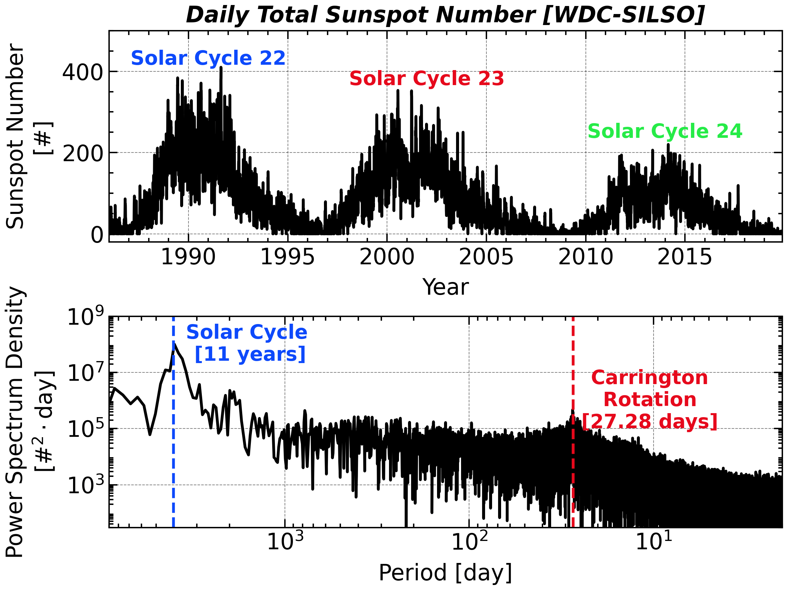

# Sunspot Cycle

<a class="gallery-back" href="../gallery.qmd">← Back to Gallery</a>

**Topic:** Power Spectral Density (PSD) estimation — Welch's method on real geophysical data.
**Chapter:** [3 — Power Spectral Density](../chap3.qmd)

---

## Background

Daily sunspot counts have been recorded continuously since 1749, making them one of the longest instrumental time series in science. The data exhibit a well-known ~11-year solar cycle (the Schwabe cycle), plus hints of longer cycles (Hale ~22 yr, Gleissberg ~87 yr) buried in broadband variability. A direct DFT of 300 years of data is noisy; Welch's method trades some frequency resolution for dramatically reduced variance.

## Key idea

Welch's method divides the record into $K$ overlapping segments of length $M$, tapers each with a window $w[n]$, computes the periodogram of each, and averages:

$$
\hat{S}_{xx}(f) = \frac{1}{K} \sum_{k=0}^{K-1} \frac{1}{f_s M U} \left|\sum_{n=0}^{M-1} w[n]\, x_k[n]\, e^{-j2\pi fn/f_s}\right|^2
$$

where $U = \frac{1}{M}\sum_n w^2[n]$ normalises for window power. The variance of the estimate is reduced by a factor $\approx K$ relative to the raw periodogram.

## Code

```python
import numpy as np
import pandas as pd
import scipy.signal
import matplotlib.pyplot as plt

# SIDC daily total sunspot number; col 3 = decimal year, col 4 = sunspot number
sn_df = pd.read_csv('docs/Data/SN_d_tot_V2.0.txt', header=None, sep=r'\s+',
                    on_bad_lines='skip')
year = sn_df.iloc[:, 3].to_numpy(float)
sn   = sn_df.iloc[:, 4].to_numpy(float)

# Welch PSD over ~8 long segments: enough averaging to tame the variance, with
# segments long enough to keep resolution from the 11-year cycle down to days.
freq, psd = scipy.signal.welch(sn, fs=1.0, window='hann',
                               nperseg=sn.size // 8, scaling='density')

fig, (ax1, ax2) = plt.subplots(2, 1, figsize=(8, 6))

# (top) the raw daily record — three full solar cycles
ax1.plot(year, sn, 'k-')
ax1.set_xlim(1986, 2019.9); ax1.set_ylim(-20, 500)
ax1.set_xlabel('Year'); ax1.set_ylabel('Sunspot Number [#]')
ax1.set_title('Daily Total Sunspot Number [WDC-SILSO]', fontweight='bold')
for yr, y, lbl, c in [(1991, 430, 'Solar Cycle 22', 'C0'),
                      (2002, 380, 'Solar Cycle 23', 'C1'),
                      (2014, 250, 'Solar Cycle 24', 'C2')]:
    ax1.text(yr, y, lbl, color=c, fontsize=12, ha='center', weight='bold')

# (bottom) its PSD, spanning four decades of period
ax2.loglog(1 / freq[1:], psd[1:], 'k-')
ax2.axvline(11 * 365.25, color='C0', ls='--')
ax2.axvline(27.28,       color='C1', ls='--')
ax2.text(11 * 365.25 * 0.4, 1e8, 'Solar Cycle\n[11 years]',
         color='C0', fontsize=12, ha='center', weight='bold')
ax2.text(27.28 * 0.4, 1e6, 'Carrington\nRotation\n[27.28 days]',
         color='C1', fontsize=12, ha='center', weight='bold')
ax2.set_xlim(9e3, 2e0); ax2.set_ylim(3e1, 1e9)
ax2.set_xlabel('Period [day]')
ax2.set_ylabel(r'Power Spectrum Density [#$^2\cdot$day]')
plt.tight_layout()
```

## Result

<div class="gallery-result">

</div>

The top panel shows three successive solar cycles (22–24). The PSD below spans more than four decades of period at once: the dominant **11-year cycle** anchors the long-period end, while at the short-period end a clear peak sits at **27.28 days** — the Sun's mean synodic (Carrington) rotation period, which sweeps active regions across the visible disk and so imprints itself on the disk-integrated count. Averaging eight long segments is what makes both peaks stand cleanly above the broadband continuum instead of drowning in periodogram variance.

## A closer look at the multi-decadal cycles

Re-expressing the same estimate with the period axis in **years** and zooming to long periods separates the two magnetic cycles: the 11-year **Schwabe** cycle and the 22-year **Hale** cycle (two Schwabe cycles with reversed magnetic polarity).

```python
# Welch with 30-year segments, period axis in years
f, Pxx = scipy.signal.welch(sn, fs=1.0, window='hann',
                            nperseg=365 * 30, noverlap=365 * 15, scaling='density')
period_yr = 1.0 / (f[1:] * 365.25)
Pxx_yr    = Pxx[1:] / 365.25

fig, ax = plt.subplots(figsize=(9, 4))
ax.loglog(period_yr, Pxx_yr, lw=1.2)
ax.axvline(11, color='C1', ls='--', label='11 yr (Schwabe)')
ax.axvline(22, color='C2', ls='--', label='22 yr (Hale)')
ax.set_xlabel('Period (years)'); ax.set_ylabel('PSD (sunspots² yr)')
ax.set_xlim(1, 200); ax.legend()
plt.tight_layout()
```

<div class="gallery-result">

</div>

The dominant peak at 11 years stands more than two orders of magnitude above the local continuum; the secondary peak near 22 years is the full Hale magnetic cycle.

---

*See [Chapter 3](../chap3.qmd) for Welch's method, confidence intervals, and the Wiener–Khinchin theorem.*
