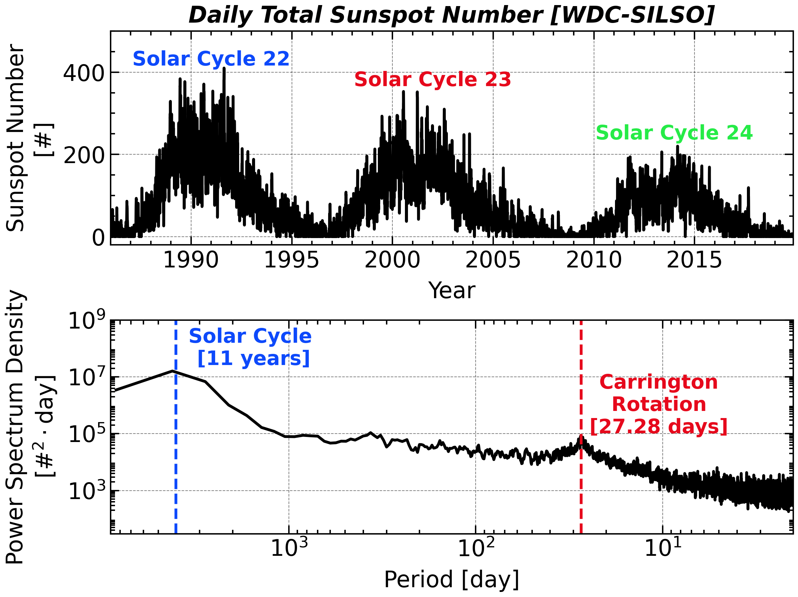

# Sunspot Cycle

<a class="gallery-back" href="../gallery.qmd">← Back to Gallery</a>

**Topic:** Power Spectral Density (PSD) estimation — Welch's method on real geophysical data.
**Chapter:** [3 — Power Spectral Density](../chap3.qmd)

---

## Background

Daily sunspot counts have been recorded continuously since 1749, making them one of the longest instrumental time series in science. The data exhibit a well-known ~11-year solar cycle (the Schwabe cycle), plus hints of longer cycles (Hale ~22 yr, Gleissberg ~87 yr) buried in broadband variability. A direct DFT of 300 years of data is noisy; Welch's method trades some frequency resolution for dramatically reduced variance.

## Key idea

Welch's method divides the record into $K$ overlapping segments of length $M$, tapers each with a window $w[n]$, computes the periodogram of each, and averages:

$$
\hat{S}_{xx}(f) = \frac{1}{K} \sum_{k=0}^{K-1} \frac{1}{f_s M U} \left|\sum_{n=0}^{M-1} w[n]\, x_k[n]\, e^{-j2\pi fn/f_s}\right|^2
$$

where $U = \frac{1}{M}\sum_n w^2[n]$ normalises for window power. The variance of the estimate is reduced by a factor $\approx K$ relative to the raw periodogram.

## Code

```python
import numpy as np
import scipy.signal
import matplotlib.pyplot as plt

# Load SIDC daily sunspot data (SN_d_tot_V2.0.txt)
data = np.loadtxt('docs/Data/SN_d_tot_V2.0.txt', usecols=(4,))
# Replace -1 fill values with NaN then linear-interpolate
data[data < 0] = np.nan
nans = np.isnan(data)
idx = np.arange(len(data))
data[nans] = np.interp(idx[nans], idx[~nans], data[~nans])

fs = 1.0   # samples per day

# Welch PSD
f, Pxx = scipy.signal.welch(data, fs=fs,
                             window='hann',
                             nperseg=365 * 30,   # 30-year segments
                             noverlap=365 * 15,
                             scaling='density')

# Convert frequency to period in years
period_yr = 1.0 / (f[1:] * 365.25)
Pxx_yr = Pxx[1:] / 365.25   # adjust density for year axis

fig, ax = plt.subplots(figsize=(9, 4))
ax.loglog(period_yr, Pxx_yr, lw=1.2)
ax.axvline(11, color='C1', ls='--', label='11 yr (Schwabe)')
ax.axvline(22, color='C2', ls='--', label='22 yr (Hale)')
ax.set_xlabel('Period (years)')
ax.set_ylabel('PSD (sunspots² yr)')
ax.set_xlim(1, 200)
ax.legend()
plt.tight_layout()
```

## Result

<div class="gallery-result">

</div>

The dominant peak at 11 years stands more than two orders of magnitude above the local continuum. The secondary peak near 22 years corresponds to the full Hale magnetic cycle (two successive Schwabe cycles with opposite polarity).

---

*See [Chapter 3](../chap3.qmd) for Welch's method, confidence intervals, and the Wiener–Khinchin theorem.*
