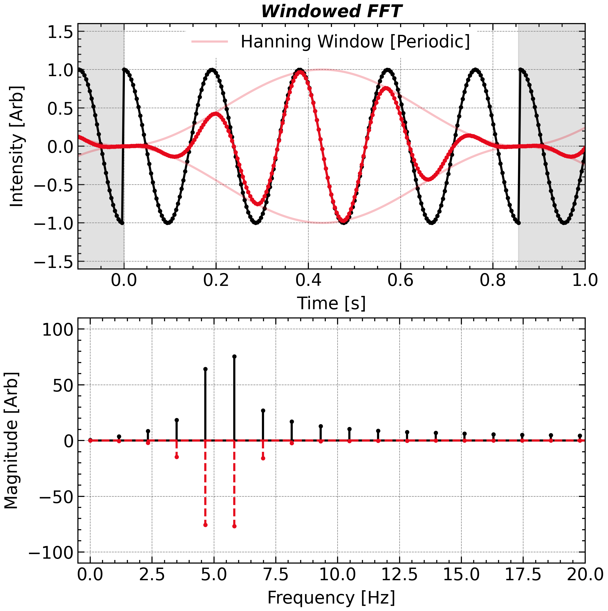

# Spectral Leakage & Windowing

<a class="gallery-back" href="../gallery.qmd">← Back to Gallery</a>

**Topic:** Window functions — controlling the trade-off between frequency resolution and spectral leakage.
**Chapter:** [4 — More about FFT](../chap4.qmd)

---

## Background

When a finite-length DFT is applied to a sinusoid whose frequency does not fall exactly on a DFT bin, the spectral energy leaks into all other bins. This **spectral leakage** can hide weak tones near strong ones. Multiplying the time-domain signal by a **window function** that tapers smoothly to zero at the edges suppresses the sidelobe levels, at the cost of widening the main lobe (reduced resolution). Different windows offer different points on this trade-off curve.

## Key idea

Windowing is equivalent to convolving the true spectrum with the window's own spectrum (the DTFT of the window):

$$
\hat{X}_w(f) = \hat{X}(f) * W(f), \quad W(f) = \sum_{n=0}^{N-1} w[n]\, e^{-j2\pi fn/N}
$$

Key window metrics:

| Window | Main-lobe width | Peak sidelobe | Use case |
|--------|----------------|--------------|----------|
| Rectangular | $2/N$ | $−13$ dB | Transients, well-separated tones |
| Hann | $4/N$ | $−31$ dB | General purpose |
| Blackman | $6/N$ | $−57$ dB | Weak tones near strong ones |
| Kaiser ($\beta=8$) | $\sim 5/N$ | $−80$ dB | Adjustable sidelobe control |

## Code

```python
import numpy as np
import matplotlib.pyplot as plt

N = 1024
fs = 1.0
f_tone = 0.21 + 0.5 / N   # deliberately off-grid

t = np.arange(N)
x = np.cos(2 * np.pi * f_tone * t)

windows = {
    'Rectangular': np.ones(N),
    'Hann':        np.hanning(N),
    'Blackman':    np.blackman(N),
    'Kaiser β=8':  np.kaiser(N, beta=8),
}

fig, ax = plt.subplots(figsize=(9, 5))

for name, w in windows.items():
    X = np.fft.rfft(x * w, n=N * 8)   # zero-pad for interpolation
    freqs = np.fft.rfftfreq(N * 8, d=1.0 / fs)
    power_dB = 20 * np.log10(np.abs(X) / N + 1e-15)
    ax.plot(freqs, power_dB, lw=0.9, label=name)

ax.set_xlim(0, 0.5)
ax.set_ylim(-120, 5)
ax.set_xlabel('Normalised frequency (cycles/sample)')
ax.set_ylabel('Power (dB)')
ax.legend()
plt.tight_layout()
```

## Result

<div class="gallery-result">

</div>

The rectangular window keeps the main lobe narrow but sidelobes reach only −13 dB. The Blackman window suppresses sidelobes to below −57 dB, making it possible to detect a tone 1000× weaker sitting just a few bins away from a strong one.

---

*See [Chapter 4](../chap4.qmd) for zero-padding, window design criteria, and the scalloping-loss correction.*
