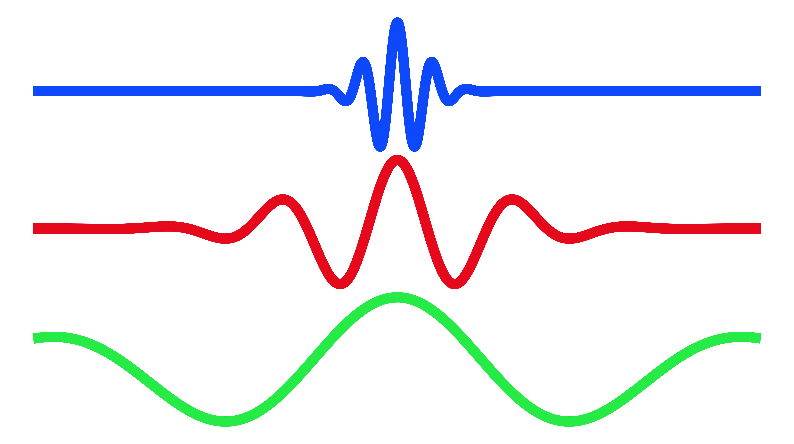

<h1 class="hero-title">Practical Spectral Analysis with Python</h1>

See it. Hear it. Compute it. A hands-on guide to signals and spectra — every concept demonstrated on real data, every figure backed by runnable code.

<a class="hero-btn hero-btn-primary" href="chap0_preface.qmd">Start reading →</a>
<a class="hero-btn hero-btn-ghost" href="gallery.qmd">Browse the gallery</a>

Jiutong Zhao · open source · content CC BY 4.0 · code MIT

8chapters

25worked examples

120+figures with code

▶audio · video · animation

## Why this guide

Signals are everywhere — heard in a bird's song, felt in an earthquake, recorded by a spacecraft. Describing *what* they do precisely is what spectral analysis is for. Yet the classic textbooks demand hundreds of pages of measure theory before the first periodogram, and rarely show a line of code. This guide inverts that: **essential concepts, real datasets, and working Python, from the first page**.

&lt;/&gt;

Code-first

Every figure is reproducible — click any plot to see the exact source that made it, or open the companion notebooks.

∿

Real data

LIGO strain, CMB sky maps, Arase spacecraft waveforms, earthquakes, sunspots, piano strings, bird song — not toy sinusoids.

♪

Ears-on

Hear the missing fundamental, a voice rebuilt from a magnitude-only spectrogram, and a speaker walking through your headphones.

## The chapters

<a class="chap-card" href="chap1.qmd">1Data Initializationsampling, aliasing &amp; the Nyquist theorem, timestamps</a>
<a class="chap-card" href="chap2.qmd">2Frequency Domainthe DFT, spectral peaks, Lomb–Scargle, the cepstrum</a>
<a class="chap-card" href="chap3.qmd">3Power Spectral DensityWelch's method, Wiener–Khinchin, windowing</a>
<a class="chap-card" href="chap4.qmd">4More about FFTfast algorithms, convolution, solving PDEs spectrally</a>
<a class="chap-card" href="chap5.qmd">5Noisewhite to red: coloured noise, power laws, significance</a>
<a class="chap-card" href="chap6.qmd">6Signal Processingfilter design, Hilbert transform, decimation</a>
<a class="chap-card" href="chap7.qmd">7Time-Frequency AnalysisSTFT, wavelets, phase retrieval, DWT denoising</a>
<a class="chap-card" href="chap8.qmd">8Multi-Channel Signalscoherence, cross-spectral phase, SVD wave analysis</a>
<a class="chap-card" href="chap10_appendix.qmd">AAppendix &amp; Referencenaming conventions, cheat sheets, further reading</a>

## From the gallery

Three of the twenty-five end-to-end examples — real data, working code, and the resulting figure:

::: {.gallery-grid}

<a href="gallery/gravitational_waves.qmd">

Gravitational Waves (GW150914)

Morlet-wavelet Q-scan of LIGO's first detection — the black-hole inspiral chirp, with a 3σ significance contour.

Ch.7 · CWT

</a>

<a href="gallery/cmb.qmd">

Cosmic Microwave Background

The Wiener–Khinchin theorem on the sphere: recovering the CMB acoustic-peak power spectrum from the oldest light in the Universe.

Ch.3 · Angular Power Spectrum

</a>

<a href="gallery/sound_localization.qmd">

Hearing Direction (ITD &amp; ILD)

A voice walks left↔right in your headphones while STFT difference spectra show the time and intensity cues your brain is using.

Ch.8 · Cross-Spectral Phase

</a>

:::

<a href="gallery.qmd">Browse all 25 examples →</a>

## How to read this book

Each chapter pairs prose and mathematics with executable Python. Figures are interactive — **click any figure to view the code that generated it**. Examples that make sound come with the audio embedded, so you can verify claims with your own ears. If you want to run things yourself, the companion Jupyter notebooks contain every figure-generating cell, using only standard libraries: `numpy`, `scipy`, `matplotlib`, `pywavelets`, and friends.

New here? Begin with the [Preface](chap0_preface.qmd) for the roadmap, or jump straight into [Chapter 1](chap1.qmd) — the sampling theorem is where every measured signal begins.
