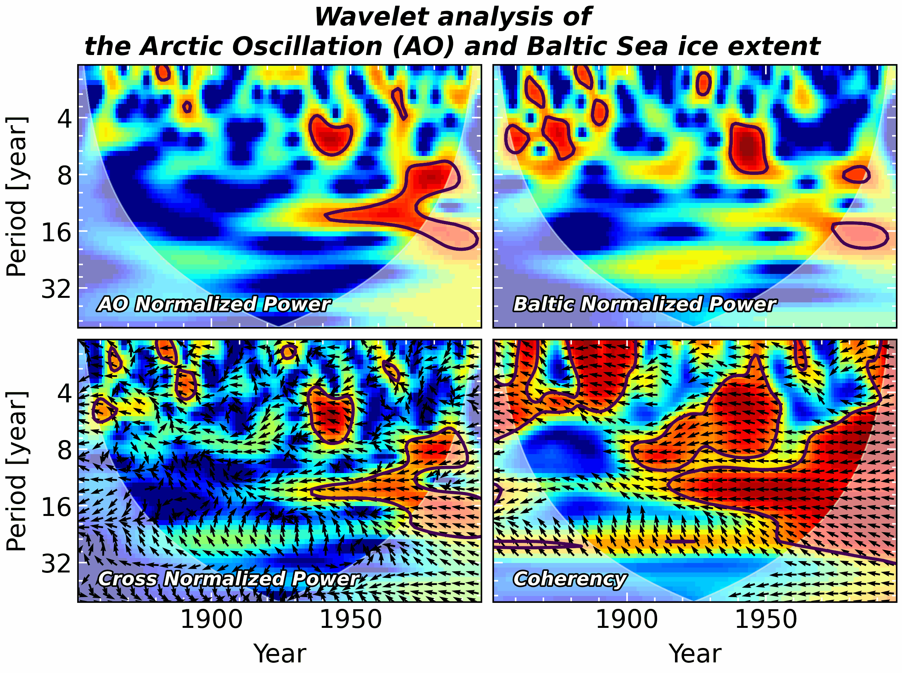
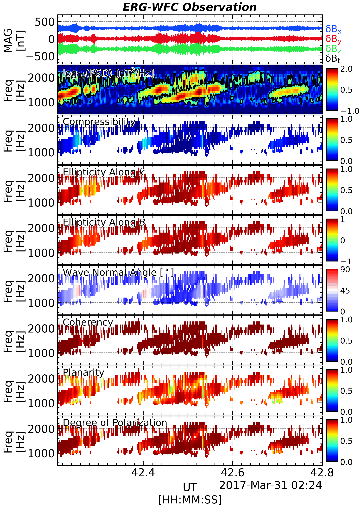

## Welcome

This document serves as a practical guide to spectral analysis, driven by two key observations:

- **The Utility of Spectral Analysis**: Signals are omnipresent in daily life—they can be seen, heard, or felt, like a whistling sound. While the variations in a signal might be intuitively perceived, precisely describing them can be challenging. Even when a raw time series hints at waveform and frequency, deeper aspects such as harmonics often remain elusive. Processing such signals is fundamental across diverse fields, including physics, engineering, and data science. Through effective spectral analysis, crucial information—like the chirping signature of a bird's song—can be readily extracted.

- **The Need for a Practical Handbook**: Traditional spectral analysis textbooks can be daunting, often spanning hundreds of pages and demanding a robust mathematical background. Concepts like "compact support," while mathematically rigorous, frequently prove irrelevant for practical research and can consume valuable time and patience. Furthermore, these theoretical texts rarely provide practical Python implementations.

This guide aims to bridge that gap by offering a **practical approach** to spectral analysis. It focuses on essential concepts and real-world applications, designed for readers with a basic understanding of Python and signal processing.

---

## Featured Examples

::: {.panel-tabset}

## Indian Cuckoo

The time series of the voice of Indian Cuckoo and its time-frequency spectrogram.

<audio controls style="width: 100%; max-width: 500px;">
  <source src="docs/Data/indian_cuckoo_short.wav" type="audio/wav">
  Your browser does not support the audio element.
</audio>

## Sunspot Number

The time series of sunspot numbers and its frequency spectrogram, showing periodic patterns in solar activity.

## AO-Baltic Coherence

Analysis of the Arctic Oscillation and Baltic index coherence in climate data.

## Mode Decomposition

Decomposition of seismic wave data into different modes of oscillation.

## Chorus Wave SVD Analysis

Singular Value Decomposition analysis of chorus wave data from magnetospheric observations.

:::

---

## Getting Started

Ready to dive in? Start with the [Preface](docs/chap0_preface.qmd) to understand the fundamentals of spectral analysis.

The guide is organized into several sections:

- **Getting Started**: Introduction and foundational concepts
- **Core Concepts**: Basic principles of spectral analysis
- **Advanced Topics**: More sophisticated signal processing techniques
- **Reference**: Appendices and additional resources

---

## About This Project

This is an interactive, practical guide that combines theoretical concepts with real-world Python implementations. All code examples are executable and designed to work with standard Python libraries.

**Last updated**: `r format(Sys.Date(), '%Y-%m-%d')`
